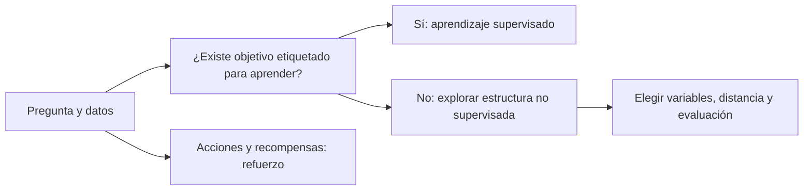
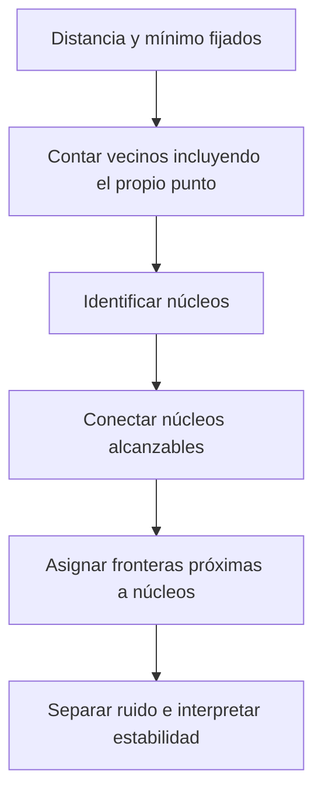
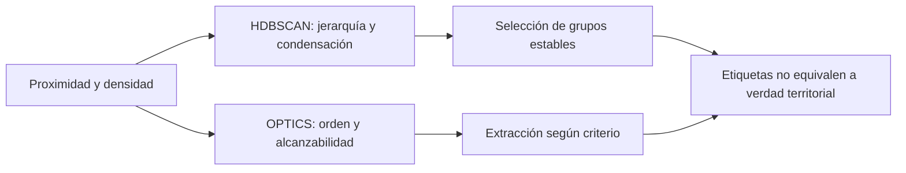

# Clase 01 - Clustering espacial

**Programa:** Diplomado GeoIA · Módulo 5 · **Docente:** Fabian Cetina  
**Estado:** revisión gráfica de notebooks en curso; ambas prácticas reejecutadas con cierre natural comprobado el 2026-09-16, pero la presentación aún no está aprobada. Se conserva la revisión técnica anterior; disposición nativa de Obsidian no comprobada. Sin aprobación ni publicación.  
**Duración prevista:** 120 minutos estimados.

## Diapositivas de referencia

Estas seis diapositivas presentan el marco IA/ML, las particularidades espaciales, los tipos de aprendizaje y los tres métodos de densidad. Se leen en el orden **8/9/11/17/19/20** de la presentación fuente.

Fuente común: **Esri, presentación local de referencia** `3. Machine Learning Espacial y AutoML/5. Aprendizaje No Supervisado/V2_DiplomadoGeoAI_Aprendizaje_No_Supervisado_2026.pptx`, diapositivas indicadas por su posición real, no por números internos del diseño; inspección 2026-09-15. No son fotogramas de V13 ni prueba de identidad entre presentaciones, ni salidas ejecutadas de Bomberos. Uso local no autoriza redistribución.

![[99 - Recursos/clase-01-slide-fundamentos-ia-ml.png]]
**Diapositiva 8 — La IA y el Aprendizaje de Máquina.** Texto y recuadros anidados muestran ML dentro de IA y DL dentro de ML; el texto sitúa detección de patrones, agrupación, clasificación y predicción en el contexto GeoIA. La inclusión expresa alcance, no porcentajes ni superioridad de DL. «Sin ser programadas explícitamente» no elimina decisiones humanas sobre datos y método; véase el desarrollo conceptual posterior.

![[99 - Recursos/clase-01-slide-ml-espacial.png]]
**Diapositiva 9 — Lo que hace especial al ML espacial.** Cuatro paneles distinguen dependencia, heterogeneidad, autocorrelación y validación cruzada espacial. Dependencia relaciona observaciones; heterogeneidad describe variación entre lugares, no el mismo fenómeno. Moran I no es z ni valor p; bloquear la evaluación puede reducir optimismo, pero no garantiza eliminarlo y puede exigir extrapolación. La mención de Random Forest no prueba que cualquier ajuste sea un modelo local. No se ejecuta aquí validación predictiva ni Moran; respaldo E6/E11 en [[99 - Recursos/Clase 01 - Fuentes y acuerdos]] y explicación posterior.

![[99 - Recursos/clase-01-slide-supervisado-no-supervisado.png]]
**Diapositiva 11 — Aprendizaje Supervisado y No Supervisado.** Tabla legible de la referencia: comparar etiquetas y objetivo. «Conocimiento previo no requerido» no elimina conocimiento de dominio ni decisiones sobre variables/distancia; interpretar como ausencia de etiqueta objetivo de entrenamiento, no de conocimiento. Esquema conceptual propio y explicación posterior complementan la simplificación.

![[99 - Recursos/clase-01-slide-dbscan.png]]
**Diapositiva 17 — DBSCAN.** La síntesis textual caracteriza agrupación no jerárquica basada en densidad y presenta vecindad ε y mínimo de puntos MinPts. Leer ambos controles juntos: ε delimita vecinos directos, no diámetro del grupo; el mínimo del núcleo incluye el propio punto y una frontera puede pertenecer sin cumplirlo por sí misma. Respaldo: Esri Pro 3.6 E2 y scikit-learn 1.6 E3 en [[99 - Recursos/Clase 01 - Fuentes y acuerdos]]; el esquema de vecindad posterior desarrolla esta diferencia sin sustituir la diapositiva fuente.

![[99 - Recursos/clase-01-slide-hdbscan.png]]
**Diapositiva 19 — HDBSCAN.** Síntesis textual legible: jerarquía y densidad. Distinguir construcción jerárquica de extracción plana; no necesitar un radio fijo como DBSCAN no significa carecer de controles de distancia o selección en todas las implementaciones. La frase sobre robustez al ruido no garantiza superioridad en cada conjunto; E4–E5 sustentan la explicación posterior.

![[99 - Recursos/clase-01-slide-optics.png]]
**Diapositiva 20 — OPTICS.** Se ven mapa y perfil de alcanzabilidad de la referencia; no corresponden a Bomberos ni a una ejecución local. El eje horizontal ordena entidades, no tiempo; valles indican estructura. En scikit-learn (E9) existe control `max_eps` de búsqueda y criterio de extracción; no interpretar «no se necesita radio» como inexistencia universal de umbrales. Los rótulos pequeños del mapa requieren ampliación; la explicación usa el perfil propio legible, sin extraer métricas de esta imagen.

## Objetivos de aprendizaje

- Distinguir aprendizaje supervisado, no supervisado y por refuerzo mediante la información y el objetivo disponibles.
- Explicar núcleo, frontera y ruido; justificar por qué 350 m de vecindad no limita el diámetro del grupo.
- Diferenciar jerarquía HDBSCAN, etiquetas planas y ordenamiento OPTICS mediante sus resultados y representaciones.
- Comparar las doce sensibilidades sintéticas y los tres métodos geográficos usando grupos, ruido, mapas y límites de los datos.
- Obtener e interpretar centros medios DBSCAN, coincidencias jurisdiccionales y conteos por grupo sin confundirlos con cobertura de servicio.
- Formular una decisión operativa pendiente e identificar información adicional necesaria sin convertir agrupaciones en recomendaciones de despacho.

## Agenda estimada de 120 minutos

| Etapa | Minutos estimados | Propósito |
| --- | ---: | --- |
| Diagnóstico | 5 | ¿Qué significa que dos registros se parezcan? |
| IA, ML, DL y particularidades espaciales | 12 | Dependencia, heterogeneidad y evaluación |
| Taxonomía, entorno y tipos de agrupación | 10 | Objetivo, etiquetas y requisitos disponibles |
| DBSCAN, HDBSCAN y OPTICS | 23 | Vecindad, jerarquía y alcanzabilidad |
| P01: generación, EDA, escalado y modelos base | 12 | Leer atributos antes de agrupar |
| P01: doce sensibilidades y controles de ruido/muestra | 18 | Comparación organizada de paneles y barras |
| P02: configuración, copia, EDA y mapa inicial | 10 | Campos, nulos, claves, XY, tiempo, CRS, estaciones y jurisdicciones |
| P02: DBSCAN → centros → Identity → COUNT/unión/copia → HDBSCAN → OPTICS | 22 | Inspección de pertenencia/frontera, mapas y barras; histogramas HDBSCAN y perfil OPTICS |
| Interpretación, preguntas y cierre | 8 | Separar descripción de decisión |
| **Total** | **120** | |

## 1. Resumen e ideas principales

- **IA, ML y DL son niveles de un marco, no una clasificación de calidad.** ML aprende regularidades de datos dentro del campo de IA; DL es una familia de ML. Elegir una técnica empieza por la pregunta y los datos, no por su complejidad.
- **El espacio cambia lo que significa aprender.** Distancia y unidades definen proximidad; dependencia, autocorrelación y heterogeneidad limitan independencia y transferencia entre lugares. Parecerse en atributos no implica estar cerca geográficamente.
- **El objetivo distingue los tipos de aprendizaje.** Supervisado usa una etiqueta objetivo; no supervisado busca estructura sin ella; refuerzo relaciona acciones y recompensas. Ninguno elimina conocimiento de dominio, evaluación ni decisiones humanas.
- **Agrupar no es predecir ni descubrir causas.** DBSCAN conecta vecindades densas; HDBSCAN construye jerarquía y selecciona grupos estables; OPTICS ordena puntos y alcanzabilidad antes de extraer grupos. No fijar k no significa no elegir parámetros.
- **La calidad se estudia antes del modelo.** Una fila no es necesariamente un evento único; nulos, ceros, claves y posiciones repetidas significan cosas distintas. Copiar y comprobar geometría protege el análisis, pero no certifica exhaustividad, ubicación ni límites legales.
- **Las prácticas enseñan a interpretar diferencias.** P01 separa perturbación sintética, tamaño de muestra y sensibilidad. P02 contrasta tres particiones de los mismos 90 443 registros, sus centros y diagnósticos: menos ruido no prueba mejor servicio, y un centro medio no es una estación óptima. Cada conclusión debe indicar qué muestra la salida y qué información adicional exigiría una decisión operativa.

## 2. Conceptos y relaciones

### Del problema a la forma de aprender

En el marco de la fuente, IA es el campo amplio; ML obtiene regularidades a partir de datos y DL es una familia de ML basada en redes profundas. Esta inclusión no establece que DL sea siempre preferible ni añade una unidad de modelos de lenguaje. Diagnóstico: ¿predecir el tipo conocido de incidente y descubrir concentraciones son la misma tarea? No: cambia el objetivo y el uso de etiquetas. V13 00:14:41–00:26:36 y 00:26:55–00:40:17; PPT de referencia, diapositivas 8–11.

En aprendizaje supervisado se ajusta una relación entre entradas y un objetivo observado; en no supervisado se estudia estructura sin esa etiqueta objetivo de entrenamiento. El analista sigue aportando variables, distancia, escala y criterio de utilidad. La analogía es ordenar una biblioteca con o sin una clasificación de referencia: sin etiquetas no desaparece la necesidad de decidir qué rasgos describen los libros. A diferencia de una biblioteca, los grupos de densidad pueden dejar elementos sin asignar.

En refuerzo, un agente observa un estado, elige una acción y recibe una recompensa; busca maximizar retorno esperado acumulado. Reservar etiquetas para validar un predictor no lo convierte en refuerzo. Corrección P3: [OpenAI, Key Concepts in RL, Terminology/The RL Problem, documento en línea](https://spinningup.openai.com/en/latest/spinningup/rl_intro.html), consulta 2026-09-15. Desarrollo y ejemplo real en [[02 - Conceptos/Aprendizaje no supervisado]].



![[99 - Recursos/clase-01-grafica-taxonomia.svg]]
**Lectura:** panel conceptual propio; las mismas posiciones pueden representarse con etiquetas de referencia o sin ellas. Las inclusiones IA/ML/DL no son porcentajes ni mediciones. Basado en V13 y precisión P7; no es una muestra de Bomberos ni el resultado de un clasificador.

### ¿Qué cambia cuando los datos son espaciales?

La proximidad de atributos no equivale a proximidad geográfica: dos estaciones pueden tener igual cantidad de registros y estar lejos. En P02 agrupamos posiciones en WKID 9377, metros; en P01 distancias entre atributos estandarizados sin CRS. Dependencia es relación entre observaciones; autocorrelación espacial describe asociación de un atributo con su disposición espacial; heterogeneidad indica que relaciones o distribuciones pueden variar entre lugares. La idea de Tobler —lo cercano suele relacionarse más— orienta preguntas, no es ley universal que dispense comprobar datos. V13 00:14:41–00:26:36; PPT 9 y 12.

Una analogía útil es una conversación en una sala: respuestas de personas cercanas pueden parecerse, pero una pared, una red de transporte o una diferencia social puede romper esa proximidad. Por eso la distancia elegida modela una relación, no certifica conexión operacional.

![[99 - Recursos/clase-01-grafica-estructura-espacial.svg]]
**Lectura:** esquema propio, no datos; los tonos representan un atributo continuo que cambia con la posición. Intercalar entrenamiento y evaluación comparte vecindarios; reservar un bloque evalúa otra separación y puede exigir extrapolación. No se ha hecho una partición ni ajustado un predictor en esta clase.

La validación cruzada espacial pregunta por transferencia predictiva, no descubre clusters. Roberts et al. estudiaron estrategias de validación con estructura espacial, incluida telemetría de **43 hembras de alce en Alberta**: bloquear puede reducir optimismo, pero el diseño debe corresponder al uso esperado y puede introducir extrapolación. [Roberts et al., Ecography 40, 2017, pp. 913–919 y Box 2](https://www.biom.uni-freiburg.de/mitarbeiter/dormann/roberts-et-al-2017-ecography.pdf), consulta 2026-09-15. P4 también distingue Moran I de z y p: no significancia no prueba aleatoriedad ([Esri Pro 3.6, Global Moran's I, Interpretation](https://pro.arcgis.com/en/pro-app/3.6/tool-reference/spatial-statistics/h-how-spatial-autocorrelation-moran-s-i-spatial-st.htm)). No se añade una práctica Moran. Véase [[02 - Conceptos/Agrupación espacial]].

### Tipos de agrupación y DBSCAN

Agrupar puede significar formar particiones alrededor de representantes, construir jerarquías o conectar regiones densas. K-means contrasta centroides y k elegido con densidad y ruido; procede de la nota fuente, no de una demo ejecutada en V13. Su criterio de inercia reúne distancias cuadráticas a centroides, no conectividad de vecindarios. [scikit-learn 1.6, KMeans, n_clusters](https://scikit-learn.org/1.6/modules/generated/sklearn.cluster.KMeans.html), consulta 2026-09-15. Comparación desarrollada en [[02 - Conceptos/Comparación de métodos de clustering]].

DBSCAN define Nε(p) como los puntos a distancia ≤ ε de p. Un núcleo tiene al menos MinPts en esa vecindad, **incluido él mismo**. Una frontera puede pertenecer por proximidad a un núcleo sin cumplir ese mínimo. Ruido es lo no asignado, no un diagnóstico de error del registro. Se expanden conexiones desde núcleos: un punto frontera no sirve por sí solo para prolongar una cadena de núcleos. La analogía es una cadena de reuniones con suficientes asistentes: la cercanía permite enlazarlas, pero no vuelve densa a toda persona aislada.

![[99 - Recursos/clase-01-grafica-dbscan-vecindad.svg]]
**Lectura:** círculo discontinuo = vecindad de un núcleo, no envolvente del grupo; enlaces entre núcleos permiten extensión mayor que ε. Los símbolos de frontera y ruido ilustran roles, no recuentos de una muestra calculada. Elaboración propia basada en E2–E3.



**Precisión P1:** 350 m limita vecinos directos, no radio ni diámetro de cada grupo. [Esri Pro 3.6, How Density-based Clustering works, Search Distance/How methods work](https://pro.arcgis.com/en/pro-app/3.6/tool-reference/spatial-statistics/how-density-based-clustering-works.htm) y [scikit-learn 1.6, DBSCAN, eps/min_samples](https://scikit-learn.org/1.6/modules/generated/sklearn.cluster.DBSCAN.html), consulta 2026-09-15. [[02 - Conceptos/DBSCAN]] desarrolla supuestos y límites. Origen espacial: Ester et al. (1996), estudio con datos reales SEQUOIA 2000, [AAAI, resumen](https://aaai.org/papers/kdd96-037-a-density-based-algorithm-for-discovering-clusters-in-large-spatial-databases-with-noise/).

### HDBSCAN y OPTICS: no son dos nombres del mismo gráfico

HDBSCAN transforma distancias según densidad local, construye conexiones y jerarquía, condensa ramas según tamaño mínimo y selecciona grupos planos por estabilidad. La analogía es seguir islas al variar el nivel del agua: interesa qué conjuntos persisten, no solo una fotografía. Su límite es que esa persistencia pertenece al modelo, no prueba que existan territorios operativos verdaderos. [Desarrolladores HDBSCAN, How HDBSCAN Works, documentación rotulada 0.8.1, algorithm steps](https://hdbscan.readthedocs.io/en/latest/how_hdbscan_works.html), consulta 2026-09-15.

![[99 - Recursos/clase-01-grafica-hdbscan-jerarquia.svg]]
**Lectura:** ramas esquemáticas a distintas densidades; la extracción selecciona conjuntos, mientras las etiquetas finales omiten buena parte de la jerarquía. Alturas y anchos no son estabilidad calculada de Bomberos. Elaboración propia, E5.

OPTICS produce un ordenamiento y distancias de alcanzabilidad. En su perfil, valles sugieren conjuntos accesibles a distancias menores; la extracción convierte estructura en grupos según un criterio adicional. El eje horizontal es orden OPTICS, **no tiempo ni longitud geográfica**. `max_eps` delimita búsqueda; no debe confundirse con una altura universal de corte ni con el diámetro de grupos. [scikit-learn 1.6, OPTICS, max_eps/Attributes/Notes](https://scikit-learn.org/1.6/modules/generated/sklearn.cluster.OPTICS.html), consulta 2026-09-15.

![[99 - Recursos/clase-01-grafica-optics-alcanzabilidad.svg]]
**Lectura:** perfil idealizado propio; valles a distintas alturas ilustran estructura multiescala. Línea discontinua = ejemplo de corte de extracción, no salida observada ni ejecución de OPTICS. No se deben traducir sus valores conceptuales a metros.



**P2:** PROB, OUTLIER y EXEMPLAR son campos diagnósticos de Esri; PROB no es valor p ni significancia. La fuerza `probabilities_` de sklearn y PROB de Esri no se equiparan automáticamente. `COLOR_ID` puede reutilizar colores; `CLUSTER_ID` es nominal. [[02 - Conceptos/HDBSCAN y OPTICS]] distingue mecanismos y parámetros con E1–E5 y E9. V13 00:51:05–01:06:59; diapositivas de referencia 17–20.

## 3. Herramientas y decisiones metodológicas

| Herramienta observada | Uso y requisito pertinente |
| --- | --- |
| ArcGIS Pro 3.6.2, licencia ArcInfo/Advanced observada | Copias, CheckGeometry, perfiles, gráficos y mapas nativos. La licencia observada no documenta el mínimo de todas las herramientas. |
| Python 3.13.7; scikit-learn 1.6.1 | Generador, escalado y clustering sintético; documentación 1.6. |
| NumPy 2.2.0; pandas 2.3.0 | Máscaras y agregados; no sustituyen autoridad cartográfica ArcGIS. |
| Matplotlib 3.9.4 | Paneles sintéticos de la fuente; complementa gráficos tabulares ArcGIS. |

P5: Pro incluye numerosas bibliotecas; los imports ya disponibles no requieren instalar deep learning. [Esri Pro 3.6, ArcGIS Pro Python environment, Third-party libraries](https://pro.arcgis.com/en/pro-app/3.6/arcpy/get-started/available-python-libraries.htm), consulta 2026-09-15. La ejecución existente necesitó aislamiento de paquetes de usuario ajenos al entorno Pro, no instalación. Data Engineering es una **vista**: su exploración manual y Measure son propuestas de inspección, no acciones ejecutadas ni `arcpy.DataEngineering`.

[[03 - Herramientas/ArcGIS Pro - Density-based Clustering]] conecta parámetros con mapas y campos. [[03 - Herramientas/scikit-learn - Clustering por densidad]] explica cómo conservar el experimento tabular sin georreferenciarlo.

## 4. Prácticas y código explicado

Los fragmentos siguientes están condensados de los notebooks ejecutados; **no son un programa autónomo ni fueron ejecutados separadamente como bloques de esta nota**. P01 conserva su apoyo declarado `clase01_arcgis.py`; P02 define sus funciones dentro del propio notebook y no importa auxiliares personalizados. Cada práctica usa un directorio nuevo por ejecución. Las llamadas abreviadas requieren las guardas y preparativos del notebook correspondiente.

### P01 — ¿Qué depende del generador y qué del algoritmo?

[[99 - Recursos/notebooks/Clase 01 - Practica 01 - Comparacion DBSCAN HDBSCAN sintetica.ipynb|Abrir notebook P01 ejecutado]]. Fuente: V13 01:08:11–01:39:38; dos semicírculos sintéticos con perturbación gaussiana, no observaciones territoriales. Se compara estructura, no predicción geográfica. Primera celda de configuración abreviada: cambiar las rutas aquí, con salidas separadas incluso si son externas.

```python
# VAULT_DIR se resuelve en la primera celda completa; no dispersar rutas personales.
from pathlib import Path
DATA_DIR = VAULT_DIR / '99 - Recursos/datos'  # No se lee para generar lunas.
OUTPUT_DIR = VAULT_DIR / '99 - Recursos/salidas_clase_01/practica_01'
# El notebook crea RUN_DIR aislado y declara el apoyo compartido.
import numpy as np
import pandas as pd
import arcpy
from sklearn.datasets import make_moons
from sklearn.preprocessing import StandardScaler
from sklearn.cluster import DBSCAN, HDBSCAN
```

Antes de modelar, el notebook exporta perfil y dispersión tabular ArcGIS. Las etiquetas del generador sirven para ilustrar origen, no entrenan DBSCAN. [scikit-learn 1.6, make_moons, API](https://scikit-learn.org/1.6/modules/generated/sklearn.datasets.make_moons.html), consulta 2026-09-15.

![[99 - Recursos/salidas_clase_01/practica_01/ejecucion_20260915T164803_70b07f40/arcgis_original.png]]
**EDA observada:** ejes Variable1/Variable2 sin metros; `noise=0.9999` dispersa la forma del generador. Los colores de origen no son grupos aprendidos. Gráfico ArcGIS del notebook P01; 200 observaciones, no el mensaje histórico incorrecto de 300.

```python
# Perturbación del generador y ruido de clustering son conceptos diferentes.
X, y_true = make_moons(n_samples=200, noise=0.9999, random_state=10)
df = pd.DataFrame(X, columns=['Variable1', 'Variable2'])
X_scaled = StandardScaler().fit_transform(df[['Variable1', 'Variable2']])
# eps opera sobre atributos estandarizados, no sobre metros.
dbscan = DBSCAN(eps=0.3, min_samples=5)
labels_db = dbscan.fit_predict(X_scaled)
hdbscan = HDBSCAN(min_cluster_size=5, min_samples=5, cluster_selection_epsilon=0.0)
labels_hd = hdbscan.fit_predict(X_scaled)
```

StandardScaler aplica z=(x−u)/s por variable; iguala escala marginal sin imponer normalidad ni eliminar atípicos. No se traslada automáticamente a coordenadas métricas P02. [scikit-learn 1.6, StandardScaler, definición](https://scikit-learn.org/1.6/modules/generated/sklearn.preprocessing.StandardScaler.html), consulta 2026-09-15.

![[99 - Recursos/salidas_clase_01/practica_01/ejecucion_20260915T164803_70b07f40/matplotlib_base.png]]
**Resultado observado:** DBSCAN produce 5 grupos y 58 ruidos (108 núcleos y 34 fronteras); HDBSCAN, 8 grupos y 108 ruidos. Negro representa no asignados; tamaños de símbolos DBSCAN distinguen roles. Los colores no emparejan grupos entre paneles. Complemento Matplotlib sintético, no mapa.

#### Doce sensibilidades: conservar la comparación completa

| Variante | DBSCAN ε / mínimo | HDBSCAN tamaño / mínimo / ε de selección |
| --- | --- | --- |
| 1 | 0.10 / 5 | 5 / 5 / 0.0 |
| 2 | 0.20 / 5 | 10 / 5 / 0.0 |
| 3 | 0.30 / 5 | 15 / 5 / 0.0 |
| 4 | 0.30 / 10 | 5 / 10 / 0.0 |
| 5 | 0.45 / 5 | 10 / 10 / 0.0 |
| 6 | 0.45 / 10 | 10 / 5 / 0.15 |

![[99 - Recursos/salidas_clase_01/practica_01/ejecucion_20260915T164803_70b07f40/matplotlib_sensibilidad_dbscan.png]]
**Leer por pares:** DB1→DB2→DB3 cambia ε con mínimo 5; DB3→DB4 cambia mínimo con ε fijo. Cada título da sus recuentos ejecutados. No atribuir causalidad a un parámetro si cambian ambos; conservar todos los paneles.

![[99 - Recursos/salidas_clase_01/practica_01/ejecucion_20260915T164803_70b07f40/matplotlib_sensibilidad_hdbscan.png]]
**Leer la jerarquía a través de extracciones:** HD1→HD2→HD3 modifica tamaño mínimo; HD1→HD4 modifica mínimo de densidad; HD2→HD6 permite estudiar ε de selección. Estas figuras muestran etiquetas planas, no árboles de jerarquía.

![[99 - Recursos/salidas_clase_01/practica_01/ejecucion_20260915T164803_70b07f40/arcgis_sensibilidad_clusters.png]]
![[99 - Recursos/salidas_clase_01/practica_01/ejecucion_20260915T164803_70b07f40/arcgis_sensibilidad_ruido.png]]
**Lectura conjunta:** barras ArcGIS por variante; grupos excluye ruido, mientras la otra figura cuenta observaciones no asignadas. Un mayor número de grupos no significa mejor separación ni menos ruido significa mejor modelo. Comparar ambas medidas y los paneles espaciales de atributos.

![[99 - Recursos/salidas_clase_01/practica_01/ejecucion_20260915T164803_70b07f40/matplotlib_control_ruido.png]]
![[99 - Recursos/salidas_clase_01/practica_01/ejecucion_20260915T164803_70b07f40/matplotlib_control_muestra.png]]
**Controles ejecutados:** N=200 con perturbación 0/0.2/0.8/0.9999; después N=200/500/1000 con perturbación 0.9999, ambos métodos por caso. Ejes = atributos estandarizados. Comparar filas con la misma columna separa variación del generador de cambio de algoritmo. Cambiar N también cambia la realización: no son los mismos individuos repetidos. Son 14 resultados controlados, no otras prácticas.

### P02 — ¿Cómo se agrupan los registros de Bomberos?

[[99 - Recursos/notebooks/Clase 01 - Practica 02 - Clustering Bomberos con ArcGIS Pro.ipynb|Abrir notebook P02 autónomo ejecutado]]. La pregunta es dónde se concentran los registros y cómo cambia la agrupación según el método. La unidad analizada es **una fila**, no necesariamente un evento único. V13 01:40:28–02:01:02 mostró exploración, DBSCAN, pertenencia/frontera y HDBSCAN con histogramas. La secuencia completa aquí ejecutada incorpora centros, superposición y OPTICS según **Esri Colombia, *DiplomadoGeoIA Ejercicio 5A — Clustering basado en densidad*, edición estudiante, pasos 1–5 y revisión**, DOCX local leído el 2026-09-15; no se atribuyen esos pasos adicionales a una demostración en V13. Sus respuestas impresas no son métricas actuales.

#### Configuración y requisitos

ArcGIS Pro 3.6.2 y licencia ArcInfo/Advanced observados; el notebook exige Advanced para Identity. No depende de ModelBuilder, otro notebook, un proyecto abierto ni un auxiliar personalizado. La primera celda configura las tres rutas: si se usan unidades externas, cambiar sus valores aquí, dejando la salida fuera de ambas entradas.

```python
# Primera celda: edite aquí las rutas; se admiten Path absolutos a unidades externas.
from pathlib import Path
ROOT = next((p for p in (Path.cwd(), *Path.cwd().parents) if (p / 'Datos').is_dir()), Path.cwd())
DATA_DIR = ROOT / 'Datos'
OUTPUT_DIR = ROOT / '99 - Recursos/salidas_clase_01/practica_02'
PREPARED_JURIS = ROOT / '99 - Recursos/datos/p02_jurisdicciones_preparadas/jurisdicciones.gdb/Jurisdicciones_Bomberos'
```

```python
# Bibliotecas del entorno Pro; las funciones docentes se definen dentro de P02.
import arcpy, os, json, math, time, hashlib, uuid, platform
from collections import Counter
from datetime import datetime, timezone
import pandas as pd
from IPython.display import display, Markdown, Image
ORIGINAL = DATA_DIR / 'Datos Ejercicio5A.gdb/Incidentes_Bomberos'
# RUN y GDB se crean tras comprobar separación de rutas, licencia y entradas.
# medir registra duración; perfil, barras, mapa_png y exportar_chart son funciones locales.
```

`pandas` organiza tablas y agregados; ArcPy realiza geoprocesamiento, mapas y gráficos. Se conserva la GDB original de solo lectura. La copia jurisdiccional fue preparada y reparada **fuera del notebook**: 17 entidades, IDs y atributos temáticos preservados; cero errores finales. P02 solo la comprueba y consume; nunca repara. Esa validez geométrica no certifica límites legales ni asignación de servicio. Procedencia y recuperación en [[99 - Recursos/datos/README]].

#### EDA: entender campos y calidad antes de agrupar

| Campo utilizado | Tipo observado | Significado y cautela |
| --- | --- | --- |
| `IncidentesBomberos_FECHA` | Date | Fecha registrada; rango no demuestra exhaustividad |
| `IncidentesBomberos_NUMERO_INC` | Double | Identificador nullable, no magnitud para promediar |
| `IncidentesBomberos_ESTACION` | String (254) | Estación reportada; no certifica despacho |
| `Incidentes_Bomberos_AddSpatialJoin_ESTACION` | String (10) | Código de unión espacial heredada; no se recalcula aquí |
| `SHAPE@XY` | Coordenadas de geometría | Posición en el CRS real; coincidencia no prueba duplicación |

El diccionario del notebook también muestra `ESTACION`, `NOMBRE_EST`, `COMPAÑIA` y `NOMBRE_CORTO_EST` de las jurisdicciones. **Perfil observado:** 90 443 puntos, del 2022-01-01 al 2024-12-31; MAGNA-SIRGAS_2018_Origen-Nacional, WKID 9377, metros. Hay 60 711 números de incidente nulos, cero números iguales a cero, 494 claves no nulas repetidas y 5 670 pares XY repetidos; cero XY no finitas. No se deduplica, imputa ni estandarizan coordenadas métricas. Los modelos se enlazan por `SOURCE_ID`/OID de la copia, no por el número nullable.

```python
# Extracto de la copia y su control; GDB es la geodatabase nueva de RUN.
PUNTOS = str(GDB / 'Incidentes_copia')
medir('CopyFeatures_entrada', arcpy.management.CopyFeatures, str(ORIGINAL), PUNTOS)
PERFIL_DESPUES = perfil(PUNTOS)
if PERFIL_ANTES != PERFIL_DESPUES:
    raise RuntimeError('La copia no conserva el perfil de entrada.')
# El notebook comprueba también CRS/unidades y detiene el flujo ante errores.
GEOMETRIA = {}
for nombre, entidad in [('puntos', PUNTOS), ('jurisdicciones_preparadas', str(PREPARED_JURIS))]:
    tabla = str(GDB / ('check_' + nombre))
    medir('CheckGeometry_' + nombre, arcpy.management.CheckGeometry, entidad, tabla, 'ESRI')
    GEOMETRIA[nombre] = int(arcpy.management.GetCount(tabla)[0])
if any(GEOMETRIA.values()) or PERFIL_DESPUES['xy_no_finitas']:
    raise RuntimeError('Geometría inválida: práctica detenida antes de Identity o clustering.')
```

**Resultado:** perfiles antes/después iguales y cero errores detectados en puntos y jurisdicciones preparadas. Data Engineering es una vista manual, no una dependencia de ejecución. `FieldStatisticsToTable` produce conteos, nulos, únicos y extremos sobre campos pertinentes, sin medias de IDs. Fuentes: **Esri, Pro 3.6**, [Copy Features, Python](https://pro.arcgis.com/en/pro-app/3.6/tool-reference/data-management/copy-features.htm), [Check Geometry, Usage/Python](https://pro.arcgis.com/en/pro-app/3.6/tool-reference/data-management/check-geometry.htm) y [Field Statistics To Table, Parameters/Python](https://pro.arcgis.com/en/pro-app/3.6/tool-reference/data-management/field-statistics-to-table.htm), consulta registrada 2026-09-15.

![[99 - Recursos/salidas_clase_01/practica_02/ejecucion_20260915T220908_d62e311d/arcgis_estaciones.png]]
**Estación reportada:** longitud de barra = número de filas; códigos nominales B-1 a B-17, nombres completos en tabla/CSV. Kennedy B-5 reúne 8 705 registros; Restrepo B-3, 4 802. Más registros no demuestra peor servicio ni mayor riesgo.

![[99 - Recursos/salidas_clase_01/practica_02/ejecucion_20260915T220908_d62e311d/arcgis_jurisdicciones.png]]
**Jurisdicción heredada:** conteos por código del campo de unión previa, no de la nueva Identity de centros. Los agregados coinciden por código con los de estación reportada; igualdad de totales no prueba equivalencia fila a fila, despacho ni límites de atención. El DOCX pide relacionar Kennedy y Restrepo/COMPAÑIA IV: contrastar código, nombre y compañía en la tabla jurisdiccional antes de interpretar volumen.

![[99 - Recursos/salidas_clase_01/practica_02/ejecucion_20260915T220908_d62e311d/arcgis_anios.png]]
**Cobertura temporal:** 29 890 / 30 821 / 29 732 registros en 2022/2023/2024; categorías anuales frente a cantidades. No son tasas ajustadas por población ni prueba de tendencia. El clustering acumula los tres años, sin modelar tiempo.

![[99 - Recursos/salidas_clase_01/practica_02/ejecucion_20260915T220908_d62e311d/arcgis_mapa_entrada.png]]
**Mapa inicial ArcGIS:** puntos azules y contornos preparados, WKID 9377, escala y norte de cuadrícula en el pie. Superposición de puntos oculta multiplicidad; el perfil XY la cuantifica. La extensión común permite comparar modelos, pero no muestra toda la prolongación sur de los polígonos. No representa exposición, accesibilidad vial ni jurisdicción legal certificada.

#### DBSCAN → centros medios → Identity → COUNT y unión

```python
# Vecindad 350 m y mínimo 100 sobre la copia completa; etiquetas verifica SOURCE_ID.
DBSCAN = str(GDB / 'IncidentesBomberosDBSCAN')
medir('DBSCAN', arcpy.stats.DensityBasedClustering, PUNTOS, DBSCAN, 'DBSCAN', 100, '350 Meters')
DB, METRICAS['DBSCAN'] = etiquetas(DBSCAN)
# Seleccionar no borra el ruido de la salida: solo limita el cálculo de centros.
asignados = arcpy.management.MakeFeatureLayer(DBSCAN, 'dbscan_asignados').getOutput(0)
medir('Seleccion_sin_ruido', arcpy.management.SelectLayerByAttribute, asignados, 'NEW_SELECTION', 'CLUSTER_ID <> -1')
CENTROS = str(GDB / 'CentrosMediosDBSCAN')
medir('MeanCenter', arcpy.stats.MeanCenter, asignados, CENTROS, Case_Field='CLUSTER_ID')
# La superposición conserva atributos salvo FID, sin cambiar tolerancia XY.
IDENTIDAD = str(GDB / 'CentrosIdentidadDBSCAN')
medir('Identity', arcpy.analysis.Identity, CENTROS, str(PREPARED_JURIS), IDENTIDAD, 'NO_FID')
```

La definición formal de núcleo, frontera y ruido de la sección 2 sigue siendo la referencia: 350 m es vecindad, no diámetro del grupo. **Esri, Pro 3.6, [Density-based Clustering, Parameters/Outputs](https://pro.arcgis.com/en/pro-app/3.6/tool-reference/spatial-statistics/densitybasedclustering.htm)**, consulta 2026-09-15. Para centros y superposición: **Esri, ayuda Python instalada Pro 3.6.2**, `arcpy.stats.MeanCenter` (Input_Feature_Class/Case_Field/Output_Feature_Class) e `arcpy.analysis.Identity` (join_attributes/cluster_tolerance), lectura registrada mediante `inspect.getdoc`, 2026-09-15; localizadores en [[99 - Recursos/Clase 01 - Fuentes y acuerdos#10. Revisión vigente y referencias de implementación|referencias de implementación]]. No se atribuye consulta web a esa ayuda local.

Un centro medio es (promedio X, promedio Y) de las filas asignadas al grupo, sin pesos adicionales. Como el punto de equilibrio de un conjunto de posiciones, resume localización; puede caer fuera de una forma no convexa. No es centro de cobertura ni estación óptima. Identity relaciona **ese centro** con polígonos; no asigna todos los incidentes del grupo a una estación.

**Observado:** 20 centros, 20 filas Identity y 20 filas finales; ninguna ausencia de jurisdicción, coincidencia múltiple ni centro a frontera dentro de **0.001 m**, tolerancia XY observada. El notebook comprueba `touches`, `boundary` y `distanceTo`; distancia a frontera no fuerza pertenencia. **Esri, ayuda Python instalada Pro 3.6.2, Geometry**, esos métodos y requisito de misma proyección para `distanceTo`, consulta 2026-09-15.

```python
# COUNT cuenta puntos asignados, no centros; el caso es CLUSTER_ID.
CONTEOS = str(GDB / 'ConteosDBSCAN')
medir('Statistics_COUNT', arcpy.analysis.Statistics, asignados, CONTEOS, [['CLUSTER_ID','COUNT']], 'CLUSTER_ID')
centros_layer = arcpy.management.MakeFeatureLayer(IDENTIDAD, 'centros_para_union').getOutput(0)
medir('AddJoin', arcpy.management.AddJoin, centros_layer, 'CLUSTER_ID', CONTEOS, 'CLUSTER_ID', 'KEEP_ALL')
CENTROS_FINALES = str(GDB / 'IncidentesBomberosCentrosGruposDB')
medir('CopyFeatures_centros', arcpy.management.CopyFeatures, centros_layer, CENTROS_FINALES)
# El notebook contrasta cada COUNT materializado con el recuento independiente de DBSCAN.
```

**Esri, ayuda Python instalada Pro 3.6.2**, `arcpy.analysis.Statistics` (statistics_fields/case_field) y `arcpy.management.AddJoin` (join_type/index_join_fields/join_operation), consulta 2026-09-15; Copy Features, referencia anterior. COUNT excluye nulos y las etiquetas fueron comprobadas no nulas. La suma es **77 059 puntos asignados**, no 20 centros. Si Identity repitiera un centro por varias coincidencias, su COUNT se repetiría: sumar esas filas duplicaría población. Se conservan ambigüedades, sin escoger jurisdicción por conveniencia.

![[99 - Recursos/salidas_clase_01/practica_02/ejecucion_20260915T220908_d62e311d/arcgis_mapa_dbscan.png]]
**Mapa DBSCAN:** 20 grupos y 13 384 ruidos (14.80%); grupo 1 con 67 478 filas. Colores nominales, gris = ruido, puntos negros = centros medios, no estaciones. La conexión de vecindades permite extensiones superiores a 350 m. Contornos preparados geométricamente, sin certificación legal; mismo límite de encuadre sur del mapa inicial.

![[99 - Recursos/salidas_clase_01/practica_02/ejecucion_20260915T220908_d62e311d/arcgis_poblacion_dbscan.png]]
**Barras DBSCAN:** categorías de etiqueta frente a filas; −1 conserva el ruido en el denominador, sin contarlo como grupo. El dominante comprime barras pequeñas en escala lineal; consultar tabla y APRX para detalle, no interpretarlas como vacías.

**Límite real de esta salida:** los grupos **10→81, 15→99, 16→66, 18→96 y 20→76** tienen menos de 100 filas pese al parámetro suministrado. Statistics COUNT y la copia materializada concuerdan con el conteo independiente. Se distingue **parámetro de entrada** de **tamaño final observado**; no se afirma que todos los grupos cumplan 100. La causa específica no está diagnosticada: no atribuirla a fronteras, posiciones repetidas ni calidad, ni reclasificar para ocultarla. La explicación formal de DBSCAN no sustituye investigar esta discrepancia antes de usar un mínimo como garantía operativa.

#### HDBSCAN y sus diagnósticos

```python
# Mismos puntos; no hereda DBSCAN ni impone un epsilon fijo de 350 m.
HDBSCAN = str(GDB / 'IncidentesBomberosHDBSCAN')
medir('HDBSCAN', arcpy.stats.DensityBasedClustering, PUNTOS, HDBSCAN, 'HDBSCAN', 100)
HD, METRICAS['HDBSCAN'] = etiquetas(HDBSCAN)
# El filtro restringe los histogramas, no elimina el ruido de la clase completa.
hd_asignados = arcpy.management.MakeFeatureLayer(HDBSCAN, 'hdbscan_asignados', 'CLUSTER_ID <> -1').getOutput(0)
for campo, nombre in [('PROB','arcgis_hist_prob'), ('OUTLIER','arcgis_hist_outlier')]:
    chart = arcpy.charts.Histogram(campo, binCount=30, showMedian=True, dataSource=hd_asignados,
        title='HDBSCAN — ' + campo + ' solo asignados', xTitle=campo + ' (sin unidades)', yTitle='Frecuencia de registros')
    exportar_chart(chart, nombre, 'Frecuencia por intervalo entre asignados; no significancia.')
```

El mínimo HDBSCAN no equivale automáticamente a dos controles de sklearn ni a vecindad fija DBSCAN. **Esri, Pro 3.6, Density-based Clustering, Parameters/Outputs**, referencia anterior, y [Histogram, binCount/dataSource/exportToPNG](https://pro.arcgis.com/en/pro-app/3.6/arcpy/charts/histogram.htm), consulta 2026-09-15. Son **30 intervalos** con mediana, sin ajuste gaussiano ni prueba de significancia.

![[99 - Recursos/salidas_clase_01/practica_02/ejecucion_20260915T220908_d62e311d/arcgis_mapa_hdbscan.png]]
**Mapa HDBSCAN:** 3 grupos y 1 187 ruidos (1.31%); grupo 2 con 88 919 filas. Mismo encuadre y escala de comparación; números y colores no emparejan grupos entre métodos. Se representa extracción plana, no jerarquía ni territorios operativos. Contornos preparados, sin límites legales certificados.

![[99 - Recursos/salidas_clase_01/practica_02/ejecucion_20260915T220908_d62e311d/arcgis_poblacion_hdbscan.png]]
**Barras HDBSCAN:** el grupo dominante deja poco detalle visible para los grupos de 146 y 191 filas. Menos ruido no demuestra mejor segmentación: una estructura muy amplia puede ser poco útil para una pregunta local.

![[99 - Recursos/salidas_clase_01/practica_02/ejecucion_20260915T220908_d62e311d/arcgis_hist_prob.png]]
**PROB:** valor sin unidades en horizontal, frecuencia por intervalo en vertical, sobre 89 256 asignados. Mediana 1 y 86 731 valores ≥0.9 describen pertenencia interna, no certeza causal, significancia al 90% ni predicción de incidentes. Los 1 187 ruidos se informan aparte.

![[99 - Recursos/salidas_clase_01/practica_02/ejecucion_20260915T220908_d62e311d/arcgis_hist_outlier.png]]
**OUTLIER:** misma población y lectura de frecuencia; mediana aproximada 0.02555. Atipicidad del modelo no confirma error del registro. PROB, OUTLIER y EXEMPLAR son diagnósticos, no ubicaciones óptimas; semántica **Esri, Pro 3.6, How Density-based Clustering works, Outputs**, consulta 2026-09-15, E2 en el registro.

#### OPTICS: mapa, barras y perfil real

```python
# Sensibilidad omitida: selección automática de ArcGIS, no un porcentaje prefijado.
OPTICS = str(GDB / 'IncidentesBomberosOPTICS')
medir('OPTICS', arcpy.stats.DensityBasedClustering, PUNTOS, OPTICS, 'OPTICS', 100, '350 Meters')
OP, METRICAS['OPTICS'] = etiquetas(OPTICS)
# El notebook identifica REACHORDER/REACHDIST en el esquema, exige orden único,
# ordena el perfil y conserva distancias no representables como huecos, nunca ceros.
chart = arcpy.charts.Line(x='Orden', y='Alcanzabilidad_m', dataSource=str(perfil_csv), nullPolicy='null',
    title='OPTICS — perfil de alcanzabilidad', xTitle='Orden OPTICS (no tiempo)', yTitle='Distancia de alcanzabilidad (m)')
exportar_chart(chart, 'arcgis_alcanzabilidad', 'Valles de densidad; el orden no es una trayectoria geográfica.')
```

**Esri, Pro 3.6, Density-based Clustering, Parameters**, y **ayuda Python instalada Pro 3.6.2**, `cluster_sensitivity` (selección automática al omitir) y `arcpy.charts.Line` (x/y/aggregation/dataSource), consulta 2026-09-15. `perfil_csv` procede de los campos reales, no del OBJECTID; sin agregación se representan valores individuales. El mensaje de ejecución informó **sensibilidad elegida 1, segunda opción 0**; no se suministró 1 en la llamada ni se adopta como valor universal.

![[99 - Recursos/salidas_clase_01/practica_02/ejecucion_20260915T220908_d62e311d/arcgis_mapa_optics.png]]
**Mapa OPTICS:** 29 grupos y 17 561 ruidos (19.42%), mayor grupo 16 con 52 889 filas. La extensión común permite contrastar fragmentación y ruido, no traducir colores a riesgo. Las jurisdicciones son la copia geométricamente comprobada; no certifican servicio ni límites legales.

![[99 - Recursos/salidas_clase_01/practica_02/ejecucion_20260915T220908_d62e311d/arcgis_poblacion_optics.png]]
**Barras OPTICS:** etiquetas nominales frente a filas, incluido ruido −1. El predominio de 16 comprime grupos pequeños; su número no es rango de importancia ni identidad compartida con DBSCAN/HDBSCAN.

![[99 - Recursos/salidas_clase_01/practica_02/ejecucion_20260915T220908_d62e311d/arcgis_alcanzabilidad.png]]
**Perfil ArcGIS observado:** horizontal = `REACHORDER`, vertical = `REACHDIST` en metros; 90 443 valores representables, ninguno sustituido por cero. Valles y tramos altos próximos al límite de búsqueda de 350 m describen estructura de densidad. Un pico no identifica automáticamente un incidente anómalo. No es tiempo, ruta de vehículos ni distancia a un centro; tampoco el umbral de búsqueda es diámetro de los grupos.

Los trece visuales P02 son elaboración propia con insumos locales y exportación nativa ArcGIS de la ejecución vigente. `barras` usa `arcpy.charts.Bar` sobre agregados; `exportar_chart` exporta 1600×1000; `mapa_png` guarda cuatro APRX y layouts PNG a 180 dpi, 2880×1980. Fuentes **Esri, Pro 3.6**, [Bar, Parameters/exportToPNG](https://pro.arcgis.com/en/pro-app/3.6/arcpy/charts/bar.htm), [Layout, export](https://pro.arcgis.com/en/pro-app/3.6/arcpy/mapping/layout-class.htm), [PNGFormat](https://pro.arcgis.com/en/pro-app/3.6/arcpy/mapping/pngformat-class.htm) y [ArcGISProject, saveACopy](https://pro.arcgis.com/en/pro-app/3.6/arcpy/mapping/arcgisproject-class.htm), consulta 2026-09-15. Los APRX permiten inspeccionar grupos pequeños; el conjunto de resultados no estima tasas, causalidad, rutas ni localización óptima.

## 5. Fuentes, prácticas y resultados: registro breve

| Práctica | Entrada → salida | Evidencia observada |
| --- | --- | --- |
| P01, notebook enlazado arriba | make_moons → practica_01/ejecucion_20260915T164803_70b07f40 | 10 celdas, nueve PNG, doce sensibilidades, 14 resultados controlados; kernel 76.76 s |
| P02, notebook enlazado arriba | GDB original + jurisdicciones preparadas de solo lectura → copia en practica_02/ejecucion_20260915T220908_d62e311d | 25 celdas de código, 13 PNG nativos y cuatro APRX; 90 443 filas preservadas; kernel 355.40 s |

Evidencia actual: [[99 - Recursos/salidas_clase_01/practica_02/ejecucion_20260915T220908_d62e311d/evidencia.json|JSON de P02]]. Las operaciones sumaron 333.30 s; llamadas DBSCAN **24.35 s**, HDBSCAN **122.76 s**, OPTICS **69.16 s**. Son mediciones de este entorno, no ranking universal ni tiempo de explicación.

| Comparación P02 | Jaccard de co-pertenencia observado |
| --- | ---: |
| DBSCAN–HDBSCAN | 0.57757 |
| DBSCAN–OPTICS | 0.61991 |
| HDBSCAN–OPTICS | 0.35804 |

El índice divide pares coagrupados en ambos métodos entre pares coagrupados en al menos uno, excluyendo ruido como grupo. Se enlazan las mismas 90 443 claves técnicas y la medida no depende de renumerar etiquetas. Los grupos grandes la condicionan: no es exactitud frente a verdad territorial ni certifica calidad operativa. Original, jurisdicciones preparadas y Blank permanecieron íntegros según [[99 - Recursos/Clase 01 - Resultados de prácticas]]; no se atribuye esa comprobación retroactivamente a intentos históricos sin baseline.

Las seis capturas y sus interpretaciones están en [[#Diapositivas de referencia|el bloque inicial]]. La primera exportación produjo cuatro PNG 16:9, 1920×1080 (11/18/19/20), inspeccionados, de los cuales se seleccionaron tres. La ampliación autorizada añadió 8/9/17, exportadas e inspeccionadas sin reexportar las anteriores; selección vigente: 8/9/11/17/19/20. El historial se conserva en [[99 - Recursos/Clase 01 - Fuentes y acuerdos]]. La exclusión de la 18 no omite tipos de punto: su explicación y esquema propio permanecen en la sección 2.

Captura no seleccionada para exposición: [[99 - Recursos/clase-01-slide-dbscan-tipos.png|diapositiva 18, tipos DBSCAN, diagrama inferior truncado en el lienzo]]. Se conserva sin editar la fuente ni simular contenido faltante.

**Revisión:** las ejecuciones se reutilizan sin repetir notebooks ni geoprocesamiento. La verificación independiente comprobó estructura, salidas e integridad; además renderizó e inspeccionó nueve bloques Mermaid y cinco SVG únicos de las ocho notas en Chrome aislado, sin recortes observados. Enlaces, anclas e incrustaciones resueltos; método y límites en [[99 - Recursos/Clase 01 - Resultados de prácticas]]. La disposición nativa de Obsidian no se comprobó. Queda revisión académica humana; las limitaciones cartográficas se conservan junto a cada mapa.

## 6. Preguntas abiertas

1. ¿Por qué un punto frontera puede pertenecer sin 100 vecinos propios? Responder usando núcleo y vecindad, no el tamaño total del grupo.
2. ¿Qué diferencia hay entre `noise` del generador y etiqueta −1? El primero perturba atributos; la segunda es una decisión del método.
3. ¿Por qué HDBSCAN con menos ruido no es automáticamente mejor? Contrastar granularidad, grupo dominante y finalidad.
4. ¿Qué cuenta Statistics antes de unir a los centros? Las 77 059 filas asignadas, agrupadas por `CLUSTER_ID`, no los 20 centros. ¿Qué error introduciría sumar COUNT si Identity repitiera un centro por varias coincidencias?
5. ¿Cómo distinguir el parámetro 100 de los cinco tamaños DBSCAN menores de 100 observados? Mostrar ambos, conservar los resultados y reconocer que la causa específica no fue diagnosticada; no usar la definición formal para ocultar la discrepancia.
6. ¿Por qué el perfil OPTICS no es tiempo ni ruta? Su orden algorítmico y alcanzabilidad anteceden la extracción; contrastar el perfil real con el mapa y las barras.
7. **¿Qué decisión operacional puede tomar Bomberos con estos grupos?** Pueden orientar preguntas de concentración, pero localizar estaciones requiere capacidad, red vial, tiempos de respuesta, demanda y restricciones. Identity relacionó centros con polígonos preparados, no validó cobertura operativa ni resolvió optimización.

Seguimiento con alcance y responsables: [[05 - Preguntas/Preguntas abiertas]].

## 7. Recursos y materiales

[[99 - Recursos/Enlaces y bibliografía]] dirige a E1–E14 y API con versiones, secciones y fecha de consulta. [[99 - Recursos/Clase 01 - Fuentes y acuerdos]] conserva V13, PPT y P1–P7; no reproduce URL privada. [[99 - Recursos/datos/README]] explica procedencia y separación de entradas/salidas. Todas las cifras observadas remiten al informe vigente y sus notebooks, no a recuentos históricos del video.

## 8. Posibles aportes al proyecto final

[[04 - Proyectos/Ideas de aplicación]] propone estudiar concentración de registros y necesidades de respuesta como pregunta futura, **no** localización resuelta. Antes de una recomendación se necesitarían datos operativos y una evaluación acordada; no se incorporan datos nuevos ni otra práctica a esta sesión.

## 9. Cierre y conexiones

Un grupo depende de representación, distancia y parámetros. La evidencia P01 separa perturbación y sensibilidad; P02 muestra que conservar los mismos registros no obliga a obtener igual partición. El estudiante debe explicar una diferencia observada, su mecanismo y una conclusión que los datos no permiten.

Los centros medios, la superposición y el perfil OPTICS completan el procedimiento del Ejercicio 5A en P02; no convierten concentración en cobertura ni subsanan por sí mismos una discrepancia entre parámetro y resultado. Para cerrar, contraste una conclusión válida con otra que exigiría datos operativos adicionales. Clase 01 queda lista para revisión académica humana tras las comprobaciones técnicas y el renderizado local aislado, sin aprobación ni publicación. [[00 - Índice|Volver al índice]].


## Revisión del atlas de notebooks — 2026-09-16 (parcial)

Ejecución secuencial desde `99 - Recursos/notebooks`, en procesos nuevos de Python Pro con captura MIME, sin salida forzada. Esto no demuestra una sesión interactiva Jupyter/VS Code ni modifica la agenda estimada.

| Práctica | Celdas completas | Tiempo medido | PNG | Retorno natural | Vista local |
| --- | ---: | ---: | ---: | ---: | --- |
| P01 sintética | 11/11 | 19.426 s | 9 | 0 | [[99 - Recursos/salidas_clase_01/practica_01/ejecucion_20260916T221000_47d05679/notebook.html|HTML incrustado P01]] |
| P02 Bomberos | 26/26 | 153.439 s | 14 | 0 | [[99 - Recursos/salidas_clase_01/practica_02/ejecucion_20260916T221040_d407aea3/notebook.html|HTML incrustado P02]] |

Sin advertencias nativas registradas en estas dos corridas. Los resúmenes DBSCAN/HDBSCAN/OPTICS, centros, COUNT, co-pertenencia, histogramas y perfil de P02 coinciden exactamente con la evidencia anterior comparada. Parámetros analíticos conservados por AST; preparación jurisdiccional solo lectura, sin reparación. P01 permanece sintética, sin CRS ni mapa base.

![[99 - Recursos/salidas_clase_01/practica_02/ejecucion_20260916T221040_d407aea3/arcgis_mapa_dbscan.png]]
**Lectura:** colores nominales = grupos; gris = ruido, no ausencia de riesgo; puntos negros = centros, no estaciones. Base **Light Gray Canvas**, Esri y colaboradores, con nombres y atribución realmente visibles. El contexto requiere conexión; datos y análisis siguen locales. **Límite:** la densidad de puntos y las leyendas numerosas requieren más refinamiento a ancho de notebook; no se declara el diseño completo.

![[99 - Recursos/salidas_clase_01/practica_02/ejecucion_20260916T221040_d407aea3/arcgis_alcanzabilidad_detalle.png]]
**Lectura:** orden OPTICS frente a metros, primeras 2000 posiciones sin suavizar; el perfil completo y CSV permanecen en el notebook. **Conclusión:** permite distinguir escalones que el perfil general comprime. **Límite:** no representa todo el universo ni una trayectoria temporal.

**Incidente preservado:** un primer intento P01 completó celdas pero terminó con error fatal GIL (retorno 3221227010). El driver diagnóstico y stderr están en `control_atlas_f0297335`. La captura posterior sin InteractiveShell terminó naturalmente; no certifica la salud de un kernel interactivo. Revisión gráfica e independiente pendientes; no se revalidó cobertura de video en esta revisión técnica.
