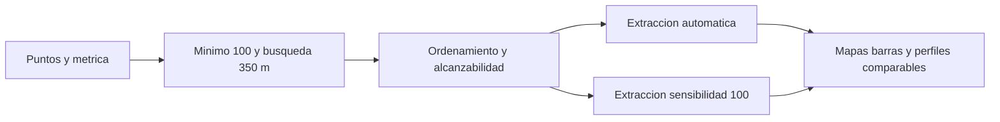
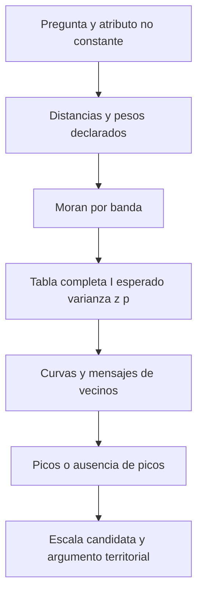

# Clase 02 - OPTICS y autocorrelación espacial incremental

**Fecha de destino:** 2026-09-15  
**Programa:** Diplomado GeoIA - Esri · Módulos 5 y 6  
**Docente:** Fabian Cetina  
**Estado:** revisión gráfica parcial; P01 reejecutada con cierre natural el 2026-09-16. Los intentos actuales de P02/P03 se detuvieron al inicializar la licencia; sus resultados anteriores son históricos. Cobertura de video y cierre visual integral pendientes; sin aprobación académica.  
**Duración prevista:** 120 minutos; agenda estimada, no ensayo medido

## Diapositivas de referencia

Fuente común: **Fabian Cetina / Esri**, `3. Machine Learning Espacial y AutoML/5. Aprendizaje No Supervisado/V3_DiplomadoGeoAI_Aprendizaje_No_Supervisado_2026.pptx`, versión V3, diapositivas verificadas mediante XML y exportadas desde PowerPoint en modo de solo lectura el **2026-09-15**. Son referencias de presentación, no capturas de la grabación ni autorización de redistribución. Las precisiones de los pies corrigen simplificaciones sin modificar el original.

### 20 — OPTICS
![[99 - Recursos/clase-02-slide-20.png]]
**Propósito y lectura:** ubicar OPTICS entre los métodos de densidad y reconocer su relación con DBSCAN. **Precisión:** «no se necesita el radio» no significa ausencia de límite de búsqueda en ArcGIS: aquí se configura explícitamente **350 m**. No confundir representación de densidad con inferencia estadística. [1, 2]

### 26 — Teorema del límite central
![[99 - Recursos/clase-02-slide-26.png]]
**Propósito y lectura:** distinguir distribución de observaciones y distribución de medias. **Precisión:** la aproximación requiere condiciones; no hay garantía universal para cualquier variable ni para todo n ≥ 30, y las observaciones espaciales no se vuelven independientes al aumentar n.

### 30 — Validación de hipótesis
![[99 - Recursos/clase-02-slide-30.png]]
**Propósito y lectura:** formular una referencia nula y una alternativa antes de observar p. **Precisión:** «no rechazar» no prueba azar; el modelo debe especificar atributo, soporte y pesos. No es una decisión sobre la existencia de cualquier patrón posible. [3]

### 31 — Análisis de correlación espacial
![[99 - Recursos/clase-02-slide-31.png]]
**Propósito y lectura:** relacionar semejanza de valores y proximidad. **Precisión:** una nube de ubicaciones no basta: Moran necesita un atributo con variación. I por sí solo no demuestra aleatoriedad ni causa. [3, 5]

### 32 — Gráfico de distribución normal
![[99 - Recursos/clase-02-slide-32.png]]
**Propósito y lectura:** interpretar colas y separación respecto de la referencia nula. **Precisión:** las referencias de z dependen del contraste y de la validez de su aproximación; no son probabilidades de pertenecer a un cluster. [3]

### 33 — Los cinco componentes del análisis
![[99 - Recursos/clase-02-slide-33.png]]
**Propósito y lectura:** separar I, E[I], varianza, z y p. **Correcciones obligatorias:** I no tiene rango universal [−1, 1] para pesos arbitrarios; cercano a cero no prueba azar. La varianza corresponde a I bajo el modelo nulo, no a distancias vecinales. p es probabilidad de resultados al menos tan extremos bajo H₀, no P(H₀), y significancia no certifica causalidad. [3]

## Objetivos de aprendizaje

- Interpretar ordenamiento, alcanzabilidad, grupos y ruido de OPTICS, comparando sensibilidad automática y 100 con mínimo 100 y búsqueda de 350 m.
- Construir `ICOUNT` mediante coincidencias XY exactas, preservando coordenadas y suma de eventos; distinguir sitio ocupado, registro, duplicado y tasa.
- Explicar I observado, esperado, varianza nula, z y p sin atribuir causalidad ni convertir Moran en requisito universal de aprendizaje automático.
- Comparar escalas en abejas, colegios y viviendas turísticas registradas, argumentando vecindad, cobertura y selección exploratoria.
- Interpretar media, mediana, desviación, cuartiles e histograma de ICOUNT sobre sitios ocupados, sin convertir multiplicidad en tasa.
- Reproducir **tres notebooks autónomos**, ya ejecutados con mapas y gráficos ArcGIS, sin modificar entradas ni reutilizar estado oculto.

## Agenda estimada de 120 minutos

| Etapa | Minutos | Foco |
| --- | ---: | --- |
| Recapitulación DBSCAN/HDBSCAN y OPTICS | 10 | Reutilizar resultados de Clase 01; no repetirla |
| P01: EDA del universo y OPTICS automático → 100 | 25 | Mapas comparables, barras y alcanzabilidad |
| Hipótesis, Moran y correcciones inferenciales | 15 | Atributo, pesos, modelo nulo y significancia |
| P01: abejas, Collect Events e incremental | 20 | Coincidencia exacta y diez bandas |
| P02: colegios y dos exploraciones de escala | 20 | Cobertura incompleta y unidades |
| P03: viviendas, Moran global e incremental | 25 | Umbral automático e interpretación |
| Síntesis | 5 | Una conclusión y un límite por práctica |
| **Total** | **120** | No se omiten ejercicios por esta estimación |

## 1. Resumen e ideas principales

OPTICS describe conectividad de densidad y extrae grupos; Moran pregunta por asociación de **valores** entre vecinos respecto de una referencia nula. Las dos preguntas no se validan mutuamente. Un perfil de alcanzabilidad no es un contraste estadístico y un p pequeño no demuestra que los grupos de OPTICS sean correctos. [1–3]

La unidad analítica cambia al contar eventos coincidentes: una fila deja de representar un incidente o establecimiento y pasa a representar un **sitio ocupado** con `ICOUNT` registros. No se añaden lugares sin eventos, no se elimina automáticamente ningún supuesto duplicado y no se estima riesgo poblacional. [7]

**Secuencia vigente:** P01 OPTICS del universo → selección de abejas → Collect Events → incremental; P02 colegios → Collect Events → dos incrementales; P03 viviendas turísticas → Collect Events → Moran global → dos incrementales. El plan histórico de dos notebooks, las integraciones a 10 m, las sensibilidades 50/90, los globales de abejas/colegios y la mención de Airbnb como caso únicamente conceptual **no representan la secuencia revisada de la grabación**. Se conservan sus archivos históricos sin trasladar sus resultados a este alcance.

## 2. Conceptos y relaciones

### 2.1 OPTICS: representación y extracción no son lo mismo

DBSCAN usa una vecindad y un mínimo de puntos; HDBSCAN examina estructura jerárquica de densidad; OPTICS construye un ordenamiento por alcanzabilidad que permite inspeccionar cambios de densidad antes de interpretar la extracción. Una probabilidad de pertenencia HDBSCAN no es un p inferencial. [[02 - Conceptos/HDBSCAN y OPTICS|HDBSCAN y OPTICS]] amplía estas diferencias y [[03 - Herramientas/ArcGIS Pro - Density-based Clustering|Density-based Clustering]] las conecta con ArcGIS. [1, 2]

**Analogía:** recorrer barrios por proximidad produce tramos fáciles de enlazar y saltos a otro sector. En el perfil, el eje horizontal es **orden de recorrido**, no longitud, fecha ni identificador original; el vertical representa alcanzabilidad. La analogía no implica rutas viales reales ni causas de los eventos.

Para mínimo m y vecindad $N_\varepsilon(o)=\{q:d(o,q)\le\varepsilon\}$, contando al propio o, la distancia de núcleo es indefinida si hay menos de m puntos; en otro caso es la distancia al m-ésimo más cercano. Desde un punto núcleo o, la alcanzabilidad de p es [11, §3.2.1, definiciones 5–6]:

$$\operatorname{reach}(p\mid o)=\max\{\operatorname{core}_m(o),d(o,p)\}.$$

El recorrido actualiza candidatos; no es simplemente distancia al vecino más próximo. Los valores iniciales no definidos deben conservarse como tales, no reemplazarse por cero para dibujar valles ficticios. Si o no es núcleo, esta alcanzabilidad es indefinida. La definición primaria fue cotejada en Ankerst et al. (1999), pp. 52–53 [11], consulta 2026-09-16; respalda el concepto, no una equivalencia entre sensibilidad ArcGIS y `xi`.

1. Verificar puntos, CRS, unidades y población completa.
2. Ejecutar mínimo **100**, búsqueda **350 m**, sensibilidad automática.
3. Leer mapa, barras por etiqueta y perfil de alcanzabilidad real.
4. Repetir con sensibilidad **100**, conservando entradas y demás parámetros.
5. Comparar pertenencias y ruido: colores iguales no aseguran grupos equivalentes.

No hay garantía universal de monotonía del número de grupos o ruido al cambiar sensibilidad; no equiparar el parámetro de ArcGIS a `xi` de scikit-learn. [1, 2, 4]



**Lectura:** esquema conceptual de dos extracciones que comparten pregunta y parámetros de vecindad; sus resultados ejecutados se distinguen del diagrama.

![[99 - Recursos/clase-02-optics-alcanzabilidad.svg]]
**Lectura:** doce posiciones ilustrativas; x = orden, y = distancia en unidades ficticias. Valles A/B indican menor alcanzabilidad relativa. **Conclusión:** examinar estructura antes de explicar etiquetas. **Límite:** no son incidentes reales ni prueba de dos grupos. Elaboración propia basada en [2, 4].

### 2.2 Ruido y exploración temática

`CLUSTER_ID = -1` significa no asignación bajo esos parámetros, no evento erróneo ni zona segura. En la grabación (34:05–39:15), José Sebastián Gómez Romero plantea huecos cerca de El Dorado, Pontibón y parques como hipótesis territoriales. La localización no verifica explicaciones sobre exposición, uso del suelo o protocolos de atención.

Antes de modelos: diccionario de campos usados, nulos frente a ceros, claves repetidas, XY y fechas, CRS/unidades, cobertura, mapa y frecuencias ArcGIS. Data Engineering es una **vista** útil para revisión manual sobre copias, no existe una llamada `arcpy.DataEngineering`. No se imputa, deduplica ni repara automáticamente.

La sonda local de solo lectura encontró **90 443 incidentes**, WKID **9377**, metros, fechas **2022-01-01 a 2024-12-31**; no rotularlos únicamente «2024». El campo `IncidentesBomberos_NUMERO_INC` presenta **60 711 nulos** y **494 valores no nulos repetidos**: no es una clave completa certificada. No se exponen identificadores individuales. La selección pertinente está en **`IncidentesBomberos_CLASE_DE_S`**, no en `SERVICIO`: `13.1 CONTROL ATAQUE MASIVO DE ABEJAS`, **2 173 registros**. Son resultados de inspección, no de modelos nuevos.

### 2.3 Collect Events: contar sin desplazar

`CollectEvents` reúne **coincidencias XY exactas** y produce un punto por sitio con `ICOUNT`. No agrega puntos solo por estar a menos de 10 m. No se ejecuta `Integrate`: esa modificación geométrica pertenece a adaptaciones históricas, no al procedimiento visible de esta clase. [7]

**Analogía:** contar llamadas que ya tienen la misma dirección, sin cambiar previamente qué dirección tiene cada llamada. Correspondencia: llamadas = eventos; dirección = coordenada ocupada; total = ICOUNT. Límite: compartir dirección no convierte registros en duplicados administrativos.

Comprobar suma de `ICOUNT` igual al número seleccionado y conjunto de coordenadas de salida igual al conjunto de XY de entrada. Si todos los sitios tienen conteo 1, el atributo es constante: Moran no se calcula, aunque la nube parezca agrupada. [5, 7]

![[99 - Recursos/clase-02-agregacion-soporte.svg]]
**Lectura:** seis eventos ficticios, tres coordenadas ocupadas, conteos 1, 2 y 3; no hay escala geográfica. **Conclusión:** se conserva el número de eventos y cambia el número de filas. **Límite:** no muestra desplazamientos ni resultados de abejas. Elaboración propia; coincidencia exacta e ICOUNT según [7].

### 2.3.1 EDA de multiplicidad: describir antes de inferir

**Complemento docente solicitado para esta clase**, no afirmación de que todo este desarrollo se mostró en la grabación. La pregunta es: **¿cuántos registros se concentran en cada ubicación ya ocupada y cómo se distribuyen esos conteos?** Primero se exploran los registros originales; después de Collect Events, la observación es un sitio y su variable es ICOUNT. En P01, OPTICS describe los 90 443 incidentes, pero esta EDA posterior describe exclusivamente las 2 173 atenciones clasificadas como abejas. En P02 son establecimientos registrados; en P03, viviendas turísticas registradas. Ninguna población equivale a todas las personas expuestas o a todos los lugares posibles.

| Tipo de campo | Resumen pertinente | Interpretación y límite |
| --- | --- | --- |
| SERVICIO/CLASE_DE_S; Tipo (alias «Marca»)/Ciudad; LOCALIDAD/SUBCATRNT | Frecuencias, nulos y barras | Categorías; promediar códigos no tiene significado |
| Identificador administrativo u OID | Nulos, unicidad y repeticiones | Identidad de fila no certifica identidad de incidente, colegio o vivienda |
| FECHA de incidentes | Cobertura y conteos por período | No tasa ni tendencia de riesgo; colegios/viviendas no aportan fecha individual |
| XY y CRS | Finitud, ceros, coincidencias, extensión y mapa | Un cero no es nulo; coincidencia no prueba duplicación; metros de 3857 tienen distorsión |
| ICOUNT en sitios | Suma, centro, dispersión e histograma | Registros por sitio ocupado, no abundancia, matrícula, precio ni riesgo |

**Intuición y definición.** Imagine tarjetas repartidas en casillas que ya contienen alguna tarjeta: tarjetas = registros, casillas = sitios ocupados, tarjetas por casilla = ICOUNT. La analogía ayuda a distinguir total y concentración, pero no representa casillas vacías ni explica por qué dos registros coinciden. Con N sitios, valores xᵢ y ausencia de nulos en ICOUNT:

$$\bar{x}=\frac{\sum_{i=1}^{N}x_i}{N},\qquad s=\sqrt{\frac{\sum_{i=1}^{N}(x_i-\bar{x})^2}{N-1}},\qquad IQR=Q_3-Q_1.$$

- **Media:** reparto uniforme hipotético del total entre sitios ocupados; conserva la contabilidad SUM/N, pero los extremos la desplazan. No es la experiencia del sitio más frecuente.
- **Mediana:** centro de los valores ordenados (promedio de los dos centrales si N es par); resiste mejor una cola larga. **Moda:** valor más frecuente, con posibles empates. Ambas pueden ser 1 aunque algunos sitios tengan muchos registros.
- **Desviación estándar:** distancia cuadrática típica respecto de la media, expresada en registros por sitio. La fórmula mostrada exige N > 1 y usa **N−1**; la descriptiva poblacional usa N. Llamarla «muestral» por su denominador no demuestra muestreo representativo ni independencia espacial. No es la varianza nula de Moran.
- **Cuartiles e IQR:** Q1 y Q3 delimitan el 50 % central; su diferencia mide anchura central, no toda la cola. Las convenciones de interpolación pueden diferir: aquí se conservan los cuartiles exportados por ArcGIS. [9, 10]

**Resultados de las corridas vigentes, 2026-09-16.** COUNT cuenta sitios no nulos y SUM recupera registros; se verificó además conservación de XY y eventos. La desviación exportada se contrastó con `statistics.stdev` y coincide con **N−1** en las tres prácticas, no solo por la etiqueta de su campo.

| Práctica | Registros / sitios | Media | Desviación N−1 | Sitios con ICOUNT=1 | Mín.–máx. | Fuera de cercas IQR |
| --- | ---: | ---: | ---: | ---: | ---: | ---: |
| P01 abejas | 2 173 / 2 043 | 1.063632 | 0.263450928 | 1 922 (94.08%) | 1–4 | 121 |
| P02 colegios | 10 617 / 10 262 | 1.034594 | 0.217345320 | 9 944 (96.90%) | 1–10 | 318 |
| P03 viviendas | 7 529 / 2 919 | 2.579308 | 8.246240139 | 2 295 (78.62%) | 1–186 | 624 |

En las tres, **mediana = moda = Q1 = Q3 = 1; IQR = 0**, sin nulos en ICOUNT. Las cercas descriptivas $[Q_1-1.5IQR,\ Q_3+1.5IQR]$ se reducen a [1, 1]: marcan cualquier conteo mayor que 1. Los **121/318/624 sitios señalados no son errores identificados ni se eliminan**. P03 muestra por qué un centro idéntico puede coexistir con dispersión muy distinta: la cola hasta 186 eleva media y desviación. Estas cifras no son tasas: faltan exposición, denominador poblacional y lugares con cero registros. Un histograma pierde posición; un mapa conserva ubicación, pero ninguno contrasta asociación bajo H₀. Moran es la etapa inferencial separada, no EDA universal.

#### Data Engineering: itinerario manual opcional en ArcGIS Pro

**Capacidad documentada, no interacción local ejecutada.** La automatización estadística sí se ejecutó; no existe `arcpy.DataEngineering`. Pasos basados en Esri Pro 3.6, *Interact with statistics*, selección de campos, cálculo y tipos de estadísticas, consulta **2026-09-16**. [10]

1. Abra el APRX de sitios de la corrida correspondiente, que apunta a su **copia `trabajo.gdb`**, no al original; añada también la copia previa a Collect Events para comparar unidades.
2. En la copia de registros, abra Data Engineering y añada a estadísticas los campos pertinentes mediante **Add To Statistics** o arrastre: SERVICIO/CLASE_DE_S en P01, Tipo/Ciudad en P02, LOCALIDAD/SUBCATRNT en P03. Pulse **Calculate**. No promedie IDs o códigos ni active limpieza.
3. Examine frecuencias, nulos y previsualizaciones de barras; use FECHA solo donde existe para cobertura temporal. La vista ofrece histogramas, barras o líneas según el tipo de campo. Anote selección y total: los resultados dependen de la selección activa.
4. Quite la selección; en la capa de sitios añada ICOUNT y calcule. Compare COUNT, SUM, centro y dispersión con la tabla anterior; abra su histograma y relaciónelo con el mapa graduado.
5. Seleccione temporalmente ICOUNT > 1 y recalcule: el denominador pasa a sitios con multiplicidad, por lo que no se espera igualdad con toda la capa. Quite la selección y recalcule antes de comparar resultados globales.
6. Compare con `Descriptivos_ICOUNT`: mismo campo, población, selección y tratamiento de nulos. La UI documenta desviación N−1; el contraste ejecutado confirma esa convención en estas exportaciones. No atribuya una diferencia a datos sucios antes de comprobar esos criterios. No deduplique, impute ni repare.

#### Equivalente automatizado ejecutado: Field Statistics To Table

El siguiente extracto docente refleja las celdas ejecutadas de los tres notebooks; **no es un script autónomo ni una nueva ejecución**. `weighted` es la clase de sitios producida por Collect Events y `gdb` la geodatabase nueva de esa corrida, definidas a partir de DATA_DIR/OUTPUT_DIR del notebook. Requiere el entorno ArcGIS Pro observado. Exporta solo **ICOUNT**, sin agrupación ni selección, para evitar resumir identificadores. `out_table` asocia el tipo NUMERIC con la tabla de salida; `out_statistics` asigna nombres a las estadísticas solicitadas. [9]

```python
from pathlib import Path  # Resolver la tabla dentro de la GDB aislada del notebook.
import arcpy  # ArcGIS Pro 3.6.2: estadística nativa sobre la copia de sitios.
import statistics  # Biblioteca estándar: contraste numérico, no reemplazo del SIG.

# Nombres solicitados y comprobados en las tablas guardadas de estas corridas.
stat_mapping = [
    ['FIELDNAME', 'Campo'], ['COUNT', 'Cantidad'], ['NULLS', 'Nulos'],
    ['SUM', 'Suma'], ['MINIMUM', 'Minimo'], ['MAXIMUM', 'Maximo'],
    ['MEAN', 'Media'], ['MEDIAN', 'Mediana'], ['MODE', 'Moda'],
    ['STANDARDDEVIATION', 'Desv'], ['FIRSTQUARTILE', 'Q1'],
    ['THIRDQUARTILE', 'Q3'], ['INTERQUARTILERANGE', 'InterquartileRange'],
]
statistics_result = arcpy.management.FieldStatisticsToTable(
    weighted, ['ICOUNT'], gdb, [['NUMERIC', 'Descriptivos_ICOUNT']],
    out_statistics=stat_mapping,
)
print(statistics_result.getMessages())  # Conservar mensajes y estado real de la operación.
stats_table = str(Path(gdb) / 'Descriptivos_ICOUNT')
stat_fields = [pair[1] for pair in stat_mapping]
actual_fields = {field.name for field in arcpy.ListFields(stats_table)}
if not set(stat_fields).issubset(actual_fields):
    raise ValueError('Revisar esquema: faltan nombres de estadísticas solicitados.')
with arcpy.da.SearchCursor(stats_table, stat_fields) as cursor:
    statistic_rows = list(cursor)
if len(statistic_rows) != 1:
    raise ValueError('Se esperaba una fila estadística para ICOUNT.')
stats = dict(zip(stat_fields, statistic_rows[0]))
# InterquartileRange es el nombre físico; IQR es solo una clave lógica Python.
stats['IQR'] = stats['InterquartileRange']
with arcpy.da.SearchCursor(weighted, ['ICOUNT']) as cursor:
    icount = [row[0] for row in cursor]
print(stats, statistics.stdev(icount), statistics.pstdev(icount))
```

La salida contiene **una fila que resume un campo**, no una fila por sitio. `Desv` coincide con `stdev` en las cifras observadas; `pstdev` da aproximadamente 0.263386443462, 0.217334729558 y 8.244827506414, respectivamente. Los notebooks verifican estas relaciones numéricas y la conservación de conteos. **`InterquartileRange` no se sustituye por un supuesto campo físico `IQR` ni se resuelve mediante un alias visual**: el esquema real se comprueba antes de abrir el cursor. ArcGIS conserva el cálculo, los gráficos y los mapas; Python estándar solo contrasta convenciones.

### 2.4 Moran global: valores, pesos y referencia nula

[[02 - Conceptos/Autocorrelación espacial global (Moran's I)|Moran global]] resume si valores similares o diferentes tienden a ser vecinos. Definir qué representa x, qué entidades constituyen n y cómo se calculan los pesos w. Con $u_i=x_i-\bar x$, $w_{ii}=0$ y $S_0=\sum_i\sum_jw_{ij}$:

$$I=\frac{n}{S_0}\frac{\sum_i\sum_jw_{ij}u_i u_j}{\sum_i u_i^2}.$$

Alto–alto y bajo–bajo contribuyen positivamente; alto–bajo, negativamente. El denominador representa variación total; un atributo constante o la ausencia de relaciones útiles impide el contraste. El rango no es universalmente [−1, 1]: Maruyama (2015), §2, teorema 2.1 y ejemplo 2.1, demuestra dependencia de W y casos fuera de esos límites [13], consulta 2026-09-16. La fórmula presupone n > 1, S₀ > 0, pesos no negativos y atributo no constante.

Bajo permutaciones equiprobables de valores en sitios fijos, pesos fijos y diagonal cero, con las condiciones anteriores [12, §13.5]:

$$E[I]=-\frac{1}{n-1},\qquad z=\frac{I-E[I]}{\sqrt{\operatorname{Var}_0(I)}}.$$

La varianza es la de **I bajo el modelo nulo**, no varianza de distancias ni simplemente varianza de ICOUNT. z mide separación estandarizada, no tamaño del efecto ni importancia operativa. p mide extremidad bajo H₀, no probabilidad de que H₀ sea cierta. Anselin [12], §13.5, distingue referencia gaussiana y aleatorización: comparten esperanza, pero la varianza de aleatorización incorpora el cuarto momento del atributo. z usa una aproximación asintótica, no normalidad incondicional. La derivación docente de E[I] se desarrolla en la nota de Moran; no se aplica una varianza universal ni se fija n sin considerar islas.

![[99 - Recursos/clase-02-moran-productos.svg]]
**Lectura:** dos cadenas ficticias comparten valores 1 y 3 y pesos binarios simétricos. Sus productos conducen a I = 1/3 y −1 contando aristas en ambas direcciones. **Conclusión:** importa qué valores son vecinos, no solo su histograma. **Límite:** cuatro sitios ilustran álgebra, no significancia; elaboración propia basada conceptualmente en [3].

### 2.5 Hipótesis, normalidad y límites

[[02 - Conceptos/Hipótesis nula espacial|Hipótesis nula espacial]] diferencia permutar valores en sitios fijos de cambiar ubicaciones bajo un modelo de proceso puntual. Moran de ICOUNT en sitios ocupados **no prueba aleatoriedad espacial completa de todas las ubicaciones posibles**: no incorpora los lugares sin eventos.

![[99 - Recursos/clase-02-nulos-espaciales.svg]]
**Lectura:** A cambia etiquetas entre sitios fijos; B cambia posiciones dentro de una ventana. **Conclusión:** son preguntas y experimentos nulos diferentes. **Límite:** posiciones y valores inventados, no simulaciones ejecutadas. Elaboración docente; atributo/localización en [3] y permutaciones en Anselin [12], §13.5. La definición formal de CSR en la nota vinculada conserva un pendiente documental específico, sin atribuirla a estas fuentes.

Definir contraste y α antes de la lectura. No rechazar significa evidencia insuficiente contra ese modelo, no demostrar azar o ausencia de riesgo. Un resultado global puede ocultar procesos locales opuestos. [3]

En el TLC clásico, variables independientes e idénticamente distribuidas, con media finita y varianza finita positiva, satisfacen convergencia normal de $\sqrt n(\bar X-\mu)/\sigma$. No se vuelve normal el histograma original. Dependencia espacial requiere condiciones adicionales; Moran no es una media ordinaria. Las referencias bilaterales normales como |z| ≈ 1.96 y p ≈ 0.05 no son umbrales para certificar clusters. Respaldo: Peter Kempthorne, MIT 18.655, primavera 2016, Lecture 15, p. 9 [14], consulta 2026-09-16. La convergencia es en distribución de la media estandarizada; no comprueba independencia ni condiciones de aproximación en los registros geográficos de esta clase.

### 2.6 Escala y autocorrelación incremental

[[02 - Conceptos/Autocorrelación espacial incremental|Incremental]] repite Moran para $d_k=d_0+k\Delta d$, $k=0,\ldots,K-1$. La banda es acumulativa: incluye vecinos hasta el umbral, no solo un anillo nuevo. Distancia euclidiana no es tiempo por red. La estandarización por filas divide pesos por su suma; filas sin vecinos requieren diagnóstico, no división por cero ni supresión automática. [5, 6]

| Población | Corrida | Bandas previstas | Distancias solicitadas |
| --- | --- | ---: | --- |
| Abejas | Única | 10 | 100 a 1 000 m, paso 100 |
| Colegios | Inicial | 20 | 2 000 a 40 000 m, paso 2 000 |
| Colegios | Refinada | 20 | 500 a 10 000 m, paso 500; confirmados por el orquestador en 97:36 |
| Viviendas turísticas | Inicial | 20 ejecutadas | 2 000 a 5 800 m, paso 200 |
| Viviendas turísticas | Segunda | 30 ejecutadas | 1 000 a 6 800 m, paso 200 |

Las tablas actuales conservan las **distancias realmente producidas** indicadas arriba. La herramienta puede ajustar rangos si se excede el umbral máximo: un parámetro solicitado no basta como evidencia de salida. La revisión focal actual confirmó P03 inicial 20/2000/200 a 118:50–118:57 y segunda 30/1000/200 a 121:30–121:40, coincidentes con el notebook. No requiere reejecución ni equivale a cobertura completa del video. Una entrada geográfica dentro de 30° puede usar distancias cordales en metros conforme a [5]; una entrada proyectada en metros no está libre de distorsión.

![[99 - Recursos/clase-02-bandas-pesos.svg]]
**Lectura:** sitios ficticios 0, 100, 220 y 700 m; a 150 m el último está aislado, a 500 m hay más conexiones. **Conclusión:** cambiar radio y normalización cambia relaciones. **Límite:** geometría lineal sin barreras, no mapa del ejercicio. Elaboración propia; [5, 6] y [[02 - Conceptos/Escala espacial, vecindad y bandas de distancia|escala, vecindad y bandas]].



**Lectura:** conservar diagnósticos antes de seleccionar. No hay puerta de «Moran significativo» que autorice OPTICS.

![[99 - Recursos/clase-02-incremental-seleccion.svg]]
**Lectura:** diez distancias y z inventados; primer pico ilustrativo 400 m y máximo 800 m; referencia normal bilateral nominal 1.96. **Conclusión:** leer curva completa, no solo máximo. **Límite:** no es resultado real ni ajuste por búsqueda de escala; elaboración propia basada en [6].

Un pico local **significativo** puede ser candidato, a menudo el primero según pregunta y proceso; puede haber varios o ninguno. No buscar indefinidamente hasta obtener significancia ni transferir automáticamente la distancia a OPTICS. [6] Las pruebas comparten datos y vecinos: p nominal no incorpora por sí solo la selección entre bandas. Recalcular sobre las mismas observaciones no es validación independiente. La ASA, Wasserstein y Lazar (2016), §3, principios 4–5 [15], exige transparencia sobre selección y distingue p de tamaño del efecto. Esta aplicación docente conserva todas las bandas dependientes; no atribuye a la ASA una corrección espacial específica ni afirma haberla ejecutado.

### 2.7 Territorio, cobertura y viviendas turísticas

**Colegios:** conjunto publicado por **CommunityMapsEsriColombia**. La grabación advierte cobertura incompleta, incluida ausencia de San Andrés (83:26–84:34). El insumo local conserva **10 617 puntos**, **10 262 XY únicos**, WKID **3857**. El notebook histórico exportó `Colegios_Colombia` y aplicó la integración únicamente a otra copia, `Colegios_Colombia_Integrados`: se reutiliza el exportado sin integración. Web Mercator distorsiona distancias; se declara esa limitación, sin asignar otro CRS ni proyectar silenciosamente. Conteo de establecimientos no mide matrícula, calidad, cobertura completa o acceso por viaje.

**Viviendas turísticas Bogotá:** tercera práctica real, no ejemplo opcional. La fuente usa registros de **Catastro/IDECA**, no una descarga comercial de Airbnb ni toda la oferta turística. El atributo es **ICOUNT** tras Collect Events. La copia oficial local está disponible en `99 - Recursos/datos/clase_02_viviendas_turisticas/viviendas.gdb/Viviendas_turisticas_Bogota` y fue ejecutada: **7 529 registros → 2 919 sitios**, CRS **3857**. El faltante consignado en la inspección anterior quedó resuelto; no describe el estado actual. LOCALIDAD y SUBCATRNT son códigos categóricos, no magnitudes: se observaron 19 y cuatro categorías, respectivamente, sin inventar nombres de un diccionario no verificado. No hay fecha individual para una serie temporal; la fecha de catálogo no es fecha de cada vivienda.

Moran global usa distancia inversa, euclidiana, estandarización por filas y umbral vacío. La ayuda local ArcPy Pro 3.6.2 y el pasaje oficial web Pro 3.6 verificado el 2026-09-16 aclaran: **vacío calcula una distancia euclidiana que garantiza al menos un vecino para cada entidad; cero, con distancia inversa, significa sin umbral**. [8] No es búsqueda del menor p ni distancia óptima validada. El valor histórico aproximado 4 822 m no se fija como parámetro nuevo.

## 3. Prácticas y código explicado

**Estado vigente:** las tres prácticas se ejecutaron completas el **2026-09-16**, secuencialmente y en procesos independientes de ArcGIS Pro **3.6.2 / ArcInfo**, sin errores finales. La ampliación EDA no cambia orden ni parámetros de los modelos; no se repitió Clase 01. Los notebooks son autónomos, sin auxiliares personalizados compartidos; rutas solo en la primera celda de código, salidas y scratch en carpetas nuevas por ejecución. Mapas locales `arcpy.mp` desde la plantilla instalada `Blank.aprx`; barras, histogramas, cajas y líneas `arcpy.charts`, sin Matplotlib ni descargas de mapas base.

### P01 — OPTICS y abejas

[[99 - Recursos/notebooks/Clase 02 - Practica 01 - OPTICS y abejas.ipynb|Notebook P01]]. Preguntas: ¿qué cambia entre extracción automática y sensibilidad 100?, ¿cómo se asocia ICOUNT de abejas según escala?

```python
from pathlib import Path  # Cambiar estas carpetas si se usan ubicaciones externas.
DATA_DIR = Path("Datos")  # Desde la raíz del vault; solo lectura.
OUTPUT_DIR = Path("99 - Recursos/salidas_clase_02/practica_01")
```

```python
import arcpy  # Entorno ArcGIS Pro; no instalar paquetes en el entorno base.
# Salidas nuevas, nunca sobrescribir fuentes; cada notebook aísla también scratch.
arcpy.env.overwriteOutput = False
for etiqueta, sensibilidad in [("auto", None), ("s100", 100)]:
    arcpy.stats.DensityBasedClustering(
        incidentes_copia, salidas[etiqueta], "OPTICS", 100,
        "350 Meters", sensibilidad,
    )  # Comparar mapa, barras y perfil real antes de avanzar a abejas.
```

Mínimo 100 y búsqueda 350 m se mantienen; únicamente cambia sensibilidad. La distancia no se deriva de Moran. Las variables del fragmento se resuelven en el notebook después de inspeccionar entradas; no es un script autónomo alternativo. [1]

```python
# Después de OPTICS, seleccionar CLASE_DE_S con la categoría exacta verificada.
arcpy.stats.CollectEvents(abejas_seleccionadas, abejas_ponderadas)
# Sin Integrate: comprobar igualdad de XY únicos y suma de ICOUNT.
arcpy.stats.IncrementalSpatialAutocorrelation(
    abejas_ponderadas, "ICOUNT", 10, 100, 100,
    "EUCLIDEAN", "ROW_STANDARDIZATION", tabla_abejas, informe_abejas,
)
```

`CollectEvents` recibe la selección temática, no el universo. El agregado produce sitios y conteos; el incremental produce tabla con I, esperado, varianza, z y p, informe y gráfico nativo. Verificar variación antes del contraste. No hay Moran global adicional de abejas en la secuencia vigente. [5, 7]

### P02 — Colegios y escala espacial

[[99 - Recursos/notebooks/Clase 02 - Practica 02 - Colegios y escala espacial.ipynb|Notebook P02]]. Pregunta: ¿qué cambia al examinar vecindades regionales y luego refinar distancias menores?

EDA → copia local nueva → Collect Events exacto → 20 bandas de 2 km → mapas y curvas I/z/p → 20 bandas de 500 m, confirmadas por el orquestador en 97:36. No se ejecuta intencionalmente la equivocación de «2 metros» mostrada antes de corregirse a 2 000.

```python
# Primera exploración: 2000, 4000, ..., 40000 metros, no diez bandas de 5 km.
arcpy.stats.IncrementalSpatialAutocorrelation(
    colegios_ponderados, "ICOUNT", 20, 2000, 2000,
    "EUCLIDEAN", "ROW_STANDARDIZATION", tabla_regional, informe_regional,
)
# Refinamiento de 20 bandas, confirmado en 97:36 y ejecutado en P02.
arcpy.stats.IncrementalSpatialAutocorrelation(
    colegios_ponderados, "ICOUNT", 20, 500, 500,
    "EUCLIDEAN", "ROW_STANDARDIZATION", tabla_refinada, informe_refinado,
)
```

Interpretar radio, no diámetro; conexiones entre núcleos no prueban accesibilidad ni convierten automáticamente bandas grandes en significancia falsa. No se agregan globales a 25/50 km provenientes de adaptaciones históricas. [5, 6]

### P03 — Viviendas turísticas y Moran

[[99 - Recursos/notebooks/Clase 02 - Practica 03 - Viviendas turisticas y Moran.ipynb|Notebook P03]]. EDA de viviendas registradas → Collect Events → global con informe HTML → incremental inicial y segunda exploración. La entrada oficial local está disponible y la secuencia completa fue ejecutada; el notebook conserva una comprobación preventiva de existencia, no un bloqueo actual.

```python
# Ayuda instalada Pro 3.6.2 y documentación web Pro 3.6 [8]: vacío no es cero.
resultado = arcpy.stats.SpatialAutocorrelation(
    viviendas_ponderadas, "ICOUNT", "GENERATE_REPORT",
    "INVERSE_DISTANCE", "EUCLIDEAN_DISTANCE", "ROW", None,
)
# Inspeccionar salidas por nombre y mensajes: umbral calculado, I, z, p e informe.
print(resultado.getMessages())
```

Las denominaciones del API **no** son intercambiables: global usa `EUCLIDEAN_DISTANCE`/`ROW`; incremental, `EUCLIDEAN`/`ROW_STANDARDIZATION`. La firma y salidas globales se comprobaron en ayuda instalada y en **Spatial Autocorrelation (Global Moran's I)**, Usage, Parameters y Python, Esri Pro 3.6, consulta del **2026-09-16**. [8]

| Salida esperada | Lectura exigida | Lo que no demuestra |
| --- | --- | --- |
| Mapas EDA, barras de categorías y resumen de calidad | Cobertura, escala, nulos y selección | Causas de huecos o exhaustividad del registro |
| Mapas OPTICS, barras y perfil nativo | Orden, alcanzabilidad, ruido y pertenencias | Confianza estadística o riesgo |
| Mapa de sitios e histograma ICOUNT | Conteos, suma y soporte ocupado | Duplicación administrativa o tasas |
| Tabla completa y curvas I/z/p por distancia | Vecindad, cambios de escala y mensajes | Distancia óptima universal |
| HTML de Moran de viviendas | Índice, referencia, z, p y umbral real | Causalidad, toda la oferta o P(H₀) |

### Resultados históricos anteriores al atlas — 2026-09-16

**No acreditan la ejecución actual:** las corridas de esta sección utilizaron cierre forzado en el driver. La revisión posterior, descrita al final de la nota, distingue retorno natural de errores de celda y conserva estos antecedentes.

Las tres revisiones docentes se ejecutaron completas y secuenciales con **ArcGIS Pro 3.6.2 / ArcInfo**, `PYTHONNOUSERSITE=1`, `-X utf8 -B -s`; procesos independientes, **cero errores de celda finales**. Se mantienen los modelos fuente y se añade una corrida Gi* después de ellos en cada notebook. Diccionarios HTML visibles, frecuencias exactas, panel de cola, caja sin estandarización y mapas discriminantes se explican junto a sus salidas. No se ejecutó Clase 01.

| Práctica | Run ID vigente | Celdas de código | Tiempo medido | PNG incrustados |
| --- | --- | ---: | ---: | ---: |
| P01 | `ejecucion_464c86c04eec` | 27 | 81.642 s | 21 |
| P02 | `ejecucion_23083ccbb608` | 24 | 53.288 s | 15 |
| P03 | `ejecucion_235fceae8af2` | 25 | 46.345 s | 15 |

Cada carpeta está en `99 - Recursos/salidas_clase_02/practica_0N/` y contiene `notebook.html` con imágenes PNG incrustadas, sin widgets para ver gráficos. Para ejecutar en Jupyter/VS Code se necesita seleccionar Python de ArcGIS Pro con licencia; un Python ordinario sin ArcPy no es un fallo del algoritmo. La interfaz Jupyter/VS Code no fue observada. **P02 no es portable por defecto:** DATA_DIR apunta al vault hermano; configure explícitamente la ruta a su GDB autorizada. Los tiempos son cómputo, no ensayo de la agenda.

**Historia preservada:** corridas EDA previas P01 `ejecucion_e16ff567232f` (23 celdas/133.455 s/16 PNG), P02 `ejecucion_6f85d4aeaf76` (20/56.837/10), P03 `ejecucion_5bd614af4469` (21/108.017/11), así como intentos y respaldos posteriores. El primer intento de esta revisión P01 `ejecucion_25efcf19e079` completó celdas pero terminó con fallo nativo GIL durante finalización Python/IPython/ArcPy. Se repitió completo con cierre explícito del proceso **después** de guardar y vaciar streams; las tres corridas finales usan ese control. No se confunde ese incidente con un error del modelo ni se oculta la evidencia. nbconvert emitió una advertencia de deprecación del parser de fechas; los HTML se generaron. Una expansión de backticks del driver omitió la ruta en el resumen Markdown; se corrigió editorialmente sin alterar código ni resultados ejecutados.

#### Histogramas y mapas históricos: centro, cola y posición

Se seleccionan cuatro salidas nativas ArcGIS de las corridas vigentes; el conjunto completo de 51 PNG permanece en los notebooks/carpetas. Son elaboración propia sobre los insumos atribuidos en cada práctica. La inspección visual focal comunicada por el escritor de notebooks no equivale a renderizado nativo de Obsidian.

![[99 - Recursos/salidas_clase_02/practica_01/ejecucion_464c86c04eec/histograma_abejas.png]]
**P01, lectura:** eje x = ICOUNT 1–4; eje y = frecuencia de sitios. El primer intervalo concentra los **1 922 sitios con un registro**; 113 tienen dos, siete tienen tres y uno tiene cuatro. **Conclusión:** la cola desplaza la media a 1.063632 respecto de mediana/moda 1. **Límite:** no mide cantidad de abejas ni riesgo, y la selección depende de la categoría disponible en Bomberos. Se elige para mostrar una multiplicidad baja sin ocultar el único máximo.

![[99 - Recursos/salidas_clase_02/practica_02/ejecucion_23083ccbb608/histograma_icount.png]]
**P02, lectura:** conteos 1–10 frente a frecuencia de sitios; **9 944 de 10 262** tienen un registro y solo uno alcanza diez. La media 1.034594 no excluye ese extremo. **Conclusión:** centro cercano a uno y cola rara coexisten. **Límite:** los intervalos son agrupaciones gráficas; no implican que existan todos los enteros intermedios (no hay ICOUNT=6). Se elige para comparar con P01 sin confundir registros con matrícula.

![[99 - Recursos/salidas_clase_02/practica_03/ejecucion_235fceae8af2/histograma_icount.png]]
**P03, lectura:** eje x = ICOUNT 1–186, intervalos de anchura 9.25; y = frecuencia de sitios. El primer intervalo **1–10.25 contiene los enteros 1–10**, no solo los **2 295 sitios singleton**. La frecuencia exacta del notebook separa esos valores. **Conclusión:** mediana/moda 1, media 2.579308 y desviación 8.246240139 describen una cola larga; el máximo 186 pertenece a un sitio. **Límite:** ni cola ni cercas IQR prueban errores. Se elige porque el mismo IQR=0 oculta una dispersión mucho mayor que en P01/P02.

![[99 - Recursos/salidas_clase_02/practica_03/ejecucion_235fceae8af2/mapa_icount_legible.png]]
**P03, lectura:** verde claro a oscuro y tamaños crecientes representan las clases **1; 2; 3–5; 6–10; 11–50; 51–186**. Se distinguen ahora los valores bajos que la antigua clase 1–38 ocultaba. Norte, CRS y escala están indicados. **Conclusión:** recupera posición y multiplicidad, no significancia. **Límite:** superposición y distorsión de Web Mercator; no certifica edificios, oferta total ni causas. Los verdes no significan frío/calor estadístico.

#### Modelos y advertencias conservadas

- **P01:** OPTICS automático eligió sensibilidad 1: **29 grupos / 17 561 ruido**; sensibilidad 100: **161 grupos / 56 337 ruido**. El incremental de abejas conserva **001284, sin pico válido**: no se fuerza una escala ni se interpreta ausencia de pico como ausencia de riesgo.
- **P02:** dos incrementales completos (20/2000/2000 y 20/500/500), **sin advertencias nativas**. Su cobertura incompleta y CRS 3857 siguen limitando la interpretación, aunque la ejecución no emita avisos.
- **P03:** global con umbral vacío produjo **4822.1390 m** (aviso **000853**), **I = 0.025782**, **z = 10.661289** y **p mostrado/exportado como 0**: no probabilidad matemáticamente nula. Es asociación positiva pequeña en magnitud de I, con evidencia estandarizada fuerte bajo estos pesos, no importancia económica ni causalidad. **001420/001422** advierten entidades con más de **1 000 vecinos** y posible presión de memoria; no errores de ejecución ni permiso para cambiar parámetros silenciosamente.

En P03, la exploración inicial produjo veinte bandas **2 000–5 800 m**: primer pico **2 200 m, z = 7.026597**, máximo pico **5 000 m, z = 10.637299**. La segunda produjo treinta bandas **1 000–6 800 m**: primer pico **1 400 m, z = 5.447021**, máximo pico **5 000 m, z = 10.637299**. La repetición del máximo no es validación independiente: reutiliza datos y vecindades. El aumento de z no equivale a aumento de I; el soporte y la varianza nula cambian. Las tablas, curvas y HTML actuales están conservados en P03; estas cifras proceden de sus salidas, no de la grabación.

### Complemento solicitado: frío/calor con Getis-Ord Gi*

**No es contenido acreditado de la grabación ni EDA universal.** Se ejecuta **después de la secuencia fuente** de cada práctica. Pregunta: ¿una multiplicidad alta/baja está acompañada por multiplicidades altas/bajas en su vecindad? Un sitio alto aislado no basta para un punto caliente. Analogía limitada: una tarjeta con muchas marcas no caracteriza al grupo de tarjetas vecinas; cuentan los valores y relaciones del vecindario, no solo la tarjeta central. [16, 17]

**Diseño previo:** sitios ocupados/ICOUNT, ocho vecinos más cercanos, distancia euclidiana, FDR. k=8 se fijó antes de resultados según la guía Esri para distribuciones asimétricas; no se optimizó para obtener colores. Se comprobaron al menos 30 sitios, n>8, finitud y variación. El número de vecinos es fijo, su alcance físico no: **no es un radio elegido por el incremental**. Se mantiene el CRS de la fuente; en 3857, especialmente colegios nacionales, distancias y vecindades están distorsionadas: interpretación exploratoria, no precisión terrestre en metros. `NONE` es un parámetro heredado sin efecto en Gi*. [16, 17]

```python
import arcpy  # ArcGIS Pro 3.6.2: firma verificada en la instalación local.
from pathlib import Path  # gdb y weighted se definen en cada notebook autónomo.

# Entrada: sitios nuevos de CollectEvents; salida: copia nueva, no sobrescribe originales.
hotspots = str(Path(gdb) / 'Gi_8vecinos_FDR')
result = arcpy.stats.HotSpots(
    Input_Feature_Class=weighted,
    Input_Field='ICOUNT',
    Output_Feature_Class=hotspots,
    Conceptualization_of_Spatial_Relationships='K_NEAREST_NEIGHBORS',
    Distance_Method='EUCLIDEAN_DISTANCE',
    Standardization='NONE',
    Apply_False_Discovery_Rate__FDR__Correction='APPLY_FDR',
    number_of_neighbors=8,
)
print(result.getMessages())  # Conservar advertencias y estado, no ajustar k después.
```

Extracto ejecutado dentro de cada notebook, no un cuarto script autónomo. **GiZScore** es estadístico local estandarizado; **GiPValue** es p nominal crudo, no P(H₀). **Gi_Bin** expresa clasificación **con FDR**: −3/−2/−1 frío al 99/95/90%, 0 no significativo, +1/+2/+3 caliente al 90/95/99%. **SOURCE_ID** enlaza el identificador local de entrada: no es clave semántica ni prueba de duplicación. FDR controla multiplicidad de pruebas locales **dentro de esta corrida**, no selección entre k/bandas/modelos. [16]

| Práctica | Fríos −3/−2/−1 | No significativo | Caliente 90% | Caliente 95% | Caliente 99% | Total sitios |
| --- | ---: | ---: | ---: | ---: | ---: | ---: |
| P01 | 0 / 0 / 0 | 1 975 | 57 | 0 | 11 | 2 043 |
| P02 | 0 / 0 / 0 | 10 127 | 0 | 0 | 135 | 10 262 |
| P03 | 0 / 0 / 0 | 2 802 | 18 | 18 | 81 | 2 919 |

**Resultado:** 68/135/117 sitios calientes respectivamente; ninguno frío con esta configuración. **No se fabrican zonas azules:** las categorías ausentes son resultados válidos y sus barras conservan cero sitios real. El análisis sobre soporte ocupado no incluye lugares vacíos ni mide riesgo, exposición, matrícula, demanda turística o causalidad. No significación tampoco prueba ausencia de estructura. Fuente de cifras: `Gi_conteos.json` y `trabajo.gdb/Gi_8vecinos_FDR` en cada corrida vigente.

![[99 - Recursos/salidas_clase_02/practica_03/ejecucion_235fceae8af2/mapa_Gi_FDR.png]]
**Lectura:** gris no significativo; rojos ordenados 90/95/99%; azul reservado para frío, ausente en este resultado. El mapa conserva norte/CRS/escala, no usa mapa base ni certifica direcciones. **Conclusión:** multiplicidad local significativa en 117 sitios; no equivale al mapa descriptivo verde anterior. Elaboración propia ArcGIS sobre la copia Catastro/IDECA, método [16, 17].

![[99 - Recursos/salidas_clase_02/practica_03/ejecucion_235fceae8af2/frecuencia_cola.png]]
**Lectura:** panel de sitios con ICOUNT>1; 02–10 son valores exactos, prefijos 11–14 ordenan intervalos 11–20, 21–50, 51–100 y 101–186. No es toda la distribución: 2 295 sitios con valor 1 permanecen en tabla y panel completo. **Conclusión:** permite leer la cola sin 186 etiquetas ni la barra singleton dominante. Elaboración propia; tabla exacta, caja con IQR=0 y PNG completos en cada notebook. [18, 19]

Los histogramas se mantienen como vistas globales; las barras exactas evitan confundir el primer intervalo P03 con singleton. `Box(y='ICOUNT', standardizeValues=False, showOutliers=True)` conserva unidades: con Q1=Q3=1 la caja colapsa, y los valores mayores no son errores a borrar. Los diccionarios visibles separan campo/tipo/rol/significado/unidad/ejemplo seguro/nulos/ceros y señalan semántica desconocida. [18, 19]

### Resultados HISTÓRICOS de P01 y P02 — 2026-09-15

Este bloque, incluidos sus tiempos, conteos de celdas e imágenes, conserva las corridas anteriores identificadas por sus propios run IDs. **No acredita la ampliación EDA del 2026-09-16** ni sustituye el resumen vigente que lo precede.

**Entorno y ejecución:** ArcGIS Pro **3.6.2 / ArcInfo**; proceso nuevo por notebook desde la raíz del vault, `PYTHONNOUSERSITE=1`, intérprete `C:/Program Files/ArcGIS/Pro/bin/Python/envs/arcgispro-py3/python.exe`, opciones `-X utf8 -B -s`. Se ejecutaron mediante IPython directo, conservando stdout, advertencias, tablas e imágenes dentro de los notebooks. Scratch y temporales quedaron aislados en las carpetas de cada práctica. No hubo errores de celda; CheckGeometry informó **cero problemas** en ambas copias de puntos, sin reparación.

| Práctica / ejecución | Evidencia observada | Tiempo medido |
| --- | --- | --- |
| P01 `ejecucion_1d728b5c20ac` | Nueve celdas originales completas; OPTICS automático eligió sensibilidad **1**, **29 grupos / 17 561 ruido**; sensibilidad 100: **161 grupos / 56 337 ruido** | **247.01 s** de proceso; **227.54 s** temporizador interno posterior a preparar workspace |
| P01, abejas | **2 173 eventos → 2 043 sitios**, ICOUNT 1–4; igualdad exacta de XY y conteos comprobada | Incluido arriba |
| P02 `ejecucion_69b6249d58ab` | Nueve celdas completas; **10 617 registros → 10 262 sitios**, ICOUNT 1–10; dos tablas de veinte bandas, distancias solicitadas conservadas | **77.35 s** de proceso; **67.99 s** temporizador interno |

Son tiempos de ejecución, no duración ensayada de la agenda. Una celda visual adicional P01 se ejecutó posteriormente en **3.07 s**, leyendo las salidas existentes sin repetir modelos. La barra original incluía todos los grupos y ruido; se conservó y complementó con doce grupos mayores, tablas CSV completas y ruido separado para mejorar legibilidad.

**Calidad que limita la selección:** `CLASE_DE_S` tiene **60 711 nulos**; por tanto, las 2 173 abejas son registros identificables en ese campo, no todos los incidentes potencialmente relacionados con abejas. Hay diez valores de SERVICIO compuestos por un espacio; se conservaron sin recodificar. Las frecuencias completas están impresas junto al gráfico para resolver etiquetas largas truncadas.

#### P01: grupos, ruido y alcanzabilidad

![[99 - Recursos/salidas_clase_02/practica_01/ejecucion_1d728b5c20ac/mapa_optics_s100.png]]
**Lectura:** norte arriba y escala indicada; gris = ruido, otros colores = grupos nominales. Los IDs se consultan en el APRX, evitando una leyenda microscópica de 161 grupos. **Resultado:** 34 106 incidentes asignados y 56 337 ruido bajo sensibilidad 100. **Límite:** superposición a esta escala; ni gris significa ausencia de riesgo ni un color certifica el mismo grupo entre corridas. Fuente: salida propia ArcGIS, entrada Bomberos.

![[99 - Recursos/salidas_clase_02/practica_01/ejecucion_1d728b5c20ac/lectura_barras_99cce127/doce_grupos_s100.png]]
**Lectura:** x = ID nominal de doce grupos seleccionados por mayor tamaño; y = incidentes, desde cero. **Conclusión:** se distinguen tamaños sin que el ruido domine el eje. **Límite:** selección visual, no distribución completa; los CSV conservan todos los grupos. El orden dibujado es por etiqueta, no un ranking causal.

![[99 - Recursos/salidas_clase_02/practica_01/ejecucion_1d728b5c20ac/perfil_optics_auto.png]]
**Lectura:** orden real de recorrido frente a alcanzabilidad en metros; eje vertical ampliado, no iniciado en cero. Valles y transiciones describen conexiones relativas, con búsqueda limitada a 350 m. **Límite:** no son distancia temporal, ruta vial ni prueba causal; el perfil no identifica por sí solo cada grupo geográfico.

#### P01: abejas sin pico significativo

![[99 - Recursos/salidas_clase_02/practica_01/ejecucion_1d728b5c20ac/abejas_z_score.png]]
**Lectura:** diez bandas reales 100–1 000 m; z no tiene unidades. A **300 m**, I = **0.025015**, z = **1.025560**, p = **0.305099**. **Conclusión:** no hay evidencia significativa al 5 % en esas bandas; ArcGIS emitió **WARNING 001284: No valid peaks found**. La prominencia visual a 300 m no es un pico significativo válido. **Límite:** no rechazo no demuestra azar ni invalida OPTICS del universo. Tabla completa e informe PDF permanecen en notebook/carpeta de ejecución.

#### P02: colegios y escala

![[99 - Recursos/salidas_clase_02/practica_02/ejecucion_69b6249d58ab/colegios_sitios.png]]
**Lectura:** tamaño de símbolo = ICOUNT por sitio; clases explícitas 1–3, 4–5, 6, 7–8 y 9–10. **Conclusión:** muchos sitios presentan pocos registros y algunos concentran varios. **Límite:** coincidencia no certifica duplicación, registro no equivale a matrícula, Web Mercator distorsiona distancias y la cobertura es incompleta. Fuente: salida propia ArcGIS sobre exportación local sin integración.

![[99 - Recursos/salidas_clase_02/practica_02/ejecucion_69b6249d58ab/Regional_2000_z_score.png]]
**Lectura:** veinte radios de 2 000 a 40 000 m. ArcGIS reportó primer pico a **14 000 m**, z = **2.491456**, p = **0.012722**; máximo pico a **38 000 m**, z = **3.966508**, p = **0.000072933**. **Límite:** resultados nominales exploratorios, no accesibilidad ni causalidad; se preservan bandas menos significativas y tabla I/esperado/varianza/z/p.

![[99 - Recursos/salidas_clase_02/practica_02/ejecucion_69b6249d58ab/Refinada_500_z_score.png]]
**Lectura:** veinte radios 500–10 000 m. Primer y máximo **pico local reportado**: **3 500 m**, z = **2.836563**, p = **0.004560**. El extremo inicial 500 m tiene un z numéricamente mayor (**4.259029**), pero no es el pico interior identificado por la herramienta. **Conclusión:** máximo numérico y pico local no son sinónimos. **Límite:** refinamiento sobre los mismos datos, no confirmación independiente. No se emitieron advertencias nativas en las dos corridas de colegios.

**Precisión inferencial observada:** E[I] cambia entre bandas en ambas prácticas; no debe imponerse una esperanza constante calculada con todos los sitios de entrada. El tamaño efectivo del cálculo y el tratamiento de sitios sin vecinos deben considerarse al interpretar esas tablas. No se eliminaron puntos de los insumos ni se reparó geometría para obtener significancia.

## 4. Fuentes, procedencia y resultados

**Fuente docente:** Clase **14**, *OPTICS y autocorrelación espacial incremental*, **2026-06-24**, **José Sebastián Gómez Romero**, duración **2:05:44**. Destino: Clase **02**, **2026-09-15**, docente **Fabian Cetina**. La sesión orquestadora abrió el video correcto mediante **Chrome DevTools MCP**, comprobó contenido multimedia y revisó reproducción/línea de tiempo con fotogramas y transcripción visible de apoyo. **No fue visionado continuo ni se afirma cobertura docente pertinente completa**: T04 sigue pendiente. Las confirmaciones focales de parámetros P03 sí quedaron resueltas, como se detalla abajo. Este escritor no abrió otra vía ni sustituyó el video por notebooks.

**Procedencia de la sesión actual — 2026-09-16:** el orquestador abrió la grabación 14 correcta (2026-06-24, 2:05:44) mediante Chrome DevTools MCP; comprobó contenido multimedia visible **1920 × 1080**, reproducción y línea de tiempo. Revisión **focal parcial**, no continua: **65:35–65:48**, Data Engineering; **66:20–66:34**, barras de CLASE_DE_S y selección; **69:30–69:52**, Collect Events de abejas; **70:20–70:40**, tabla/mapa ICOUNT 1–4. Esta revisión no certifica toda la cobertura docente ni confirma por sí sola parámetros posteriores de P03. No se conserva transcripción cruda ni información privada. La EDA ampliada es complemento docente explícito, no contenido íntegramente atribuido al video.

**Ampliación focal actual — parámetros P03, 2026-09-16:** el orquestador verificó reproductor accesible, duración 7544.064 s, 1920 × 1080, readyState 4 y avance por reproducción visible. Intervalos realmente revisados: **106:00–106:02** (todavía colegios 20/500/500); **108:00–108:07** (mapa viviendas); **109:15–109:22** (VT_CollectE, ICOUNT 1–186); **110:20–110:27** (global ICOUNT, Generate Report, inversa, euclidiana, fila y umbral vacío); **111:10–111:15** (mensajes); **115:00–115:07** (HTML global); **116:50–116:57** (medición manual); **118:10–118:17** (configuración provisional); **118:50–118:57** (ejecución 20/2000/200); **120:00–120:10** (curva inicial); **121:30–121:40** (30/1000/200 y curva). Son ventanas cortas, **no** revisión continua de 106:00 a 121:40 ni cobertura docente integral.

**Resultado fuente confirmado:** HTML a 115:06: I=0.025782, z=10.661289, p mostrado 0 y umbral 4822.1390 m. Curva inicial: primer pico cercano a 2200 m, máximo 5000 m; segunda: primero cercano a 1400 m y máximo 5000 m. Las salidas actuales se documentan por separado arriba aunque sus valores coincidan. **10 bandas/inicio vacío/paso 200 a 118:16 es un estado provisional, no una tercera corrida acreditada.** No se repiten modelos ni se modifica la secuencia. Esta revisión cierra atribución y parámetros focales P03; no cierra T04.

**Revisión parcial anterior, conservada como antecedente:** los intervalos de la tabla siguiente corresponden al registro previo; no son una nueva revisión completa el 2026-09-16.

| Cobertura visible histórica comunicada por el orquestador | Contenido verificado |
| --- | --- |
| 08:12–33:49 | Recapitulación, OPTICS 100/350 m automático, perfil, repetición sensibilidad 100 |
| 34:05–65:13 | Hipótesis territoriales, inferencia, hipótesis y Moran |
| 65:42–83:24 | Data Engineering, selección de abejas, Collect Events sin Integrate, incremental 10/100/100 |
| 83:26–97:42 | Colegios, cobertura, Collect Events, 20/2000/2000; refinamiento 20/500/500 confirmado por el orquestador en 97:36 |
| 106:00–123:09 | Viviendas Catastro/IDECA, Collect Events, global inversa/fila/umbral vacío, dos incrementales con parámetros pendientes en aquel registro, resueltos focalmente arriba |
| 125:14 | Cierre, sin cuarta práctica identificada |

**Resultados de fuente, no de ejecución actual:** abejas muestra pico cercano a 300 m, z ≈ 1.02 no significativo (76:33–83:24); viviendas global muestra z ≈ 10.6612 y distancia automática ≈ 4 822 m (111:05–114:47). No convertir esas cifras en aserciones del notebook. Los TXT históricos con integración, 700 m, 50/90, búsqueda automática ≈924 m o globales de colegios se preservan, pero pertenecen a otras adaptaciones.

**Disponibilidad vigente:** P01 en `Datos/Datos Ejercicio5A.gdb/Incidentes_Bomberos`; P02 sin integración en `../diplomado_geoia/99 - Recursos/salidas_clase_14/clase_14_colegios_work.gdb/Colegios_Colombia`; P03 en la copia oficial local `99 - Recursos/datos/clase_02_viviendas_turisticas/viviendas.gdb/Viviendas_turisticas_Bogota`, consumida de solo lectura. La inspección histórica no había localizado P03; ese faltante no sigue vigente. Esta actualización de la nota no consulta servicios ni modifica entradas. Entorno de lectura observado: **ArcGIS Pro 3.6.2, licencia ArcInfo**, intérprete Pro con `PYTHONNOUSERSITE=1`, `-X utf8 -B -s`.

**Revisión focal comunicada por el orquestador en esta misma sesión:** 70:18–70:28, abejas con símbolos amarillos ICOUNT; no evidencia de Gi* en ese segmento. Este complemento responde a la solicitud actual y no amplía la cobertura acreditada del video.

## 5. Preguntas y conexión con el proyecto

1. ¿Por qué una clave nula o repetida no autoriza eliminar incidentes?
2. ¿Qué cambia al agregar coincidencias exactas y qué permanece igual?
3. ¿Por qué una nube agrupada con ICOUNT constante no permite este Moran?
4. ¿Qué distingue umbral automático, umbral cero y distancia elegida por un pico?
5. ¿Por qué un z mayor no implica I mayor, más riesgo o efecto causal?
6. ¿Cómo limita Web Mercator la interpretación de metros en colegios nacionales?

El proyecto final debe separar descripción operativa, asociación de atributo y explicación causal. Aportar población, soporte, vecindad justificada y límites de cobertura; no acumular algoritmos como prueba de calidad. Cerrar con una conclusión respaldada por una salida y otra afirmación que esa salida no permite.

## 6. Referencias verificadas y pendientes

Referencias 1–7: pasajes comunicados y registrados el **2026-09-15**. Referencias 8–15: pasajes verificados por el equipo el **2026-09-16** y reutilizados aquí; Maruyama §2 también se leyó en el PDF extraído durante esta actualización. No se atribuye una consulta web propia a este escritor.

1. **Esri, ArcGIS Pro 3.6 — [Density-based Clustering](https://pro.arcgis.com/en/pro-app/3.6/tool-reference/spatial-statistics/densitybasedclustering.htm)**, Summary, Usage, Parameters y Code sample. Registro reutilizado: [[99 - Recursos/Clase 01 - Fuentes y acuerdos#8. Referencias verificadas por el orquestador|fuentes Clase 01]].
2. **Esri, ArcGIS Pro 3.6 — [How Density-based Clustering works](https://pro.arcgis.com/en/pro-app/3.6/tool-reference/spatial-statistics/how-density-based-clustering-works.htm)**, Search Distance, How methods work y Outputs. Mismo registro.
3. **Esri, ArcGIS Pro 3.6 — [How Spatial Autocorrelation (Global Moran's I) works](https://pro.arcgis.com/en/pro-app/3.6/tool-reference/spatial-statistics/h-how-spatial-autocorrelation-moran-s-i-spatial-st.htm)**, introducción e Interpretation, registro E6 reutilizado.
4. **scikit-learn 1.6 — [OPTICS](https://scikit-learn.org/1.6/modules/generated/sklearn.cluster.OPTICS.html)**, max_eps, Attributes e implementation notes. Referencia conceptual, no dependencia añadida ni equivalencia de parámetros.
5. **Esri, ArcGIS Pro 3.6 — [Incremental Spatial Autocorrelation](https://pro.arcgis.com/en/pro-app/3.6/tool-reference/spatial-statistics/incremental-spatial-autocorrelation.htm)**, Usage, Parameters, Python y Licensing. Campo no constante, distancias, tabla y gráfico nativo, códigos API; disponible Basic/Standard/Advanced.
6. **Esri, ArcGIS Pro 3.6 — [How Incremental Spatial Autocorrelation works](https://pro.arcgis.com/en/pro-app/3.6/tool-reference/spatial-statistics/how-incremental-spatial-autocorrelation-works.htm)**, página completa: picos significativos candidatos, ausencia de pico y escala de proceso; ejemplo de obesidad escolar y escala hogar/programa.
7. **Esri, ArcGIS Pro 3.6 — [Collect Events](https://pro.arcgis.com/en/pro-app/3.6/tool-reference/spatial-statistics/collect-events.htm)**, Usage, Parameters, Python y Licensing, HTML público leído por el orquestador: XY exacto, ICOUNT, integración opcional que modifica geometría; todas las licencias.

8. **Esri, ArcGIS Pro 3.6 — [Spatial Autocorrelation (Global Moran's I)](https://pro.arcgis.com/en/pro-app/3.6/tool-reference/spatial-statistics/spatial-autocorrelation.htm)**, Usage, Parameters y Python, consulta **2026-09-16**: umbral vacío euclidiano con al menos un vecino por entidad; cero sin umbral con distancia inversa; firma `EUCLIDEAN_DISTANCE`/`ROW` y salidas. Cierra el cotejo web de la ayuda instalada Pro 3.6.2; los respaldos académicos se distinguen en 11–15.
9. **Esri, ArcGIS Pro 3.6 — [Field Statistics To Table](https://pro.arcgis.com/en/pro-app/3.6/tool-reference/data-management/field-statistics-to-table.htm)**, Parameters y Python, consulta **2026-09-16**: campos de entrada, tablas por tipo de campo y asignación de estadísticas de salida. Es la operación ejecutada sobre ICOUNT en las tres prácticas.
10. **Esri, ArcGIS Pro 3.6 — [Interact with statistics](https://pro.arcgis.com/en/pro-app/3.6/help/analysis/geoprocessing/data-engineering/view-statistics.htm)**, selección de campos, cálculo y tipos de estadísticas, consulta **2026-09-16**: selección afecta resultados, desviación estándar N−1 y previsualizaciones de histogramas/barras/líneas. Respalda el itinerario manual opcional, no acredita uso local de la UI.

11. **Ankerst, Breunig, Kriegel y Sander (1999), [OPTICS: Ordering Points To Identify the Clustering Structure](https://sigmodrecord.org/publications/sigmodRecord/9906/OPTICS_%20ordering%20points%20to%20identify%20the%20clustering%20structure.pdf)**, SIGMOD, §3.2.1, definiciones 5–6, pp. 52–53; consulta **2026-09-16**. Distancia de núcleo y alcanzabilidad; no equivalencia de parámetros entre productos.
12. **Luc Anselin, [An Introduction to Spatial Data Science with GeoDa — Moran’s I](https://lanselin.github.io/introbook_vol1/morans-i.html)**, edición web, §13.5, momentos nulos, pesos/islas e inferencia; consulta **2026-09-16**, sección leída por el orquestador.
13. **Yuzo Maruyama (2015), [An alternative to Moran’s I for spatial autocorrelation](https://arxiv.org/abs/1501.06260)**, arXiv:1501.06260v1, §2, definición, teorema 2.1 y ejemplo 2.1/tabla 1, pp. 2–4; consulta **2026-09-16**. Solo fórmula y límites; no se introduce la medida alternativa del artículo.
14. **Peter Kempthorne, MIT 18.655, primavera 2016, [Mathematical Statistics — Lecture 15: Limit Theorems](https://live.ocw.mit.edu/courses/18-655-mathematical-statistics-spring-2016/6c41b4096a836ff41f8de46cf54b5b7c_MIT18_655S16_LecNote15.pdf)**, p. 9, TLC iid de varianza finita positiva; consulta **2026-09-16**.
15. **Wasserstein y Lazar (2016), [The ASA’s Statement on p-Values: Context, Process, and Purpose](https://doi.org/10.1080/00031305.2016.1154108)**, §3, principios 4–5, pp. 131–132; [reproducción pública leída](https://www.uab.edu/ccts/images/kaizen/r2t/2025/Review%2016-20_ASA%20Statement%20on%20Pvalues.pdf), consulta **2026-09-16**. Transparencia de análisis y p frente a magnitud, no corrección espacial implementada.

16. **Esri, ArcGIS Pro 3.6 — [Hot Spot Analysis (Getis-Ord Gi*)](https://pro.arcgis.com/en/pro-app/3.6/tool-reference/spatial-statistics/hot-spot-analysis.htm)**, Usage, Parameters, Python, consulta del orquestador **2026-09-16**: KNN, FDR, campos y firma; firma instalada contrastada por el escritor en Pro 3.6.2.
17. **Esri, ArcGIS Pro 3.6 — [How Hot Spot Analysis works](https://pro.arcgis.com/en/pro-app/3.6/tool-reference/spatial-statistics/h-how-hot-spot-analysis-getis-ord-gi-spatial-stati.htm)**, página completa leída por el orquestador **2026-09-16**: valores altos aislados, al menos 30 entidades, variación y aproximadamente ocho vecinos ante asimetría. No se copia el ejemplo de Integrate.
18. **Esri, ArcGIS Pro 3.6 — [Bar](https://pro.arcgis.com/en/pro-app/3.6/arcpy/charts/bar.htm)**, Syntax/Parameters, consulta del orquestador **2026-09-16**: categorías, SUM/COUNT, títulos y exportación nativa.
19. **Esri, ArcGIS Pro 3.6 — [Box](https://pro.arcgis.com/en/pro-app/3.6/arcpy/charts/box.htm)**, Syntax/Parameters/Methods, consulta del orquestador **2026-09-16**: unidades originales con standardizeValues=False, outliers y exportToPNG.

**Procedencia visual y límites de revisión:** las seis diapositivas se exportaron previamente desde PowerPoint de solo lectura a 1920 × 1080 y se inspeccionaron completas, sin interfaz de reunión; la 32 conserva pequeñas marcas rojas del recurso fuente. Se preservan los Mermaid y seis SVG conceptuales y los gráficos históricos, separados de las cuatro imágenes actuales seleccionadas. Las comprobaciones anteriores de XML/JSON/AST no equivalen a aprobación académica ni al renderizado integral de Obsidian. Data Engineering UI no se ejecutó localmente; el renderizado nativo de Obsidian y la sintaxis/renderizado Mermaid no se revalidaron en esta actualización documental. Permanecen pendientes T03 (verificación visual focal) y T04 (cobertura docente pertinente completa del video). El respaldo de OPTICS, fórmula/rango/esperanza de Moran, TLC y cautela de postselección quedó integrado; la definición formal de CSR conserva un pendiente documental acotado en su concepto. La confirmación focal de parámetros P03 está resuelta y no sustituye T04. **P01, P02 y P03 sí están ejecutadas; no se declara la clase completa ni aprobada: queda revisión académica humana y cierre de esos límites.**


## Revisión del atlas y cierre de procesos — 2026-09-16 (parcial)

| Práctica | Celdas actuales | Tiempo medido | PNG nuevos | Retorno natural | Vista local |
| --- | ---: | ---: | ---: | ---: | --- |
| P01 | 28/28 completas | 154.725 s | 22 | 0 | [[99 - Recursos/salidas_clase_02/practica_01/ejecucion_653954f2743a/notebook.html|HTML ejecutado]] |
| P02 | 2/25 intentadas; falla preflight | 3.252 s | 0 | 1 | [[99 - Recursos/salidas_clase_02/practica_02/control_atlas_e9c14f45/notebook.html|HTML diagnóstico, no ejecución completa]] |
| P03 | 2/26 intentadas; falla preflight | 2.832 s | 0 | 1 | [[99 - Recursos/salidas_clase_02/practica_03/control_atlas_4b662719/notebook.html|HTML diagnóstico, no ejecución completa]] |

P02 y P03: `The Product License has not been initialized`; no se cambió autenticación ni configuración permanente. Sus salidas anteriores se conservan como historia, no como ejecución del código gráfico revisado. P01 conserva la advertencia **001284: sin picos válidos**. Gi_Bin permanece **0/0/0/1975/57/0/11**; el detalle de seis categorías excluye NS solo de ese panel y la tabla muestra el denominador 2043. El control por AST conserva llamadas y parámetros; no sustituye comparar salidas físicas de las dos prácticas bloqueadas.

![[99 - Recursos/salidas_clase_02/practica_01/ejecucion_653954f2743a/mapa_Gi_FDR.png]]
**Lectura:** gris = no significativo (no ruido de clustering), rojo/salmón = categorías calientes FDR. **Conclusión:** 68 sitios calientes; cero fríos no significa mayor seguridad. **Límite:** posiciones ocupadas y multiplicidad registrada, no riesgo ni toda la población. Base **Light Gray Canvas**, Esri y colaboradores; nombres, vías y atribución visibles. Solo ese contexto depende de conexión; los cálculos continúan locales.

![[99 - Recursos/salidas_clase_02/practica_01/ejecucion_653954f2743a/barras_Gi_detalle.png]]
**Lectura:** seis categorías significativas, incluidos ceros; alturas 57 y 11 en calientes 90% y 99%. NS=1975 sigue visible en el panel completo del notebook. **Límite:** este detalle no es la población completa ni una comparación de riesgo.

**Pendientes gráficos observados:** mapas OPTICS con contornos/puntos excesivamente densos y leyenda nominal demasiado alta; tipografía pequeña de gráficos nativos a ancho de notebook; guía +1.96 fuera del rango mostrado en z de abejas; armonización de colores aún incompleta. No se declara terminado el atlas. Los procesos con retorno 0 usaron ejecución consecutiva y captura MIME sin InteractiveShell, no una interfaz Jupyter/VS Code observada. Cobertura fuente y verificación independiente siguen pendientes.
