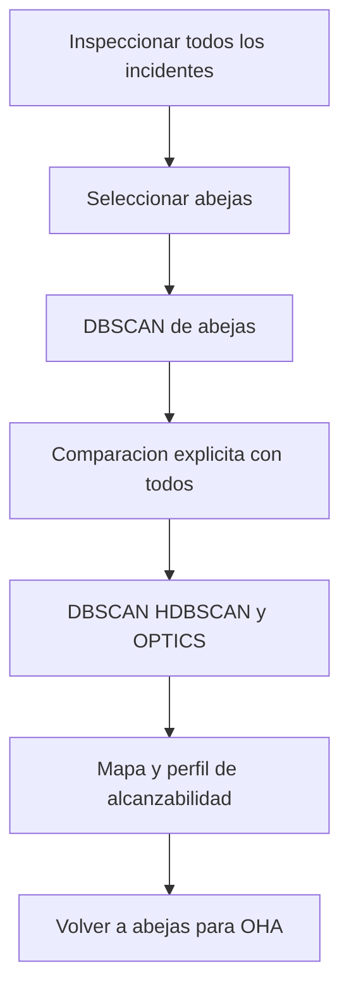
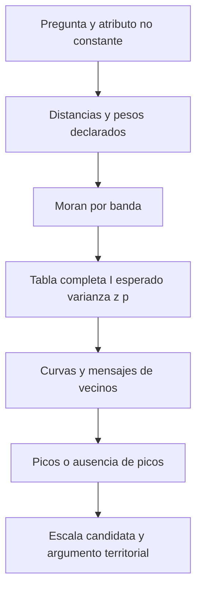

# Clase 02 - OPTICS y autocorrelación espacial incremental

**Fecha de destino:** 2026-09-15  
**Programa:** Diplomado GeoIA - Esri · Módulos 5 y 6  
**Docente:** Fabian Cetina  
**Estado:** tres notebooks con todas las celdas Jupyter completadas y salidas guardadas, 0 errores de celda; **los tres kernels abortaron al cerrar y el problema del entorno sigue sin resolver**. Revisión académica pendiente; cobertura directa del video parcial. Sin aprobación ni publicación.
**Duración prevista:** 120 minutos; agenda estimada, no ensayo medido

## Diapositivas de referencia

Fuente común: **Fabian Cetina / Esri**, `3. Machine Learning Espacial y AutoML/5. Aprendizaje No Supervisado/V3_DiplomadoGeoAI_Aprendizaje_No_Supervisado_2026.pptx`, versión V3, diapositivas verificadas mediante XML y exportadas desde PowerPoint en modo de solo lectura el **2026-09-15**. Son referencias de presentación, no capturas de la grabación ni autorización de redistribución. Las precisiones de los pies corrigen simplificaciones sin modificar el original.

### 20 — OPTICS
![[99 - Recursos/clase-02-slide-20.png]]
**Propósito y lectura:** ubicar OPTICS entre los métodos de densidad y reconocer su relación con DBSCAN. **Precisión:** «no se necesita el radio» no significa ausencia de límite de búsqueda en ArcGIS: aquí se configura explícitamente **350 m**. No confundir representación de densidad con inferencia estadística. [1, 2]

### 26 — Teorema del límite central
![[99 - Recursos/clase-02-slide-26.png]]
**Propósito y lectura:** distinguir distribución de observaciones y distribución de medias. **Precisión:** la aproximación requiere condiciones; no hay garantía universal para cualquier variable ni para todo n ≥ 30, y las observaciones espaciales no se vuelven independientes al aumentar n.

### 30 — Validación de hipótesis
![[99 - Recursos/clase-02-slide-30.png]]
**Propósito y lectura:** formular una referencia nula y una alternativa antes de observar p. **Precisión:** «no rechazar» no prueba azar; el modelo debe especificar atributo, soporte y pesos. No es una decisión sobre la existencia de cualquier patrón posible. [3]

### 31 — Análisis de correlación espacial
![[99 - Recursos/clase-02-slide-31.png]]
**Propósito y lectura:** relacionar semejanza de valores y proximidad. **Precisión:** una nube de ubicaciones no basta: Moran necesita un atributo con variación. I por sí solo no demuestra aleatoriedad ni causa. [3, 5]

### 32 — Gráfico de distribución normal
![[99 - Recursos/clase-02-slide-32.png]]
**Propósito y lectura:** interpretar colas y separación respecto de la referencia nula. **Precisión:** las referencias de z dependen del contraste y de la validez de su aproximación; no son probabilidades de pertenecer a un cluster. [3]

### 33 — Los cinco componentes del análisis
![[99 - Recursos/clase-02-slide-33.png]]
**Propósito y lectura:** separar I, E[I], varianza, z y p. **Correcciones obligatorias:** I no tiene rango universal [−1, 1] para pesos arbitrarios; cercano a cero no prueba azar. La varianza corresponde a I bajo el modelo nulo, no a distancias vecinales. p es probabilidad de resultados al menos tan extremos bajo H₀, no P(H₀), y significancia no certifica causalidad. [3]

## Objetivos de aprendizaje

- Interpretar ordenamiento, alcanzabilidad, grupos y ruido de OPTICS, con mínimo 100 y búsqueda de 350 m; distinguir abejas seleccionadas de comparaciones explícitas con todos los incidentes.
- Construir `ICOUNT` mediante coincidencias XY exactas y conservar la suma de eventos; distinguir sitio ocupado, registro, duplicado y tasa. En P01, separar el desplazamiento previo autorizado por Integrate de la agregación posterior.
- Explicar I observado, esperado, varianza nula, z y p sin atribuir causalidad ni convertir Moran en requisito universal de aprendizaje automático.
- Comparar escalas en abejas, colegios y viviendas turísticas registradas, argumentando vecindad, cobertura y selección exploratoria.
- Interpretar media, mediana, desviación, cuartiles e histograma de ICOUNT sobre sitios ocupados, sin convertir multiplicidad en tasa.
- Reproducir **tres notebooks autónomos**, ya ejecutados con mapas y gráficos ArcGIS, sin modificar entradas ni reutilizar estado oculto.

## Agenda estimada de 120 minutos

| Etapa | Minutos | Foco |
| --- | ---: | --- |
| Recapitulación DBSCAN/HDBSCAN y OPTICS | 10 | Reutilizar resultados de Clase 01; no repetirla |
| P01: EDA, filtro de abejas y comparación de clustering | 25 | Mapas comparables, barras y alcanzabilidad |
| Hipótesis, Moran y correcciones inferenciales | 15 | Atributo, pesos, modelo nulo y significancia |
| P01: OHA, copia Integrate, Collect Events e incremental | 20 | Soporte territorial, coincidencias y diez bandas |
| P02: colegios y dos exploraciones de escala | 20 | Cobertura incompleta y unidades |
| P03: viviendas, Moran global e incremental | 25 | Umbral automático e interpretación |
| Síntesis | 5 | Una conclusión y un límite por práctica |
| **Total** | **120** | No se omiten ejercicios por esta estimación |

## ¿Qué pregunta responde cada método?

OPTICS describe conectividad de densidad y extrae grupos; Moran pregunta por asociación de **valores** entre vecinos respecto de una referencia nula. Las dos preguntas no se validan mutuamente. Un perfil de alcanzabilidad no es un contraste estadístico y un p pequeño no demuestra que los grupos de OPTICS sean correctos. [1–3]

La unidad analítica cambia al contar eventos coincidentes: una fila deja de representar un incidente o establecimiento y pasa a representar un **sitio ocupado** con `ICOUNT` registros. No se añaden lugares sin eventos, no se elimina automáticamente ningún supuesto duplicado y no se estima riesgo poblacional. [7]

**¿Por qué dos mapas pueden parecer contradictorios sin estarlo?** Imagine una atención por abejas aislada en una zona con muchas otras atenciones de distinta clase. Un cluster del conjunto completo no prueba un cluster de abejas. Y una zona con conteos altos puede ser un punto caliente aunque DBSCAN no encuentre grupos con el mínimo solicitado. Hay que mantener visibles **población, soporte y vecindad**.

P01 comienza con el filtro de abejas y su DBSCAN; compara explícitamente con todos los incidentes mediante DBSCAN, HDBSCAN y OPTICS; vuelve a abejas para OHA hexagonal con dos delimitaciones; continúa con el ensayo HDBSCAN 50 de todos, copia exclusiva Integrate → Collect Events → incremental y ensayo DBSCAN de abejas a 300 m. P02 y P03 conservan sus recorridos de colegios y viviendas, incluidos Gi* k8/FDR. La comparación OPTICS sensibilidad 100 y el Gi* manual de P01 quedan en la historia, no como obligaciones del recorrido actual.

## De la intuición al método

### 2.1 OPTICS: representación y extracción no son lo mismo

DBSCAN usa una vecindad y un mínimo de puntos; HDBSCAN examina estructura jerárquica de densidad; OPTICS construye un ordenamiento por alcanzabilidad que permite inspeccionar cambios de densidad antes de interpretar la extracción. Una probabilidad de pertenencia HDBSCAN no es un p inferencial. [[02 - Conceptos/HDBSCAN y OPTICS|HDBSCAN y OPTICS]] amplía estas diferencias y [[03 - Herramientas/ArcGIS Pro - Density-based Clustering|Density-based Clustering]] las conecta con ArcGIS. [1, 2]

**Analogía:** recorrer barrios por proximidad produce tramos fáciles de enlazar y saltos a otro sector. En el perfil, el eje horizontal es **orden de recorrido**, no longitud, fecha ni identificador original; el vertical representa alcanzabilidad. La analogía no implica rutas viales reales ni causas de los eventos.

Para mínimo m y vecindad $N_\varepsilon(o)=\{q:d(o,q)\le\varepsilon\}$, contando al propio o, la distancia de núcleo es indefinida si hay menos de m puntos; en otro caso es la distancia al m-ésimo más cercano. Desde un punto núcleo o, la alcanzabilidad de p es [11, §3.2.1, definiciones 5–6]:

$$\operatorname{reach}(p\mid o)=\max\{\operatorname{core}_m(o),d(o,p)\}.$$

El recorrido actualiza candidatos; no es simplemente distancia al vecino más próximo. Los valores iniciales no definidos deben conservarse como tales, no reemplazarse por cero para dibujar valles ficticios. Si o no es núcleo, esta alcanzabilidad es indefinida. La definición primaria fue cotejada en Ankerst et al. (1999), pp. 52–53 [11], consulta 2026-09-16; respalda el concepto, no una equivalencia entre sensibilidad ArcGIS y `xi`.

En el recorrido actual, el filtro de abejas se define **antes** de modelar. La comparación OPTICS usa explícitamente **todos los incidentes**, mínimo 100 y búsqueda 350 m, sensibilidad automática. El perfil describe esa población, no solo abejas. Sensibilidad y extracción no son equivalentes a `xi` de scikit-learn; una etiqueta de cluster tampoco es un nivel de confianza. [1, 2, 4]



El diagrama muestra cambios de universo, no una validación de un método por otro.

![[99 - Recursos/clase-02-optics-alcanzabilidad.svg]]
**Lectura:** doce posiciones ilustrativas; x = orden, y = distancia en unidades ficticias. Valles A/B indican menor alcanzabilidad relativa. **Conclusión:** examinar estructura antes de explicar etiquetas. **Límite:** no son incidentes reales ni prueba de dos grupos. Elaboración propia basada en [2, 4].

### 2.2 Ruido y exploración temática

`CLUSTER_ID = -1` significa no asignación bajo esos parámetros, no evento erróneo ni zona segura. En la fuente histórica de colegios/viviendas, grabación 14 del 24/06/2026 (34:05–39:15), José Sebastián Gómez Romero plantea huecos cerca de El Dorado, Pontibón y parques como hipótesis territoriales. La localización no verifica explicaciones sobre exposición, uso del suelo o protocolos de atención.

Antes de modelos: diccionario de campos usados, nulos frente a ceros, claves repetidas, XY y fechas, CRS/unidades, cobertura, mapa y frecuencias ArcGIS. Data Engineering es una **vista** útil para revisión manual sobre copias, no existe una llamada `arcpy.DataEngineering`. No se imputa, deduplica ni repara automáticamente.

La sonda local de solo lectura encontró **90 443 incidentes**, WKID **9377**, metros, fechas **2022-01-01 a 2024-12-31**; no rotularlos únicamente «2024». El campo `IncidentesBomberos_NUMERO_INC` presenta **60 711 nulos** y **494 valores no nulos repetidos**: no es una clave completa certificada. No se exponen identificadores individuales. La selección pertinente está en **`IncidentesBomberos_CLASE_DE_S`**, no en `SERVICIO`: `13.1 CONTROL ATAQUE MASIVO DE ABEJAS`, **2 173 registros**. La categoría `CLASE_DE_S` también contiene 60 711 nulos: la selección identifica registros etiquetados, no toda atención potencialmente asociada con abejas.

### 2.3 Collect Events: contar sin desplazar

`CollectEvents` reúne **coincidencias XY exactas** y produce un punto por sitio con `ICOUNT`. No agrega puntos solo por estar a menos de 10 m. En P01 sí se reproduce **Integrate antes de Collect Events**, únicamente en una copia nueva de abejas destinada a Moran: mueve coordenadas y se comprueba por separado. P02 y P03 no integran. La coincidencia exacta se evalúa sobre la entrada que recibe Collect Events, no sobre una supuesta tolerancia de agrupación de esta herramienta. [7, 22]

**Analogía:** contar llamadas que ya tienen la misma dirección, sin que el acto de contar cambie la dirección. En P01, la preparación previa sí puede cambiarla y por eso se compara antes/después. Correspondencia: llamadas = eventos; dirección = coordenada ocupada; total = ICOUNT. Límite: compartir dirección no convierte registros en duplicados administrativos.

Comprobar suma de `ICOUNT` igual al número seleccionado y conjunto de coordenadas de salida igual al conjunto de XY de entrada. Si todos los sitios tienen conteo 1, el atributo es constante: Moran no se calcula, aunque la nube parezca agrupada. [5, 7]

![[99 - Recursos/clase-02-agregacion-soporte.svg]]
**Lectura:** seis eventos ficticios, tres coordenadas ocupadas, conteos 1, 2 y 3; no hay escala geográfica. **Conclusión:** se conserva el número de eventos y cambia el número de filas. **Límite:** no muestra desplazamientos ni resultados de abejas. Elaboración propia; coincidencia exacta e ICOUNT según [7].

### 2.3.1 EDA de multiplicidad: describir antes de inferir

**Complemento docente solicitado para esta clase**, no afirmación de que todo este desarrollo se mostró en la grabación. La pregunta es: **¿cuántos registros se concentran en cada ubicación ya ocupada y cómo se distribuyen esos conteos?** Primero se exploran los registros originales; después de Collect Events, la observación es un sitio y su variable es ICOUNT. En P01, OPTICS compara los 90 443 incidentes; las barras posteriores describen exclusivamente las 2 173 abejas, tras la copia preparada para Moran. En P02 son establecimientos registrados; en P03, viviendas turísticas registradas. Ninguna población equivale a todas las personas expuestas o a todos los lugares posibles.

| Tipo de campo | Resumen pertinente | Interpretación y límite |
| --- | --- | --- |
| SERVICIO/CLASE_DE_S; Tipo (alias «Marca»)/Ciudad; LOCALIDAD/SUBCATRNT | Frecuencias, nulos y barras | Categorías; promediar códigos no tiene significado |
| Identificador administrativo u OID | Nulos, unicidad y repeticiones | Identidad de fila no certifica identidad de incidente, colegio o vivienda |
| FECHA de incidentes | Cobertura y conteos por período | No tasa ni tendencia de riesgo; colegios/viviendas no aportan fecha individual |
| XY y CRS | Finitud, ceros, coincidencias, extensión y mapa | Un cero no es nulo; coincidencia no prueba duplicación; metros de 3857 tienen distorsión |
| ICOUNT en sitios | Suma, centro, dispersión e histograma | Registros por sitio ocupado, no abundancia, matrícula, precio ni riesgo |

**Intuición y definición.** Imagine tarjetas repartidas en casillas que ya contienen alguna tarjeta: tarjetas = registros, casillas = sitios ocupados, tarjetas por casilla = ICOUNT. La analogía ayuda a distinguir total y concentración, pero no representa casillas vacías ni explica por qué dos registros coinciden. Con N sitios, valores xᵢ y ausencia de nulos en ICOUNT:

$$\bar{x}=\frac{\sum_{i=1}^{N}x_i}{N},\qquad s=\sqrt{\frac{\sum_{i=1}^{N}(x_i-\bar{x})^2}{N-1}},\qquad IQR=Q_3-Q_1.$$

- **Media:** reparto uniforme hipotético del total entre sitios ocupados; conserva la contabilidad SUM/N, pero los extremos la desplazan. No es la experiencia del sitio más frecuente.
- **Mediana:** centro de los valores ordenados (promedio de los dos centrales si N es par); resiste mejor una cola larga. **Moda:** valor más frecuente, con posibles empates. Ambas pueden ser 1 aunque algunos sitios tengan muchos registros.
- **Desviación estándar:** distancia cuadrática típica respecto de la media, expresada en registros por sitio. La fórmula mostrada exige N > 1 y usa **N−1**; la descriptiva poblacional usa N. Llamarla «muestral» por su denominador no demuestra muestreo representativo ni independencia espacial. No es la varianza nula de Moran.
- **Cuartiles e IQR:** Q1 y Q3 delimitan el 50 % central; su diferencia mide anchura central, no toda la cola. Las convenciones de interpolación pueden diferir: aquí se conservan los cuartiles exportados por ArcGIS. [9, 10]

**Resultados actuales de multiplicidad.** P01 conserva **2 173 atenciones en 2 029 sitios** después de Integrate; ICOUNT 1/2/3/4 tiene frecuencias **1 898/120/9/2**, media **1.070971**. No se confunde ese soporte con los 2 043 sitios de la preparación histórica sin Integrate.

En P02/P03, Field Statistics To Table exporta ICOUNT y la biblioteca estándar contrasta la desviación N−1:

| Práctica | Registros / sitios | Media | Desviación N−1 | Sitios con ICOUNT=1 | Mín.–máx. | Fuera de cercas IQR |
| --- | ---: | ---: | ---: | ---: | ---: | ---: |
| P02 colegios | 10 617 / 10 262 | 1.034594 | 0.217345320 | 9 944 (96.90%) | 1–10 | 318 |
| P03 viviendas | 7 529 / 2 919 | 2.579308 | 8.246240139 | 2 295 (78.62%) | 1–186 | 624 |

En ambas, mediana, moda, Q1 y Q3 son 1; IQR=0 y no hay nulos en ICOUNT. Las cercas se reducen a [1,1]: señalar 318/624 sitios no identifica errores ni autoriza eliminarlos. La cola hasta 186 explica por qué P03 combina centro en uno con media y dispersión mayores. Faltan lugares con cero, exposición y denominadores poblacionales: estas cifras no son tasas. [9, 10]

#### Data Engineering: itinerario manual opcional en ArcGIS Pro

**Capacidad documentada, no interacción local ejecutada.** La automatización estadística sí se ejecutó; no existe `arcpy.DataEngineering`. Pasos basados en Esri Pro 3.6, *Interact with statistics*, selección de campos, cálculo y tipos de estadísticas, consulta **2026-09-16**. [10]

1. Abra el APRX de sitios de la corrida correspondiente, que apunta a su **copia `trabajo.gdb`**, no al original; añada también la copia previa a Collect Events para comparar unidades.
2. En la copia de registros, abra Data Engineering y añada a estadísticas los campos pertinentes mediante **Add To Statistics** o arrastre: SERVICIO/CLASE_DE_S en P01, Tipo/Ciudad en P02, LOCALIDAD/SUBCATRNT en P03. Pulse **Calculate**. No promedie IDs o códigos ni active limpieza.
3. Examine frecuencias, nulos y previsualizaciones de barras; use FECHA solo donde existe para cobertura temporal. La vista ofrece histogramas, barras o líneas según el tipo de campo. Anote selección y total: los resultados dependen de la selección activa.
4. Quite la selección; en la capa de sitios añada ICOUNT y calcule. Compare COUNT, SUM, centro y dispersión con la tabla anterior para P02/P03 y con las frecuencias actuales para P01; abra su histograma y relaciónelo con el mapa graduado.
5. Seleccione temporalmente ICOUNT > 1 y recalcule: el denominador pasa a sitios con multiplicidad, por lo que no se espera igualdad con toda la capa. Quite la selección y recalcule antes de comparar resultados globales.
6. Compare con `Descriptivos_ICOUNT`: mismo campo, población, selección y tratamiento de nulos. La UI documenta desviación N−1; el contraste ejecutado confirma esa convención en las exportaciones P02/P03. No atribuya una diferencia a datos sucios antes de comprobar esos criterios. No deduplique, impute ni repare.

#### Equivalente automatizado ejecutado: Field Statistics To Table

El siguiente extracto docente refleja las celdas ejecutadas de P02 y P03; **no es un script autónomo ni una nueva ejecución**. `weighted` es la clase de sitios producida por Collect Events y `gdb` la geodatabase nueva de esa corrida, definidas a partir de DATA_DIR/OUTPUT_DIR del notebook. Requiere el entorno ArcGIS Pro observado. Exporta solo **ICOUNT**, sin agrupación ni selección, para evitar resumir identificadores. `out_table` asocia el tipo NUMERIC con la tabla de salida; `out_statistics` asigna nombres a las estadísticas solicitadas. [9]

```python
from pathlib import Path  # Resolver la tabla dentro de la GDB aislada del notebook.
import arcpy  # ArcGIS Pro 3.6.2: estadística nativa sobre la copia de sitios.
import statistics  # Biblioteca estándar: contraste numérico, no reemplazo del SIG.

# Nombres solicitados y comprobados en las tablas guardadas de estas corridas.
stat_mapping = [
    ['FIELDNAME', 'Campo'], ['COUNT', 'Cantidad'], ['NULLS', 'Nulos'],
    ['SUM', 'Suma'], ['MINIMUM', 'Minimo'], ['MAXIMUM', 'Maximo'],
    ['MEAN', 'Media'], ['MEDIAN', 'Mediana'], ['MODE', 'Moda'],
    ['STANDARDDEVIATION', 'Desv'], ['FIRSTQUARTILE', 'Q1'],
    ['THIRDQUARTILE', 'Q3'], ['INTERQUARTILERANGE', 'InterquartileRange'],
]
statistics_result = arcpy.management.FieldStatisticsToTable(
    weighted, ['ICOUNT'], gdb, [['NUMERIC', 'Descriptivos_ICOUNT']],
    out_statistics=stat_mapping,
)
print(statistics_result.getMessages())  # Conservar mensajes y estado real de la operación.
stats_table = str(Path(gdb) / 'Descriptivos_ICOUNT')
stat_fields = [pair[1] for pair in stat_mapping]
actual_fields = {field.name for field in arcpy.ListFields(stats_table)}
if not set(stat_fields).issubset(actual_fields):
    raise ValueError('Revisar esquema: faltan nombres de estadísticas solicitados.')
with arcpy.da.SearchCursor(stats_table, stat_fields) as cursor:
    statistic_rows = list(cursor)
if len(statistic_rows) != 1:
    raise ValueError('Se esperaba una fila estadística para ICOUNT.')
stats = dict(zip(stat_fields, statistic_rows[0]))
# InterquartileRange es el nombre físico; IQR es solo una clave lógica Python.
stats['IQR'] = stats['InterquartileRange']
with arcpy.da.SearchCursor(weighted, ['ICOUNT']) as cursor:
    icount = [row[0] for row in cursor]
print(stats, statistics.stdev(icount), statistics.pstdev(icount))
```

La salida contiene **una fila que resume un campo**, no una fila por sitio. `Desv` coincide con `stdev` en las cifras observadas; `pstdev` da aproximadamente 0.217334729558 y 8.244827506414, respectivamente. Los notebooks verifican estas relaciones numéricas y la conservación de conteos. **`InterquartileRange` no se sustituye por un supuesto campo físico `IQR` ni se resuelve mediante un alias visual**: el esquema real se comprueba antes de abrir el cursor. ArcGIS conserva el cálculo, los gráficos y los mapas; Python estándar solo contrasta convenciones.

### 2.4 Moran global: valores, pesos y referencia nula

[[02 - Conceptos/Autocorrelación espacial global (Moran's I)|Moran global]] resume si valores similares o diferentes tienden a ser vecinos. Definir qué representa x, qué entidades constituyen n y cómo se calculan los pesos w. Con $u_i=x_i-\bar x$, $w_{ii}=0$ y $S_0=\sum_i\sum_jw_{ij}$:

$$I=\frac{n}{S_0}\frac{\sum_i\sum_jw_{ij}u_i u_j}{\sum_i u_i^2}.$$

Alto–alto y bajo–bajo contribuyen positivamente; alto–bajo, negativamente. El denominador representa variación total; un atributo constante o la ausencia de relaciones útiles impide el contraste. El rango no es universalmente [−1, 1]: Maruyama (2015), §2, teorema 2.1 y ejemplo 2.1, demuestra dependencia de W y casos fuera de esos límites [13], consulta 2026-09-16. La fórmula presupone n > 1, S₀ > 0, pesos no negativos y atributo no constante.

Bajo permutaciones equiprobables de valores en sitios fijos, pesos fijos y diagonal cero, con las condiciones anteriores [12, §13.5]:

$$E[I]=-\frac{1}{n-1},\qquad z=\frac{I-E[I]}{\sqrt{\operatorname{Var}_0(I)}}.$$

La varianza es la de **I bajo el modelo nulo**, no varianza de distancias ni simplemente varianza de ICOUNT. z mide separación estandarizada, no tamaño del efecto ni importancia operativa. p mide extremidad bajo H₀, no probabilidad de que H₀ sea cierta. Anselin [12], §13.5, distingue referencia gaussiana y aleatorización: comparten esperanza, pero la varianza de aleatorización incorpora el cuarto momento del atributo. z usa una aproximación asintótica, no normalidad incondicional. La derivación docente de E[I] se desarrolla en la nota de Moran; no se aplica una varianza universal ni se fija n sin considerar islas.

![[99 - Recursos/clase-02-moran-productos.svg]]
**Lectura:** dos cadenas ficticias comparten valores 1 y 3 y pesos binarios simétricos. Sus productos conducen a I = 1/3 y −1 contando aristas en ambas direcciones. **Conclusión:** importa qué valores son vecinos, no solo su histograma. **Límite:** cuatro sitios ilustran álgebra, no significancia; elaboración propia basada conceptualmente en [3].

### 2.5 Hipótesis, normalidad y límites

[[02 - Conceptos/Hipótesis nula espacial|Hipótesis nula espacial]] diferencia permutar valores en sitios fijos de cambiar ubicaciones bajo un modelo de proceso puntual. Moran de ICOUNT en sitios ocupados **no prueba aleatoriedad espacial completa de todas las ubicaciones posibles**: no incorpora los lugares sin eventos.

![[99 - Recursos/clase-02-nulos-espaciales.svg]]
**Lectura:** A cambia etiquetas entre sitios fijos; B cambia posiciones dentro de una ventana. **Conclusión:** son preguntas y experimentos nulos diferentes. **Límite:** posiciones y valores inventados, no simulaciones ejecutadas. Elaboración docente; atributo/localización en [3] y permutaciones en Anselin [12], §13.5. La definición formal de CSR en la nota vinculada conserva un pendiente documental específico, sin atribuirla a estas fuentes.

Definir contraste y α antes de la lectura. No rechazar significa evidencia insuficiente contra ese modelo, no demostrar azar o ausencia de riesgo. Un resultado global puede ocultar procesos locales opuestos. [3]

En el TLC clásico, variables independientes e idénticamente distribuidas, con media finita y varianza finita positiva, satisfacen convergencia normal de $\sqrt n(\bar X-\mu)/\sigma$. No se vuelve normal el histograma original. Dependencia espacial requiere condiciones adicionales; Moran no es una media ordinaria. Las referencias bilaterales normales como |z| ≈ 1.96 y p ≈ 0.05 no son umbrales para certificar clusters. Respaldo: Peter Kempthorne, MIT 18.655, primavera 2016, Lecture 15, p. 9 [14], consulta 2026-09-16. La convergencia es en distribución de la media estandarizada; no comprueba independencia ni condiciones de aproximación en los registros geográficos de esta clase.

### 2.6 Escala y autocorrelación incremental

[[02 - Conceptos/Autocorrelación espacial incremental|Incremental]] repite Moran para $d_k=d_0+k\Delta d$, $k=0,\ldots,K-1$. La banda es acumulativa: incluye vecinos hasta el umbral, no solo un anillo nuevo. Distancia euclidiana no es tiempo por red. La estandarización por filas divide pesos por su suma; filas sin vecinos requieren diagnóstico, no división por cero ni supresión automática. [5, 6]

| Población | Corrida | Bandas previstas | Distancias solicitadas |
| --- | --- | ---: | --- |
| Abejas | Única | 10 | 100 a 1 000 m, paso 100 |
| Colegios | Inicial | 20 | 2 000 a 40 000 m, paso 2 000 |
| Colegios | Refinada | 20 | 500 a 10 000 m, paso 500; fuente histórica 14, 97:36 |
| Viviendas turísticas | Inicial | 20 ejecutadas | 2 000 a 5 800 m, paso 200 |
| Viviendas turísticas | Segunda | 30 ejecutadas | 1 000 a 6 800 m, paso 200 |

Las tablas actuales conservan las **distancias realmente producidas** indicadas arriba. La herramienta puede ajustar rangos si se excede el umbral máximo: un parámetro solicitado no basta como evidencia de salida. La revisión histórica focal de la grabación 14 confirmó P03 inicial 20/2000/200 a 118:50–118:57 y segunda 30/1000/200 a 121:30–121:40, coincidentes con el notebook. Esa atribución no equivale a cobertura completa del video actual. Una entrada geográfica dentro de 30° puede usar distancias cordales en metros conforme a [5]; una entrada proyectada en metros no está libre de distorsión.

![[99 - Recursos/clase-02-bandas-pesos.svg]]
**Lectura:** sitios ficticios 0, 100, 220 y 700 m; a 150 m el último está aislado, a 500 m hay más conexiones. **Conclusión:** cambiar radio y normalización cambia relaciones. **Límite:** geometría lineal sin barreras, no mapa del ejercicio. Elaboración propia; [5, 6] y [[02 - Conceptos/Escala espacial, vecindad y bandas de distancia|escala, vecindad y bandas]].



**Lectura:** conservar diagnósticos antes de seleccionar. No hay puerta de «Moran significativo» que autorice OPTICS.

![[99 - Recursos/clase-02-incremental-seleccion.svg]]
**Lectura:** diez distancias y z inventados; primer pico ilustrativo 400 m y máximo 800 m; referencia normal bilateral nominal 1.96. **Conclusión:** leer curva completa, no solo máximo. **Límite:** no es resultado real ni ajuste por búsqueda de escala; elaboración propia basada en [6].

Un pico local **significativo** puede ser candidato, a menudo el primero según pregunta y proceso; puede haber varios o ninguno. No buscar indefinidamente hasta obtener significancia ni transferir automáticamente la distancia a OPTICS. [6] Las pruebas comparten datos y vecinos: p nominal no incorpora por sí solo la selección entre bandas. Recalcular sobre las mismas observaciones no es validación independiente. La ASA, Wasserstein y Lazar (2016), §3, principios 4–5 [15], exige transparencia sobre selección y distingue p de tamaño del efecto. Esta aplicación docente conserva todas las bandas dependientes; no atribuye a la ASA una corrección espacial específica ni afirma haberla ejecutado.

### 2.7 Territorio, cobertura y viviendas turísticas

**Colegios:** conjunto publicado por **CommunityMapsEsriColombia**. La grabación advierte cobertura incompleta, incluida ausencia de San Andrés (83:26–84:34). El insumo local conserva **10 617 puntos**, **10 262 XY únicos**, WKID **3857**. El notebook histórico exportó `Colegios_Colombia` y aplicó la integración únicamente a otra copia, `Colegios_Colombia_Integrados`: se reutiliza el exportado sin integración. Web Mercator distorsiona distancias; se declara esa limitación, sin asignar otro CRS ni proyectar silenciosamente. Conteo de establecimientos no mide matrícula, calidad, cobertura completa o acceso por viaje.

**Viviendas turísticas Bogotá:** tercera práctica real, no ejemplo opcional. La fuente usa registros de **Catastro/IDECA**, no una descarga comercial de Airbnb ni toda la oferta turística. El atributo es **ICOUNT** tras Collect Events. La copia oficial local está disponible en `99 - Recursos/datos/clase_02_viviendas_turisticas/viviendas.gdb/Viviendas_turisticas_Bogota` y fue ejecutada: **7 529 registros → 2 919 sitios**, CRS **3857**. El faltante consignado en la inspección anterior quedó resuelto; no describe el estado actual. LOCALIDAD y SUBCATRNT son códigos categóricos, no magnitudes: se observaron 19 y cuatro categorías, respectivamente, sin inventar nombres de un diccionario no verificado. No hay fecha individual para una serie temporal; la fecha de catálogo no es fecha de cada vivienda.

Moran global usa distancia inversa, euclidiana, estandarización por filas y umbral vacío. La ayuda local ArcPy Pro 3.6.2 y el pasaje oficial web Pro 3.6 verificado el 2026-09-16 aclaran: **vacío calcula una distancia euclidiana que garantiza al menos un vecino para cada entidad; cero, con distancia inversa, significa sin umbral**. [8] No es búsqueda del menor p ni distancia óptima validada. La corrida actual devuelve 4 822.1390 m; no se fija ese resultado como parámetro de entrada.

## Tres preguntas con datos reales

Los tres notebooks funcionan de forma autónoma con ArcGIS Pro 3.6.2/ArcInfo. Su primera celda configura entradas de solo lectura y salidas nuevas; no comparten estado ni un auxiliar personalizado. ArcPy calcula, cartografía y exporta gráficos nativos. Los fragmentos siguientes explican llamadas de los notebooks ejecutados: **no forman otro script autónomo**. No repiten Clase 01 ni modifican originales.

### P01 — ¿Agrupar atenciones o encontrar áreas con conteos altos?

[[99 - Recursos/notebooks/Clase 02 - Practica 01 - OPTICS y abejas.ipynb|Abrir P01: OPTICS y abejas]] contiene 49 celdas. Primero se inspeccionan **90 443 incidentes**, EPSG:9377; después se seleccionan **2 173 abejas**. Hay **60 711 categorías nulas**, por lo que la selección no equivale a todas las atenciones posiblemente relacionadas con abejas.

```python
from pathlib import Path  # ROOT se descubre/configura en la primera celda del notebook.
import arcpy  # Kernel de ArcGIS Pro con licencia; sin instalaciones adicionales.
DATA_DIR = ROOT / 'Datos'
OUTPUT_DIR = ROOT / '99 - Recursos/salidas_clase_02/practica_01/reorganizacion_20260917'
# source es Incidentes_Bomberos; gdb es una geodatabase nueva de esta ejecución.
field = 'IncidentesBomberos_CLASE_DE_S'
where = arcpy.AddFieldDelimiters(source, field) + " = '13.1 CONTROL ATAQUE MASIVO DE ABEJAS'"
selected = arcpy.management.MakeFeatureLayer(source, 'abejas_seleccion', where)
bees = str(Path(gdb) / 'Abejas')
arcpy.management.CopyFeatures(selected, bees)  # Selección antes de clustering.
arcpy.stats.DensityBasedClustering(bees, bee350, 'DBSCAN', 100, '350 Meters')
```

El filtro usa CLASE_DE_S, no SERVICIO. DBSCAN deja las **2 173 abejas como ruido**, aviso 110142: no significa error ni seguridad. La fuente cambia después a todos los incidentes; mantener ese cambio explícito evita atribuir sus grupos a las abejas. [1, 2]

| Comparación sobre 90 443 incidentes | Grupos | Ruido |
| --- | ---: | ---: |
| DBSCAN mínimo 100 / 350 m | 20 | 13 384 |
| DBSCAN mínimo 50 / 100 m | 5 | 90 087 |
| HDBSCAN mínimo 100 | 3 | 1 187 |
| OPTICS mínimo 100 / 350 m, automático | 29 | 17 561 |

```python
# Comparaciones de fuente: incidents es TODOS, no bees.
arcpy.stats.DensityBasedClustering(incidents, db100, 'DBSCAN', 100, '350 Meters')
arcpy.stats.DensityBasedClustering(incidents, db50, 'DBSCAN', 50, '100 Meters')
arcpy.stats.DensityBasedClustering(incidents, hdb100, 'HDBSCAN', 100)
arcpy.stats.DensityBasedClustering(incidents, optics, 'OPTICS', 100, '350 Meters')
```

![[99 - Recursos/salidas_clase_02/practica_01/reorganizacion_20260917/ejecucion_fcaae83db5bf/optics_perfil.png]]
El eje horizontal es orden OPTICS real y el vertical alcanzabilidad; los valles describen conectividad, no rutas ni fechas. Corresponde a **todos los incidentes** y no permite inferir causas. Elaboración docente, ArcGIS sobre Bomberos; conceptos en [1, 2, 11].

#### Volver a abejas: hexágonos y delimitación territorial

OHA agrega incidentes a hexágonos y evalúa conteos con escalas elegidas por la herramienta. Se deja vacío Analysis Field porque se cuentan puntos, no se suma un atributo. La delimitación permite incluir celdas con cero; no es el Gi* manual de ocho vecinos sobre sitios ocupados. [20, 21]

```python
# jurisdictions es la copia jurisdiccional autorizada; bees sigue SIN Integrate.
where = arcpy.AddFieldDelimiters(jurisdictions, 'ESTACION') + " <> 'B-10'"
without_b10 = arcpy.management.MakeFeatureLayer(jurisdictions, 'sin_B10', where)
arcpy.stats.OptimizedHotSpotAnalysis(
    bees, oha_all, '', 'COUNT_INCIDENTS_WITHIN_HEXAGON_POLYGONS', jurisdictions)
arcpy.stats.OptimizedHotSpotAnalysis(
    bees, oha_without, '', 'COUNT_INCIDENTS_WITHIN_HEXAGON_POLYGONS', without_b10)
```

| Delimitación | Hexágonos | Con cero | Suma JOIN_COUNT |
| --- | ---: | ---: | ---: |
| Las 17 jurisdicciones | 4 318 | 3 534 | 2 173 |
| 16, ESTACION distinto de B-10 | 4 753 | 3 569 | 2 074 |

![[99 - Recursos/salidas_clase_02/practica_01/reorganizacion_20260917/ejecucion_fcaae83db5bf/oha_17.png]]
![[99 - Recursos/salidas_clase_02/practica_01/reorganizacion_20260917/ejecucion_fcaae83db5bf/oha_16.png]]
Las leyendas distinguen frío, no significativo y caliente con FDR; los colores no son grupos DBSCAN ni probabilidades de riesgo. Lea escala y dominio de cada mapa por separado: excluir una jurisdicción cambia puntos contabilizados, ceros y escalas automáticas, por lo que más hexágonos no significa más incidentes. **B-10 corresponde a Marichuela en estos datos; la exclusión no está acreditada como límite administrativo de Sumapaz.** Son mapas ArcGIS actuales de elaboración docente, sin base remota en P01. [20, 21]

Después de OHA, la fuente ensaya **HDBSCAN mínimo 50 sobre todos**: 5 grupos y 2 463 ruido. La llamada conserva el mismo patrón `DensityBasedClustering(incidents, hdb50, 'HDBSCAN', 50)`; aumentar grupos no demuestra mejora.

#### Una copia exclusiva para preparar Moran

Integrate cambia posiciones in situ. Solo se aplica a una **copia nueva de abejas para Moran**, con la tolerancia predeterminada del CRS: no a originales ni a las entradas de clustering/OHA. El notebook enlaza IDs y compara cantidad, atributos y coordenadas antes/después. [22]

```python
# integrated es una copia NUEVA: preservar enlace ORIG_OID y medir antes/después.
arcpy.management.CopyFeatures(bees, integrated)
arcpy.management.Integrate([[integrated, 1]])  # Tolerancia omitida: predeterminada del CRS.
arcpy.stats.CollectEvents(integrated, weighted)  # Coincidencias exactas de esa copia.
arcpy.stats.IncrementalSpatialAutocorrelation(
    weighted, 'ICOUNT', 10, 100, 100,
    'EUCLIDEAN', 'ROW_STANDARDIZATION', moran_table, str(report))
```

Se movieron **31 de 2 173 puntos**; tolerancia XY **0.001 m**, desplazamiento máximo observado **0.001360147 m**. La tolerancia no se presenta como cota del desplazamiento medido. Se conservaron IDs, atributos y cantidad; las abejas de clustering/OHA quedaron intactas. Collect Events produjo **2 029 sitios**, suma **2 173**. No se integra en P02/P03.

![[99 - Recursos/salidas_clase_02/practica_01/reorganizacion_20260917/ejecucion_fcaae83db5bf/icount_frecuencia.png]]
ICOUNT 1/2/3/4 corresponde a 1 898/120/9/2 sitios. La media 1.070971 cuenta atenciones por sitio ocupado, no abundancia de abejas. Las barras nativas muestran la cola sin eliminar registros. [7]

![[99 - Recursos/salidas_clase_02/practica_01/reorganizacion_20260917/ejecucion_fcaae83db5bf/moran_curva_z.png]]
Diez radios de 100–1 000 m: máximo numérico a **700 m**, I=0.014074, **z=1.220846, p=0.222144**. Aviso **001284: sin picos válidos**. El eje ampliado deja ±1.96 fuera del encuadre; ninguna banda es significativa al 5 % nominal. No rechazo no demuestra azar, y el máximo no selecciona radio óptimo. [5, 6]

El ensayo final de la fuente vuelve a abejas **sin integrar**: `DensityBasedClustering(bees, bee300, 'DBSCAN', 100, '300 Meters')`. Otra vez 2 173 ruido, aviso 110142. Se reproduce una comparación, no una optimización validada por Moran.

### P02 — ¿La escala regional cuenta la misma historia que la vecindad cercana?

[[99 - Recursos/notebooks/Clase 02 - Practica 02 - Colegios y escala espacial.ipynb|Abrir P02: Colegios y escala espacial]] usa la copia local **`99 - Recursos/datos/clase_02_colegios/colegios.gdb/Colegios_Colombia`**, no el vault hermano. Sus 65 celdas conservan EDA → Collect Events exacto → descriptivos → dos incrementales → Gi* k8/FDR. **10 617 registros → 10 262 sitios** sin Integrate. Tipo (alias gráfico «Marca») distingue categorías; Count significa número de filas, no matrícula. Ciudad contiene 771 etiquetas y no equivale automáticamente a 771 municipios.

```python
# Tras configurar DATA_DIR/OUTPUT_DIR: GDB lógica comprobada con arcpy.Exists.
source = str(DATA_DIR / 'Colegios_Colombia')
arcpy.management.CopyFeatures(source, working)  # Copia nueva comprobada con CheckGeometry.
arcpy.stats.CollectEvents(working, weighted)  # Sin desplazar ni deduplicar.
arcpy.stats.IncrementalSpatialAutocorrelation(
    weighted, 'ICOUNT', 20, 2000, 2000,
    'EUCLIDEAN', 'ROW_STANDARDIZATION', tabla_regional, informe_regional)
arcpy.stats.IncrementalSpatialAutocorrelation(
    weighted, 'ICOUNT', 20, 500, 500,
    'EUCLIDEAN', 'ROW_STANDARDIZATION', tabla_refinada, informe_refinado)
```

Se conservan veinte radios 2 000–40 000 m y veinte 500–10 000 m. No se añade un global de colegios ni se reproduce como ejercicio un error de unidades. La configuración refinada procede de la fuente histórica 14, 97:36. EPSG:3857 se mantiene sin reproyección: metros cartográficos distorsionados, no tiempos de viaje. [5, 6]

![[99 - Recursos/salidas_clase_02/practica_02/reorganizacion_20260917/ejecucion_fb7b2e19ecf8/eda_colegios.png]]
El mapa muestra cobertura registrada con base Light Gray Canvas; norte, escala y CRS están indicados. La concentración visual no certifica cobertura nacional ni demanda educativa. Fuente de puntos: CommunityMapsEsriColombia; mapa de elaboración docente, base Esri y colaboradores.

![[99 - Recursos/salidas_clase_02/practica_02/reorganizacion_20260917/ejecucion_fb7b2e19ecf8/Regional_2000_z_score.png]]
Primer pico regional **14 000 m, z=2.491456, p=0.012722**; máximo pico **38 000 m, z=3.966508, p≈0.000072933**. Eje x: distancia cartográfica; y: separación estandarizada. Las guías ±1.96 son nominales, no corrigen explorar bandas.

![[99 - Recursos/salidas_clase_02/practica_02/reorganizacion_20260917/ejecucion_fb7b2e19ecf8/Refinada_500_z_score.png]]
Pico local refinado **3 500 m, z=2.836563, p=0.004560**. El extremo 500 m tiene z=4.259029, mayor pero no un pico interior. Ninguna corrida emitió advertencias nativas; eso no resuelve distorsión, cobertura incompleta ni dependencia entre pruebas. Ambas curvas son salidas ArcGIS de los mismos sitios, no confirmaciones independientes.

### P03 — ¿Se parecen las multiplicidades de viviendas registradas vecinas?

[[99 - Recursos/notebooks/Clase 02 - Practica 03 - Viviendas turisticas y Moran.ipynb|Abrir P03: Viviendas turísticas y Moran]] conserva 66 celdas. Datos del **Instituto Distrital de Turismo**, distribuidos por Catastro/IDECA: copia local `99 - Recursos/datos/clase_02_viviendas_turisticas/viviendas.gdb/Viviendas_turisticas_Bogota`. Contenido del catálogo 31/05/2025, copia 15/09/2026; no fecha individual de cada vivienda. No son datos comerciales Airbnb ni toda la oferta. [Catálogo IDECA, Vivienda turística](https://www.ideca.gov.co/recursos/mapas/vivienda-turistica), procedencia verificada de la copia.

**7 529 registros → 2 919 sitios**, ICOUNT 1–186; sin Integrate. LOCALIDAD y SUBCATRNT tienen 19 y cuatro categorías, sin nulos/vacíos observados. No se inventan nombres para códigos sin diccionario verificado. EPSG:3857 limita las distancias; la comprobación de almacenamiento conservó correspondencia de sitios/conteos con diferencia máxima **1.178×10⁻⁸ m**, no tolerancia de agrupación ni desplazamiento intencional.

```python
# weighted es la salida de Collect Events de la copia de viviendas.
result = arcpy.stats.SpatialAutocorrelation(
    weighted, 'ICOUNT', 'GENERATE_REPORT',
    'INVERSE_DISTANCE', 'EUCLIDEAN_DISTANCE', 'ROW', None)
print(result.getMessages())  # Conservar umbral calculado y advertencias.
# Dos exploraciones de fuente; reglas de pesos distintas del global.
arcpy.stats.IncrementalSpatialAutocorrelation(
    weighted, 'ICOUNT', 20, 2000, 200,
    'EUCLIDEAN', 'ROW_STANDARDIZATION', tabla_inicial, informe_inicial)
arcpy.stats.IncrementalSpatialAutocorrelation(
    weighted, 'ICOUNT', 30, 1000, 200,
    'EUCLIDEAN', 'ROW_STANDARDIZATION', tabla_segunda, informe_segundo)
```

El global usa distancia inversa y ROW; incremental usa bandas acumulativas y ROW_STANDARDIZATION. **None no es cero:** el umbral automático asegura al menos un vecino y devuelve **4 822.1390 m** del CRS (aviso 000853). Los avisos **001420/001422** indican algunas entidades con más de 1 000 vecinos y posible presión de memoria: se interpretan, no se suprimen ni motivan cambios silenciosos de parámetros. [8]

Resultado global: **I=0.025782**, esperado **−0.000343**, **z=10.661289**, **p mostrado 0** por precisión numérica. Asociación positiva pequeña con separación nula fuerte no es un efecto económico grande ni causa. El [informe nativo actual](<../99 - Recursos/salidas_clase_02/practica_03/reorganizacion_20260917/ejecucion_79ec3f306fcc/MoransI_Result_47612_48524_.html>) conserva la salida original; el notebook incrusta sus imágenes oficiales para evitar depender de rutas de instalación. El texto del informe sobre azar no debe interpretarse como P(H₀).

![[99 - Recursos/salidas_clase_02/practica_03/reorganizacion_20260917/ejecucion_79ec3f306fcc/Inicial_z_score.png]]
Inicial: veinte radios **2 000–5 800 m**, primer pico **2 200 m, z=7.026597**; máximo **5 000 m, z=10.637299**. Segunda: treinta radios **1 000–6 800 m**, primero **1 400 m, z=5.447021**, máximo nuevamente **5 000 m**. El eje muestra z, no magnitud I; repetir el máximo con los mismos sitios no valida un radio óptimo. Curvas completas I/z/p y PDF nativos permanecen en P03. [5, 6]

![[99 - Recursos/salidas_clase_02/practica_03/reorganizacion_20260917/ejecucion_79ec3f306fcc/frecuencia_cola.png]]
El panel excluye singleton **solo de la vista**: los 2 295 sitios con ICOUNT=1 siguen en la tabla y panel completo. 02–10 son valores exactos; 11–14 ordenan intervalos 11–20, 21–50, 51–100 y 101–186. La cola no prueba errores ni riesgo; barras ArcGIS de elaboración docente. [18, 19]

### Gi* manual permanece en colegios y viviendas, no sustituye OHA de abejas

Este complemento solicitado se ejecuta **después** de los métodos fuente en P02/P03. Un sitio alto aislado no basta: importa su vecindad. Se fijan **ocho vecinos más cercanos**, distancia euclidiana y FDR antes de observar colores; no se elige el radio de un pico incremental. k es fijo, alcance físico variable. [16, 17]

```python
# Solo P02/P03: sitios ocupados e ICOUNT, salida nueva.
result = arcpy.stats.HotSpots(
    Input_Feature_Class=weighted, Input_Field='ICOUNT', Output_Feature_Class=hotspots,
    Conceptualization_of_Spatial_Relationships='K_NEAREST_NEIGHBORS',
    Distance_Method='EUCLIDEAN_DISTANCE', Standardization='NONE',
    Apply_False_Discovery_Rate__FDR__Correction='APPLY_FDR', number_of_neighbors=8)
print(result.getMessages())  # No ajustar k para producir categorías ausentes.
```

GiZScore es separación local estandarizada y GiPValue es p nominal; **Gi_Bin incorpora FDR**: −3/−2/−1 frío al 99/95/90 %, 0 no significativo y +1/+2/+3 caliente al 90/95/99 %. `NONE` es un parámetro heredado sin efecto. FDR corrige pruebas locales de esta corrida, no la selección entre modelos. SOURCE_ID enlaza una fila, no certifica una entidad real. [16]

| Práctica | Fríos | No significativo | Caliente 90 % | Caliente 95 % | Caliente 99 % |
| --- | ---: | ---: | ---: | ---: | ---: |
| Colegios: 10 262 sitios | 0 | 10 127 | 0 | 0 | 135 |
| Viviendas: 2 919 sitios | 0 | 2 802 | 18 | 18 | 81 |

![[99 - Recursos/salidas_clase_02/practica_03/reorganizacion_20260917/ejecucion_79ec3f306fcc/mapa_Gi_FDR.png]]
Gris no significa seguro; rojo no prueba causa. No hay frío significativo y no se cambia k para fabricarlo. Norte, escala y CRS permiten leer ubicación; la base Light Gray Canvas requiere conexión, mientras cálculos y entradas son locales. Elaboración docente ArcGIS, puntos IDT/Catastro/IDECA y base Esri y colaboradores. Los 117 sitios calientes no representan 117 viviendas ni toda la oferta turística.

## ¿Qué podemos concluir y llevar al proyecto?

1. ¿Por qué una clave nula o repetida no autoriza eliminar incidentes?
2. ¿Qué cambia al agregar coincidencias exactas y qué permanece igual?
3. ¿Por qué una nube agrupada con ICOUNT constante no permite este Moran?
4. ¿Qué distingue umbral automático, umbral cero y distancia elegida por un pico?
5. ¿Por qué un z mayor no implica I mayor, más riesgo o efecto causal?
6. ¿Cómo limita Web Mercator la interpretación de metros en colegios nacionales?

El proyecto final debe separar descripción operativa, asociación de atributo y explicación causal. Aportar población, soporte, vecindad justificada y límites de cobertura; no acumular algoritmos como prueba de calidad. Cerrar con una conclusión respaldada por una salida y otra afirmación que esa salida no permite.

## Referencias y lecturas

Se reutilizan pasajes verificados: referencias 1–7 el **2026-09-15**, 8–19 el **2026-09-16** y 20–22 el **2026-09-17**. Las secciones indicadas permiten localizar el respaldo de cada afirmación; esta sincronización no añade consultas web.

1. **Esri, ArcGIS Pro 3.6 — [Density-based Clustering](https://pro.arcgis.com/en/pro-app/3.6/tool-reference/spatial-statistics/densitybasedclustering.htm)**, Summary, Usage, Parameters y Code sample. Registro reutilizado: [[99 - Recursos/Clase 01 - Fuentes y acuerdos#8. Referencias verificadas por el orquestador|fuentes Clase 01]].
2. **Esri, ArcGIS Pro 3.6 — [How Density-based Clustering works](https://pro.arcgis.com/en/pro-app/3.6/tool-reference/spatial-statistics/how-density-based-clustering-works.htm)**, Search Distance, How methods work y Outputs. Mismo registro.
3. **Esri, ArcGIS Pro 3.6 — [How Spatial Autocorrelation (Global Moran's I) works](https://pro.arcgis.com/en/pro-app/3.6/tool-reference/spatial-statistics/h-how-spatial-autocorrelation-moran-s-i-spatial-st.htm)**, introducción e Interpretation, registro E6 reutilizado.
4. **scikit-learn 1.6 — [OPTICS](https://scikit-learn.org/1.6/modules/generated/sklearn.cluster.OPTICS.html)**, max_eps, Attributes e implementation notes. Referencia conceptual, no dependencia añadida ni equivalencia de parámetros.
5. **Esri, ArcGIS Pro 3.6 — [Incremental Spatial Autocorrelation](https://pro.arcgis.com/en/pro-app/3.6/tool-reference/spatial-statistics/incremental-spatial-autocorrelation.htm)**, Usage, Parameters, Python y Licensing. Campo no constante, distancias, tabla y gráfico nativo, códigos API; disponible Basic/Standard/Advanced.
6. **Esri, ArcGIS Pro 3.6 — [How Incremental Spatial Autocorrelation works](https://pro.arcgis.com/en/pro-app/3.6/tool-reference/spatial-statistics/how-incremental-spatial-autocorrelation-works.htm)**, página completa: picos significativos candidatos, ausencia de pico y escala de proceso; ejemplo de obesidad escolar y escala hogar/programa.
7. **Esri, ArcGIS Pro 3.6 — [Collect Events](https://pro.arcgis.com/en/pro-app/3.6/tool-reference/spatial-statistics/collect-events.htm)**, Usage, Parameters, Python y Licensing, coincidencias y preparación: XY exacto, ICOUNT, integración opcional que modifica geometría; todas las licencias.

8. **Esri, ArcGIS Pro 3.6 — [Spatial Autocorrelation (Global Moran's I)](https://pro.arcgis.com/en/pro-app/3.6/tool-reference/spatial-statistics/spatial-autocorrelation.htm)**, Usage, Parameters y Python, consulta **2026-09-16**: umbral vacío euclidiano con al menos un vecino por entidad; cero sin umbral con distancia inversa; firma `EUCLIDEAN_DISTANCE`/`ROW` y salidas. Cierra el cotejo web de la ayuda instalada Pro 3.6.2; los respaldos académicos se distinguen en 11–15.
9. **Esri, ArcGIS Pro 3.6 — [Field Statistics To Table](https://pro.arcgis.com/en/pro-app/3.6/tool-reference/data-management/field-statistics-to-table.htm)**, Parameters y Python, consulta **2026-09-16**: campos de entrada, tablas por tipo de campo y asignación de estadísticas de salida. Es la operación ejecutada sobre ICOUNT en P02/P03; P01 actual conserva sus conteos y barras propios.
10. **Esri, ArcGIS Pro 3.6 — [Interact with statistics](https://pro.arcgis.com/en/pro-app/3.6/help/analysis/geoprocessing/data-engineering/view-statistics.htm)**, selección de campos, cálculo y tipos de estadísticas, consulta **2026-09-16**: selección afecta resultados, desviación estándar N−1 y previsualizaciones de histogramas/barras/líneas. Respalda el itinerario manual opcional, no acredita uso local de la UI.

11. **Ankerst, Breunig, Kriegel y Sander (1999), [OPTICS: Ordering Points To Identify the Clustering Structure](https://sigmodrecord.org/publications/sigmodRecord/9906/OPTICS_%20ordering%20points%20to%20identify%20the%20clustering%20structure.pdf)**, SIGMOD, §3.2.1, definiciones 5–6, pp. 52–53; consulta **2026-09-16**. Distancia de núcleo y alcanzabilidad; no equivalencia de parámetros entre productos.
12. **Luc Anselin, [An Introduction to Spatial Data Science with GeoDa — Moran’s I](https://lanselin.github.io/introbook_vol1/morans-i.html)**, edición web, §13.5, momentos nulos, pesos/islas e inferencia; consulta **2026-09-16**, sección consultada.
13. **Yuzo Maruyama (2015), [An alternative to Moran’s I for spatial autocorrelation](https://arxiv.org/abs/1501.06260)**, arXiv:1501.06260v1, §2, definición, teorema 2.1 y ejemplo 2.1/tabla 1, pp. 2–4; consulta **2026-09-16**. Solo fórmula y límites; no se introduce la medida alternativa del artículo.
14. **Peter Kempthorne, MIT 18.655, primavera 2016, [Mathematical Statistics — Lecture 15: Limit Theorems](https://live.ocw.mit.edu/courses/18-655-mathematical-statistics-spring-2016/6c41b4096a836ff41f8de46cf54b5b7c_MIT18_655S16_LecNote15.pdf)**, p. 9, TLC iid de varianza finita positiva; consulta **2026-09-16**.
15. **Wasserstein y Lazar (2016), [The ASA’s Statement on p-Values: Context, Process, and Purpose](https://doi.org/10.1080/00031305.2016.1154108)**, §3, principios 4–5, pp. 131–132; [reproducción pública leída](https://www.uab.edu/ccts/images/kaizen/r2t/2025/Review%2016-20_ASA%20Statement%20on%20Pvalues.pdf), consulta **2026-09-16**. Transparencia de análisis y p frente a magnitud, no corrección espacial implementada.

16. **Esri, ArcGIS Pro 3.6 — [Hot Spot Analysis (Getis-Ord Gi*)](https://pro.arcgis.com/en/pro-app/3.6/tool-reference/spatial-statistics/hot-spot-analysis.htm)**, Usage, Parameters, Python, consulta **2026-09-16**: KNN, FDR, campos y firma; firma instalada contrastada en Pro 3.6.2.
17. **Esri, ArcGIS Pro 3.6 — [How Hot Spot Analysis works](https://pro.arcgis.com/en/pro-app/3.6/tool-reference/spatial-statistics/h-how-hot-spot-analysis-getis-ord-gi-spatial-stati.htm)**, página completa, consulta **2026-09-16**: valores altos aislados, al menos 30 entidades, variación y aproximadamente ocho vecinos ante asimetría. No se copia el ejemplo de Integrate.
18. **Esri, ArcGIS Pro 3.6 — [Bar](https://pro.arcgis.com/en/pro-app/3.6/arcpy/charts/bar.htm)**, Syntax/Parameters, consulta **2026-09-16**: categorías, SUM/COUNT, títulos y exportación nativa.
19. **Esri, ArcGIS Pro 3.6 — [Box](https://pro.arcgis.com/en/pro-app/3.6/arcpy/charts/box.htm)**, Syntax/Parameters/Methods, consulta **2026-09-16**: unidades originales con standardizeValues=False, outliers y exportToPNG.

20. **Esri, ArcGIS Pro 3.6 — [Optimized Hot Spot Analysis](https://pro.arcgis.com/en/pro-app/3.6/tool-reference/spatial-statistics/optimized-hot-spot-analysis.htm)**, agregación hexagonal, campo vacío, delimitación, FDR y firma; consulta **2026-09-17**.
21. **Esri, ArcGIS Pro 3.6 — [How Optimized Hot Spot Analysis works](https://pro.arcgis.com/en/pro-app/3.6/tool-reference/spatial-statistics/how-optimized-hot-spot-analysis-works.htm)**, ceros dentro de la delimitación y selección automática de celda/escala; consulta **2026-09-17**.
22. **Esri, ArcGIS Pro 3.6 — [Integrate](https://pro.arcgis.com/en/pro-app/3.6/tool-reference/data-management/integrate.htm)**, modificación in situ, copia y tolerancia XY predeterminada; consulta **2026-09-17**. La autorización de P01 no se extiende a otras prácticas.

## Evidencia de ejecución, fuentes docentes y pendientes

**Fuente actual de P01:** grabación del 16/09/2026, `20260916_225700UTC`, duración **2:17:26**. Revisión directa mediante reproductor visible Chrome DevTools en esta sesión, **focal y parcial**, con transcripción visible solo de apoyo: selección **43:53–44:04**; DBSCAN abejas **55:30–55:36 y 58:00–58:04**; comparaciones de todos **59:20–59:28, 60:30–60:35, 61:30–61:35 y 62:45–62:49**; OHA **67:28–67:32, 68:12–68:18 y 71:18–71:25**, resultado sin B-10 **72:20–72:23**; HDBSCAN 50 **76:20–76:32**; Integrate **111:50–111:58** y Collect Events **112:00–112:22**; incremental **114:20–114:35**, curva/aviso **116:00–116:05**; DBSCAN 300 m **118:10–118:16**; documentación visible **133:00–133:07**. Son ventanas verificadas, no reproducción continua ni cobertura docente integral.

**Otras fuentes conservadas:** colegios y viviendas siguen la grabación **14**, *OPTICS y autocorrelación espacial incremental*, **24/06/2026**, **José Sebastián Gómez Romero**, duración **2:05:44**. No se atribuyen al nuevo video de Bomberos. La evidencia histórica incluye colegios **83:26–97:42** (refinamiento 97:36) y revisión focal de viviendas el 16/09/2026: **108:00–108:07, 109:15–109:22, 110:20–110:27, 111:10–111:15, 115:00–115:07, 116:50–116:57, 118:10–118:17, 118:50–118:57, 120:00–120:10 y 121:30–121:40**. La configuración provisional a 118:16 no se presenta como tercera corrida. Esta evidencia histórica no sustituye una revisión directa completa actual. Las seis diapositivas iniciales mantienen su atribución independiente al PPTX V3.

**Ejecución Jupyter guardada — 17/09/2026:** P01 **25/25**, P02 **32/32**, P03 **33/33** celdas completadas, **0 errores de celda**, **16 PNG por notebook** y **1/2/2 PDF nativos**. Las salidas auténticas, contadores y tiempos de celda están guardados en los tres notebooks canónicos. **Advertencia: los tres kernels abortaron al cerrar; este problema del entorno no está resuelto.** Salida de kernel **3221227010**, controlador **1**, en cada intento. Los **419.863/176.265/148.597 s** incluyen el cierre, no son tiempos puros de cálculo. Evidencia: [P01](<../99 - Recursos/salidas_clase_02/ejecucion_jupyter_20260917/reintento_3a2b2b37dc/P01/execution.json>) · [P02](<../99 - Recursos/salidas_clase_02/ejecucion_jupyter_20260917/reintento_3a2b2b37dc/P02/execution.json>) · [P03](<../99 - Recursos/salidas_clase_02/ejecucion_jupyter_20260917/reintento_3a2b2b37dc/P03/execution.json>) (cada carpeta conserva `executed_attempt.ipynb` y `kernel.stderr.log`). [Registro de guardado y respaldos exactos](<../99 - Recursos/salidas_clase_02/ejecucion_jupyter_20260917/guardado_canonico_20260917/save-result.json>). Guardar no reejecuta modelos ni resuelve el cierre; tampoco acredita interacción con el visor.

**Historia anterior:** la tabla, tiempos, vistas HTML y observaciones de cierre siguientes corresponden a las corridas anteriores por DisplayFormatter, no a los kernels Jupyter actuales. Las figuras analíticas enlazadas en esta nota se conservan con esa procedencia anterior; las nuevas salidas están en los notebooks y registros anteriores de este párrafo.

| Práctica | Ejecución histórica y evidencia | Celdas ejecutadas | Tiempo de cómputo histórico | PNG |
| --- | --- | ---: | ---: | ---: |
| P01 | [Resumen](<../99 - Recursos/salidas_clase_02/practica_01/reorganizacion_20260917/ejecucion_fcaae83db5bf/resumen.json>) · [registro](<../99 - Recursos/salidas_clase_02/practica_01/reorganizacion_20260917/proceso_e5a0655350/ejecucion.json>) | 25/25 | 378 s | 16 |
| P02 | [Registro](<../99 - Recursos/salidas_clase_02/practica_02/reorganizacion_20260917/proceso_58b3305057/ejecucion.json>) · [vista HTML actualizada](<../99 - Recursos/salidas_clase_02/practica_02/reorganizacion_20260917/revision_procedencia_21fe76149e/notebook.html>) | 32/32 | 73.024 s | 16 |
| P03 | [Registro](<../99 - Recursos/salidas_clase_02/practica_03/reorganizacion_20260917/proceso_e7ede4402c/ejecucion.json>) · [vista HTML actualizada](<../99 - Recursos/salidas_clase_02/practica_03/reorganizacion_20260917/revision_procedencia_be8f011f59/notebook.html>) | 33/33 | 72.011 s | 16 |

Entorno: ArcGIS Pro **3.6.2/ArcInfo**, Python **3.13.7**, procesos nuevos secuenciales. Los tiempos anteriores no son un ensayo de la agenda de 120 minutos. El escritor observó retorno natural 0 en las corridas finales; los JSON originales de P02/P03 no contienen campo de salida y el verificador independiente no presenció el cierre. Esa observación se conserva ahora en los metadatos históricos; no describe el cierre fallido de los kernels Jupyter actuales. La revisión independiente de P02/P03 comprobó análisis, autonomía y visuales, no una ejecución nueva. Esta sincronización cambia presentación y nota, **sin reejecutar modelos ni alterar imágenes o código analítico**.

[Nota exacta anterior, con registros y gráficos históricos](<../99 - Recursos/salidas_clase_02/reorganizacion_20260917/nota_antes_D04_c9caa24ada/2026-09-15 - Clase 02 - OPTICS y autocorrelación espacial incremental.md>): preserva las etapas anteriores, incluidos bloqueos de licencia, cierres forzados, sensibilidad 100 y Gi* manual de P01. Los originales y todas las carpetas históricas permanecen intactos; no describen el estado vigente.

**Comprobación documental:** seis diapositivas conservadas sin cambios, enlaces locales y bloques Python comprobados; seis SVG con XML válido. Se revisó visualmente el PNG OHA 17 actual. Los dos diagramas Mermaid pasaron el parser y generaron SVG en Chrome aislado con Mermaid 11.12.0, sin instalación. El primero se dispuso verticalmente para evitar su compresión horizontal en una columna de lectura; el DOM confirmó ambos SVG actuales. La captura visual del navegador agotó el plazo: esta comprobación no equivale a inspección de capturas ni a renderizado nativo de Obsidian.

**Límites:** diapositivas y seis SVG conceptuales conservados; las imágenes analíticas enlazadas conservan las corridas anteriores de la tabla histórica; las salidas Jupyter recientes están incrustadas en los canónicos. La exportación HTML separada de ArcPy no prueba navegación ni descargas. No se comprobó interfaz Jupyter/VS Code, Data Engineering manual ni disposición nativa de Obsidian. La definición formal de CSR mantiene el pendiente documental de su nota de concepto. La cobertura del video sigue parcial y la revisión académica humana está pendiente: no se declara la clase completa, aprobada ni publicada.

[[00 - Índice|Volver al índice del diplomado]].
