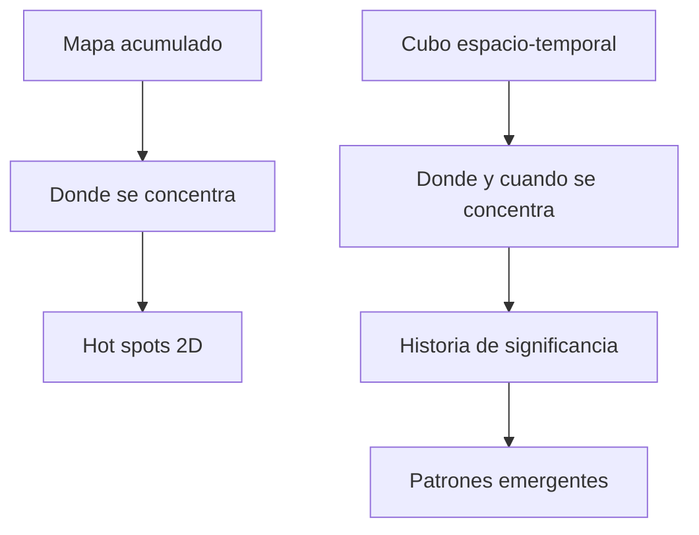
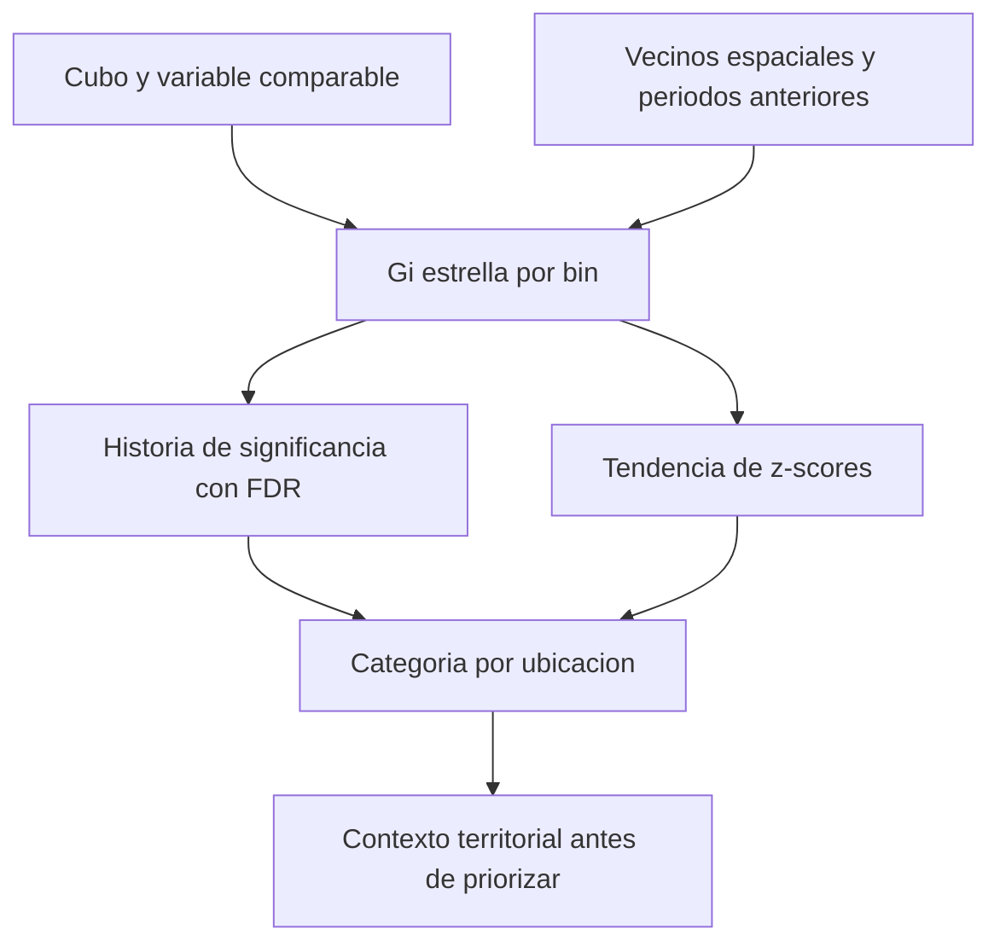

# Clase 03 - Cubos espacio-temporales y patrones emergentes

**Fecha:** 2026-09-16  
**Programa:** Diplomado GeoIA - Esri  
**Docente:** Fabian Cetina  
**Estado:** Borrador para revisión humana; migración documental, video parcialmente revisado.  
**Fuente docente:** Clase 15 del 2026-06-25, José Sebastián Gómez Romero; atribución y cobertura al final.

## Diapositivas de referencia

Estas seis imágenes proceden de la presentación local de referencia **Diplomado_GeoIA_Notas_Explicadas.pptx**, carpeta `3. Machine Learning Espacial y AutoML/5. Aprendizaje No Supervisado/`, diapositivas 38, 39, 40, 41, 46 y 47. Son exportaciones del PPTX, **no fotogramas de la grabación**. Se conserva la identidad institucional visible de Esri; no se atribuye su autoría a quien adapta esta nota ni se concede permiso de redistribución.

### Cubo espacio-temporal — diapositiva 38
![[../99 - Recursos/clase-03-slide-38.png]]

**Fuente:** presentación citada, diap. 38. La misma ubicación aparece en enero, febrero y marzo; una celda combina lugar y periodo. Se selecciona para introducir el bin. La altura expresa tiempo, no elevación ni cantidad de eventos.

### Dos formas de leer el cubo — diapositiva 39
![[../99 - Recursos/clase-03-slide-39.png]]

**Fuente:** presentación citada, diap. 39. A la izquierda se comparan lugares en un periodo; a la derecha, eventos por periodo para una ubicación. Se selecciona para distinguir corte espacial y serie temporal. La curva ilustrativa no es un resultado de Bogotá.

### Creación del cubo en ArcGIS Pro — diapositiva 40
![[../99 - Recursos/clase-03-slide-40.png]]

**Fuente:** presentación citada, diap. 40. La herramienta depende de si hay eventos fechados, lugares fijos o ráster temporal. Se selecciona para justificar la ruta por agregación de puntos de esta práctica; las otras rutas no son ejercicios adicionales.

### Resolución y vecindad cumplen funciones distintas — diapositiva 41
![[../99 - Recursos/clase-03-slide-41.png]]

**Fuente:** presentación citada, diap. 41. La resolución construye las unidades; la vecindad determina su contexto de comparación. Los 250 m, una semana y 750 m son ilustrativos: **no reemplazan los 500 m y seis meses del caso histórico**.

### Análisis de puntos calientes emergentes — diapositiva 46
![[../99 - Recursos/clase-03-slide-46.png]]

**Fuente:** presentación citada, diap. 46. Gi* por celda y Mann-Kendall conectan concentración y evolución del agrupamiento. Se selecciona para evitar confundir una categoría emergente con una simple subida del conteo.

### La vecindad también incluye periodos anteriores — diapositiva 47
![[../99 - Recursos/clase-03-slide-47.png]]

**Fuente:** presentación citada, diap. 47. El bin actual se contextualiza con vecinos espaciales de t, t−1 y t−2. Se selecciona para explicar dos pasos temporales anteriores; no se incorporan periodos futuros.

## Objetivos y agenda

Al finalizar, distinguir ubicación, bin y variable; explicar cómo escala y cobertura afectan el cubo; leer COUNT y categorías emergentes sin confundir concentración con riesgo; y contrastar los casos de siniestros, colegios y abejas sin fabricar significancia.

| Minutos estimados | Actividad |
| --- | --- |
| 0–15 | Recapitulación y pregunta espacio-temporal. |
| 15–35 | Calidad, teselación y construcción del cubo de siniestros. |
| 35–55 | Exploración 2D/3D y lectura de sus límites. |
| 55–80 | Gi*, OHA y categorías emergentes; priorización. |
| 80–110 | Práctica: cubo, Emerging y contrastes OHA de siniestros, colegios y abejas. |
| 110–120 | Comparar evidencia, preguntas y aplicaciones. |

Es una agenda docente estimada de 120 minutos, no un tiempo de ejecución medido. Conserva los ejercicios; no promete que cada geoproceso termine durante su bloque.

## 1. Del mapa acumulado a la historia de un lugar

La [[2026-09-14 - Clase 01 - Clustering espacial|Clase 01]] planteó agrupaciones por densidad; la [[2026-09-15 - Clase 02 - OPTICS y autocorrelación espacial incremental|Clase 02]] añadió inferencia y escala. Ahora preguntamos no solo si hay un patrón, sino **cuándo aparece, cuánto persiste y cómo cambia**. Este es el paso hacia la [[../02 - Conceptos/Minería de patrones espacio-temporales]].

Un mapa que junta todos los años puede ocultar que una zona fue crítica solo al comienzo, que otra se volvió crítica recientemente o que la ocurrencia cayó después de una intervención. El tiempo no es un atributo decorativo: forma parte del proceso. Una comparación antes/después, sin embargo, no demuestra por sí sola que la intervención causó el cambio.



El mapa acumulado y el cubo no son versiones mejor/peor de la misma respuesta: responden preguntas diferentes. [[../02 - Conceptos/Optimized Hot Spot Analysis|OHA]] ofrece concentración espacial; [[../02 - Conceptos/Emerging Hot Spot Analysis|Emerging]] conserva historia.

## 2. Construir el cubo: dos decisiones que cambian el resultado

Imagine mapas de la misma ciudad apilados por fecha. Cada columna representa una ubicación y cada piso un intervalo; el bin guarda un conteo o una variable resumida. La base contiene el periodo más antiguo y la parte superior el más reciente. La analogía con edificios ayuda a orientarse, pero **la altura es tiempo y no cantidad ni relieve** [E1, Usage](#referencias).

![[../99 - Recursos/grafica-cubo-espacio-temporal.svg]]

**Lectura:** ubicación, unidad espacial e intervalo definen dónde se resume la variable. Las cajas no son magnitudes. **Conclusión:** el bin es una decisión analítica. **Límite:** esquema conceptual migrado del vault fuente, basado en la Clase 15 y E1; no representa geometrías reales.

La [[../02 - Conceptos/Teselación espacial]] fija forma, tamaño, origen y extensión. Una unidad demasiado fina puede fragmentar la señal; una demasiado gruesa puede ocultar diferencias locales. El intervalo temporal puede borrar cambios rápidos o acentuar ventanas con escasa información. En el caso histórico se trabajó con **hexágonos de 500 m de altura y pasos de seis meses alineados al final**. Los 500 m no son el lado del hexágono ni el radio de Gi* [E1, Distance Interval](#referencias).

### Siniestros viales: primero entender los registros

El ejercicio fuente usa `SiniestrosViales` y `UPZ` de `Datos Ejercicio5C.gdb`. La selección local está en `99 - Recursos/datos/clase_03/entradas.gdb`; su [procedencia](../99%20-%20Recursos/datos/clase_03/README.md) registra 199.146 siniestros y 112 UPZ. Las entradas son de solo lectura.

Antes de agregar, revisar `FECHA_OCUR`, `GRAVEDAD`, `CLASE_ACC`, `LOCALIDAD` y `ANO_OCURRE`: significado, tipos, nulos frente a ceros, claves, rango temporal y cobertura. Un identificador repetido no autoriza eliminar registros. CRS y unidades deben leerse del dato; no se hereda un EPSG de otra práctica. [[../02 - Conceptos/Ingeniería de datos geoespaciales]] explica por qué preparar forma parte del análisis.

En la demo fuente se revisan conteos por localidad y distribución de fechas mediante ArcGIS. **Data Engineering es una vista**, no `arcpy.DataEngineering`. Los gráficos ayudan a detectar periodos incompletos; mapas y escenas comprueban distribución y contexto. No se reparan geometrías, imputan fechas ni repite Integrate en esta migración.

### De puntos fechados a NetCDF

**Create Space Time Cube By Aggregating Points** recibe puntos y un campo de fecha; agrega por unidad espacial y temporal y escribe un [[../02 - Conceptos/NetCDF]]. No es una capa que deba arrastrarse y leerse como cualquier feature class. La herramienta especializada y sus requisitos se explican en [[../03 - Herramientas/ArcGIS Pro - Space Time Pattern Mining]].

Los siguientes bloques son **adaptaciones docentes del notebook fuente, no ejecutadas aquí**. Requieren Python de ArcGIS Pro con ArcPy, las entradas locales y una carpeta de salida nueva. Se muestran operaciones importantes sin reemplazar el notebook autónomo; su ejecución actual y el fallo de cierre están documentados al final.

```python
# Ejecutar desde la raíz del vault; cambiar estas dos rutas si se usan carpetas externas.
from pathlib import Path
DATA_DIR = Path("99 - Recursos/datos/clase_03")
OUTPUT_DIR = Path("99 - Recursos/salidas_clase_03/practica_01")
```

```python
# ArcPy aporta geoprocesamiento; shutil copia el cubo sin modificar la entrada.
import arcpy
import shutil
SINESTROS = str(DATA_DIR / "entradas.gdb" / "SiniestrosViales")
UPZ = str(DATA_DIR / "entradas.gdb" / "UPZ")
# No reutilizar una salida previa silenciosamente.
OUTPUT_DIR.mkdir(parents=True, exist_ok=False)
WORK_GDB = OUTPUT_DIR / "trabajo.gdb"
arcpy.management.CreateFileGDB(str(OUTPUT_DIR), WORK_GDB.name)
CUBE = str(OUTPUT_DIR / "cubo_trabajo.nc")
shutil.copyfile(DATA_DIR / "cubo_espacio_temporal_accidentes.nc", CUBE)
```

La copia es indispensable: Emerging añade variables al NetCDF y puede reemplazar resultados anteriores. El archivo histórico ya contiene variables de Emerging; copiarlo **no constituye analizarlo de nuevo** [E2, Tool outputs](#referencias).

```python
# Documentación de la construcción fuente; función no invocada en esta nota.
# Si se usa, escribir otro archivo nuevo, nunca sobre CUBE ni sobre la entrada.
def crear_cubo_desde_eventos(nuevo_nc):
    arcpy.stpm.CreateSpaceTimeCube(
        in_features=SINESTROS, output_cube=str(nuevo_nc),
        time_field="FECHA_OCUR", time_step_interval="6 Months",
        time_step_alignment="END_TIME", distance_interval="500 Meters",
        aggregation_shape_type="HEXAGON_GRID")
```

El notebook fuente documentaba esta construcción, pero reutilizaba el cubo disponible. Se conserva esa distinción: **crear desde eventos** y **leer un cubo histórico** son rutas diferentes, no dos ejecuciones obligatorias.

## 3. Explorar no equivale a probar

En escena local, las columnas permiten recorrer ubicaciones y periodos. La fuente muestra cómo apagar elevación o mapa base cuando ocultan los bins y activar filtros temporales. En 2D se distinguen ubicaciones con datos y tendencias; en 3D se examina COUNT por bin. Son vistas complementarias, no pruebas de significancia por su apariencia [E3](#referencias).

```python
# Las salidas son entidades en la geodatabase de trabajo; COUNT es la variable del cubo.
arcpy.stpm.VisualizeSpaceTimeCube2D(
    CUBE, "COUNT", "LOCATIONS_WITH_DATA", str(WORK_GDB / "Cubo2D_Locations"), "CREATE_POPUP")
arcpy.stpm.VisualizeSpaceTimeCube2D(
    CUBE, "COUNT", "TRENDS", str(WORK_GDB / "Cubo2D_Trends"), "CREATE_POPUP")
arcpy.stpm.VisualizeSpaceTimeCube3D(
    CUBE, "COUNT", "VALUE", str(WORK_GDB / "Cubo3D_Counts"))
```

![[../99 - Recursos/salidas_clase_03/evidencia_historica_clase_15/arcgis_mapa_cubo_tendencias_leyenda.png]]

**Mapa histórico ArcGIS, Clase 15.** Leer las clases de tendencia en la leyenda, no como categorías de Emerging. Cada unidad resume su serie COUNT; un patrón de conteo no equivale a una tendencia de z-scores Gi*. La geografía orienta preguntas, pero no demuestra causas.

![[../99 - Recursos/salidas_clase_03/evidencia_historica_clase_15/arcpy_chart_hist_bins_cubo.png]]

**Histograma histórico ArcPy Charts.** El eje horizontal representa conteos por bin y el vertical su frecuencia. Permite examinar la distribución y la concentración de bins con valores bajos; no es una distribución de riesgo por persona ni una prueba de normalidad. Se conserva como resultado histórico, no como EDA recién ejecutado.

## 4. De Gi* a la historia de significancia

[[../02 - Conceptos/Hot spots Getis-Ord Gi Star|Getis-Ord Gi*]] compara la suma de una ubicación y sus vecinos con la esperada en el conjunto. Un valor alto aislado no basta: importa su contexto. El z-score positivo significativo indica concentración alta; el negativo significativo, baja. El p-value no mide gravedad ni la probabilidad de que la hipótesis sea verdadera [E4](#referencias).

OHA automatiza agregación y escala para incidentes o entidades ponderadas. Produce una lectura 2D sin conservar la historia temporal. En su salida, `Gi_Bin` incorpora FDR; no se debe reclasificar `GiPValue` como si contuviera esa corrección. Los campos z/p no están corregidos [E5, Usage](#referencias).

Emerging calcula Gi* por bin con vecinos espaciales y temporales y evalúa la tendencia de los z-scores mediante Mann-Kendall. La categoría combina esa tendencia con la secuencia de significancia; **intensificar el agrupamiento no es simplemente aumentar COUNT** [E2](#referencias).

![[../99 - Recursos/grafica-emerging-hot-spot.svg]]

**Lectura:** etapas desde cubo y vecindad hasta tendencia y categoría. **Conclusión:** hay más de una operación inferencial. **Límite:** las flechas no implican causalidad ni bastan para asignar una categoría. Gráfica conceptual adaptada de Clase 15: se corrigió la secuencia estadística con E2 (Esri, ArcGIS Pro 3.6, releído en esta sesión); no es una copia inalterada.



No existe una sola prueba genérica que permita llamar a todo el proceso «aleatoriedad espacio-temporal». Gi* y Mann-Kendall tienen preguntas distintas. La [[../02 - Conceptos/Hipótesis nula espacial]] y la interpretación de pruebas de hipótesis ayudan a interpretar la evidencia sin confundirla con certeza.

| Categoría caliente | Lectura resumida según E2 |
| --- | --- |
| Nueva | Solo el último periodo es caliente significativo. |
| Consecutiva | Racha final de al menos dos periodos, sin episodios calientes previos; menos de 90 % de periodos calientes. |
| Intensificada | Al menos 90 %, incluido el último, con aumento significativo del agrupamiento. |
| Persistente | Al menos 90 %, sin tendencia discernible de intensificación/disminución. |
| Decreciente | Al menos 90 %, incluido el último, con disminución significativa. |
| Esporádica | Último periodo caliente, intermitencia en menos de 90 % y ningún periodo frío. |
| Oscilante | Último caliente, algún periodo frío anterior y menos de 90 % calientes. |
| Histórica | Último no caliente, pero al menos 90 % de periodos calientes. |
| Sin patrón detectado | No satisface las reglas; no significa ausencia de eventos. |

Existen categorías frías equivalentes. Véanse las reglas completas en [[../02 - Conceptos/Emerging Hot Spot Analysis]]. Una curva que sube y baja no basta para llamarla oscilante.

## 5. Práctica conservada: cubo y contrastes sin omitir casos

La explicación de la fuente presenta OHA antes de profundizar Emerging. El **orden de ejecución del notebook fuente**, conservado aquí, es: inspección y cubo disponible → vistas 2D/3D → Emerging → OHA siniestros desde 2020 → OHA colegios → OHA abejas. No se trasladan ni eliminan los contrastes finales. Esta práctica es una **adaptación del notebook histórico**, no una reproducción exacta del video. Las ventanas visibles de la grabación `20260625_225553UTC` muestran variantes que responden preguntas diferentes:

| Caso | Variante visible en video y diferencia con el notebook |
| --- | --- |
| Siniestros | OHA sobre COUNT de la salida 3D (1:05:00–1:05:15); después, puntos sin Analysis Field, hexágonos y UPZ (1:08:00–1:08:15), con salida de 500 m (1:14:00–1:14:15). No equivale al contraste del notebook desde 2020. |
| Colegios | OHA sin ponderación en hexágonos (1:20:00–1:20:15), de 1.000 m y sin Analysis Field (1:28:00–1:28:15). El notebook conserva ubicaciones preparadas y peso ICOUNT: cambia la unidad analizada. |
| Abejas | OHA con fishnet, sin Analysis Field y Jurisdicciones_Bomberos (1:49:00–1:49:15). El notebook conserva el contraste ponderado por ICOUNT, no esa agregación territorial. |

Estas variantes audiovisuales **no se han reproducido**; su revisión completa y contraste siguen pendientes, no constituyen omisiones aprobadas. Las ventanas breves no acreditan todos los pasos intermedios ni autorizan sustituir los ejercicios conservados.

### 5.1 Emerging de siniestros

```python
# Se modifica exclusivamente CUBE, la copia de trabajo; UPZ actúa como máscara.
# Distancia vacía conserva la elección automática; dos pasos son dos anteriores.
arcpy.stpm.EmergingHotSpotAnalysis(
    CUBE, "COUNT", str(WORK_GDB / "EmergingHotSpot_Siniestros"), "", "2", UPZ)
print(arcpy.GetMessages())  # Leer decisiones y advertencias antes de interpretar.
```

Con semestres y dos pasos anteriores, el contexto temporal puede abarcar el actual y dos previos; no mira el futuro. No confundir distancia de vecinos con tamaño de hexágono.

![[../99 - Recursos/salidas_clase_03/evidencia_historica_clase_15/arcgis_mapa_emerging_hotspot_patrones_leyenda.png]]

**Mapa histórico ArcGIS.** La leyenda identifica categorías, no una escala continua de accidentes. Permite localizar historias distintas; persistencia e intensificación motivan investigación, pero no fijan automáticamente una prioridad.

![[../99 - Recursos/salidas_clase_03/evidencia_historica_clase_15/arcpy_chart_emerging_hotspot_patrones.png]]

**Barras históricas ArcPy Charts.** Comparan número de ubicaciones por categoría, no número de siniestros. Leer conjuntamente con el mapa: una categoría numerosa puede ocupar lugares con distinta exposición. La [tabla de categorías](../99%20-%20Recursos/salidas_clase_03/evidencia_historica_clase_15/tabla_emerging_hotspot_categorias.csv) permite contrastar los valores.

### 5.2 Contraste OHA: siniestros desde 2020

```python
# ANO_OCURRE selecciona la ventana fuente; no se alteran los registros originales.
arcpy.management.MakeFeatureLayer(SINESTROS, "siniestros_2020", "ANO_OCURRE >= 2020")
arcpy.stats.OptimizedHotSpotAnalysis(
    "siniestros_2020", str(WORK_GDB / "OHA_Siniestros_2020plus"))
```

![[../99 - Recursos/salidas_clase_03/evidencia_historica_clase_15/arcgis_mapa_optimized_hotspot_2020plus_leyenda.png]]

**Mapa histórico ArcGIS.** Gi_Bin distingue concentración alta/baja y niveles de confianza; no muestra aparición ni persistencia. Los 871 polígonos y 553 significativos pertenecen a aquella configuración y ventana, no a un nuevo cálculo.

![[../99 - Recursos/salidas_clase_03/evidencia_historica_clase_15/arcpy_chart_optimized_hotspot_siniestros_2020plus.png]]

**Barras históricas ArcPy Charts.** El eje de categorías corresponde a Gi_Bin y la altura a entidades. Comparar calientes, frías y no significativas; no confundir cantidad de polígonos con eventos. La [tabla resumida](../99%20-%20Recursos/salidas_clase_03/evidencia_historica_clase_15/tabla_optimized_hotspot_siniestros_2020plus_bins.csv) conserva el contraste.

### 5.3 Contraste OHA: colegios

Los preparados de colegios son 9.911 ubicaciones con `ICOUNT`, cuya suma es 10.617. El peso cuenta eventos agregados; no representa matrículas ni cobertura educativa. Se consume la entrada local seleccionada, sin depender de salidas mutables de Clase 02 y sin repetir su preparación histórica.

```python
# ICOUNT conserva el peso de cada ubicación; omitirlo cambiaría la pregunta.
colegios = str(DATA_DIR / "entradas.gdb" / "Colegios_Colombia_CollectEvents")
arcpy.stats.OptimizedHotSpotAnalysis(
    colegios, str(WORK_GDB / "OHA_Colegios"), "ICOUNT")
```

![[../99 - Recursos/salidas_clase_03/evidencia_historica_clase_15/arcgis_mapa_optimized_hotspot_colegios_leyenda.png]]

**Mapa histórico ArcGIS.** Localiza concentración de pesos según Gi_Bin. La distancia 16.625,3004 m fue reportada en el notebook fuente; no es un parámetro universal ni una medida de accesibilidad escolar.

![[../99 - Recursos/salidas_clase_03/evidencia_historica_clase_15/arcpy_chart_optimized_hotspot_colegios.png]]

**Barras históricas ArcPy Charts.** De 9.911 entidades, 3.627 fueron significativas. El eje de clases describe niveles hot/cold, no calidad educativa. La [tabla resumida](../99%20-%20Recursos/salidas_clase_03/evidencia_historica_clase_15/tabla_optimized_hotspot_colegios_bins.csv) conserva esos grupos.

### 5.4 Contraste final: incidentes de abejas

La fuente vuelve al subconjunto de abejas de bomberos: una pregunta homogénea no equivale a preguntar por todos los incidentes. Aquí se utilizan 1.918 ubicaciones ponderadas que suman 2.173 eventos. No contienen fechas individuales para construir por sí solas un cubo temporal.

```python
# Entrada preparada histórica: no ejecutar Integrate ni Collect Events nuevamente.
abejas = str(DATA_DIR / "entradas.gdb" / "Incidentes_Control_Abejas_CollectEvents")
arcpy.stats.OptimizedHotSpotAnalysis(
    abejas, str(WORK_GDB / "OHA_Abejas"), "ICOUNT")
```

![[../99 - Recursos/salidas_clase_03/evidencia_historica_clase_15/arcgis_mapa_optimized_hotspot_abejas_leyenda.png]]

**Mapa histórico ArcGIS.** La ausencia de entidades significativas es un resultado interpretable, no un fallo que deba corregirse cambiando parámetros hasta obtener rojo. La distancia reportada en el notebook fue 2.201,9014 m.

![[../99 - Recursos/salidas_clase_03/evidencia_historica_clase_15/arcpy_chart_optimized_hotspot_abejas.png]]

**Barras históricas ArcPy Charts.** Las 1.918 entidades quedaron no significativas; la [tabla resumida](../99%20-%20Recursos/salidas_clase_03/evidencia_historica_clase_15/tabla_optimized_hotspot_abejas_bins.csv) documenta la clasificación. No demuestra ausencia de incidentes ni invalida análisis con otras preguntas justificadas.

La fuente recordaba Moran global a 350 m no significativo en abejas. Se conserva ese antecedente narrado, pero se precisa su interpretación: **la no significancia global no impide por sí sola significancia local**. Son preguntas distintas; la cautela se sostiene por escala, variable y pruebas múltiples, no porque Moran deba autorizar Gi* [E4; concepto Gi*].

## 6. Qué dicen —y qué no dicen— los resultados históricos

| Evidencia del vault fuente | Valor histórico | Lectura y límite |
| --- | --- | --- |
| Fechas de eventos | 2015-01-01 a 2021-09-10 | No confundir con límites temporales de bins. |
| Pasos | 14 de seis meses | Alineados al final; primer intervalo parcialmente cubierto. |
| Bins totales | 132.468 | 9.462 ubicaciones de la malla × 14 pasos. |
| Ubicaciones con puntos | 1.885; 19,92 % | No todas las ubicaciones contienen eventos. |
| Bins no cero | 21.088 de 26.390 en ubicaciones con puntos | El reporte etiqueta 79,91 %; no leerlo como porcentaje de ceros de todo el cubo. |
| Tendencia global COUNT | z=0,3285; p=0,7426 | No significativa; no elimina heterogeneidad local. |
| Emerging | 2.137 ubicaciones analizadas | Su universo no equivale al de ubicaciones con puntos. |
| Persistent / Intensifying Hot Spot | 175 / 49 | Persistencia e intensificación del agrupamiento. |
| Oscillating Hot Spot | 363 | Historia con cambio de signo significativo según reglas. |
| Persistent Cold Spot | 538 | Baja concentración relativa; no demuestra baja exposición. |
| OHA siniestros 2020+ | 871 polígonos; 553 significativos | Lectura acumulada de aquella ventana. |
| OHA colegios | 9.911 entidades; 3.627 significativas | Pesos ICOUNT, no estudiantes. |
| OHA abejas | 1.918 entidades; 0 significativas | Evidencia insuficiente en aquella configuración. |

El [reporte del cubo](../99%20-%20Recursos/salidas_clase_03/evidencia_historica_clase_15/describe_cubo_espacio_temporal_accidentes.txt) registra un sesgo temporal inicial de **62,43 %**: el primer bin comienza después de 2014-09-10 y termina en 2015-03-10 inclusive, mientras los eventos disponibles comienzan en enero. Una caída inicial puede reflejar cobertura, no mejoría vial. La procedencia local también conserva una discrepancia de atributos de proyección del NetCDF; no se corrigió silenciosamente.

## 7. Priorizar no es obedecer colores

Un hot spot persistente puede representar una necesidad sostenida; uno intensificado motiva investigar cambios; uno histórico explica el pasado sin garantizar urgencia actual. Un cold spot puede reflejar menor ocurrencia, menor exposición o subregistro. La decisión requiere gravedad, movilidad, población expuesta, factibilidad y conocimiento territorial. Ninguna categoría pronostica por sí sola accidentes futuros.

![[../99 - Recursos/grafica-flujo-cubo-hotspot-emergente.svg]]

**Lectura:** eventos, cubo, exploración, inferencia y decisión son etapas diferentes. **Conclusión:** el último paso incorpora información que no está en el mapa. **Límite:** esquema conceptual migrado de Clase 15; no es una evaluación causal ni un resultado medido.

Para el proyecto final se conservan tres posibilidades: priorización temporal de intervención con eventos fechados y área de posibilidad; detección de zonas emergentes para investigar; y monitoreo antes/después con fecha de intervención y unidades estables. Esta última requiere un diseño de evaluación que separe intervención de otras explicaciones.

### Preguntas para discutir

- ¿Cuándo conviene una malla y cuándo unidades administrativas?
- ¿Cómo registrar sensibilidad variando tamaño espacial e intervalo temporal por separado?
- ¿Cuándo priorizar un patrón persistente frente a uno intensificado?
- ¿Cómo distinguir baja ocurrencia de baja exposición o subregistro?
- ¿Qué ventana de comparación es pertinente: todo el cubo, vecindario o periodo?
- ¿Cómo traducir categorías a acciones, presupuesto y evaluación sin prometer causalidad?

## Referencias

Se reutilizan las precisiones documentales registradas en los conceptos nuevos; E2 fue además releído en esta sesión para corregir la secuencia de la gráfica de Emerging. No se atribuye nueva consulta a las demás referencias.

- **E1. Esri.** *Create Space Time Cube By Aggregating Points*, ArcGIS Pro 3.6, Summary, Usage y Parameters; consulta registrada en [[../02 - Conceptos/Cubo espacio-temporal]]: 2026-09-17. <https://pro.arcgis.com/en/pro-app/3.6/tool-reference/space-time-pattern-mining/create-space-time-cube.htm>.
- **E2. Esri.** *How Emerging Hot Spot Analysis works*, ArcGIS Pro 3.6, categorías, Tool outputs y Neighborhood defaults; consulta registrada en [[../02 - Conceptos/Emerging Hot Spot Analysis]]: 2026-09-17. <https://pro.arcgis.com/en/pro-app/3.6/tool-reference/space-time-pattern-mining/learnmoreemerging.htm>.
- **E3. Esri.** *Visualizing cube data*, ArcGIS Pro, referencia `latest` conservada de la nota fuente; sin nueva consulta atribuida. <https://doc.esri.com/en/arcgis-pro/latest/tool-reference/space-time-pattern-mining/visualizing-cube-data.htm>.
- **E4. Esri.** *How Hot Spot Analysis (Getis-Ord Gi*) works*, ArcGIS Pro 3.6, Calculations, Interpretation y considerations; consulta registrada en [[../02 - Conceptos/Hot spots Getis-Ord Gi Star]]: 2026-09-17. <https://pro.arcgis.com/en/pro-app/3.6/tool-reference/spatial-statistics/h-how-hot-spot-analysis-getis-ord-gi-spatial-stati.htm>.
- **E5. Esri.** *Optimized Hot Spot Analysis*, ArcGIS Pro 3.6, Usage y Parameters; consulta registrada en [[../02 - Conceptos/Optimized Hot Spot Analysis]]: 2026-09-17. <https://pro.arcgis.com/en/pro-app/3.6/tool-reference/spatial-statistics/optimized-hot-spot-analysis.htm>.
- **NSF Unidata.** *NetCDF*, referencia y lectura registradas en [[../02 - Conceptos/NetCDF]].

## Procedencia, práctica y pendientes

Migración de la nota y notebook **Clase 15 — Cubos espacio-temporales y patrones emergentes**, 2026-06-25, vault `../diplomado_geoia`, docente fuente **José Sebastián Gómez Romero**. Se conservan recapitulación, creación, exploración, Gi*, OHA, Emerging, priorización y todos los contrastes del notebook en su orden. La fecha y numeración destino son distintas de la fuente. Los PNG de diapositivas son del PPTX local citado, no evidencia de cobertura del video.

**P01 →** [[../99 - Recursos/notebooks/Clase 03 - Practica 01 - Cubos espacio-temporales y patrones emergentes.ipynb|notebook con resultados actuales y advertencia de cierre]] → cuatro entidades y NetCDF de `datos/clase_03/` → [salidas actuales aisladas](../99%20-%20Recursos/salidas_clase_03/practica_01/run_b01a1f3965b84ae2a861e185ead354dc/). El 17/09/2026 se ejecutaron las 21 celdas en un kernel Jupyter nuevo de ArcGIS Pro 3.6.2/Python 3.13.7, licencia ArcInfo: cero errores de celda, ocho mapas 2D, escena COUNT 3D, siete gráficos nativos y APRX local. Se revisaron los 16 PNG; etiquetas abreviadas y oclusión 3D limitan leer detalles sin tablas/APRX. Las cuatro entradas conservaron OID, atributos, WKB, esquema y CRS antes/después y respecto al original; NetCDF idéntico byte a byte.

Los cálculos actuales dan Emerging 2.137 ubicaciones; OHA siniestros 871 polígonos/553 significativos; colegios 9.911/3.627 y abejas 1.918/0. El notebook interpreta esos resultados junto a sus salidas sin sustituir las cifras históricas de esta nota. La construcción opcional del cubo no se ejecutó. **El cierre no fue limpio:** tras guardar todas las celdas y comprobar entradas, el último kernel salió con **4294967295**, controlador 1 y fatal `_Py_GetConfig`/GIL; dos intentos anteriores conservados salieron con **3221227010**. [Registro y etapa](../99%20-%20Recursos/salidas_clase_03/practica_01/jupyter_1c5ae5a89ed14ae78bab93ff1f7cb1c0/execution.json). No se declara ejecución integral sin errores ni reparación del entorno.

Las figuras/tablas históricas anteriores se conservaron en `salidas_clase_03/evidencia_historica_clase_15/`: no se reclasifican como ejecución nueva. No se ejecutaron los bloques de esta nota. La verificación independiente posterior comprobó 223 enlaces/anclas locales, coincidencia de fuente, salidas, contadores y timestamps de las 21 celdas canónicas con el intento real, y los 16 PNG incrustados idénticos byte a byte; **no hubo nueva ejecución de modelos** ni se resolvió el fallo de cierre.

En Chrome, con Mermaid 11.12.0, el padre comprobó parseo/renderizado de los 12 diagramas del conjunto y carga de 31 imágenes. Inspeccionó capturas reales de los nueve SVG; tres diagramas Mermaid comprimidos pasaron de LR a TD y se renderizaron nuevamente con fuente 16, escala 1 y columna de 760 px. La disposición nativa en Obsidian no se comprobó. Persisten las cautelas sobre etiquetas de gráficos, oclusión 3D y simbología de colegios; deben leerse con tablas y APRX. Antes de cualquier publicación siguen pendientes privacidad y derechos de redistribución.

**Video: cobertura PARCIAL registrada por el padre en esta sesión**, fuente `20260625_225553UTC`, duración 1:53:36. Reproducción visible revisada en 15:30–15:35, 18:30–18:36, 25:00–25:07, 31:00–31:09, 40:30–40:39, 45:00–45:10, 46:50–47:00 y 52:20–52:30: introducción, bin, transición, EDA, parámetros de creación, resultado y escena COUNT. La revisión visible se amplió con el reproductor activo (readyState 4, 1920×1080): 1:01:00–1:01:12 (escena 3D y búsqueda de OHA); las variantes OHA detalladas en §5; 1:35:00–1:35:15 (diapositiva conceptual de Emerging); 1:40:00–1:40:15 (Emerging: COUNT, distancia fija vacía/automática, dos pasos temporales, UPZ y Entire cube); y 1:44:00–1:44:15 (categorías de salida). No se guardaron fotogramas ni transcripciones. Estas ventanas de 12–15 segundos no cubren todas las operaciones ni verifican por completo orden y parámetros de los cierres. La migración conserva la secuencia del notebook, sin afirmar reproducción exacta ni cobertura audiovisual completa. Pendientes: resto del video y variantes no reproducidas, cierre limpio del kernel y revisión integrada en el visor nativo; **no se declara clase procesada ni aprobación académica**.
