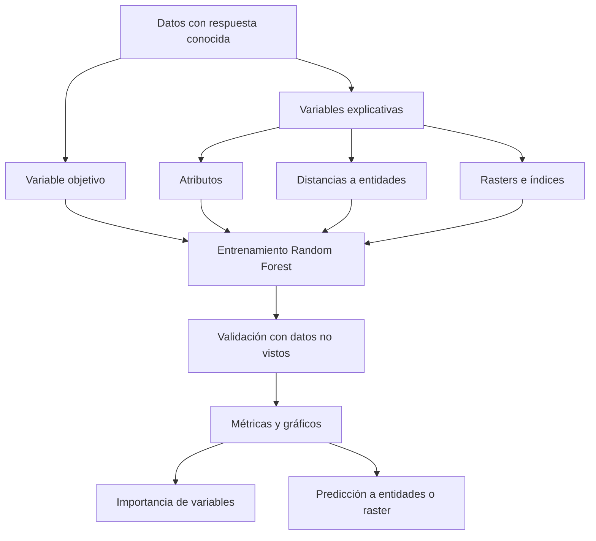
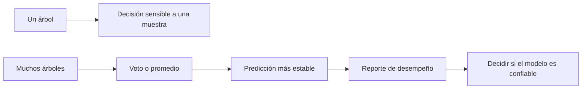

---
tags:
  - tipo/clase
  - estado/borrador
  - fuente/grabacion
  - tema/geoia
  - tema/machine-learning
  - tema/analitica-predictiva
  - tema/teledeteccion
---

# Clase 04 - Aprendizaje supervisado y Random Forest geoespacial

**Fecha:** 2026-09-21  
**Programa:** Diplomado GeoIA - Esri  
**Docente:** Fabian Cetina  
**Materiales:** Datos Ejercicio 6A / geodatabase `Datos_Coiba.gdb`; práctica en ArcGIS Pro con Forest-based and Boosted Classification and Regression  
**Estado:** Borrador

## Diapositivas de referencia

### Variables explicativas

![[../99 - Recursos/clase-06-slide-variables-explicativas.png]]

**Fuente:** Francisco Javier Anzola, `RandomForest_FA.pptx`, diapositiva **16**. Distingue atributos, entidades de distancia y rasters como fuentes de predicción. Se selecciona para reconocer que una variable explicativa no tiene que ser un campo originalmente presente en la tabla de entrenamiento.

### Tipos de predicción

![[../99 - Recursos/clase-06-slide-tipos-prediccion.png]]

**Fuente:** Francisco Javier Anzola, `RandomForest_FA.pptx`, diapositiva **20**. Resume tres salidas: solo entrenamiento, predicción a entidades y predicción a rasters. Permite separar evaluar un modelo de producir una superficie: generar un mapa no demuestra que el modelo generalice.

### Validación del modelo

![[../99 - Recursos/clase-06-slide-validacion-modelo.png]]

**Fuente:** Francisco Javier Anzola, `RandomForest_FA.pptx`, diapositiva **27** («10% para validación»). La partición entrenamiento/validación refuerza por qué se reserva un subconjunto que el modelo no vio. Su propósito es distinguir ajuste y generalización, sin interpretar una partición aleatoria como garantía de independencia espacial.

### Matriz de confusión

![[../99 - Recursos/clase-06-slide-matriz-confusion.png]]

**Fuente:** Francisco Javier Anzola, `RandomForest_FA.pptx`, diapositiva **31** («15/20»). Cruza etiquetas reales y predicciones para localizar aciertos y errores por clase. Se incluye para explicar clasificación; la predicción continua de biomasa requiere métricas de regresión, no convertir sus valores en clases arbitrarias.

**Corrección terminológica:** el 75% rotulado «precisión» en la imagen es **exactitud global (accuracy)**: `(8 + 7) / 20 = 75%`. Para la clase positiva, la precisión es `8 / (8 + 2) = 80%` y la sensibilidad (recall), `8 / (8 + 3) ≈ 72,7%`. Se conserva la imagen original; no se confunden estas tres métricas.

### Bosque: diversidad de muestras y variables

![[../99 - Recursos/clase-06-slide-bosque.png]]

**Fuente:** Francisco Javier Anzola, `RandomForest_FA.pptx`, diapositiva **12**. Cada árbol combina una muestra y variables distintas: siga los atributos de cada árbol para reconocer la diversidad del ensamble. Se selecciona para explicar por qué muchos árboles no equivalen a repetir uno solo; diversidad no garantiza independencia espacial.

### Errores fuera de bolsa

![[../99 - Recursos/clase-06-slide-fuera-de-bolsa.png]]

**Fuente:** Francisco Javier Anzola, `RandomForest_FA.pptx`, diapositiva **26**. El esquema separa observaciones incluidas y excluidas por árbol (aproximadamente dos tercios y un tercio). Las excluidas permiten evaluar ese árbol. Su propósito es distinguir esta evaluación del 10% reservado para validar el bosque completo; no son la misma partición.

## Objetivos

- Distinguir clasificación y regresión a partir de la variable objetivo.
- Explicar el muestreo del bosque, la evaluación fuera de bolsa y la validación retenida.
- Preparar puntos y rasters de Coiba sin alterar entradas y explicar la selección de casos completos.
- Interpretar importancia, residuales y límites de generalización espacial sin confundir predicción con causalidad.

## Agenda estimada · 120 minutos

| Minutos | Actividad |
|---|---|
| 0–20 | Respuesta conocida, árboles y bosque |
| 20–35 | Variables explicativas y tipos de predicción |
| 35–50 | Validación, fuera de bolsa y matriz de confusión |
| 50–70 | Coiba: datos, bandas e índices |
| 70–105 | Práctica: inspección → proyección → extracción → selección → entrenamiento |
| 105–120 | Importancia, residuales, límites y discusión |

### Gráficas conceptuales complementarias

![[../99 - Recursos/grafica-indices-teledeteccion-formulas.svg]]

**Lectura:** las expresiones relacionan bandas con NDVI, EVI, SAVI, RVI, DVI, MSI y MNDWI. Es una gráfica conceptual, no una medición: comparar numeradores y denominadores ayuda a reconocer bandas compartidas y posibles redundancias. Las fórmulas se desarrollan en §7.1; no todos los índices tienen la misma escala ni significado. Fuente: elaboración didáctica del caso Coiba; contraste de aritmética de bandas en [B3](#bibliografía-verificada).

![[../99 - Recursos/grafica-biomasa-coiba-indices-modelo.svg]]

**Lectura:** el flujo vincula índices y topografía con puntos de biomasa, modelo y validación. Las conexiones representan etapas, no relaciones causales demostradas. Enseña por qué predecir AGBD es una estimación indirecta y por qué el resultado debe validarse. Fuente: elaboración didáctica del caso Coiba; funcionamiento del bosque en [B1–B2](#bibliografía-verificada).

## 1. Resumen corto

Esta clase abre el bloque de [[../02 - Conceptos/Aprendizaje supervisado]] dentro del módulo de GeoIA. Contrasta el aprendizaje supervisado con el [[../02 - Conceptos/Aprendizaje no supervisado]] trabajado anteriormente: ahora sí existe una variable objetivo conocida que se usa para entrenar y validar el modelo. El modelo principal es [[../02 - Conceptos/Random Forest]], un ensamble de árboles de decisión que combina muestras de entidades y subconjuntos de variables explicativas. La práctica usa ArcGIS Pro para estimar biomasa en el Parque Nacional Coiba, en Panamá, a partir de puntos de muestreo y rasters derivados de imágenes Landsat. El énfasis está en validación, errores fuera de bolsa, importancia de variables, matrices de confusión y el riesgo de interpretar un primer resultado como definitivo. [B1, funcionamiento; B2, validación; B4, introducción](#bibliografía-verificada).

## 2. Ideas principales

- En aprendizaje supervisado el modelo aprende con ejemplos que ya tienen respuesta conocida.
- La variable objetivo puede ser categórica, para clasificación, o continua, para regresión.
- Un modelo útil no debe memorizar la muestra: debe generalizar a datos que no vio durante el entrenamiento.
- [[../02 - Conceptos/Random Forest]] reduce el riesgo de depender de un solo árbol de decisión al combinar muchos árboles entrenados con muestras y variables distintas.
- Las variables explicativas pueden venir de atributos de la misma capa, distancias a otras entidades o rasters.
- En ArcGIS Pro se puede entrenar el modelo, predecir a nuevas entidades o generar un raster de predicción.
- La validación requiere separar una parte de los datos para probar el modelo con información no usada en entrenamiento.
- La importancia de variables ayuda a estudiar el modelo, pero no debe leerse automáticamente como causalidad.
- En el caso de Coiba, la estimación de biomasa conecta aprendizaje supervisado, teledetección e indicadores espectrales como NDVI.
- Un resultado inesperado, como baja importancia inicial del NDVI, no debe descartarse sin repetir, revisar redundancia entre variables e interpretar el contexto físico.

Funcionamiento, variables y evaluación: [B1–B2 y B4](#bibliografía-verificada); las observaciones particulares de Coiba son antecedentes históricos, no resultados nuevos.

## 3. Flujo conceptual de la clase



La lógica es pasar de la intuición de los árboles de decisión a una práctica geoespacial completa: seleccionar datos de entrenamiento, elegir variables explicativas, entrenar, validar, revisar importancia de variables y producir una superficie de predicción. Las flechas describen el proceso, no una garantía de calidad: la decisión de predecir depende de la evaluación. Diagrama didáctico consistente con [B1–B2](#bibliografía-verificada).



En clasificación se combinan votos; en regresión se promedian predicciones. La estabilidad del ensamble no elimina sesgos del muestreo ni sustituye la validación. Este segundo diagrama compara el mecanismo de combinación, no métricas medidas. [B4, introducción a Random Forest](#bibliografía-verificada).

## 4. Conceptos nuevos o reforzados

| Concepto | Explicación simple | Relacionado con |
|---|---|---|
| [[../02 - Conceptos/Aprendizaje supervisado]] | Modelos que aprenden desde ejemplos con respuesta conocida. | [[../02 - Conceptos/Analítica predictiva]], [[../02 - Conceptos/Random Forest]] |
| [[../02 - Conceptos/Random Forest]] | Ensamble de árboles de decisión que combina múltiples predicciones. | [[../02 - Conceptos/Importancia de variables]], [[../02 - Conceptos/Métricas de evaluación de modelos]] |
| [[../02 - Conceptos/Métricas de evaluación de modelos]] | Medidas para juzgar desempeño, error y capacidad de generalización. | [[../02 - Conceptos/Random Forest]] |
| [[../02 - Conceptos/Validación de modelos supervisados]] | Separación y evaluación con datos no vistos para evitar confundir ajuste con generalización. | [[../02 - Conceptos/Aprendizaje supervisado]], [[../02 - Conceptos/Métricas de evaluación de modelos]] |
| [[../02 - Conceptos/Matriz de confusión]] | Tabla que cruza clases reales y predichas para identificar falsos positivos y falsos negativos. | [[../02 - Conceptos/Validación de modelos supervisados]] |
| [[../02 - Conceptos/Importancia de variables]] | Jerarquía de variables según su aporte al modelo. | [[../02 - Conceptos/Random Forest]], correlación frente a causalidad |
| [[../02 - Conceptos/Rasters explicativos]] | Capas usadas como insumos predictivos, por ejemplo bandas Landsat o índices espectrales. | Datos geoespaciales, [[../02 - Conceptos/Analítica predictiva]] |
| [[../02 - Conceptos/Índices de teledetección]] | Combinaciones de bandas usadas para resaltar verdor, humedad, suelo o agua. | [[../02 - Conceptos/Rasters explicativos]], [[../02 - Conceptos/Biomasa aérea sobre el suelo (AGBD)]] |
| [[../02 - Conceptos/Biomasa aérea sobre el suelo (AGBD)]] | Variable objetivo de biomasa aérea por unidad de área. | [[../02 - Conceptos/Random Forest]], [[../02 - Conceptos/Índices de teledetección]] |

## 5. Herramientas o tecnologías mencionadas

| Herramienta | Uso en la clase | Relacionado con |
|---|---|---|
| ArcGIS Pro | Entrenar y evaluar el modelo supervisado sobre datos geoespaciales. | [[../02 - Conceptos/Aprendizaje supervisado]] |
| [[../03 - Herramientas/ArcGIS Pro - Forest-based and Boosted Classification and Regression]] | Entrenar Random Forest, generar reportes, importancia de variables y predicción. | [[../02 - Conceptos/Random Forest]]; [B1](#bibliografía-verificada) |
| ArcGIS Pro / rasters | Usar bandas e índices espectrales como variables explicativas. | [[../02 - Conceptos/Rasters explicativos]]; [B3](#bibliografía-verificada) |
| Moodle del diplomado | Distribución del paquete del ejercicio Coiba; esta práctica utiliza la copia local seleccionada. | Datos Ejercicio 6A / Coiba |

## 6. Ejemplos, demos o casos vistos

### 6.1 Del no supervisado al supervisado

El hilo viene de las clases de clustering y patrones espacio-temporales. En el aprendizaje no supervisado se buscaban estructuras sin etiquetas previas. Aquí, en cambio, el modelo trabaja con una respuesta conocida y aprende a predecirla.

### 6.2 Árboles de decisión como votación

Random Forest puede entenderse con ejemplos intuitivos de clasificación: varios árboles responden a una pregunta y la predicción final se decide por mayoría. Si cinco árboles dicen “Bogotá” y uno dice “Quito”, el bosque predice Bogotá. Es un ejemplo hipotético: la idea importante no es la ciudad elegida, sino que un conjunto de árboles puede ser más estable que un árbol aislado. La analogía del voto corresponde a clasificación; para biomasa continua se usa el promedio. [B4, introducción](#bibliografía-verificada).

### 6.3 Muestreo de entidades y variables

Random Forest no solo muestrea entidades; también trabaja con subconjuntos de variables explicativas al construir los árboles. Por eso distintos árboles pueden aprender con combinaciones distintas: tamaño, peso, color, pelo, edad, distancia, bandas o índices. Esto diversifica los árboles y permite estudiar qué variables aportan al modelo y cuáles podrían introducir ruido; no identifica por sí solo causas del fenómeno. [B2 y B4, funcionamiento](#bibliografía-verificada).

### 6.4 Variables explicativas en ArcGIS Pro

La herramienta permite tres familias de variables explicativas:

- **atributos:** campos de la misma capa de entrenamiento;
- **entidades de distancia:** otras capas vectoriales a partir de las cuales se calculan distancias;
- **rasters:** bandas, índices o superficies de las cuales se extraen valores para las entidades de entrenamiento.

Esta diferencia permite integrar datos tabulares, vectoriales y raster en un mismo modelo predictivo. Distancia a una entidad no equivale automáticamente a un área de influencia causal. [B1, parámetros de variables explicativas](#bibliografía-verificada).

### 6.5 Tipos de predicción

Se diferencian tres salidas posibles:

- solo entrenar el modelo y revisar su reporte;
- predecir sobre nuevas entidades;
- predecir sobre rasters para generar una superficie continua.

En Coiba, el objetivo es entrenar con puntos conocidos de biomasa y luego extender la predicción hacia una superficie raster. Esto exige revisar si los valores de los predictores del territorio están representados en el entrenamiento; producir un raster no resuelve el riesgo de extrapolación. [B1, tipos de predicción](#bibliografía-verificada).

### 6.6 Validación del modelo

El modelo separa una parte de los datos para validación. El punto de partida del ejercicio es 90% para entrenamiento y 10% para validación; esta decisión debe justificarse con criterio metodológico, bibliografía o estándares del proyecto. La validación se hace con datos que el modelo no vio, para evaluar si aprendió una estructura general y no solo la muestra. Ese porcentaje histórico no es un parámetro universal ni evidencia de independencia espacial. [B1–B2, validación](#bibliografía-verificada).

### 6.7 Errores fuera de bolsa y matriz de confusión

Los errores fuera de bolsa corresponden a predicciones sobre observaciones no usadas para entrenar un árbol específico. No deben confundirse con el subconjunto externo reservado para validación. En clasificación, la matriz de confusión compara lo predicho contra lo real: verdaderos positivos, falsos positivos, verdaderos negativos y falsos negativos. Métricas como precisión o sensibilidad dependen de esa lectura; para Coiba, una respuesta continua requiere evaluar errores de regresión. [B2, evaluación; B4, error fuera de bolsa](#bibliografía-verificada).

### 6.8 Caso Coiba: biomasa desde teledetección

La práctica se centra en el Parque Nacional Coiba, una isla al sur de Panamá. El objetivo es estimar biomasa a partir de **4.946 registros** de biomasa por área y variables raster. La lectura aplicada es: si los puntos representan mediciones confiables, el modelo puede aprender una relación con bandas e índices y producir una predicción para la isla. `AGBD` expresa densidad de biomasa aérea; no debe llamarse biomasa total sin incorporar unidades y superficie de integración.

### 6.9 Rasters e índices espectrales

Se revisan bandas Landsat e índices derivados como NDVI. El NDVI es un indicador asociado al verdor porque contrasta reflectancia del infrarrojo cercano y del rojo. Varios índices comparten bandas, por lo que sus importancias pueden variar entre iteraciones y no siempre conviene retirar una variable solo porque apareció baja en una corrida. Las fórmulas y su escala importan tanto como el nombre del índice. [B3, NDVI, EVI y SAVI](#bibliografía-verificada).

### 6.10 Lectura de importancia de variables

La tabla de importancia ordena qué insumos aportaron más al modelo según la medida utilizada. No conviene interpretar una primera corrida como verdad definitiva. Si un resultado contradice conocimiento del fenómeno, como un NDVI muy bajo en un modelo de biomasa, hay que revisar iteraciones, variables redundantes, configuración, calidad de datos y sentido físico. Importancia predictiva no es causalidad ni prueba de irrelevancia ecológica. [B2, importancia de variables](#bibliografía-verificada).

### 6.11 De la preparación al resultado actual

La ejecución conserva **4.946 observaciones**, selecciona **4.840 casos completos** y deja **106 fuera del modelo, no eliminados**. La falta de valores en predictores puede sesgar qué lugares quedan representados. El entrenamiento y la rama raster tienen diagnósticos separados, interpretados junto a sus salidas en P01; un resultado técnico exitoso no certifica generalización territorial.

## 7. Índices espectrales y biomasa: lectura con referencias

La práctica de Coiba no usa las bandas e índices como “mediciones directas” de biomasa. Los usa como [[../02 - Conceptos/Rasters explicativos]]: señales ópticas y topográficas que pueden ayudar a predecir `AGBD` en un modelo supervisado.

La discusión se conecta con [[../02 - Conceptos/Índices de teledetección]], [[../02 - Conceptos/NDVI]], [[../02 - Conceptos/EVI]], [[../02 - Conceptos/SAVI]], [[../02 - Conceptos/RVI y DVI]], [[../02 - Conceptos/MSI]], [[../02 - Conceptos/MNDWI]] y [[../02 - Conceptos/Biomasa aérea sobre el suelo (AGBD)]]. La relación importante es distinguir la señal espectral, la propiedad física que puede representar y la respuesta que el modelo intenta estimar.

### 7.1 Fórmulas principales usadas en el caso

| Índice | Fórmula | Lectura para biomasa |
|---|---|---|
| [[../02 - Conceptos/NDVI]] | `(NIR - Red) / (NIR + Red)` | Verdor y vigor; puede saturarse en bosque denso. |
| [[../02 - Conceptos/EVI]] | `2.5 * (NIR - Red) / (NIR + 6*Red - 7.5*Blue + 1)` | Diseñado para mejorar sensibilidad en vegetación densa; requiere una banda azul confiable. |
| [[../02 - Conceptos/SAVI]] | `((NIR - Red) / (NIR + Red + 0.5)) * 1.5` | Reduce efecto de suelo visible; aquí se fija L = 0.5. |
| [[../02 - Conceptos/RVI y DVI|RVI]] | `NIR / Red` | Relación simple rojo–NIR; no está acotada. |
| [[../02 - Conceptos/RVI y DVI|DVI]] | `NIR - Red` | Contraste absoluto rojo–NIR; sensible a escala radiométrica. |
| [[../02 - Conceptos/MSI]] | `SWIR / NIR` | Señal relativa de humedad de canopia; especificar la banda SWIR utilizada. |
| [[../02 - Conceptos/MNDWI]] | `(Green - SWIR) / (Green + SWIR)` | Agua/humedad/bordes; puede actuar como proxy espacial, no como medida directa de biomasa. |

Fórmulas utilizadas en el ejercicio. Contraste documental de aritmética de bandas y métodos correspondientes: [B3](#bibliografía-verificada). `Blue`, `Green`, `Red`, `NIR` y `SWIR` son bandas, no números de banda universales: su correspondencia depende del sensor. Hay que tratar denominadores nulos y NoData, y comprobar la escala radiométrica; las constantes de EVI y SAVI hacen especialmente importante trabajar en la escala de reflectancia prevista.

### 7.2 Ejemplo manual mínimo

Para un píxel **hipotético** de vegetación densa:

```text
Blue = 0.05, Green = 0.09, Red = 0.06, NIR = 0.52, SWIR = 0.18

NDVI  = (0.52 - 0.06) / (0.52 + 0.06) = 0.793
EVI   = 2.5 * (0.52 - 0.06) / (0.52 + 6*0.06 - 7.5*0.05 + 1) = 0.764
SAVI  = ((0.52 - 0.06) / (0.52 + 0.06 + 0.5)) * 1.5 = 0.639
MSI   = 0.18 / 0.52 = 0.346
MNDWI = (0.09 - 0.18) / (0.09 + 0.18) = -0.333
```

La lectura propuesta en el ejemplo es vegetación vigorosa, baja señal relativa de estrés hídrico y no agua abierta. No son umbrales universales ni resultados de Coiba. Tampoco equivalen automáticamente a alta biomasa: la biomasa aérea depende de estructura vertical, edad, composición, perturbación y topografía.

### 7.3 Discusión bibliográfica del caso Coiba

El ejercicio permite discutir seis líneas de investigación como hipótesis de ampliación, no como resultados demostrados:

| Línea de discusión | Qué enseña | Aplicación a Coiba |
|---|---|---|
| Cartografía de carbono/biomasa tropical | Combinar parcelas, LiDAR y sensores remotos permite considerar información complementaria. | Coiba tiene AGBD puntual y óptico/topografía; explorar estructura vertical sería una extensión, no un requisito ya satisfecho. |
| Escala e incertidumbre de mapas tropicales | Los mapas de carbono deben comunicar escala e incertidumbre. | La salida Coiba debe presentarse como práctica exploratoria, no mapa oficial. |
| Landsat, series temporales e inventario | La dimensión temporal puede aportar información sobre cambios de biomasa. | Una sola fecha limita el análisis de dinámica temporal. |
| Integración de Landsat y LiDAR | La estructura vertical puede complementar la señal óptica; su beneficio se evalúa. | Una capa estructural adicional sería una hipótesis de mejora, no un resultado demostrado aquí. |
| Densidad de biomasa y GEDI | La información estructural ayuda a distinguir biomasa de verdor. | `AGBD` no se mide directamente con NDVI/EVI/MSI. |
| Límites de los índices ópticos | Saturación, artefactos e incertidumbre condicionan la interpretación. | Interpretar NDVI bajo y EVI/MSI/MNDWI con cautela, no como causalidad. |

Estas líneas orientan la discusión; incorporar nuevos datos exige evaluar su pertinencia y contar con autorización.

### 7.4 Qué aplica con lo que tenemos

Con `Datos_Coiba.gdb`, el flujo **es pertinente como ejercicio de aprendizaje supervisado** porque reúne respuesta (`AGBD`), predictores raster, topografía, entrenamiento, importancia de variables y residuales. La ejecución actual completó 17/17 celdas de código con las entradas locales, incluida la rama raster; el mapa residual se corrigió después mediante un render focal de la capa entrenada, sin repetir el modelo. Una ejecución satisfactoria no garantiza reproducibilidad en otros entornos ni generalización espacial.

Para evaluar su uso como producto final se plantean:

- validación espacial por bloques o zonas retenidas;
- evaluación de incertidumbre;
- revisión de extrapolación por rangos de variables;
- comparación de grupos de variables: bandas, índices, topografía y combinación;
- posible incorporación de GEDI/LiDAR o mediciones estructurales, sujeta a autorización de nuevos datos;
- diagnóstico de valores atípicos y estudio de una transformación `log(AGBD + 1)`, sin eliminar ni transformar automáticamente observaciones.

Estas propuestas no son pasos ejecutados ni cambios autorizados sobre las entradas.

### 7.5 Referencias directas de esta sección

Las fórmulas y su implementación se consultan en [B3, Band Arithmetic](#bibliografía-verificada); el uso de rasters explicativos, entrenamiento e interpretación del modelo, en [B1–B2](#bibliografía-verificada). Las ampliaciones del §7.3 son preguntas para investigación posterior, no conclusiones de la práctica.

## Práctica P01 · Del punto observado al diagnóstico del bosque

El [notebook autónomo](../99%20-%20Recursos/notebooks/Clase%2004%20-%20Practica%2001%20-%20Random%20Forest%20geoespacial.ipynb) desarrolla la secuencia: inspeccionar → proyectar → extraer → seleccionar casos completos → explorar relaciones → entrenar → interpretar importancia y residuales. Los fragmentos siguientes pertenecen a sus etapas; se ejecutan allí en orden, con sus variables y auxiliares ya definidos, no como scripts independientes. Requiere ArcGIS Pro 3.6 con licencia local y Spatial Analyst; no instala bibliotecas.

### Bibliotecas y rutas

```python
# Configuración inicial: cambie solo entradas y salidas si usa rutas externas.
from pathlib import Path
ROOT = next(p for p in (Path.cwd(), *Path.cwd().parents)
            if (p / '99 - Recursos').is_dir())
DATA_DIR = ROOT / '99 - Recursos/datos/clase_04'
OUTPUT_DIR = ROOT / '99 - Recursos/salidas_clase_04/practica_01'
```

```python
# ArcPy realiza las operaciones geográficas; las demás bibliotecas complementan tablas y lectura.
import arcpy
import numpy as np
import pandas as pd
import matplotlib.pyplot as plt
from IPython.display import display, Markdown, Image, HTML
```

El notebook comprueba versión/licencia, abre `Datos_Coiba.gdb` en solo lectura y crea `OUT` con UUID y `WORK_GDB` nuevos. Pandas resume campos; Matplotlib conserva las dispersiones complementarias del ejercicio, sin sustituir gráficos ni mapas ArcGIS. Consulte las [entradas locales](../99%20-%20Recursos/datos/clase_04/README.md).

### Proyectar y extraer sin modificar los puntos originales

```python
# La referencia procede del raster real, no de un EPSG supuesto.
reference_raster = SOURCE_GDB / 'NDVI_Mask'
reference_sr = arcpy.Describe(str(reference_raster)).spatialReference
projected_points = WORK_GDB / 'agbd_observaciones_proyectadas'
# Ejecutar después de las comprobaciones GCS/datum del notebook.
arcpy.management.Project(str(POINTS_FC), str(projected_points), reference_sr)
extract_pairs = [[str(SOURCE_GDB / raster), field]
                 for raster, field, _ in RASTER_SPECS]
arcpy.sa.ExtractMultiValuesToPoints(str(projected_points), extract_pairs, 'BILINEAR')
```

`Project` escribe una copia en la referencia de `NDVI_Mask`; el notebook detiene el proceso ante GCS/datum desconocidos o diferentes, sin elegir una transformación automáticamente. `RASTER_SPECS` identifica los 17 rasters y sus campos. `BILINEAR` interpola valores en las ubicaciones; no crea rasters remuestreados. La extracción modifica exclusivamente la copia de puntos y conserva los rasters originales. Los nulos posteriores indican falta de valores disponibles, no ceros ecológicos. [B5, Usage y Parameters](#bibliografía-verificada).

La ejecución actual registra 4.946 observaciones, 4.840 casos completos y 106 excluidos del modelo, conservados sin eliminación. El notebook selecciona explícitamente objetivo y predictores no nulos, conserva todos los puntos extraídos y copia la selección a `WORK_GDB/complete_case_training`. Esta copia persistente permite a los gráficos nativos abrir una ruta real; no elimina, deduplica ni imputa observaciones. Conviene localizar las exclusiones: la falta de cobertura puede sesgar la muestra.

### Gráficos y mapa nativos antes del ajuste

```python
# Llamadas reales a los auxiliares autónomos definidos al inicio del notebook.
native_chart(arcpy.charts.Scatter(
    x='NDVI', y=TARGET_FIELD, dataSource=training_fc,
    title='AGBD frente a NDVI', xTitle='NDVI (adimensional)',
    yTitle='AGBD (Mg/ha)'), 'arcgis_agbd_ndvi')
native_map(eda_fc, 'arcgis_agbd', TARGET_FIELD,
           'Mg/ha')
```

`native_chart` exporta el gráfico ArcGIS y lo muestra; `native_map` construye la vista con simbología graduada en un proyecto nuevo. La dispersión compara verdor y respuesta sin probar causalidad; el mapa ayuda a reconocer cobertura territorial. AGBD se expresa en Mg/ha por confirmación del usuario, no como metadato encontrado ni prueba de origen GEDI. 1 Mg/ha equivale a 1 tonelada métrica por hectárea; no se convirtieron datos. El gráfico necesita una entidad persistente como fuente de datos, no una referencia transitoria cuyo nombre deje de resolverse.

### Salidas ArcGIS observadas antes del ajuste

![[../99 - Recursos/salidas_clase_04/publicados/historico_arcgis_agbd.png]]

**Mapa de AGBD observado.** Elaboración propia con ArcGIS y la copia local Coiba, ejecución anterior a la ampliación raster. Los puntos y su leyenda representan observaciones, no una superficie continua de biomasa; lea las clases de AGBD junto al CRS y escala del pie. Permite reconocer la distribución de la muestra, no asegurar cobertura uniforme ni independencia entre puntos. Se interpreta AGBD en Mg/ha; el rótulo genérico de esta imagen histórica se conserva.

![[../99 - Recursos/salidas_clase_04/publicados/historico_arcgis_agbd_ndvi.png]]

**Dispersión nativa AGBD–NDVI.** Elaboración propia con ArcGIS, misma ejecución: eje horizontal NDVI adimensional y vertical AGBD en Mg/ha, aunque la captura histórica conserva su rótulo genérico. Cada punto representa un caso completo seleccionado; la dispersión muestra que el verdor no determina por sí solo la biomasa. No demuestra causalidad ni permite descartar NDVI sin estudiar redundancia y saturación. La selección usa 4.840 de 4.946 registros; los 106 excluidos por valores ausentes pueden afectar la representatividad.

### Entrenar y evaluar: 10% retenido, no 90% excluido

```python
# Salidas nuevas y predictores numéricos del notebook.
trained_features = WORK_GDB / 'rf_agbd_trained_features'
importance_table = WORK_GDB / 'rf_agbd_importance'
trained_model = OUT / 'rf_agbd_coiba.ssm'
explanatory_variables = [[field, 'false'] for field in model_fields]
result = arcpy.stats.Forest(
    prediction_type='TRAIN', in_features=str(training_fc),
    variable_predict=TARGET_FIELD, treat_variable_as_categorical='NUMERIC',
    explanatory_variables=explanatory_variables,
    output_trained_features=str(trained_features),
    output_importance_table=str(importance_table),
    number_of_trees=30, minimum_leaf_size=5, maximum_depth=20,
    sample_size=100, random_variables=5,
    percentage_for_training=10,  # Porcentaje EXCLUIDO para validación en esta API.
    number_validation_runs=2,
    output_trained_model=str(trained_model), model_type='FOREST-BASED')
```

`TRAIN` ajusta y genera diagnósticos: no produce por sí solo un raster de predicción. Los 30 árboles combinan estimaciones; profundidad máxima 20 y hoja mínima 5 limitan complejidad. `random_variables=5` controla las variables candidatas de las divisiones y `sample_size=100` el porcentaje disponible por árbol; este último no es el porcentaje de validación. Aunque el nombre de la firma resulte confuso, `percentage_for_training=10` reserva **10%**, dejando **90%** para entrenamiento. `number_validation_runs=2` solicita dos ejecuciones de validación, no dos particiones espaciales. No se fija una nueva semilla: las corridas pueden variar. [B1, Parameters y Syntax; B2, validación](#bibliografía-verificada).

La capa entrenada, tabla de importancia y modelo `.ssm` permiten interpretar respuesta, ranking y residuales. Compare ajuste y validación, localice errores y revise redundancia antes de retirar NDVI. La herramienta se desarrolla en [[../03 - Herramientas/ArcGIS Pro - Forest-based and Boosted Classification and Regression]].

### Predicción raster exploratoria: otro ajuste con los mismos insumos

Después del diagnóstico puntual, la etapa 13 del notebook inspecciona los 17 rasters, reentrena para producir una superficie y prepara sus propiedades, mapa e histograma ArcGIS. Consulte dentro del [notebook la «Guía paso a paso en ArcGIS Pro»](../99%20-%20Recursos/notebooks/Clase%2004%20-%20Practica%2001%20-%20Random%20Forest%20geoespacial.ipynb#Guía-paso-a-paso-en-ArcGIS-Pro): incluye cinco diagramas, la correspondencia de los 17 rasters/campos y parámetros de cada herramienta. Es una guía de interfaz, no registro de clics ni una obligación de repetir geoprocesamientos ya ejecutados; el código continúa siendo autónomo.

```python
# Fragmento de la etapa 13: requiere inspección de cuadrícula y rutas ya definidas.
# ValueTable GPBoolean: 'false' desmarca Categorical (continuo); el objetivo conserva NUMERIC.
raster_pairs = [[str((SOURCE_GDB / name).resolve()), 'false']
                for name, _, _ in RASTER_SPECS]
# No cargar el SSM de TRAIN: ajustar con rasters, no con los campos extraídos.
with arcpy.EnvManager(workspace=str(WORK_GDB), scratchWorkspace=str(WORK_GDB),
                      snapRaster=raster_reference, cellSize=raster_reference,
                      outputCoordinateSystem=raster_sr, extent='MINOF'):
    raster_result = arcpy.stats.Forest(
        prediction_type='PREDICT_RASTER', in_features=training_fc,
        variable_predict=TARGET_FIELD, treat_variable_as_categorical='NUMERIC',
        explanatory_rasters=raster_pairs, output_raster=raster_output,
        output_trained_features=raster_trained_fc,
        output_importance_table=raster_importance,
        number_of_trees=30, minimum_leaf_size=5, maximum_depth=20,
        sample_size=100, random_variables=5, percentage_for_training=10,
        number_validation_runs=2, output_trained_model=raster_model,
        model_type='FOREST-BASED')
```

Las rutas preparadas son `WORK_GDB/rf_agbd_prediction`, `rf_raster_trained_features`, `rf_raster_importance` y `OUT/rf_raster_coiba.ssm`; el reporte propio se guarda como `clase_04_raster_diagnostico_arcgis.html`. `raster_reference` es NDVI_Mask y `raster_sr` su CRS real: no se impone un EPSG o tamaño supuesto. `MINOF` delimita el solapamiento; NoData puede dejar huecos internos. Los 17 rasters son numéricos y **no se pasa `explanatory_variables`**. Esta rama reentrena: las métricas TRAIN anteriores no son sus resultados. [B1, Parameters; B2, Predict using a model / Predicting to rasters](#bibliografía-verificada), pasajes verificados el 21/09/2026.

Se mantiene **10% retenido con dos validaciones para explorar**, sin semilla nueva ni cambios de hiperparámetros. No se realiza el reajuste final con **0% retenido recomendado por Esri** después de seleccionar/evaluar el modelo. El raster se interpreta como AGBD estimada, no mapa oficial; Is Null separa ausencia de predicción de ceros válidos. El histograma ArcGIS de hasta 50.000 píxeles finitos usa índices equiespaciados, no una muestra aleatoria ni datos retenidos. Cuantiles y rango describen la salida, no miden su exactitud. La ejecución y la inspección visual comprobaron superficie, leyenda, huecos e histograma; el mapa residual previo no queda corregido por ello.

### Resultados actuales: ajuste no equivale a generalización

| Rama y evaluación | R² | MAE | RMSE |
|---|---:|---:|---:|
| TRAIN · entrenamiento | 0,890 | 46,075 | 62,680 |
| TRAIN · validación retenida | 0,196 | 109,068 | 140,597 |
| PREDICT_RASTER · entrenamiento | 0,891 | 46,639 | 62,661 |
| PREDICT_RASTER · validación retenida | 0,219 | 101,354 | 133,425 |

Fuentes: [reporte TRAIN](../99%20-%20Recursos/salidas_clase_04/publicados/clase_04_rf_diagnostico_arcgis.html) y [reporte raster](../99%20-%20Recursos/salidas_clase_04/publicados/clase_04_raster_diagnostico_arcgis.html), apartados Training/Validation Data. MAE y RMSE conservan la unidad AGBD del insumo, Mg/ha; R² es adimensional. La caída de R² y el aumento de error en retenidos revelan una brecha importante: el ajuste alto no sostiene un producto final. Las pequeñas diferencias entre ramas no prueban mejora controlada; no se fijó una nueva semilla ni se validó espacialmente por bloques.

El [CSV de la capa TRAIN](../99%20-%20Recursos/salidas_clase_04/publicados/clase_04_metricas_entrenamiento.csv) registra R² 0,766611, MAE 52,374470, RMSE 74,247486 y error medio −1,948037. **No es validación retenida**. El sesgo ligeramente negativo (observado menos predicho) indica sobrepredicción global, pero puede cancelar errores locales opuestos. RMSE mayor que MAE señala sensibilidad a errores grandes. El PNG histórico vacío no se interpreta; el siguiente mapa corrige únicamente su representación.

![[../99 - Recursos/salidas_clase_04/publicados/arcgis_residuales.png]]

**Residuales ArcGIS por signo.** Elaboración propia sobre una copia nueva de TRAIN: RESIDUAL = AGBD − PREDICTED, comprobado en los 4.840 registros. Azul: 2.859 sobrepredicciones; rojo: 1.981 subpredicciones; cero: 0, sin capa vacía. Rango −340,868 a 560,933 Mg/ha. El marco UTM 17N contiene todos los XY. Se ven franjas y cruces con ambos signos; el color no representa magnitud y los puntos superpuestos no se cuentan visualmente. No demuestra autocorrelación ni desempeño retenido. Este render focal no reentrenó ni reemplazó el complemento Matplotlib.

### Superficie e histograma observados

![[../99 - Recursos/salidas_clase_04/publicados/arcgis_raster_agbd.png]]

**Mapa raster ArcGIS.** Elaboración propia, rama PREDICT_RASTER de P01; fuente de valores: [reporte raster](../99%20-%20Recursos/salidas_clase_04/publicados/clase_04_raster_diagnostico_arcgis.html). La superficie visible está **en grises**, con valores bajos oscuros y altos claros según la leyenda; no en amarillo–verde. Esa rampa queda como opción de la guía GUI, no como descripción del PNG. Los huecos son ausencia de predicción, no biomasa cero. Norte arriba, escala impresa 1:211.685 y CRS WGS 1984 UTM 17N describen la representación, no la exactitud.

La salida **F64 de 1.099 × 1.222** tiene celdas **30 × 30 m observadas**, extensión **(401745, 808935, 434715, 845595)** y **1.342.978 píxeles = 542.006 finitos + 800.972 NoData**, sin ceros válidos ni otros no finitos. Mínimo **0,934559**, máximo **687,265558**, media **227,702455**. La tabla de propiedades del [notebook ejecutado](../99%20-%20Recursos/notebooks/Clase%2004%20-%20Practica%2001%20-%20Random%20Forest%20geoespacial.ipynb) sustenta estas cifras. Los 14 rasters UTM y tres geográficos comparten GCS/datum compatibles; la salida se alinea con NDVI y reduce la extensión al solapamiento. La compatibilidad no demuestra correspondencia temporal ni cobertura administrativa.

![[../99 - Recursos/salidas_clase_04/publicados/arcgis_raster_histograma.png]]

**Histograma nativo ArcGIS.** Elaboración propia a partir de **50.000 píxeles finitos seleccionados sistemáticamente** en orden de filas. Eje X: AGBD predicha en Mg/ha (rótulo histórico genérico conservado); eje Y: frecuencia en esa muestra. Predominan intervalos alrededor de 240–280 y hay una cola derecha poco frecuente. No son observaciones de campo, áreas independientes ni datos retenidos; el muestreo puede omitir extremos del raster completo. La forma de la distribución no valida su exactitud.

El reporte raster advierte **extrapolación en los 17 predictores**: sus rangos territoriales exceden los representados por el entrenamiento. Ni la superficie visible ni los valores finitos certifican plausibilidad ecológica. Con validación retenida débil y no espacial, esta salida es exploratoria, **no un producto de biomasa certificado**. [B1–B2, diagnósticos y límites](#bibliografía-verificada).

## 8. Recursos y materiales

| Recurso | Tipo | Enlace / ubicación | Notas |
|---|---|---|---|
| Grabación fuente | Video | Identidad y revisión parcial en la sección final | Fuente histórica del 2026-06-30. |
| Datos Ejercicio 6A / Datos Coiba | Datos de práctica | [Entradas Coiba](../99%20-%20Recursos/datos/clase_04/README.md) | `Datos_Coiba.gdb`, solo lectura; preparación observada; Mg/ha confirmado por el usuario, procedencia externa no certificada. |
| Notebook Clase 04 · P01 | Práctica | [Clase 04 - Practica 01 - Random Forest geoespacial.ipynb](../99%20-%20Recursos/notebooks/Clase%2004%20-%20Practica%2001%20-%20Random%20Forest%20geoespacial.ipynb) | Ejecución actual: 17/17 celdas en kernel nuevo, incluida la rama raster. Mapa residual corregido después mediante diagnóstico focal, sin reentrenar. Entradas Coiba; nuevas salidas en Clase 04, sin mover evidencia anterior. |
| Forest-based and Boosted Classification and Regression | Herramienta ArcGIS Pro | [B1](#bibliografía-verificada) | Modelo supervisado para clasificación y regresión; la práctica se centra en Forest-based Regression. |

## 9. Posibles aportes al proyecto final

| Candidato | Tipo de aporte | Datos necesarios | Método / herramienta posible | Estado |
|---|---|---|---|---|
| Estimar variable ambiental continua desde muestras y rasters | Método / evaluación | Puntos de entrenamiento confiables, bandas satelitales, índices espectrales, área de predicción | Random Forest en ArcGIS Pro; validación con datos no vistos; revisión espacial del error | Prometedor |
| Evaluar importancia de variables geoespaciales | Evaluación / interpretación | Variables explicativas documentadas, conocimiento experto del fenómeno, corridas comparables | Tabla de importancia de variables y sensibilidad por iteraciones; comparar modelos sin destruir entradas | Prometedor |

## 10. Acciones después de la clase

- [ ] Reproducir la práctica con la geodatabase `Datos_Coiba.gdb` en el notebook autónomo de Clase 04.
- [ ] Documentar una configuración base de entrenamiento/validación y justificarla.
- [ ] Ejecutar el notebook y guardar salidas nuevas de ArcPy en una ubicación aislada.
- [ ] Comparar varias corridas antes de descartar variables como NDVI, pendiente o aspecto.
- [ ] Registrar preguntas abiertas sobre validación y extrapolación espacial.

Compare los resultados de su ejecución con los antecedentes históricos sin asumir que deben coincidir.

## 11. Enlaces relacionados

- [[../02 - Conceptos/Aprendizaje supervisado]]: define el papel de la respuesta conocida.
- [[../02 - Conceptos/Random Forest]]: desarrolla el ensamble de árboles.
- [[../02 - Conceptos/Métricas de evaluación de modelos]]: distingue desempeño de clasificación y regresión.
- [[../02 - Conceptos/Validación de modelos supervisados]]: conecta partición y generalización.
- [[../02 - Conceptos/Matriz de confusión]]: interpreta errores por clase.
- [[../02 - Conceptos/Importancia de variables]]: orienta la lectura de predictores sin atribuir causalidad.
- [[../02 - Conceptos/Rasters explicativos]]: conecta píxeles y muestras de entrenamiento.
- [[../02 - Conceptos/Índices de teledetección]]: reúne las señales espectrales.
- [[../02 - Conceptos/NDVI]], [[../02 - Conceptos/EVI]] y [[../02 - Conceptos/SAVI]]: comparan indicadores de vegetación.
- [[../02 - Conceptos/RVI y DVI]], [[../02 - Conceptos/MSI]] y [[../02 - Conceptos/MNDWI]]: amplían contrastes espectrales y sus límites.
- [[../02 - Conceptos/Biomasa aérea sobre el suelo (AGBD)]]: precisa la variable objetivo.
- [[../02 - Conceptos/Analítica predictiva]]: sitúa el ejercicio en el proceso de predicción.
- [[../04 - Proyectos/Ideas de aplicación]]: reúne posibles desarrollos posteriores.
- [[../05 - Preguntas/Preguntas abiertas]]: recoge dudas de validación y extrapolación.
- [[../99 - Recursos/Enlaces y bibliografía]]: navegación bibliográfica del diplomado.

### Bibliografía verificada

Referencias de los métodos y parámetros utilizados; consulta: **2026-09-21**.

- **B1 — Esri.** *Forest-based and Boosted Classification and Regression (Spatial Statistics).* ArcGIS Pro **3.6**, apartados Usage, Parameters y Syntax. https://pro.arcgis.com/en/pro-app/3.6/tool-reference/spatial-statistics/forestbasedclassificationregression.htm. Consulta: 2026-09-21.
- **B2 — Esri.** *How Forest-based and Boosted Classification and Regression works.* ArcGIS Pro **3.6**, funcionamiento, validación e importancia de variables. https://pro.arcgis.com/en/pro-app/3.6/tool-reference/spatial-statistics/how-forest-works.htm. Consulta: 2026-09-21.
- **B3 — Esri.** *Band Arithmetic function.* ArcGIS Pro **3.6**, métodos de aritmética de bandas, incluidos NDVI, EVI y SAVI. https://pro.arcgis.com/en/pro-app/3.6/help/analysis/raster-functions/band-arithmetic-function.htm. Consulta: 2026-09-21.
- **B4 — Leo Breiman y Adele Cutler, University of California, Berkeley.** *Random Forests.* Introducción, combinación de árboles y error fuera de bolsa; recurso web sin versión declarada. https://www.stat.berkeley.edu/~breiman/RandomForests/cc_home.htm. Consulta: 2026-09-21.

- **B5 — Esri.** *Extract Multi Values to Points (Spatial Analyst).* ArcGIS Pro **3.6**, Usage y Parameters: referencia espacial de cada raster, interpolación y modificación de los puntos de entrada. https://pro.arcgis.com/en/pro-app/3.6/tool-reference/spatial-analyst/extract-multi-values-to-points.htm. Consulta: 2026-09-21.

## Procedencia y estado de la práctica

- **Fuentes:** Clase 16, 2026-06-30, José Sebastián Gómez Romero; grabación `20260630_225310UTC`, duración 2:14:27. Capturas de `RandomForest_FA.pptx`, 38 diapositivas, crédito **Francisco Javier Anzola**; localizadores 12, 16, 20, 26, 27 y 31 contrastados. No corresponde a `V2_RandomForest`. La redistribución de Coiba y capturas fuente está autorizada expresamente; los PPTX no se incluyen. SVG: elaboración didáctica propia.
- **Video:** cobertura histórica parcial: 30:00, 45:00–45:07, 1:10:00–1:10:08 y 1:35:00–1:35:08. Excluido de esta preparación; sin nueva revisión ni afirmación de cobertura completa.
- **Práctica y resultados:** [notebook autoral](../99%20-%20Recursos/notebooks/Clase%2004%20-%20Practica%2001%20-%20Random%20Forest%20geoespacial.ipynb), [datos públicos](../99%20-%20Recursos/datos/clase_04/README.md) y [resultados seleccionados](../99%20-%20Recursos/salidas_clase_04/publicados/README.md). La ejecución histórica integral completó **17/17**, incluida la rama raster, en kernel nuevo Pro **3.6.2 / ArcInfo**, ~320 s. La nueva copia de datos conserva atributos, geometrías, CRS y todos los píxeles; solo filtra metadatos privados. No se reejecutó el modelo.
- **Corrección posterior:** [mapa residual](../99%20-%20Recursos/salidas_clase_04/publicados/arcgis_residuales.png) y [comprobación focal](../99%20-%20Recursos/salidas_clase_04/publicados/residuales_resultado.json). Tres celdas de arranque y diagnóstico; conserva las 4.840 filas y sus valores/XY. PNG y mapa abierto en Pro verificados, no otro 17/17. Los antecedentes 13/13 y fallos anteriores permanecen intactos, fuera del paquete público.
- **Límites:** cinco Mermaid del notebook comprobados previamente; la nota y conceptos no se renderizaron nuevamente. La disposición completa de Notebook/Obsidian sigue parcialmente comprobada; el mapa en Pro no acredita toda la guía manual. Borrador para revisión humana, no aprobación académica ni clase procesada completa.
