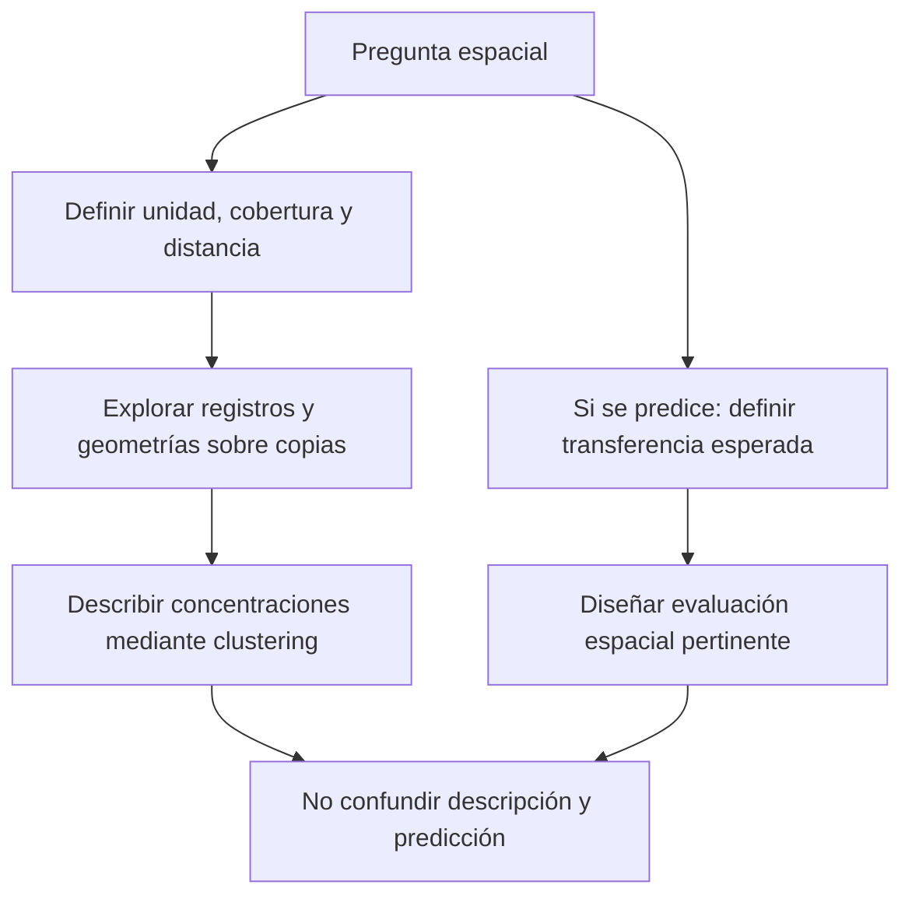

# Agrupación espacial

**Idea central:** una concentración depende de qué se considera cercano, de la distribución observada y de la escala de análisis; no es automáticamente una zona de riesgo o de servicio.

## Qué es y qué problema resuelve

Agrupar espacialmente organiza observaciones usando sus relaciones de localización. Permite describir concentraciones, separar agrupaciones y señalar elementos no asignados. Es útil para formular preguntas sobre registros dispersos que una tabla no hace visibles; no establece por sí mismo explicación causal ni decisión operacional.

En [[01 - Clases/2026-09-14 - Clase 01 - Clustering espacial]], P02 utiliza posiciones de Bomberos para agrupar. P01 es tabular sintética: aunque una dispersión tenga dos ejes y formas visibles, no tiene geografía. Fuente: V13, José Gómez Romero, 2026-06-23, 00:14:41–00:26:36 y 00:40:48–00:50:54; [[99 - Recursos/Clase 01 - Fuentes y acuerdos|V13 y precisiones P4/P7]].

### Analogía limitada

Pensar en conversaciones dentro de una sala ayuda a entender por qué una distancia corta puede favorecer interacción. Pero una pared puede separar personas próximas y una conexión remota unir personas lejanas. La proximidad es una aproximación a una relación: no sustituye barreras, redes ni procesos. En emergencias, proximidad euclidiana no equivale automáticamente a tiempo de respuesta.

## Atributos y geografía no son intercambiables

| Representación | Qué significa cercanía | Límite |
| --- | --- | --- |
| Dos variables de make_moons estandarizadas | Similitud de atributos sintéticos | No asignar EPSG, metros ni mapas geográficos |
| Coordenadas proyectadas P02 | Distancia en el SR real, metros | No representa por sí sola rutas de circulación |
| Recuento por estación reportada | Semejanza de cantidades | Dos estaciones con igual recuento pueden estar lejos |

En el plano métrico, d(p,q)=√((xₚ−x_q)²+(yₚ−y_q)²) expresa una distancia euclidiana. La unidad depende de las coordenadas. Un umbral 350 carece de interpretación geográfica si se ignora su unidad; P02 usa explícitamente `350 Meters` y WKID 9377. No se hereda un SR de un ejercicio anterior.

Fuente: [Esri Pro 3.6, Density-based Clustering, Parameters/Search Distance](https://pro.arcgis.com/en/pro-app/3.6/tool-reference/spatial-statistics/densitybasedclustering.htm) y [How Density-based Clustering works, Search Distance](https://pro.arcgis.com/en/pro-app/3.6/tool-reference/spatial-statistics/how-density-based-clustering-works.htm), consulta 2026-09-15 (E1–E2). La elección efectiva se documenta en el notebook P02.

## Dependencia, heterogeneidad y autocorrelación

**Dependencia:** observaciones pueden estar relacionadas y no aportar información completamente independiente. Repetir posiciones exactas puede reflejar varios eventos en un sitio o problemas de registro; la geometría sola no decide cuál.

**Heterogeneidad espacial:** distribución o relaciones pueden variar de un lugar a otro. Una densidad uniforme como criterio global puede describir mal zonas con intensidades distintas. No se corrige esa incertidumbre simplemente escogiendo el método con menos ruido.

**Autocorrelación espacial:** considera asociación entre valores de un atributo y su disposición espacial. No es sinónimo de agrupación de puntos ni de dependencia en cualquier forma. La idea de Tobler, presentada como orientación en V13, sugiere mayor relación de lo cercano; es una heurística general, no una garantía universal.

El índice Moran I, su z y su p responden a objetos distintos: medida de patrón y evaluación bajo un modelo nulo. Un resultado no significativo no demuestra aleatoriedad. Precisión P4: [Esri Pro 3.6, How Spatial Autocorrelation (Global Moran's I) works, Interpretation](https://pro.arcgis.com/en/pro-app/3.6/tool-reference/spatial-statistics/h-how-spatial-autocorrelation-moran-s-i-spatial-st.htm), consulta 2026-09-15 (E6). Aquí se explica el límite; no se ejecuta Moran ni se impone como EDA universal.

![[99 - Recursos/clase-01-grafica-estructura-espacial.svg]]
**Cómo leerla:** posiciones abstractas X/Y y tonos de un atributo; borde rojo identifica evaluación y azul entrenamiento. En el panel izquierdo se comparten vecindarios, en el derecho se reserva una zona. La transición de tonos ilustra que el bloque reservado puede exigir extrapolar. Elaboración propia idealizada, no datos ni partición de Bomberos; basada en Roberts et al. (E11).

## Evaluar transferencia no es descubrir clusters

La validación cruzada espacial pertenece a una pregunta predictiva: ¿cómo se comportaría el modelo al transferirse según una separación espacial relevante? Compartir vecinos entre entrenamiento y evaluación puede dar una impresión demasiado optimista para un uso en zonas nuevas. Bloquear puede reducirla, pero también cambiar el rango de condiciones evaluadas. La selección del esquema depende del objetivo, no de una regla universal «siempre bloquear».

**Ejemplo real publicado:** Roberts et al. (2017) discuten datos con estructura espacial y un caso de telemetría de **43 hembras de alce en Alberta**. El caso ilustra el diseño de evaluación, no valida nuestros clusters ni añade una práctica predictiva.

Fuente: [Roberts et al., Cross-validation strategies for data with temporal, spatial, hierarchical, or phylogenetic structure, Ecography 40:913–929, pp. 913–919, Blocking y Box 2](https://www.biom.uni-freiburg.de/mitarbeiter/dormann/roberts-et-al-2017-ecography.pdf), doi:10.1111/ecog.02881, consulta 2026-09-15 (E11).

**Lectura:** ambas ramas comparten necesidad de una pregunta, pero no son pasos obligatorios consecutivos. No se ejecutó validación predictiva después del clustering de Clase 01.

## Método aplicado a Bomberos

1. Conservar entrada y crear copia completa; comparar perfiles antes/después.
2. Revisar campos usados, fechas, nulos, claves y coordenadas; no imputar ni deduplicar automáticamente.
3. Comprobar geometrías puntuales; separar problemas de contexto poligonal de la entrada analítica.
4. Explorar estación reportada y mapa de puntos antes de asignar etiquetas.
5. Ejecutar DBSCAN y HDBSCAN sobre la misma copia; comparar mapas con extensión común y barras por grupo.
6. Interpretar ruido y campos HDBSCAN dentro del alcance de sus definiciones, sin saltar a decisiones de cobertura.

**Evidencia real local:** 90 443 registros de 2022–2024, WKID 9377 en metros; 60 711 números de incidente nulos, cero valores cero de ese campo, cero XY no finitas. Se encontraron 82 770 pares XY distintos y 7 673 filas excedentes en posiciones repetidas, pero eso no prueba eventos duplicados. Los enlaces de resultados utilizan SOURCE_ID/OID técnico, no el identificador nullable. [[99 - Recursos/Clase 01 - Resultados de prácticas|Perfil observado P02]].

![[99 - Recursos/salidas_clase_01/practica_02/ejecucion_20260915T171532_430b1cca/arcgis_mapa_entrada.png]]
**Mapa ArcGIS observado:** permite situar puntos y extensión de la entrada. Jurisdicciones son solo contexto no validado: 17 polígonos, una auto-intersección, sin Repair, límites certificados ni estadísticas poligonales. Cero errores puntuales detectados por CheckGeometry no certifica exactitud posicional absoluta. No inferir riesgo por intensidad gráfica ni cobertura por límites contextuales.

![[99 - Recursos/salidas_clase_01/practica_02/ejecucion_20260915T171532_430b1cca/arcgis_estaciones.png]]
**Gráfico ArcGIS observado:** estaciones reportadas en eje categórico y registros en eje cuantitativo. B-5 tiene 8 705 registros y B-17, 3 087; los códigos permanecen visibles aunque algunos nombres se abrevien. Son frecuencias acumuladas, no tasas ajustadas por población o exposición, ni prueba de despacho. Fuente: notebook P02 e informe vigente.

## Límites para interpretar la densidad

Acumular 2022–2024 proporciona una descripción espacial conjunta; no demuestra que los registros de un grupo ocurrieran simultáneamente. El análisis no incluyó campo temporal en las llamadas. Una región con más registros puede reflejar múltiples procesos que no se identificaron aquí.

DBSCAN enlaza núcleos, por lo que el grupo puede extenderse mucho más que la distancia local. HDBSCAN cambia la selección de estructura; menos ruido puede coexistir con un grupo dominante poco discriminante para cierta decisión. Deben observarse escala, granularidad y utilidad de la pregunta, no escoger por apariencia del mapa.

## Relaciones y comprobación del aprendizaje

[[02 - Conceptos/Aprendizaje no supervisado]] aclara el tipo de tarea; [[02 - Conceptos/DBSCAN]] formaliza vecindad y conectividad. [[02 - Conceptos/HDBSCAN y OPTICS]] explica por qué variar densidad no equivale a medir causas. [[03 - Herramientas/ArcGIS Pro - Density-based Clustering]] conecta esas ideas con parámetros y campos concretos.

**Pregunta de salida:** ¿qué faltaría para convertir una concentración en propuesta de ubicación de estación? Capacidad, red vial, tiempos de respuesta, demanda y restricciones; no se ha ejecutado esa optimización. Véase [[05 - Preguntas/Preguntas abiertas]]. Referencias E1/E2/E6/E11 reutilizadas de [[99 - Recursos/Clase 01 - Fuentes y acuerdos]], consulta original 2026-09-15. Revisión visual de Mermaid/SVG pendiente.
