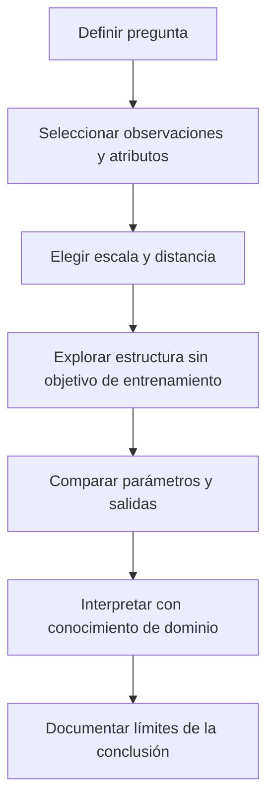

# Aprendizaje no supervisado

**Idea central:** buscar estructura sin una etiqueta objetivo de entrenamiento no significa trabajar sin conocimiento de dominio. La representación y la pregunta siguen siendo decisiones humanas.

## Qué problema resuelve y por qué importa

Cuando tenemos posiciones o atributos, pero no una clasificación objetivo para aprender, podemos explorar semejanzas y agrupaciones. En Bomberos interesa describir concentraciones de registros, no predecir una etiqueta de incendio a partir de ejemplos clasificados. Un grupo aprendido es una hipótesis descriptiva para investigar, no una verdad administrativa.

V13, José Gómez Romero, 2026-06-23, 00:26:55–00:40:17 y 00:40:48–00:50:54; identidad y síntesis verificadas en [[99 - Recursos/Clase 01 - Fuentes y acuerdos]]. La precisión P7 evita confundir «sin etiquetas» con «sin supuestos».

### Una analogía y su límite

Ordenar libros sin un catálogo previo obliga a elegir semejanzas: tema, idioma o extensión producirán organizaciones distintas. Las variables equivalen a esos rasgos y el método a la regla de organización. La analogía deja de servir si se supone que todo libro debe pertenecer a una sección: DBSCAN y HDBSCAN pueden dejar observaciones como ruido. Tampoco garantiza una clasificación única.

## De IA a una tarea concreta

IA es el marco amplio de la fuente; ML aprende regularidades de datos y DL utiliza redes profundas dentro de ML. Esta inclusión conceptual no representa proporciones del mercado ni una jerarquía de calidad. No hace falta DL para estudiar estas concentraciones. Fuente: V13 00:14:41–00:26:36; PPT de referencia, diapositivas 8–11, archivo identificado en el registro.

![[99 - Recursos/clase-01-grafica-taxonomia.svg]]
**Interpretación:** las dos dispersiones repiten posiciones; el color de etiqueta objetivo se retira en la segunda. No se ha ejecutado un clasificador ni clustering en esta figura. Las áreas anidadas IA/ML/DL son inclusiones, no cantidades. Elaboración propia conceptual basada en V13 y P7.

| Familia | Información y objetivo | Qué no basta para identificarla |
| --- | --- | --- |
| Supervisado | Entradas y objetivo observado para ajustar una relación predictiva | Tener una columna categórica cualquiera |
| No supervisado | Estructura sin objetivo etiquetado de entrenamiento | Desconocer totalmente el dominio |
| Refuerzo | Agente, estados, acciones y recompensas; retorno esperado acumulado | Evaluar un predictor con etiquetas reservadas |

Una columna de estación reportada puede describir o estratificar una exploración sin convertirse en objetivo de un modelo supervisado. Las etiquetas `y_true` de make_moons permiten ilustrar su generador, pero no se entregan a `fit_predict` de los modelos P01. Tenerlas disponibles no cambia el entrenamiento realmente efectuado.

**Lectura del proceso:** el dominio interviene antes y después del algoritmo; no solo al nombrar grupos. Cambiar la pregunta puede exigir otra representación, no simplemente otro valor de un parámetro.

## Definición operativa y método

Sea X una matriz de n observaciones por p atributos. En clustering se obtiene una asignación cᵢ a un grupo; ciertos métodos admiten cᵢ=−1 para no asignados. No hay una etiqueta objetivo yᵢ usada para ajustar esa asignación. Esto es una definición de la tarea de agrupación de esta clase, **no** una definición exhaustiva de todo aprendizaje no supervisado.

La distancia d(xᵢ,xⱼ) expresa la similitud operacional. Si una variable tiene escala mucho mayor, puede dominar distancias euclidianas. StandardScaler transforma cada atributo mediante z=(x−u)/s; no vuelve normales los datos y es sensible a valores extremos. En P01 se ajusta sobre la realización sintética. En P02 no se estandarizan metros automáticamente: hacerlo cambiaría el significado del radio geográfico.

Fuente: [scikit-learn 1.6, StandardScaler, definición y advertencia sobre atípicos](https://scikit-learn.org/1.6/modules/generated/sklearn.preprocessing.StandardScaler.html), consulta 2026-09-15; E12 verificada y reutilizada.

1. Formular qué observaciones y qué semejanza se quiere estudiar.
2. Inspeccionar variables pertinentes, faltantes y escala; no borrar registros automáticamente.
3. Elegir método y parámetros coherentes con esa representación.
4. Leer grupos y no asignados mediante gráficos, mapas cuando corresponda y resúmenes.
5. Comparar cambios controlados y discutir utilidad, no declarar un ganador por una única cifra.

## Refuerzo: una distinción que evita un error frecuente

En refuerzo una política orienta acciones del agente según el estado; las acciones influyen en lo que sucede después. El retorno reúne recompensas a lo largo de la interacción, y el objetivo es maximizar su esperanza. Una analogía docente sería un agente que decide movimientos y recibe recompensas; no es un experimento ejecutado aquí ni una recomendación para despacho de emergencias.

En cambio, predecir etiquetas y comparar con un conjunto reservado sigue siendo evaluación supervisada. El hecho de producir una puntuación de validación no la convierte en la recompensa de una interacción agente–entorno. Precisión P3 aprobada.

Fuente: [OpenAI Spinning Up, Key Concepts in RL, Terminology/The RL Problem, sin versión numérica indicada](https://spinningup.openai.com/en/latest/spinningup/rl_intro.html), consulta 2026-09-15 (E7).

## Ejemplos: separar ilustración de evidencia real

![[99 - Recursos/salidas_clase_01/practica_01/ejecucion_20260915T164803_70b07f40/arcgis_original.png]]
**Ilustración sintética ejecutada:** dispersión ArcGIS de 200 observaciones make_moons con ruido generador 0.9999 y semilla 10. Ejes son atributos, no metros; los colores de origen no son grupos aprendidos. La perturbación del generador no equivale a etiqueta −1. Fuente: notebook P01 y [scikit-learn 1.6, make_moons, API](https://scikit-learn.org/1.6/modules/generated/sklearn.datasets.make_moons.html), consulta 2026-09-15 (E13).

**Ejemplo real atribuible:** el notebook P02 del diplomado agrupó 90 443 registros locales de Bomberos de 2022–2024. DBSCAN obtuvo 20 grupos y HDBSCAN 3; ambos conservaron las filas. Estos números describen ejecuciones con parámetros distintos, no etiquetas verdaderas ni calidad del servicio. El informe [[99 - Recursos/Clase 01 - Resultados de prácticas]] documenta datos, parámetros, mapas y límites. No se usaron etiquetas de riesgo para entrenarlos.

## Evaluación y supuestos

- **Representación:** que dos puntos estén cerca según las variables elegidas debe ser relevante para la pregunta; no se presume equivalencia entre similitud tabular y geográfica.
- **Sensibilidad:** modificar un parámetro a la vez permite atribuir mejor el cambio observado. Estabilidad ante algunas variaciones no demuestra optimalidad.
- **Granularidad:** muchos grupos pequeños y un grupo dominante responden a descripciones diferentes; ninguno es automáticamente correcto.
- **Ruido:** inspeccionar no asignados, sin considerarlos errores ni eliminarlos por defecto.
- **Uso posterior:** una decisión operativa exige criterios externos al clustering, como tiempos y capacidad.

No todos los métodos evitan elegir k. [scikit-learn 1.6, KMeans, n_clusters](https://scikit-learn.org/1.6/modules/generated/sklearn.cluster.KMeans.html), consulta 2026-09-15 (E14), documenta el número de grupos y centroides solicitado. Es contraste de la nota fuente, no tercer ejercicio ejecutado.

## Relaciones que conviene conservar

[[02 - Conceptos/Agrupación espacial]] precisa qué significa semejanza cuando interviene localización. [[02 - Conceptos/DBSCAN]] convierte esa noción en vecindades y conexiones densas; [[02 - Conceptos/HDBSCAN y OPTICS]] permite distinguir estructuras multiescala de etiquetas finales. [[02 - Conceptos/Comparación de métodos de clustering]] ayuda a evaluar sin contar grupos como si fueran aciertos.

Aplicación y discusión conjunta en [[01 - Clases/2026-09-14 - Clase 01 - Clustering espacial]]. Fuentes completas E7/E12–E14 y V13 en [[99 - Recursos/Clase 01 - Fuentes y acuerdos]]; lecturas originales del orquestador del 2026-09-15 reutilizadas, no consultadas otra vez. Mermaid y SVG requieren revisión visual final, no inferida de su presencia.
