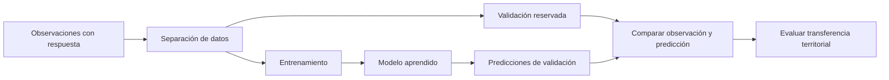

# Aprendizaje supervisado

## ¿Cómo aprender de observaciones conocidas?

El aprendizaje supervisado aprende una relación entre variables explicativas y una **variable objetivo conocida** para estimarla en ejemplos nuevos. La respuesta puede ser una categoría —zona crítica/no crítica— o un número continuo —biomasa, temperatura o incidentes—. A diferencia del aprendizaje no supervisado, existe una respuesta contra la cual contrastar la predicción. La pregunta importante no es si el modelo ajusta lo que ya vio, sino si **generaliza sin memorizar**. [Esri, 3.6, «How…», introducción y entrenamiento; referencia al final.]

| Componente | Significado | Ejemplo geoespacial |
|---|---|---|
| Objetivo | Lo que se predice | Biomasa observada en parcelas de Coiba |
| Variables explicativas | Información disponible para predecir | Bandas Landsat, NDVI, pendiente, elevación |
| Entrenamiento | Ejemplos usados para aprender | Puntos con biomasa medida |
| Validación | Ejemplos reservados para evaluar | 10 % de puntos no usados en el ajuste |
| Modelo | Regla aprendida | [[Random Forest]] |
| Predicción | Aplicación a ejemplos nuevos | Raster continuo de biomasa estimada |

El 10 % es un parámetro del ejercicio, no una garantía universal de validación suficiente.

La separación precede al ajuste. Evaluar transferencia exige revisar también dónde están las muestras, no solo contar cuántas se reservaron.

## Clasificación y regresión

| Tipo | Objetivo | Salida | Evaluación |
|---|---|---|---|
| Clasificación | Categoría | Bosque/no bosque; riesgo alto/medio/bajo | [[Matriz de confusión]], accuracy, precision, recall, F1 |
| Regresión | Número continuo | Biomasa, precio, población, temperatura | MAE, RMSE, R², error medio |

La herramienta [[ArcGIS Pro - Forest-based and Boosted Classification and Regression]] admite ambos problemas. Clasificación/regresión describen el objetivo; entrenar/predecir describen la operación de la herramienta.

### Ejemplo hipotético de clasificación

Se usan NDVI y elevación para distinguir biomasa alta y baja; «Alta» es la clase positiva.

| Parcela | NDVI | Elevación | Clase real | Predicción |
|---|---:|---:|---|---|
| A | 0.82 | 130 m | Alta | Alta |
| B | 0.45 | 80 m | Baja | Baja |
| C | 0.76 | 260 m | Alta | Baja |
| D | 0.39 | 40 m | Baja | Alta |

C es un falso negativo: no se detectó la clase alta. D es un falso positivo: se indicó alta donde no correspondía. Estas dos equivocaciones pueden tener costos diferentes.

### Ejemplo hipotético de regresión

| Punto | Biomasa observada | Predicha | Error observado − predicho |
|---|---:|---:|---:|
| 1 | 80 | 75 | 5 |
| 2 | 120 | 130 | −10 |
| 3 | 60 | 50 | 10 |

$$MAE=\frac{|5|+|-10|+|10|}{3}=8.33.$$

El error absoluto medio es 8.33 unidades de biomasa. Esto no informa si se falla especialmente en costa, elevaciones altas o bosques densos: hay que localizar los errores.

![[99 - Recursos/clase-06-errores-prediccion.svg]]

**Lectura:** las barras verdes muestran observados y las naranjas predichos para P1–P3; el eje horizontal expresa unidades de respuesta. La diferencia entre longitudes permite reconocer sobreestimación y subestimación. **Conclusión:** ajustar bien algunos ejemplos no demuestra generalización. **Límite:** son ejemplos hipotéticos, no resultados nuevos de Coiba. Fuente: elaboración docente del recurso; ideas de evaluación de modelos supervisados de Esri 3.6.

![[99 - Recursos/grafica-aprendizaje-supervisado-geoespacial.svg]]

**Lectura:** de izquierda a derecha, la respuesta conocida se combina con atributos, distancias y rasters para estimar valores o clases nuevos. No hay escala geográfica: las cajas representan información, no áreas medidas. **Conclusión:** la validación debe acompañar la predicción. **Límite:** las flechas no demuestran causalidad ni desempeño. Fuente: gráfico didáctico original del material GeoIA; fundamento en Esri 3.6, «How…», citado al final.

## Del punto al territorio

Con [[Rasters explicativos]] se puede estimar biomasa en una isla a partir de muestras, clasificar coberturas o riesgo y usar bandas, índices, distancias y atributos territoriales como predictores. La [[Importancia de variables]] ayuda a examinar las señales usadas, sin demostrar causalidad.

Dos puntos cercanos pueden parecerse más que dos lejanos. Una partición aleatoria puede repartir vecinos entre entrenamiento y validación y producir una evaluación demasiado favorable para zonas nuevas. Random Forest no resuelve automáticamente esta dependencia: véase [[Validación de modelos supervisados]].

1. Definir objetivo y unidad espacial de predicción.
2. Revisar calidad, cobertura y sesgo de las etiquetas.
3. Elegir predictores con sentido físico y territorial.
4. Separar entrenamiento y validación antes de evaluar.
5. Ajustar y revisar [[Métricas de evaluación de modelos]].
6. Mapear residuales y localizar errores sistemáticos.
7. Revisar importancia sin interpretarla como causalidad.
8. Delimitar rangos, territorio y fechas donde es razonable aplicar el modelo.

Un modelo puede sobreajustarse; accuracy puede engañar con clases desbalanceadas; extrapolar fuera de lo observado es arriesgado. Estas precauciones vinculan el método con [[Analítica predictiva]], no con una promesa de certeza.

## Referencias y contexto docente

- Esri. *How Forest-based and Boosted Classification and Regression works*. ArcGIS Pro 3.6, introducción, entrenamiento y validación. https://pro.arcgis.com/en/pro-app/3.6/tool-reference/spatial-statistics/how-forest-works.htm. Consulta documentada: 2026-09-21.
- Esri. *Forest-based and Boosted Classification and Regression*. ArcGIS Pro 3.6, uso y parámetros. https://pro.arcgis.com/en/pro-app/3.6/tool-reference/spatial-statistics/forestbasedclassificationregression.htm. Consulta documentada: 2026-09-21.
- Ampliación bibliográfica conservada: Hastie, Tibshirani y Friedman, *The Elements of Statistical Learning*, https://hastie.su.domains/ElemStatLearn/; scikit-learn, *Supervised learning*, https://scikit-learn.org/stable/supervised_learning.html, y *train_test_split*, https://scikit-learn.org/stable/modules/generated/sklearn.model_selection.train_test_split.html. Sin nueva comprobación web en esta edición.

Aplicación: [[2026-09-21 - Clase 04 - Aprendizaje supervisado y Random Forest geoespacial|Clase 04]]. Ejemplos numéricos didácticos; esta nota no acredita ejecución de modelos.
