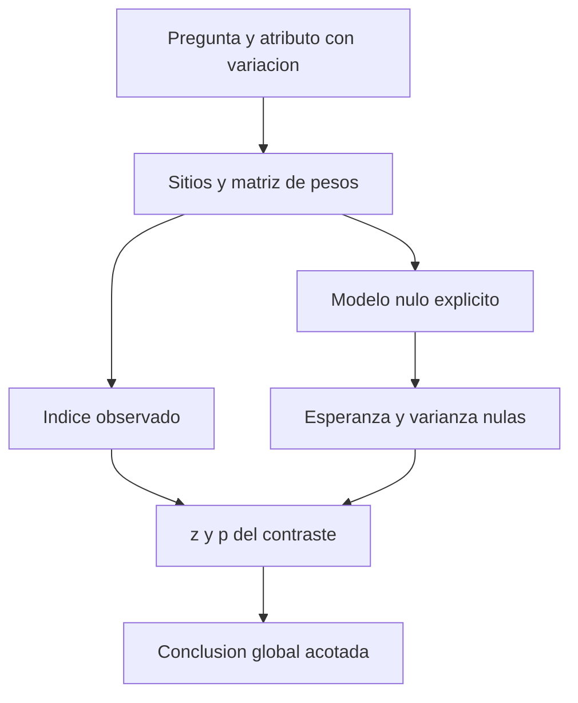

# Autocorrelación espacial global (Moran's I)

## Qué es y qué problema resuelve

Moran global resume la asociación entre **valores de un atributo y valores de sus vecinos**, con una vecindad explícita. Permite preguntar si valores altos están cerca de otros altos y valores bajos cerca de otros bajos, o si predominan contrastes entre vecinos. No localiza cada agrupación ni explica su causa. La interpretación necesita el índice observado, su referencia nula y la incertidumbre, no solo un mapa atractivo. Esri distingue I, z y p y advierte que no rechazar la hipótesis nula no demuestra aleatoriedad. [1]

En [[01 - Clases/2026-09-15 - Clase 02 - OPTICS y autocorrelación espacial incremental|Clase 02]], el atributo es `ICOUNT`: número de eventos que representa cada sitio ocupado después de preparar copias y reunir coincidencias. El soporte es el conjunto de sitios, no todas las posiciones posibles del territorio. Esto hace que la pregunta sea distinta de la agrupación de ubicaciones mediante [[02 - Conceptos/HDBSCAN y OPTICS|OPTICS]].

## Analogía, correspondencias y límite

Imagine una fila de casas con una tarjeta numérica en cada puerta. Si las tarjetas grandes quedan juntas y las pequeñas también, los vecinos tienden a parecerse. Las casas representan sitios; las tarjetas representan el atributo; las conexiones entre casas son los pesos. La analogía no permite inferir quién decidió poner las tarjetas ni asegura que una fila sea una vecindad adecuada para una ciudad.

## Definición formal

Sean $n>1$ observaciones, $x_i$ su atributo, $\bar{x}$ la media, $u_i=x_i-\bar{x}$ y $w_{ij}$ el peso de la relación entre $i$ y $j$. Con pesos no negativos, diagonal cero, $S_0=\sum_i\sum_jw_{ij}>0$ y atributo no constante:

$$
I=\frac{n}{S_0}\frac{\sum_i\sum_j w_{ij}u_i u_j}{\sum_i u_i^2}.
$$

- El **numerador** suma productos de desviaciones ponderados por vecindad. Dos desviaciones del mismo signo aportan positivamente; signos contrarios aportan negativamente.
- El **denominador** mide la variación total del atributo. Si todos los valores son iguales, es cero: no hay una estadística válida de este atributo.
- $n/S_0$ ajusta por cantidad total de relaciones ponderadas. Hay que conocer cómo trata el programa las entidades sin vecinos.
- I no es idéntico a Pearson ni tiene extremos universales garantizados de −1 y +1 para cualquier matriz. Su rango realizable depende de los pesos.

**Respaldo formal:** Maruyama [3], §2, define esta estadística y demuestra que sus límites dependen de W. Su ejemplo 2.1 incluye límites fuera de [−1, 1]; no se incorpora aquí la medida alternativa propuesta en ese artículo. Anselin [4], §13.5, separa índice, momentos nulos y aproximación inferencial.

## Una figura que permite reconstruir el cálculo

![[99 - Recursos/clase-02-moran-productos.svg]]

**Lectura.** Figura algebraica propia, no datos de Bomberos. Cada círculo contiene el valor 1 o 3; las líneas representan pesos binarios simétricos y no distancias métricas. La media es 2, por lo que las desviaciones son ±1. Hay tres aristas, contadas en ambas direcciones: $S_0=6$. En A, los productos dirigidos suman 2 y $I=1/3$; en B suman −6 y $I=-1$.

**Conclusión.** Los mismos valores y la misma geometría pueden producir distinta asociación si cambia su distribución entre sitios. **Límite.** Cuatro sitios sirven para mostrar aritmética, no para justificar aproximación normal ni significancia. No se han calculado z o p para este dibujo. Ideas y fórmula: [1, 3]; cálculo didáctico de elaboración propia, no ejecución geográfica.

## Hipótesis nula y los cinco componentes del análisis

Para permutaciones equiprobables de valores entre sitios fijos y pesos fijos, diagonal cero, n > 1, S₀ > 0 y atributo no constante, el valor esperado es [4]:

$$
E_0[I]=-\frac{1}{n-1}.
$$

Se aproxima a cero desde valores negativos cuando crece $n$, pero no es exactamente cero en una muestra finita. La esperanza requiere especificar qué observaciones entran en $n$; no se debe retirar silenciosamente una isla y conservar el tamaño anterior en la explicación. Véase [[02 - Conceptos/Hipótesis nula espacial|hipótesis nula espacial]] para distinguir esta aleatorización de CSR.

| Componente | Qué informa | Error que evita |
| --- | --- | --- |
| I observado | Asociación de valores para los pesos elegidos | Llamar densidad al índice |
| E[I] | Referencia media bajo el modelo nulo | Tomar cero como referencia exacta siempre |
| Varianza nula | Variación de la estadística bajo ese modelo | Usar en su lugar varianza de `ICOUNT` o de distancias vecinales |
| z | Distancia estandarizada entre observado y esperado | Confundir significancia con tamaño del efecto |
| p | Extremidad respecto del modelo y contraste | Probabilidad de que la hipótesis sea verdadera |

$$
z=\frac{I-E_0[I]}{\sqrt{\operatorname{Var}_0(I)}}.
$$

El signo de z expresa por qué lado de la referencia nula cae el índice, no simplemente si I es mayor o menor que cero. Un I pequeño puede tener z grande si la varianza nula es pequeña. La decisión no convierte esa diferencia en importante para una política pública. [1, 4]

**Por qué aparece −1/(n−1).** Complemento algebraico docente: sea $Q=\sum_i u_i^2>0$. Como $\sum_i u_i=0$, la suma de productos entre posiciones distintas es $-Q$. Bajo permutaciones equiprobables, cada par distinto tiene esperanza $-Q/[n(n-1)]$; multiplicar por S₀ y por n/(S₀Q) da la esperanza indicada. No se deduce de esto una varianza universal.

Anselin [4] distingue referencia gaussiana y aleatorización: comparten esa esperanza, pero la varianza bajo aleatorización incorpora el cuarto momento de los valores, mientras la expresión gaussiana depende de los pesos. Estandarizar I no garantiza normalidad exacta: el z utiliza una aproximación asintótica, cuya adecuación no queda demostrada por tener muchos registros. La estandarización por filas permite S₀=n solo si todas las filas tienen vecinos.

**Lectura del diagrama.** Los pesos alimentan tanto el índice como la referencia inferencial. Cambiarlos modifica el contraste, no únicamente la visualización. No representa una prueba ya ejecutada.

## Método y controles necesarios

1. Definir la población, período, atributo y unidad espacial; verificar qué significan cero, nulo y coincidencia.
2. Verificar variación, valores extremos y suma de conteos cuando se agregaron eventos; no imputar por conveniencia estadística.
3. Elegir vecindad coherente con métrica, CRS y pregunta. Registrar pesos, distancia, estandarización y entidades aisladas.
4. Especificar modelo nulo y criterio inferencial antes de mirar el resultado, si la intención es confirmatoria.
5. Conservar todos los mensajes y estadísticas; leer mapa, I, z y p juntos, sin afirmar grupos locales a partir del resultado global.
6. Evaluar sensibilidad mediante [[02 - Conceptos/Autocorrelación espacial incremental|varias distancias]], declarando exploratoria la selección posterior.

La estandarización por filas distribuye el peso de una entidad entre sus vecinos; no elimina dependencia espacial. Su efecto y el tratamiento de islas se desarrollan en [[02 - Conceptos/Escala espacial, vecindad y bandas de distancia|escala y pesos]]. La ausencia de vecinos no se remedia sumando valores ficticios.

## Ejemplo real atribuido y límites territoriales

La grabación de Clase 14 de **José Sebastián Gómez Romero, 2026-06-24**, revisada directamente por el orquestador con Chrome DevTools MCP el 2026-09-15, desarrolla una tercera práctica real con **viviendas turísticas Bogotá de Catastro/IDECA** (106:00–123:09): Collect Events → Moran global de ICOUNT con distancia inversa, euclidiana, estandarización por filas y umbral vacío → dos incrementales. No son datos comerciales de Airbnb ni precios. La copia local ya está disponible y P03 fue ejecutada el **2026-09-16**: **7 529 registros → 2 919 sitios**, ICOUNT 1–186. La corrida vigente `ejecucion_5bd614af4469`, registrada en la nota central, produjo **I=0.025782, z=10.661289, p exportado 0 y umbral 4822.1390 m**. El cero es una representación numérica, no probabilidad matemáticamente nula; la evidencia estandarizada no convierte un I pequeño en gran efecto territorial. No se reejecutó para esta actualización. El global de abejas a 350 m pertenece a una adaptación histórica, no al procedimiento vigente.

La ayuda instalada de `SpatialAutocorrelation`, Pro 3.6.2, comprobada el 2026-09-15, distingue **umbral vacío** (distancia calculada que garantiza al menos un vecino por entidad) de **cero** (sin umbral para distancia inversa). No optimiza p ni selecciona una escala validada. El valor mostrado en la fuente, aproximadamente 4 822 m, no se fija como parámetro nuevo. El cotejo web quedó resuelto con Esri Pro 3.6, Usage/Parameters/Python, consulta 2026-09-16 [5]. La revisión focal actual del video confirmó global a 110:20–110:27 y HTML a 115:00–115:07 con I=0.025782, z=10.661289, p mostrado 0 y 4822.1390 m: son resultados **de fuente**, separados de los actuales aunque coincidan. No acredita revisión continua de 106:00–123:09 ni cobertura docente completa.

Los conteos no están normalizados por población expuesta, esfuerzo de atención ni presencia de colmenas. Una asociación significativa puede motivar otra investigación, no explicar causalidad. Un resultado no significativo tampoco niega riesgo ni invalida un agrupamiento descriptivo de OPTICS. [1]

## Fuentes y estado

1. **Esri, ArcGIS Pro 3.6 — [How Spatial Autocorrelation (Global Moran's I) works](https://pro.arcgis.com/en/pro-app/3.6/tool-reference/spatial-statistics/h-how-spatial-autocorrelation-moran-s-i-spatial-st.htm)**. Introducción e Interpretation. Consulta registrada **2026-09-15**, pasaje reutilizado de [[99 - Recursos/Clase 01 - Fuentes y acuerdos#8. Referencias verificadas por el orquestador|registro documental, E6]]. No se afirma lectura nueva de otras secciones.
2. **Gómez Romero, José Sebastián — grabación Clase 14, 2026-06-24**, 106:00–123:09 (viviendas, global e incrementales), revisión directa comunicada por el orquestador el 2026-09-15. Registro de identidad, cobertura parcial y pendientes en [[01 - Clases/2026-09-15 - Clase 02 - OPTICS y autocorrelación espacial incremental#4. Fuentes, procedencia y resultados|procedencia de Clase 02]]. No se afirma visionado continuo ni cobertura total.

3. **Yuzo Maruyama (2015), [An alternative to Moran’s I for spatial autocorrelation](https://arxiv.org/abs/1501.06260)**, arXiv:1501.06260v1, §2, definición, teorema 2.1 y ejemplo 2.1/tabla 1, pp. 2–4; consulta **2026-09-16**, PDF extraído leído. Se reutilizan fórmula y límites, no su alternativa.
4. **Luc Anselin, [An Introduction to Spatial Data Science with GeoDa — Moran’s I](https://lanselin.github.io/introbook_vol1/morans-i.html)**, edición web, §13.5, momentos, inferencia y permutaciones; consulta **2026-09-16**, pasaje leído por el orquestador y reutilizado.
5. **Esri, ArcGIS Pro 3.6, [Spatial Autocorrelation (Global Moran’s I)](https://pro.arcgis.com/en/pro-app/3.6/tool-reference/spatial-statistics/spatial-autocorrelation.htm)**, Usage/Parameters/Python; consulta **2026-09-16**, pasaje verificado por el orquestador.

Pendientes: revisión focal de renderizado Mermaid/SVG (T03) y cobertura docente pertinente completa del video (T04). Las salidas actuales están registradas en Clase 02; la figura algebraica no sustituye sus mapas ArcGIS ni acredita aprobación académica.
