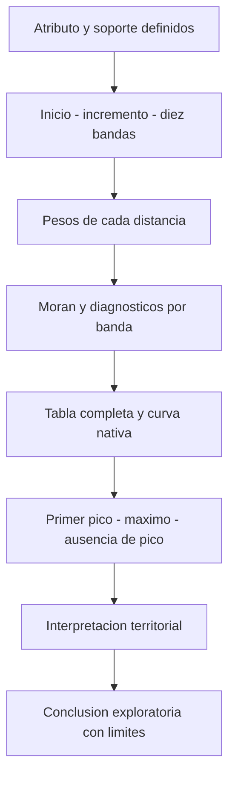

# Autocorrelación espacial incremental

## Qué es, qué resuelve y por qué importa

La autocorrelación espacial incremental repite un análisis global de asociación de un atributo para varias distancias de vecindad. Responde cómo cambia esa asociación al ampliar las relaciones espaciales consideradas. No es una secuencia temporal: «incremental» se refiere aquí al incremento de distancia.

Una sola banda puede ocultar que el resultado depende de la escala. La curva permite ver transiciones, picos o ausencia de picos, pero cada punto pertenece a un contraste con sus propios pesos. No se elige una distancia únicamente por la altura de la curva. Esta es la lectura multiterritorial de abejas y colegios conservada en la fuente docente [2]; la interpretación básica de I, z y p se apoya en Esri [1]. El orquestador verificó Usage/Parameters/Python y la explicación oficial el 2026-09-15 [3, 4]: atributo no constante, tabla y gráfico nativo; picos significativos como candidatos, no óptimos universales.

## Analogía con límites

Imagine escuchar una conversación primero entre vecinos de una mesa y luego entre varias mesas. Al ampliar el conjunto de interlocutores cambia la relación que se resume. La distancia representa el alcance de la relación, los valores representan el atributo y la curva resume su asociación estandarizada. La analogía no afirma que toda relación real dependa de distancia euclidiana ni que la mesa más grande sea la mejor escala.

## Método formal y parámetros

Elegir $d_0>0$, incremento $\Delta d>0$ y cantidad $K$. Para cada $k=0,\ldots,K-1$:

$$
d_k=d_0+k\Delta d,\qquad I_k=I(x,W(d_k)),\qquad
z_k=\frac{I_k-E_0[I_k]}{\sqrt{\operatorname{Var}_0(I_k)}}.
$$

El atributo y sus sitios permanecen; la matriz $W(d_k)$ cambia. Una banda fija acumulativa incorpora a todos los vecinos hasta $d_k$, no únicamente los que están entre $d_{k-1}$ y $d_k$. La distancia inicial, incremento, estandarización y tratamiento de islas son parte del método, no detalles cosméticos. La notación anterior es una síntesis docente: distancias y operación según Esri [3, 4]; estandarización inferencial según Anselin [5], §13.5. No presupone varianza constante entre bandas ni normalidad exacta de cada z.

| Parámetro | Ejercicio de abejas | Ejercicio de colegios | Límite |
| --- | --- | --- | --- |
| Atributo | ICOUNT de abejas agregadas | ICOUNT de colegios agregados | Conteos en sitios ocupados; no tasas ni prueba de CSR |
| Distancia inicial | 100 m | 2 000 m; refinamiento 500 m | Configuración visible, no óptimo |
| Incremento | 100 m | 2 000 m; refinamiento 500 m | Resolución de exploración |
| Bandas | 10 | 20 en ambas corridas | Final solicitado: 1 000; 40 000 y 10 000 m |
| Global adicional | No forma parte de esta práctica | No forma parte de esta práctica | No trasladar globales históricos al alcance vigente |

La pregunta formal de [[02 - Conceptos/Autocorrelación espacial global (Moran's I)|Moran global]] se repite; no se prueba «si OPTICS está bien». Se mantiene el orden práctico de [[01 - Clases/2026-09-15 - Clase 02 - OPTICS y autocorrelación espacial incremental|Clase 02]]: **OPTICS del universo primero**, después selección de abejas, Collect Events exacto e inferencia; siguen colegios y la tercera práctica de viviendas. No se ejecuta Integrate.

## Figura: diez puntos, no solo el máximo

![[99 - Recursos/clase-02-incremental-seleccion.svg]]

**Lectura.** Gráfica propia con z deliberadamente inventados y diez distancias de 100 a 1 000 m. El eje horizontal expresa el umbral acumulativo en metros; el vertical es z sin unidades. La línea horizontal 1.96 es una referencia bilateral normal **nominal**, no un ajuste por explorar distancias. El primer pico local ilustrativo está en 400 m; el máximo, en 800 m. Estas cifras no pertenecen a Bomberos ni colegios.

**Conclusión.** Primer pico y máximo pueden responder a vecindades diferentes; hay que explicar qué relaciones incorpora cada banda. **Límite.** No es salida de ArcGIS, no demuestra significancia de la práctica y no certifica la aproximación normal. Ideas procedentes del ejercicio multiescala [2]; postselección como aplicación docente de la transparencia sobre análisis de la ASA [6], principios 4–5.

## Procedimiento que conserva la información

1. Inspeccionar atributo y soporte. La variación de `ICOUNT` resulta de contar coincidencias XY exactas, sin desplazar geometrías: no tratar eventos y sitios agregados como la misma unidad.
2. Verificar CRS, unidades, métrica y cobertura. En colegios nacionales, metros válidos no equivalen a distancias por red de transporte.
3. Registrar inicio, incremento, número de bandas y estandarización. Las distancias solicitadas deben ser reconstruibles desde esos parámetros; contrastarlas con la tabla real, pues la herramienta puede ajustar el rango. [3]
4. Conservar la tabla completa y los mensajes de vecinos; identificar entidades aisladas y su distribución, no solo su total.
5. Graficar distancia–z y leer junto a I y p nominales. Un z alto no significa «alta densidad de eventos» ni mayor tamaño del efecto.
6. Describir picos candidatos sin ocultar distancias que contradicen la narrativa. La ausencia de picos no obliga a buscar indefinidamente hasta encontrar uno.
7. Confrontar escalas con el territorio y documentar el carácter exploratorio de la selección.

**Lectura.** Los diagnósticos anteceden a la selección del pico. El flujo mantiene resultados que no favorecen una conclusión y no abre automáticamente una nueva práctica.

## Postselección: por qué el pico no se confirma a sí mismo

Si se examinan varias distancias y después se comunica solo la de menor p, se ha seleccionado una estadística usando el resultado observado. El p nominal de esa distancia no incorpora por sí solo la búsqueda. Los contrastes comparten entidades y muchas relaciones, por lo que no son diez experimentos independientes.

Recalcular Moran global en el pico seleccionado con las mismas observaciones puede ayudar a revisar informe y parámetros, pero **no es una confirmación independiente**. Una inferencia confirmatoria necesitaría una escala prefijada por otra evidencia o un procedimiento que contemple explícitamente la selección y sus supuestos. Aquí se conserva la exploración original y se declara su alcance; no se inventa una corrección por comparaciones múltiples ejecutada. **Respaldo:** Wasserstein y Lazar/ASA [6], §3, principios 4–5, advierten sobre selección de análisis y distinguen p de tamaño del efecto. Aplicarlo a bandas dependientes es una cautela docente: el documento no proporciona una corrección espacial ni supone independencia entre estas bandas.

Además, z depende tanto del índice como de su referencia nula y varianza. Maximizar z no equivale a maximizar asociación sustantiva, homogeneidad de grupos ni capacidad operativa. No concluir que la distancia del pico sea el radio que «debe» usar [[02 - Conceptos/HDBSCAN y OPTICS|OPTICS]].

## Entidades aisladas y vecindad

Una banda pequeña puede dejar sitios sin vecinos. Un promedio vecinal para una fila de suma cero no se construye dividiendo por cero; el manejo depende de la implementación. Registrar los mensajes y revisar dónde se concentran las islas antes de comparar resultados. Ampliar la banda solo para suprimir advertencias puede destruir la escala de interés.

[[02 - Conceptos/Escala espacial, vecindad y bandas de distancia|Escala, vecindad y bandas]] muestra por qué estandarizar por filas cambia pesos y por qué ampliar una banda añade relaciones, no solo observaciones útiles. La misma política de pesos debe mantenerse o su cambio debe explicarse.

## Caso real atribuido: colegios a varias escalas

La fuente **Clase 14, José Sebastián Gómez Romero, 2026-06-24**, usa **Colegios de Colombia**, propietario CommunityMapsEsriColombia. La revisión visible del orquestador confirma Collect Events directo y **20 bandas de 2 000 m**, seguidas de **20 bandas de 500 m** (87:03–88:18 y 97:36). No se incluyen globales a 25/50 km ni integración a 10 m: son adaptaciones históricas. Se reutiliza la exportación local sin integración, 10 617 puntos, con cobertura incompleta y CRS Web Mercator 3857; no se descarga el servicio ni se atribuye ejecución nueva.

Una vecindad mayor puede conectar establecimientos de municipios diferentes. Eso sugiere una lectura multiterritorial, pero no demuestra un mecanismo regional ni accesibilidad escolar: no se han modelado viajes, demanda, matrícula ni calidad. Tampoco convierte las fronteras administrativas en contornos de clusters.

**Viviendas turísticas Bogotá de Catastro/IDECA** es una tercera práctica real (106:00–123:09), no un caso conceptual de Airbnb. El atributo es ICOUNT de registros coincidentes. Después del global con distancia inversa y umbral automático, la revisión focal actual del orquestador confirmó **20/2000/200 a 118:50–118:57** y **30/1000/200 a 121:30–121:40**; 10 bandas con inicio vacío a 118:10–118:17 era una configuración provisional, no tercera corrida acreditada. No se afirma revisión continua de 106:00–123:09.

**Ejecución vigente P03, 2026-09-16:** entrada local disponible; corrida `ejecucion_5bd614af4469`, 7 529 registros → 2 919 sitios. La inicial produjo veinte bandas 2 000–5 800 m, primer pico 2 200 m (z=7.026597) y máximo pico 5 000 m (z=10.637299). La segunda produjo treinta bandas 1 000–6 800 m, primer pico 1 400 m (z=5.447021) y máximo pico 5 000 m (z=10.637299). Son salidas actuales registradas en la nota central, no cifras atribuidas al video; las curvas fuente coinciden en las distancias de picos observadas a 120:00–120:10 y 121:30–121:40. Repetir el máximo sobre los mismos datos no lo confirma independientemente; no hubo reejecución en esta actualización.

## Fuentes y estado del respaldo

1. **Esri, ArcGIS Pro 3.6 — [How Spatial Autocorrelation (Global Moran's I) works](https://pro.arcgis.com/en/pro-app/3.6/tool-reference/spatial-statistics/h-how-spatial-autocorrelation-moran-s-i-spatial-st.htm)**, introducción e Interpretation. Consulta registrada **2026-09-15**, pasajes reutilizados de [[99 - Recursos/Clase 01 - Fuentes y acuerdos#8. Referencias verificadas por el orquestador|E6]]. Respalda interpretación global, no una nueva lectura de la herramienta incremental.
2. **Gómez Romero, José Sebastián — Clase 14, 2026-06-24**, [nota procesada](<../../diplomado_geoia/01 - Clases/2026-06-24 - Clase 14 - OPTICS y autocorrelación espacial incremental.md>), §§6.7–6.9 y 7, y [notebook autónomo original de colegios](<../../diplomado_geoia/99 - Recursos/notebooks/Clase 14 - Practica colegios Moran incremental.ipynb>). Procedencia local del ejercicio, no ejecución actual.

3. **Esri, ArcGIS Pro 3.6 — [Incremental Spatial Autocorrelation](https://pro.arcgis.com/en/pro-app/3.6/tool-reference/spatial-statistics/incremental-spatial-autocorrelation.htm)**, Usage/Parameters/Python/Licensing; pasajes leídos por el orquestador el 2026-09-15: campo no constante, códigos API, distancias reales, tabla y gráfico nativo, todas las licencias.
4. **Esri, ArcGIS Pro 3.6 — [How Incremental Spatial Autocorrelation works](https://pro.arcgis.com/en/pro-app/3.6/tool-reference/spatial-statistics/how-incremental-spatial-autocorrelation-works.htm)**, página completa, consulta 2026-09-15 por el orquestador: picos significativos candidatos según proceso y ausencia de pico; ejemplo de obesidad escolar a escala hogar/programa.

5. **Luc Anselin, [An Introduction to Spatial Data Science with GeoDa — Moran’s I](https://lanselin.github.io/introbook_vol1/morans-i.html)**, edición web, §13.5, momentos nulos e inferencia; consulta **2026-09-16**, pasaje leído por el orquestador y reutilizado.
6. **Wasserstein y Lazar (2016), [The ASA’s Statement on p-Values: Context, Process, and Purpose](https://doi.org/10.1080/00031305.2016.1154108)**, §3, principios 4–5, pp. 131–132; [reproducción pública leída](https://www.uab.edu/ccts/images/kaizen/r2t/2025/Review%2016-20_ASA%20Statement%20on%20Pvalues.pdf), consulta **2026-09-16**.

**Estado:** las tres prácticas de Clase 02 están ejecutadas con EDA, mapas y gráficos ArcGIS. Se conservan advertencias y tablas completas; el cambio observado de E[I] entre bandas exige leer el tamaño efectivo y las islas, sin deducir una política exacta del API solo desde la fórmula. No se presenta aquí un inventario espacial nuevo de islas. Pendientes T03 (renderizado) y T04 (cobertura docente completa); la referencia histórica [2] no sustituye la revisión visible focal actual registrada en la nota central.
