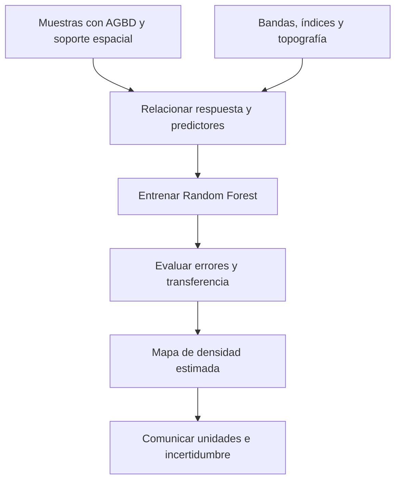

# Biomasa aérea sobre el suelo (AGBD)

## Masa vegetal y densidad no son lo mismo

**AGBD (Aboveground Biomass Density)** es la densidad de biomasa vegetal por encima del suelo: masa por unidad de superficie. La biomasa aérea total se suele abreviar AGB; añadir la D enfatiza que se expresa como densidad. En bosques se relaciona con estructura del dosel, altura, densidad de madera, edad, composición y conservación. Se vincula con carbono, pero biomasa y carbono no son cantidades idénticas: una conversión requiere supuestos explícitos. [Créditos académicos de Saatchi et al., Baccini et al. y Duncanson et al., conservados al final.]

Conceptualmente, si $M$ es biomasa aérea y $A$ el área representada:

$$AGBD=\frac{M}{A}.$$

Una unidad frecuente es Mg/ha, pero **las unidades del campo `AGBD` deben confirmarse en los metadatos del insumo**. No inferirlas únicamente del nombre ni presentar una celda predicha como masa total. Para convertir densidad en masa se necesita el área y la coherencia de unidades.

## El objetivo del ejercicio Coiba

En el material de `Datos_Coiba.gdb`, `AGBD` es la variable objetivo. Se busca relacionarla con bandas Landsat, [[Índices de teledetección]], DEM, pendiente y aspecto. Son señales distintas: los puntos aportan respuesta conocida; los rasters, condiciones para predecir.

La medición y el píxel pueden representar superficies diferentes. Alinear coordenadas no resuelve por sí solo esa diferencia de soporte.

![[99 - Recursos/grafica-biomasa-coiba-indices-modelo.svg]]

**Lectura:** seguir los insumos ópticos, índices, topografía y observaciones hacia el modelo y la salida. **Conclusión:** el mapa estima densidad a partir de relaciones aprendidas; no mide directamente cada árbol. **Límite:** el recurso no demuestra licencia, inspección de datos, precisión ni ejecución actual. Fuente: recurso docente del caso Coiba; modelo con rasters en Esri 3.6, «How…».

![[99 - Recursos/grafica-random-forest-biomasa-raster.svg]]

**Lectura:** muestras, predictores y bosque preceden a una salida de biomasa estimada. El degradado verde no tiene unidades ni escala cartográfica. **Conclusión:** modelar AGBD no equivale a medir masa total. **Límite:** el gráfico no acredita una superficie ejecutada; representar el dominio de entrenamiento es necesario, pero no garantiza exactitud. Fuente: gráfico didáctico original GeoIA; Esri 3.6, predicción raster, citado al final.

## Por qué el verdor no basta

[[NDVI]] y [[EVI]] describen señales ópticas de vegetación que pueden correlacionarse con biomasa. Dos doseles igualmente verdes pueden diferir en altura, edad, densidad de madera y composición. La estructura vertical no se mide directamente con esos índices y la saturación limita su sensibilidad en bosques densos.

La bibliografía de biomasa tropical combina parcelas, LiDAR/GEDI, óptico, radar, clima, topografía y modelos estadísticos. Esta complementariedad es una línea de mejora, no una autorización para incorporar datos nuevos ni una garantía de exactitud.

| Referencia conservada | Aporte docente | Pregunta para Coiba |
|---|---|---|
| Saatchi et al. (2011) | Cartografía pantropical con parcelas, LiDAR GLAS y sensores remotos | ¿Qué soporte de calibración y estructura representa la muestra? |
| Baccini et al. (2012) | Densidad de carbono tropical con información multifuente | ¿Qué escala e incertidumbre se comunican? |
| Powell et al. (2010) | Series Landsat e inventario para dinámica de biomasa | ¿Qué limita trabajar con una sola fecha? |
| Lu et al. (2016) | Referencia conservada sobre Landsat/LiDAR e incertidumbre | ¿Qué información estructural y evaluación adicional harían falta? |
| Duncanson et al. (2022) | Modelos AGBD para la misión GEDI | ¿Qué estructura vertical no capturan los índices ópticos? |

Estas atribuciones corresponden a la bibliografía docente conservada; no se afirma nueva lectura de los artículos en esta edición.

## Qué permite el ejercicio y qué no

Los puntos con `AGBD`, bandas e índices ópticos y topografía permiten plantear una práctica exploratoria de [[Random Forest]], revisar [[Importancia de variables]] y residuales. El alcance no equivale a un producto operativo final.

Se requiere [[Validación de modelos supervisados]] acorde con el territorio, revisión de incertidumbre, fechas, unidades, representatividad y combinaciones de predictores nuevas. Los errores de medición, soporte espacial y desajuste temporal se propagan al modelo. Un mapa suave o visualmente coherente no demuestra ausencia de esos errores. [[Rasters explicativos]] desarrolla la preparación de entradas sin modificar originales.

## Referencias y contexto

- Esri. *How Forest-based and Boosted Classification and Regression works*. ArcGIS Pro 3.6, entrenamiento y predicción raster. https://pro.arcgis.com/en/pro-app/3.6/tool-reference/spatial-statistics/how-forest-works.htm. Consulta documentada: 2026-09-21.
- Saatchi et al. (2011). *Benchmark map of forest carbon stocks in tropical regions across three continents*. https://pmc.ncbi.nlm.nih.gov/articles/PMC3116381/.
- Baccini et al. (2012). *Estimated carbon dioxide emissions from tropical deforestation improved by carbon-density maps*. https://www.nature.com/articles/nclimate1354.
- Powell et al. (2010). *Quantification of live aboveground forest biomass dynamics with Landsat time-series and field inventory data*. https://doi.org/10.1016/j.rse.2010.01.018.
- Lu et al. (2016). Referencia conservada como *Aboveground forest biomass estimation with Landsat and LiDAR data and uncertainty analysis*. https://www.mdpi.com/2071-1050/8/2/159.
- Duncanson et al. (2022). *Aboveground biomass density models for NASA’s GEDI lidar mission*. https://www.sciencedirect.com/science/article/pii/S0034425721005654. Los créditos académicos se conservan sin nueva consulta; la referencia Esri respalda el método de modelamiento, no la calibración ecológica de Coiba.

Aplicación: [[2026-09-21 - Clase 04 - Aprendizaje supervisado y Random Forest geoespacial|Clase 04]]. Descripción del ejercicio docente; esta nota no acredita inspección ni ejecución nueva de la GDB.
