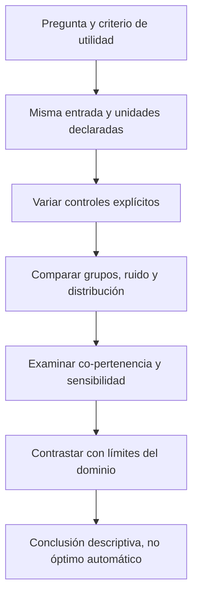

# Comparación de métodos de clustering

**Idea central:** comparar significa preguntar qué estructura expresa cada resultado y para qué sirve; no elegir automáticamente el método con más grupos, menos ruido o menor tiempo.

## Problema e importancia

La misma entrada puede producir particiones muy diferentes porque cambian representación, definición de grupo, parámetros y extracción. Necesitamos distinguir esas causas antes de atribuir superioridad. En Bomberos, un conjunto dominante con poco ruido puede ser estable pero demasiado amplio para una decisión local; una partición más fina tampoco demuestra utilidad sin criterio externo.

Fuente: V13, José Gómez Romero, 2026-06-23, 00:40:48–01:06:59, P01 01:08:11–01:39:38 y P02 01:45:44–02:01:02; [[99 - Recursos/Clase 01 - Fuentes y acuerdos|V13, P6/P7 y referencias]]. K-means es contraste de la nota fuente, no ejecución demostrada en video.

### Analogía y límite

Un mapa de barrios y otro de conexiones de transporte organizan la ciudad según criterios distintos. No basta contar regiones para elegir cuál es «mejor»: hay que saber qué pregunta responde. El límite es que nuestros clusters no son barrios oficiales ni redes operativas; son grupos de observaciones bajo un modelo.

## Definiciones que conviene comparar

| Método | Idea de grupo | Elecciones principales | Qué se conserva en Clase 01 |
| --- | --- | --- | --- |
| K-means | Partición alrededor de centroides que reduce distancias cuadráticas internas | k y representación/escala | Contraste conceptual de la nota, sin ejecución |
| DBSCAN | Conexiones entre núcleos y sus fronteras; ruido permitido | Vecindad ε y mínimo de densidad | P01/P02 ejecutadas |
| HDBSCAN | Grupos planos seleccionados de jerarquía condensada por estabilidad | Tamaño mínimo, densidad y extracción según implementación | P01/P02 ejecutadas |
| OPTICS | Estructura en orden y alcanzabilidad, seguida de extracción | Densidad, búsqueda máxima y criterio de extracción | P02 ejecutada: 29 grupos y 17 561 ruidos en `ejecucion_20260915T220908_d62e311d` |

En K-means, el centroide representa el promedio de posiciones en el espacio de atributos; la inercia suma distancias cuadráticas de observaciones a su centroide asignado. Formalmente, J=Σᵢ‖xᵢ−μcᵢ‖². Este criterio favorece compacidad alrededor de representantes, no conectividad arbitraria como DBSCAN. Elegir k determina cuántos grupos/centroides se solicitan; no implica que k se descubra automáticamente.

[scikit-learn 1.6, KMeans, n_clusters](https://scikit-learn.org/1.6/modules/generated/sklearn.cluster.KMeans.html), consulta 2026-09-15 (E14); contraste de la nota fuente registrado, sin afirmar una demostración de video. Los criterios de densidad se respaldan en E1–E5 y E9.

## Unidades, muestra e implementación primero

Una comparación defendible mantiene la entrada y declara qué cambia. P01 usa distancias de atributos estandarizados; P02 usa metros proyectados. ε=0.3 y 350 m no son dos valores de una misma escala. HDBSCAN sklearn 5/5/0 no se equipara a HDBSCAN Esri 100 mediante una conversión simple.

No mezclar tiempo de llamada, tiempo de kernel y agenda docente. Esri orienta sobre rapidez de métodos en Pro; sklearn documenta costes de su propia implementación. [Esri Pro 3.6, Density-based Clustering, Usage](https://pro.arcgis.com/en/pro-app/3.6/tool-reference/spatial-statistics/densitybasedclustering.htm), [DBSCAN sklearn 1.6, Notes](https://scikit-learn.org/1.6/modules/generated/sklearn.cluster.DBSCAN.html) y [OPTICS sklearn 1.6, Notes](https://scikit-learn.org/1.6/modules/generated/sklearn.cluster.OPTICS.html), consulta 2026-09-15 (E1/E3/E9).

**Lectura:** la comparación empieza con la pregunta, no con un ranking de algoritmos. Las medidas se interpretan juntas y no sustituyen mapas o inspección de atributos.

## P01: doce variantes, una práctica

Se mantienen seis combinaciones DBSCAN y seis HDBSCAN sobre la misma realización escalada. Los controles de muestra y perturbación son otra familia de comparación dentro de P01, no prácticas independientes.

![[99 - Recursos/salidas_clase_01/practica_01/ejecucion_20260915T164803_70b07f40/arcgis_sensibilidad_clusters.png]]
![[99 - Recursos/salidas_clase_01/practica_01/ejecucion_20260915T164803_70b07f40/arcgis_sensibilidad_ruido.png]]
**Gráficos ArcGIS observados:** categorías DB1–DB6/HD1–HD6 en horizontal, grupos sin ruido o cantidad de no asignados en vertical. Leer ambas barras por variante evita llamar mejora a una fragmentación o a una fusión excesiva. Son recuentos del experimento sintético, no métricas de exactitud ni tasas de incidentes. Fuente: notebook P01 e [[99 - Recursos/Clase 01 - Resultados de prácticas]].

![[99 - Recursos/salidas_clase_01/practica_01/ejecucion_20260915T164803_70b07f40/matplotlib_sensibilidad_hdbscan.png]]
**Paneles ejecutados:** seis extracciones HDBSCAN; los títulos identifican ternas y recuentos. HD1→HD2→HD3 modifica tamaño, HD1→HD4 mínimo de densidad, HD2→HD6 ε de selección. Leer formas además de barras permite ver qué concentración se conserva. Son etiquetas planas, no la jerarquía ni mapas geográficos.

La base DBSCAN produce 5 grupos y 58 ruidos; HDBSCAN, 8 y 108. Esto no permite decir «HDBSCAN encontró más grupos reales»: las lunas tienen etiquetas del generador, pero una perturbación intensa modifica la estructura visible. El objetivo de esta práctica es sensibilidad, no optimización de un clasificador.

Cambiar `noise` con N=200 (0/0.2/0.8/0.9999) separa el efecto de perturbación; cambiar N=200/500/1000 con `noise=0.9999` estudia tamaño y realización. Se preservan ambos métodos por caso: 14 resultados controlados. [scikit-learn 1.6, make_moons, parámetros](https://scikit-learn.org/1.6/modules/generated/sklearn.datasets.make_moons.html), consulta 2026-09-15 (E13).

## P02: ejemplo real y comparación por co-pertenencia

**Ejecución vigente:** `ejecucion_20260915T220908_d62e311d` completa el Ejercicio 5A: DBSCAN 20 grupos/13 384 ruidos, HDBSCAN 3/1 187 y OPTICS 29/17 561 sobre 90 443 filas. OPTICS usa mínimo 100, búsqueda de 350 m y sensibilidad automática; el kernel completo duró 355.40 s. Véanse mapas, barras y perfil actuales en [[01 - Clases/2026-09-14 - Clase 01 - Clustering espacial]] y [[99 - Recursos/Clase 01 - Resultados de prácticas]].

**Comparación histórica preservada:** la tabla, tiempos y dos barras siguientes corresponden a la ejecución anterior `ejecucion_20260915T171532_430b1cca`, no a la ampliación vigente de P02.

| Medida observada | DBSCAN 350 m/100 | HDBSCAN 100 |
| --- | ---: | ---: |
| Filas conservadas | 90 443 | 90 443 |
| Grupos sin ruido | 20 | 3 |
| Ruido | 13 384 | 1 187 |
| Mayor grupo | 67 478 | 88 919 |
| Tiempo de llamada | 7.98 s | 64.82 s |

**Atribución:** notebook P02, ejecución `ejecucion_20260915T171532_430b1cca`, ArcGIS Pro 3.6.2, registros Bomberos 2022–2024. No son tasas de desempeño del servicio ni tiempos medidos nuevamente. El tiempo de kernel completo fue 113.29 s, no la suma exclusiva de dos modelos.

![[99 - Recursos/salidas_clase_01/practica_02/ejecucion_20260915T171532_430b1cca/arcgis_poblacion_dbscan.png]]
![[99 - Recursos/salidas_clase_01/practica_02/ejecucion_20260915T171532_430b1cca/arcgis_poblacion_hdbscan.png]]
**Barras ArcGIS:** cantidad de registros por categoría nominal, incluido ruido. El predominio del grupo mayor explica por qué pocos grupos pueden resumir casi todo. Las escalas y rótulos deben leerse en cada gráfico; grupos pequeños no están vacíos. No comparar grupo 1 por nombre como si los dos algoritmos hubieran definido idéntica entidad.

Para comparar sin depender de etiquetas, se consideran pares de observaciones asignadas al mismo grupo. Sean A y B los conjuntos de pares co-pertenecientes en cada método: **J(A,B)=|A∩B|/|A∪B|**. Cambiar los números de grupo no cambia el conjunto de pares. En la implementación usada, el ruido no se convierte en un único gran cluster para este cálculo.

P02 enlazó 90 443 filas mediante SOURCE_ID/OID de copia. Registró 2 283 290 879 pares DBSCAN y 3 953 278 551 HDBSCAN, con 2 283 290 879 compartidos; Jaccard=**0.57757**. Es comparación descriptiva de co-pertenencia, condicionada por grupos muy grandes; no mide correspondencia con una verdad externa ni calidad del despacho. Evidencia de la implementación y resultado en [[99 - Recursos/Clase 01 - Resultados de prácticas]].

## Supuestos y límites de evaluación

- La entrada común protege comparabilidad, pero no asegura representatividad territorial ni calidad semántica.
- Los 60 711 números de incidente nulos impiden utilizarlos como enlace fiable; posiciones repetidas no prueban duplicados de eventos.
- Menos ruido significa mayor asignación bajo el método, no menos datos erróneos.
- Estabilidad al variar parámetros no demuestra optimalidad; solo identifica persistencia dentro de lo explorado.
- PROB alto no es una prueba de significancia ni criterio suficiente de elección.
- Los registros acumulados no forman automáticamente un proceso espacio-temporal.

En los mapas históricos P02, las jurisdicciones eran contexto no validado con una auto-intersección. La ejecución vigente consume una copia preparada fuera del notebook y comprobada sin errores geométricos; Identity relacionó 20 centros con 20 filas, sin ausencias, multiplicidad ni proximidad a frontera dentro de 0.001 m. COUNT suma 77 059 puntos asignados por cluster, no incidentes asignados por jurisdicción. Esta comprobación geométrica no certifica límites legales ni permite resolver localización de estaciones; el original permanece intacto.

## Relaciones y cierre

[[02 - Conceptos/DBSCAN]] explica por qué la extensión de un grupo supera ε. [[02 - Conceptos/HDBSCAN y OPTICS]] distingue estabilidad jerárquica de extracción y ordenamiento. [[02 - Conceptos/Agrupación espacial]] impide trasladar conclusiones de atributos a territorio sin unidades y contexto. [[03 - Herramientas/ArcGIS Pro - Density-based Clustering]] y [[03 - Herramientas/scikit-learn - Clustering por densidad]] delimitan versiones.

**Pregunta de salida:** ¿qué medida permitiría decidir dónde ubicar una estación? Ninguna de las anteriores por sí sola: hace falta una pregunta operativa y datos de capacidad, vías y respuesta. [[05 - Preguntas/Preguntas abiertas]] conserva esa cuestión; [[01 - Clases/2026-09-14 - Clase 01 - Clustering espacial]] integra la lectura de todos los paneles sin nueva ejecución. Referencias reutilizadas del registro, consulta original 2026-09-15; renderizado Mermaid comprobado en Chrome aislado con Mermaid 11.13.0; disposición nativa de Obsidian no comprobada.
