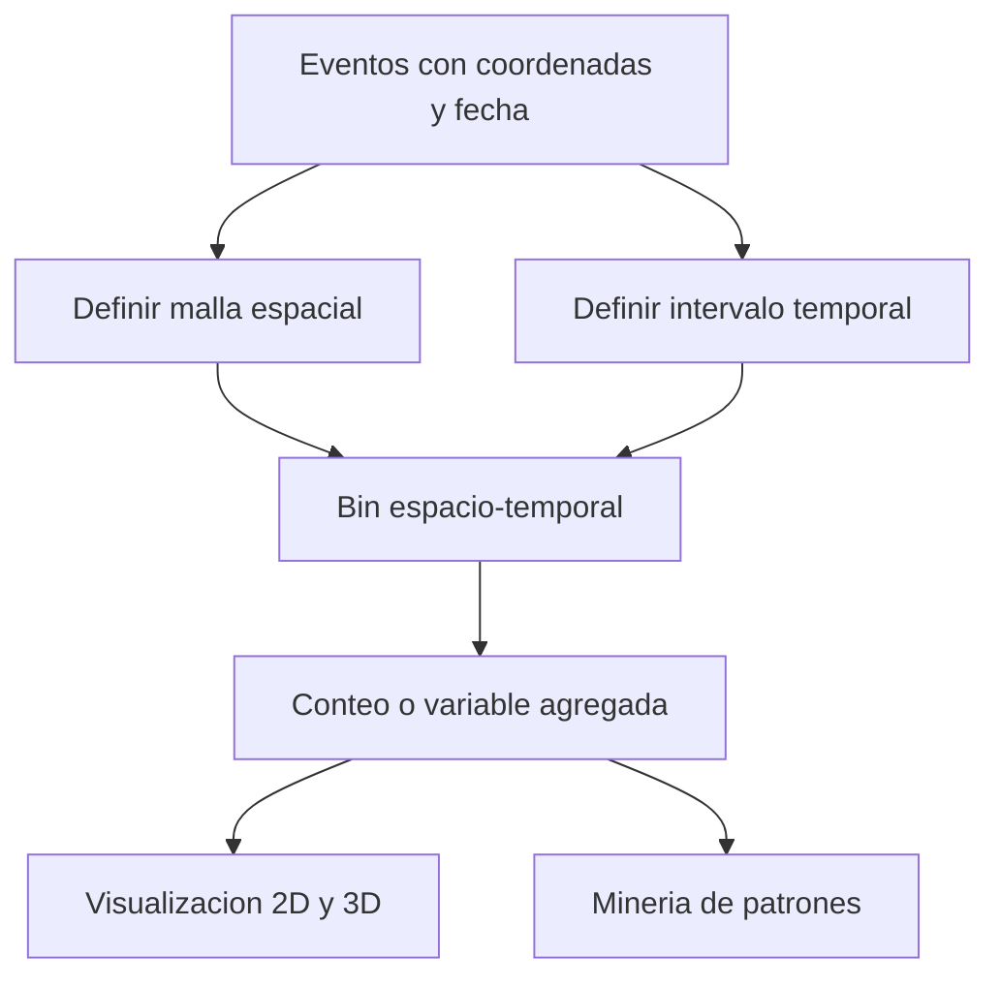

# Cubo espacio-temporal

Un cubo espacio-temporal es una estructura de análisis que agrega eventos o valores en dos dimensiones simultáneas: **ubicación y tiempo**. En ArcGIS Pro se materializa como un archivo [[NetCDF]]: cada celda o *bin* corresponde a una unidad espacial durante un intervalo temporal. Permite pasar de «¿dónde ocurre?» a «¿dónde ocurre, cuándo ocurre y cómo cambia?» [E1, Summary y Usage](#referencias).

En la [[../01 - Clases/2026-09-16 - Clase 03 - Cubos espacio-temporales y patrones emergentes|Clase 03]] estudiamos siniestros viales de Bogotá por hexágonos y pasos de seis meses, conservando el caso de la Clase 15 fuente.

## Una pila de mapas, no un edificio

Imagine mapas de la misma ciudad apilados por fecha. Una columna reúne la historia de una ubicación; un piso permite comparar muchas ubicaciones en un mismo periodo. La analogía ayuda a orientarse, pero su límite es importante: **la altura representa tiempo, no número de siniestros ni elevación del terreno**.

![[../99 - Recursos/grafica-cubo-espacio-temporal.svg]]

**Lectura:** de izquierda a derecha, ubicaciones y periodos definen las unidades en las que se resume una variable. Las cajas no son medidas ni escalas numéricas. **Conclusión:** el patrón depende de cómo construimos el bin. **Límite:** este esquema no muestra geometría real ni resultados. Gráfica conceptual migrada del vault fuente, basada en la Clase 15 y E1.

## Componentes y decisiones

| Componente | Función | Decisión analítica |
| --- | --- | --- |
| Ubicación | Identifica la misma unidad a través del tiempo. | Malla regular o ubicaciones definidas pertinentes. |
| Unidad espacial | Recibe los eventos. | Tamaño, forma, alineación y extensión. |
| Intervalo temporal | Define cada piso. | Días, meses, semestres u otro intervalo defendible. |
| Variable | Resume lo ocurrido. | COUNT cuenta puntos; otros campos admiten estadísticas de resumen. |
| NetCDF | Conserva dimensiones, variables y atributos. | Almacenamiento para visualización y análisis posteriores. |

La escala define lo que podemos ver. Bins muy pequeños pueden fragmentar la señal y producir muchos ceros; bins muy grandes pueden ocultar variación local. Intervalos cortos permiten ver cambios rápidos, pero exigen datos suficientemente completos. Intervalos largos pueden borrar cambios relevantes. La [[Teselación espacial]] explica la decisión espacial; [[Ingeniería de datos geoespaciales]] ayuda a evaluar si fechas, coordenadas y cobertura sostienen la comparación.

En **Create Space Time Cube By Aggregating Points**, `distance_interval` es la altura del hexágono, no su lado ni la distancia del análisis Gi*. Con altura de 500 m, el ancho es $2(500)/\sqrt{3}$ m. La resolución del cubo y su vecindad analítica son decisiones distintas [E1, Usage: Distance Interval](#referencias).

## El cubo histórico de siniestros

El [reporte histórico](../99%20-%20Recursos/salidas_clase_03/evidencia_historica_clase_15/describe_cubo_espacio_temporal_accidentes.txt) conserva: eventos entre 2015-01-01 y 2021-09-10, 14 pasos de seis meses alineados al final y 132.468 bins. Son resultados del vault fuente, **no una ejecución de Clase 03**.

El primer intervalo va de después de 2014-09-10 a 2015-03-10 inclusive; presenta 62,43 % de sesgo temporal reportado porque la cobertura de eventos comienza después del inicio del bin. Las etiquetas del NetCDF no son las fechas mínima y máxima de los eventos. Este detalle importa: una aparente caída inicial podría ser un efecto de cobertura, no una mejora vial [E1, Usage: temporal bias](#referencias).

## Interpretar antes de decidir

El cubo transforma puntos individuales en unidades comparables, pero pierde detalle. Un cero de COUNT significa ningún punto contabilizado en ese bin; no demuestra que allí no hubiera exposición ni que todos los eventos fueran reportados. Ver una columna llamativa sirve para formular preguntas, no para declarar significancia.

Una zona puede mantener alta ocurrencia, cambiar después de una intervención o alternar periodos. Para estudiar la concentración relativa y su historia se utiliza [[Emerging Hot Spot Analysis]]; para una comparación espacial acumulada se utiliza [[Optimized Hot Spot Analysis]]. Ninguna comparación antes/después demuestra por sí sola que una intervención causó el cambio.

## Referencias

- **E1. Esri.** *Create Space Time Cube By Aggregating Points*. ArcGIS Pro **3.6**, secciones Summary, Usage y Parameters; lectura 2026-09-17. <https://pro.arcgis.com/en/pro-app/3.6/tool-reference/space-time-pattern-mining/create-space-time-cube.htm>.

## Procedencia y estado

BORRADOR migrado de `../diplomado_geoia/02 - Conceptos/Cubo espacio-temporal.md` y de la Clase 15, 2026-06-25, docente fuente José Sebastián Gómez Romero. Se conserva el relato de capas, escalas y siniestros; se precisan altura hexagonal y sesgo temporal con E1. Evidencia histórica enlazada, sin ejecución nueva. La cobertura directa parcial del video se registra en la nota de Clase 03.
