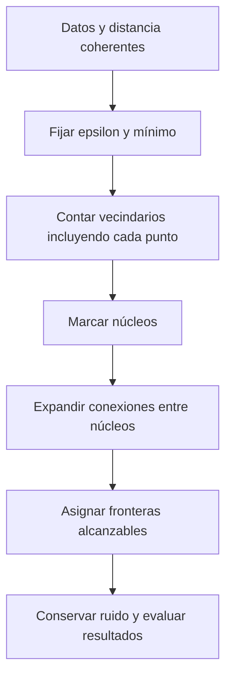

# DBSCAN

**Idea central:** DBSCAN conecta regiones densas a partir de vecindarios locales y permite observaciones no asignadas. Su distancia ε no es el diámetro ni el radio del grupo completo.

## Qué resuelve y por qué importa

Una agrupación por centroides puede describir mal formas alargadas o curvadas. DBSCAN permite grupos de formas no necesariamente convexas y separa ruido sin pedir directamente k. No evita elegir una escala: ε y el mínimo de vecinos determinan qué se entiende por densidad.

**Origen real atribuible:** Ester, Kriegel, Sander y Xu (1996) propusieron DBSCAN para bases espaciales; el resumen menciona datos sintéticos y datos reales SEQUOIA 2000. No se atribuyen aquí métricas no leídas. [A Density-Based Algorithm for Discovering Clusters in Large Spatial Databases with Noise, AAAI, resumen](https://aaai.org/papers/kdd96-037-a-density-based-algorithm-for-discovering-clusters-in-large-spatial-databases-with-noise/), consulta 2026-09-15 (E10).

### Analogía limitada

Imagine reuniones cercanas con suficientes asistentes. Una reunión puede conectar con otra por sus núcleos próximos, formando una cadena larga. Una persona en el borde puede pertenecer aunque no tenga suficientes vecinos propios. La analogía no implica relaciones sociales reales ni que cada vínculo conecte por vías transitables; es una regla geométrica sobre los datos representados.

## Definición precisa

Para un conjunto D y distancia d:

**Nε(p) = {q ∈ D : d(p,q) ≤ ε}.**

- **Núcleo:** |Nε(p)| ≥ m, donde m es MinPts o `min_samples`; p cuenta en su propia vecindad.
- **Frontera:** no es núcleo, pero puede asignarse por estar dentro del vecindario de un núcleo.
- **Ruido:** no queda asignado como núcleo ni frontera; suele representarse con etiqueta −1.

La alcanzabilidad directa desde un núcleo depende de su vecindad. Una cadena de núcleos conecta regiones; un punto frontera no constituye por sí solo un nuevo núcleo de expansión. Esta asimetría evita interpretar cualquier cadena de puntos poco densos como un grupo DBSCAN.

Precisión P1 aprobada, V13 00:58:46–01:01:15 y 01:54:25–01:55:52. [Esri Pro 3.6, How Density-based Clustering works, Search Distance/How methods work](https://pro.arcgis.com/en/pro-app/3.6/tool-reference/spatial-statistics/how-density-based-clustering-works.htm) y [scikit-learn 1.6, DBSCAN, eps/min_samples](https://scikit-learn.org/1.6/modules/generated/sklearn.cluster.DBSCAN.html), consulta 2026-09-15 (E2–E3).

![[99 - Recursos/clase-01-grafica-dbscan-vecindad.svg]]
**Lectura:** círculo = un vecindario de radio ε; nodos verdes enlazados = núcleos; naranja = frontera; cruz = ruido. Los vecinos suficientes de cada núcleo se suponen, no están todos dibujados: no contar símbolos para calcular MinPts. La cadena completa supera ε. Ejes conceptuales sin unidades; elaboración propia no observacional basada en E2–E3.

## Pasos del método

**Interpretación:** contar vecinos es local; expandir conecta locales. El resultado puede tener pocos o muchos grupos, y algunos puntos pueden quedar fuera. La inspección final no autoriza borrar esos registros.

## Parámetros: qué cambia al moverlos

| Control | Significado | Comparación útil |
| --- | --- | --- |
| ε / `search_distance` | Distancia máxima de vecindad directa | Mantener mínimo y aumentar ε para observar conexiones y fusiones |
| MinPts / `min_samples` | Observaciones necesarias para un núcleo, incluido él mismo | Mantener ε y aumentar mínimo para exigir mayor densidad |
| Distancia y escala de atributos | Geometría de la similitud | No comparar 0.3 estandarizado con 350 metros como iguales |

Aumentar ε no garantiza aumentar el número de grupos: puede conectar y fusionar conjuntos. Elevar el mínimo puede reducir núcleos y dejar más observaciones sin asignar. La respuesta debe leerse sobre la misma muestra; variar simultáneamente N, escala y parámetros mezcla explicaciones.

En scikit-learn se obtienen `labels_` y `core_sample_indices_`; la máscara de frontera se deriva de asignados que no están entre núcleos. En Esri se obtiene una clase de puntos con `CLUSTER_ID` y `COLOR_ID`; los colores pueden reutilizarse y no son identificadores universales. Fuentes E1–E3, consulta 2026-09-15.

## Ejemplo sintético ejecutado: tipos de punto

![[99 - Recursos/salidas_clase_01/practica_01/ejecucion_20260915T164803_70b07f40/matplotlib_base.png]]
**P01 observada:** DBSCAN ε=0.3, mínimo=5, 200 lunas perturbadas y estandarizadas: 5 grupos, 58 ruidos, 108 núcleos y 34 fronteras. En el panel DBSCAN el tamaño distingue roles; negro indica ruido. El panel HDBSCAN muestra otra extracción, no los mismos grupos con otros colores. Complemento Matplotlib, sin CRS ni mapa ficticio. [[99 - Recursos/Clase 01 - Resultados de prácticas|Evidencia P01]].

Que el generador añada ruido gaussiano 0.9999 no implica que exactamente esa proporción termine etiquetada −1. El primer ruido es una perturbación de entrada; el segundo es resultado del criterio de densidad. [scikit-learn 1.6, make_moons, noise](https://scikit-learn.org/1.6/modules/generated/sklearn.datasets.make_moons.html), consulta 2026-09-15 (E13).

![[99 - Recursos/salidas_clase_01/practica_01/ejecucion_20260915T164803_70b07f40/matplotlib_sensibilidad_dbscan.png]]
**Sensibilidad ejecutada:** seis paneles, ejes compartidos de atributos estandarizados. Comparar ε=0.10/0.20/0.30 con mínimo 5 separa el efecto de distancia; ε=0.30 con mínimos 5/10 separa densidad mínima. Los títulos informan grupos y ruidos reales de cada variante. Los paneles ε=0.45 y mínimos 5/10 completan la secuencia; no se omiten por parecer redundantes.

## Ejemplo real local: Bomberos

P02 usa los 90 443 puntos de 2022–2024, proyectados en WKID 9377 y metros, sobre copia verificada. Con DBSCAN 350 m/100 se obtuvieron **20 grupos y 13 384 ruidos (14.80%)**; el mayor grupo contiene 67 478 filas. Es la condición histórica reproducida, no una búsqueda de óptimo. [[99 - Recursos/Clase 01 - Resultados de prácticas|Evidencia ejecutada P02]].

![[99 - Recursos/salidas_clase_01/practica_02/ejecucion_20260915T171532_430b1cca/arcgis_mapa_dbscan.png]]
**Mapa ArcGIS observado:** la continuidad de un grupo grande no contradice ε=350 m; la regla limita enlaces locales. No interpretar colores como prioridad operativa. Jurisdicciones exclusivamente contextuales, una auto-intersección, sin reparación, límites certificados ni estadísticas poligonales. Rótulo contextual parcialmente truncado en leyenda; el pie completo conserva la advertencia.

![[99 - Recursos/salidas_clase_01/practica_02/ejecucion_20260915T171532_430b1cca/arcgis_poblacion_dbscan.png]]
**Barras ArcGIS:** eje categórico nominal y recuentos; el grupo dominante reduce la visibilidad relativa de otros. Barras pequeñas no son vacías. Incluir ruido permite no ocultar 13 384 registros de la comparación; no son incidentes descartables por definición.

## Supuestos, evaluación y límites

- La distancia debe representar una proximidad relevante. Metros euclidianos no prueban tiempos viales.
- Una única escala de densidad puede resultar restrictiva con densidades variables; comparar con [[02 - Conceptos/HDBSCAN y OPTICS]] no elimina la necesidad de interpretación.
- Coincidencias XY pueden aumentar conteos locales, pero no prueban eventos duplicados; no deduplicar automáticamente.
- Recuentos y cambios de parámetros describen sensibilidad, no certifican clusters «verdaderos».
- La numeración es nominal: comparar co-pertenencia de registros, no igualdad de números o colores entre métodos.

**Rendimiento P6:** 7.98 s en la llamada P02 es una medición local. Esri orienta sobre velocidad en Pro; scikit-learn documenta peor caso de memoria O(n²) para su implementación. No universalizar un ranking DBSCAN/HDBSCAN/OPTICS entre paquetes. [DBSCAN sklearn 1.6, Notes](https://scikit-learn.org/1.6/modules/generated/sklearn.cluster.DBSCAN.html) y [Esri Pro 3.6, Density-based Clustering, Usage](https://pro.arcgis.com/en/pro-app/3.6/tool-reference/spatial-statistics/densitybasedclustering.htm), consulta 2026-09-15.

## Relaciones y pregunta de comprobación

[[02 - Conceptos/Agrupación espacial]] justifica unidades y límites territoriales. [[02 - Conceptos/Comparación de métodos de clustering]] separa cantidad de grupos, ruido y utilidad. [[03 - Herramientas/scikit-learn - Clustering por densidad]] y [[03 - Herramientas/ArcGIS Pro - Density-based Clustering]] muestran implementaciones sin equiparar sus parámetros.

**Compruebe:** ¿por qué 34 fronteras P01 pertenecen sin cumplir el mínimo por sí solas? Porque son alcanzables desde núcleos; pertenecer no equivale a ser núcleo. Desarrollo y notebooks en [[01 - Clases/2026-09-14 - Clase 01 - Clustering espacial]]. Fuentes E1–E3/E10/E13 reutilizadas de [[99 - Recursos/Clase 01 - Fuentes y acuerdos]]; Mermaid/SVG pendientes de revisión visual final.
