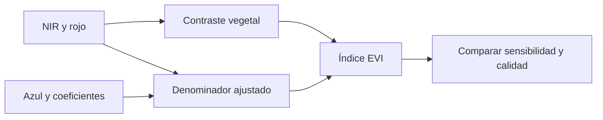

# EVI

![[99 - Recursos/grafica-indice-evi.svg]]

**Lectura:** la tarjeta conecta el contraste NIR-rojo con azul y coeficientes de corrección; no es una medición ni una escala de biomasa. **Conclusión:** la banda azul y la escala radiométrica forman parte del método. **Límite:** menor saturación no significa ausencia de saturación ni corrección automática de nubes. Fuente: gráfico didáctico original GeoIA; Esri 3.6, «Band Arithmetic», EVI, citado al final.

## Diferenciar vegetación cuando el contraste simple pierde sensibilidad

El **Enhanced Vegetation Index** busca mejorar la sensibilidad en vegetación densa y reducir parte de las influencias atmosféricas y del fondo del dosel. A diferencia de [[NDVI]], añade la banda azul y coeficientes de ajuste. No sustituye corrección atmosférica, enmascarado de nubes ni validación. [Esri, *Band Arithmetic*, ArcGIS Pro 3.6, EVI; crédito fundacional: Huete et al., 2002.]

$$EVI=G\frac{NIR-Red}{NIR+C_1Red-C_2Blue+L}.$$

La formulación común usa $G=2.5$, $C_1=6$, $C_2=7.5$ y $L=1$:

$$EVI=2.5\frac{NIR-Red}{NIR+6Red-7.5Blue+1}.$$

$G$ es ganancia; $C_1$ y $C_2$ ponderan el ajuste atmosférico basado en rojo y azul; $L$ ajusta el fondo. Las constantes requieren reflectancias en la escala apropiada: introducir enteros escalados sin aplicar la transformación del producto cambia el significado de la fórmula. En Landsat 8/9, la correspondencia usual es B5 (NIR), B4 (rojo), B2 (azul), conservada de la referencia USGS; verificar el orden del raster utilizado.

Los términos adicionales pueden aportar información, pero también propagan errores de la banda azul.

## Ejemplo manual hipotético

Con Blue = 0.05, Red = 0.06 y NIR = 0.52:

$$EVI=\frac{2.5(0.52-0.06)}{0.52+6(0.06)-7.5(0.05)+1}=\frac{1.15}{1.505}\approx0.764.$$

El valor describe contraste vegetal bajo esta parametrización, no 76.4 % de cobertura ni una cantidad de biomasa. No deben imponerse automáticamente a EVI los rangos de NDVI; el denominador y la calidad radiométrica pueden producir valores anómalos.

![[99 - Recursos/grafica-indices-teledeteccion-formulas.svg]]

**Lectura:** localizar EVI y comparar su banda azul, ganancia y constante con NDVI. **Conclusión:** la mayor complejidad introduce correcciones específicas, no una superioridad universal. **Límite:** la comparación de fórmulas no demuestra mejor desempeño en cada imagen o bosque. Fuente: recurso docente de índices; Esri 3.6, «Band Arithmetic», EVI.

## Aplicación y límites en Coiba

EVI puede aportar señal donde NDVI pierde sensibilidad por saturación. El material docente del caso Coiba lo describe entre las variables relevantes; ese antecedente no es un ranking calculado en esta edición ni prueba de relación causal. Se debe contrastar con [[Importancia de variables]], redundancia de predictores y [[Validación de modelos supervisados]].

- Requiere azul confiable; nubes, aerosoles o corrección atmosférica deficiente pueden distorsionarlo.
- No mide [[Biomasa aérea sobre el suelo (AGBD)]] directamente ni resuelve por sí solo estructura vertical.
- El índice de dos bandas EVI2 es otra formulación, no EVI con azul simplemente eliminado; su atribución se conserva en Jiang et al. (2008).

[[Índices de teledetección]] sitúa EVI junto a otros contrastes espectrales; [[Rasters explicativos]] explica cómo incorporarlo al modelo.

## Referencias y contexto

- Esri. *Band Arithmetic function*. ArcGIS Pro 3.6, EVI. https://pro.arcgis.com/en/pro-app/3.6/help/analysis/raster-functions/band-arithmetic-function.htm. Consulta documentada: 2026-09-21.
- Fuentes técnicas conservadas, sin nueva consulta: USGS, *Landsat Enhanced Vegetation Index*, https://www.usgs.gov/landsat-missions/landsat-enhanced-vegetation-index; NASA MODIS Land, *MOD13 User Guide V6.1*, https://modis-land.gsfc.nasa.gov/pdf/MOD13_User_Guide_V61.pdf.
- Créditos académicos conservados, sin nueva consulta: Huete et al. (2002), *Overview of the radiometric and biophysical performance of the MODIS vegetation indices*, https://doi.org/10.1016/S0034-4257(02)00096-2; Jiang et al. (2008), *Development of a two-band enhanced vegetation index without a blue band*, https://doi.org/10.1016/j.rse.2008.06.006; Zeng et al. (2022), *Optical vegetation indices for monitoring terrestrial ecosystems globally*, https://doi.org/10.1038/s43017-022-00298-5.

Aplicación: [[2026-09-21 - Clase 04 - Aprendizaje supervisado y Random Forest geoespacial|Clase 04]]. Ejemplo hipotético; sin cálculo nuevo sobre imágenes.
