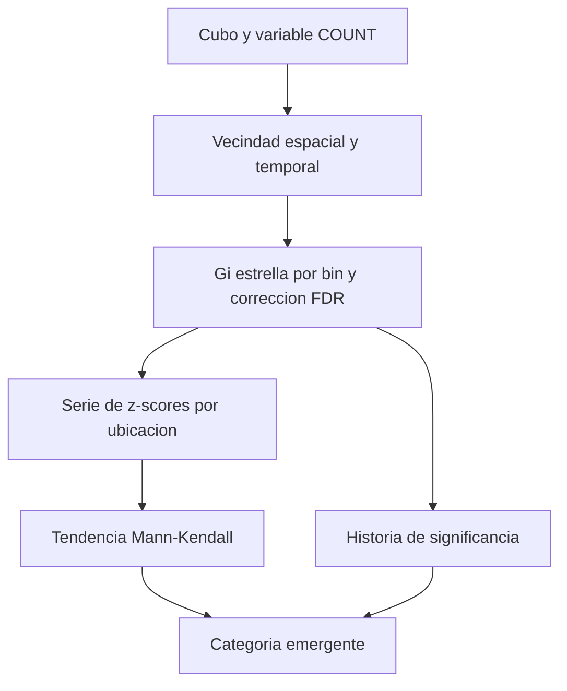

# Emerging Hot Spot Analysis

¿Una concentración es reciente o lleva años? **Emerging Hot Spot Analysis** identifica historias de puntos calientes y fríos en un [[Cubo espacio-temporal]]. No se limita a colorear dónde hay más eventos: combina la significancia local de cada bin con la evolución del agrupamiento en cada ubicación [E1, introducción](#referencias).

## Del bin a la historia de un lugar

Primero calcula [[Hot spots Getis-Ord Gi Star|Getis-Ord Gi*]] con vecinos espaciales y temporales. Cada bin recibe z-score, p-value y clasificación hot/cold con corrección FDR. Después evalúa la tendencia de esa historia mediante Mann-Kendall y combina los resultados para asignar una categoría. No confundir esta tendencia de los z-scores Gi* con una tendencia de los conteos brutos [E1](#referencias).

![[../99 - Recursos/grafica-emerging-hot-spot.svg]]

**Lectura:** la secuencia enlaza Gi* por bin, su serie temporal y la prueba de tendencia. Las cajas son etapas, no magnitudes. La etiqueta final sintetiza reglas que también consideran cuántos periodos fueron significativos y cómo terminó la serie. **Conclusión:** no basta con que aumente COUNT para ser *Intensifying Hot Spot*. **Límite:** el esquema no permite asignar categorías sin aplicar sus reglas. Gráfica conceptual migrada de Clase 15; precisión de interpretación basada en E1.

## Qué se decide antes del cálculo

| Insumo o parámetro | Qué representa | Qué puede cambiar |
| --- | --- | --- |
| Cubo y variable | Valores comparables por lugar y periodo. | La pregunta; COUNT no representa automáticamente riesgo. |
| Distancia de vecindad | Contexto espacial de comparación. | Suavizado, aislamiento y escala del patrón. |
| Pasos temporales vecinos | Cuántos periodos anteriores se incluyen. | Contexto temporal de la inferencia. |
| Máscara de análisis | Área de estudio pertinente. | Dónde se interpretan los resultados. |
| Ventana de comparación | Marco de referencia estadístico. | Contra qué contexto se juzga la concentración. |

Con `Neighborhood Time Step = 2`, se considera el periodo actual y hasta **dos anteriores**, no dos futuros ni dos periodos en total. En el ejemplo de la documentación, con bins diarios son tres días; en el caso histórico semestral son hasta tres intervalos de seis meses. La distancia de vecindad no cambia el tamaño de los bins [E1, Neighborhood defaults](#referencias).

## Leer las categorías con precisión

La tabla resume las categorías calientes; las frías usan la lógica equivalente para concentración de valores bajos. «Significativo» se refiere a Gi*, no a una impresión visual [E1, tabla Pattern name / Definition](#referencias).

| Categoría | Regla de lectura |
| --- | --- |
| New | Último periodo caliente significativo; nunca lo había sido antes. |
| Consecutive | Racha final ininterrumpida de al menos dos periodos calientes, sin periodos calientes anteriores a la racha; menos de 90 % de la serie caliente. |
| Intensifying | Al menos 90 % de periodos calientes, incluido el último, y aumento significativo de la intensidad del agrupamiento. |
| Persistent | Al menos 90 % de periodos calientes, sin tendencia discernible de intensificación o disminución del agrupamiento. |
| Diminishing | Al menos 90 % de periodos calientes, incluido el último, con disminución significativa del agrupamiento. |
| Sporadic | Último periodo caliente; apariciones intermitentes en menos de 90 % de periodos y ningún periodo frío significativo. |
| Oscillating | Último periodo caliente; existió algún periodo frío significativo y menos de 90 % de periodos fueron calientes. |
| Historical | Último periodo no caliente, pero al menos 90 % de los periodos fueron calientes. |
| No Pattern Detected | No cumple ninguna de las reglas de patrones; no equivale a «no hubo eventos». |

Por tanto, *oscilante* no significa simplemente una curva de conteos con subidas y bajadas; exige historia de significancia del signo opuesto. Tampoco *persistente* equivale a tener un conteo constante.

## Caso de siniestros: resultado histórico

En la Clase 15 fuente se analizaron 2.137 ubicaciones. La [tabla histórica de categorías](../99%20-%20Recursos/salidas_clase_03/evidencia_historica_clase_15/tabla_emerging_hotspot_categorias.csv) contiene, entre otras: 175 *Persistent Hot Spot*, 49 *Intensifying Hot Spot*, 363 *Oscillating Hot Spot*, 538 *Persistent Cold Spot* y 243 *Sporadic Cold Spot*. **No son resultados ejecutados en Clase 03.**

La discusión operativa se conserva: persistencia e intensificación pueden orientar prioridades, pero no fijarlas automáticamente. Una zona fría puede tener menor exposición o subregistro. Para asignar recursos hay que incorporar gravedad, movilidad, población expuesta, factibilidad y conocimiento territorial. La categoría no es una predicción de accidentes futuros ni evidencia causal de una intervención.

[[Optimized Hot Spot Analysis]] ofrece un contraste espacial 2D; [[Minería de patrones espacio-temporales]] explica por qué conservar la historia cambia la pregunta.

## Referencias

- **E1. Esri.** *How Emerging Hot Spot Analysis works*. ArcGIS Pro **3.6**, introducción, tabla de categorías, Tool outputs y Neighborhood defaults; consulta 2026-09-17. <https://pro.arcgis.com/en/pro-app/3.6/tool-reference/space-time-pattern-mining/learnmoreemerging.htm>.

## Procedencia y estado

BORRADOR migrado de `../diplomado_geoia/02 - Conceptos/Emerging Hot Spot Analysis.md`, Clase 15 del 2026-06-25, docente fuente José Sebastián Gómez Romero. Las definiciones abreviadas de la fuente se precisan con E1; no se altera su caso práctico. El NetCDF de entrada debe copiarse a salidas porque la herramienta lo modifica; véase [[NetCDF]]. Sin nueva ejecución. Cobertura directa del video: parcial, documentada en [[../01 - Clases/2026-09-16 - Clase 03 - Cubos espacio-temporales y patrones emergentes|Clase 03]].
