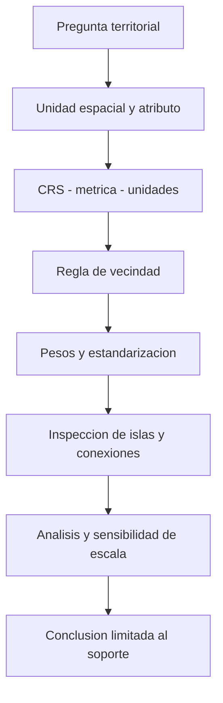

# Escala espacial, vecindad y bandas de distancia

## Tres decisiones distintas

**Escala** es el alcance espacial al que se formula e interpreta una pregunta. **Vecindad** es la regla que decide qué entidades se relacionan. **Pesos** cuantifica cuánto cuenta cada relación en el cálculo. Una banda de distancia es una forma de construir vecindad, no una frontera natural demostrada por los datos.

Estas decisiones importan porque [[02 - Conceptos/Autocorrelación espacial global (Moran's I)|Moran global]] mide asociación de atributos dadas sus relaciones. Cambiar los pesos puede cambiar el índice, su referencia y su incertidumbre. La interpretación conjunta de atributo y localización está documentada por Esri [1]; el desarrollo algebraico de pesos de esta nota es un complemento docente respaldado por Anselin [5], §13.5, para dependencia de W, normalización e islas, sin atribuirle una política específica del API ArcGIS.

## Analogía y límite

Un grupo de conversación puede incluir a quienes se sientan cerca o a quienes comparten una función. La distancia sería una regla de cercanía; la pertenencia a un equipo, otra regla de vecindad. Ponderar por filas se parece a repartir la atención total de una persona entre quienes escucha. La analogía no demuestra que las influencias reales sumen uno ni que distancia recta equivalga a interacción social.

## Bandas acumulativas y pesos

Con métrica $d(i,j)$ y umbral $h$, una matriz binaria de banda fija puede escribirse:

$$
b_{ij}(h)=\begin{cases}
1,&i\ne j\;\text{y}\;d(i,j)\le h,\\
0,&\text{en otro caso}.
\end{cases}
$$

Las entidades dentro de una banda pequeña siguen dentro de una mayor. Esto no describe un anillo; un anillo requeriría una condición adicional de distancia mínima. La diagonal se deja en cero: una entidad no se cuenta como su propio vecino en esta formulación de Moran. No trasladar esa regla a `MinPts` de DBSCAN, cuyo conteo de núcleo incluye el propio punto en las referencias de densidad de la clase.

Para una fila no vacía, la estandarización por filas es:

$$
w_{ij}=\frac{b_{ij}}{\sum_jb_{ij}}.
$$

Cada fila no vacía suma uno. Una entidad con pocos vecinos asigna más peso a cada uno que otra con muchos vecinos. Aunque $b_{ij}=b_{ji}$, puede ocurrir $w_{ij}\ne w_{ji}$ porque los grados son diferentes. Estandarizar no hace iguales los territorios, no transforma conteos en tasas de población y no elimina dependencia espacial. **Solo sin filas aisladas**, sumar las n filas normalizadas da $S_0=n$; no debe simplificarse n/S₀ a uno si hay islas sin aclarar cómo se tratan. Anselin [5], §13.5, explicita esta condición. La asimetría descrita se obtiene directamente de los denominadores de la fórmula docente, no de un cambio de distancias.

### Figura: calcular relaciones antes de interpretar índices

![[99 - Recursos/clase-02-bandas-pesos.svg]]

**Lectura.** Figura propia con cuatro sitios ficticios sobre un eje horizontal métrico: A en 0 m, B en 100 m, C en 220 m y D en 700 m. A 150 m existen A–B y B–C; D queda aislado. Con pesos por filas, A asigna 1 a B, mientras B reparte 0.5 entre A y C. A 500 m se añaden A–C y C–D; B–D sigue fuera porque mide 600 m.

**Conclusión.** Ampliar el umbral cambia estructura y pesos de relaciones existentes, no solo incorpora «más datos». **Límite.** Es una línea idealizada, sin barreras, curvatura terrestre ni red vial. Los valores no representan abejas o colegios. Desarrollo algebraico propio sobre [5]; no representa ni certifica la política interna de tratamiento de islas del API.

## Islas: entidades sin vecinos

Una isla espacial tiene fila vacía bajo la regla elegida. No es necesariamente una isla física, un error, ruido de OPTICS ni una ausencia de actividad. A 150 m, D es una isla del ejemplo; a 500 m deja de serlo.

No hay división válida por suma cero. Distintas implementaciones pueden conservar filas nulas, ajustar el conjunto analizado o advertir condiciones que afectan la inferencia. Por eso no se adivina qué hace ArcGIS: se cotejan documentación y mensajes de la versión usada, se cuenta el número de entidades sin vecinos y se mira su localización. La política de tratamiento de islas debe ser explícita al interpretar $n$, $S_0$ y la varianza.

**No corregir el problema ocultándolo.** Eliminar sitios aislados cambia la población; ampliar la distancia cambia la escala; usar vecinos más próximos cambia la regla. Son modificaciones sustantivas, no ajustes equivalentes. En esta clase se conservan las bandas fuente y se reportan las advertencias, sin cambiar automáticamente el método.

## Preparación de soporte: coincidencia exacta no es vecindad

En [[01 - Clases/2026-09-15 - Clase 02 - OPTICS y autocorrelación espacial incremental|Clase 02]], la grabación revisada aplica **Collect Events directamente**, sin Integrate. Se cuentan registros con la misma XY y se produce ICOUNT sin desplazar coordenadas. Coincidencia no significa cercanía a 10 m ni vecindad de Moran. La integración de los notebooks históricos es una adaptación distinta y no se ejecuta en estas prácticas. [3]

![[99 - Recursos/clase-02-agregacion-soporte.svg]]

**Lectura.** Seis eventos ficticios pasan a tres sitios con conteos 1, 2 y 3. Los círculos de salida representan conteos y sus tamaños solo ilustran el orden, no una escala proporcional calibrada. No hay coordenadas ni distancias geográficas en este esquema. **Conclusión:** la suma de conteos conserva seis eventos, mientras la unidad analítica cambia a tres sitios ocupados. **Límite:** los anillos concéntricos indican registros en una misma XY, no puntos próximos ni tolerancia de integración. Fuente metodológica: Esri Collect Events [3].

Antes de interpretar inferencia, comprobar que se conservan exactamente las XY únicas y sus conteos, cuántos sitios resultaron y si la suma de `ICOUNT` explica los eventos de entrada. Conservar ceros y nulos como categorías semánticas distintas; no inventar sitios vacíos ni denominadores poblacionales. Moran en ese soporte no es una prueba de [[02 - Conceptos/Hipótesis nula espacial|CSR de ubicaciones]].

## Método de decisión territorial

**Lectura.** La escala se conecta con la pregunta antes del cálculo. Una matriz técnicamente válida no demuestra relevancia territorial. El diagrama no prescribe inferencia como condición de todo clustering.

1. Definir el mecanismo que se pretende describir: proximidad geométrica, accesibilidad, cobertura administrativa o asociación de conteos no son intercambiables.
2. Comprobar CRS, unidades y métrica. Un umbral en metros exige tratamiento métrico defendible; no asignar una proyección ficticia a coordenadas desconocidas.
3. Conservar la regla fuente en la práctica y registrar sus límites; no introducir análisis por red no autorizado.
4. Inspeccionar conexiones, islas y distribución del número de vecinos. El promedio de vecinos no muestra por sí solo dónde falla la cobertura.
5. Comparar escalas mediante [[02 - Conceptos/Autocorrelación espacial incremental|Moran incremental]], describiendo la selección posterior del pico y los p nominales.
6. Explicar qué entidades y relaciones representa la conclusión y qué decisión pública no se puede deducir.

## Ejemplos reales atribuidos

La **Clase 14 de José Sebastián Gómez Romero, 2026-06-24**, usa abejas con diez bandas desde 100 m, paso 100; colegios con veinte bandas desde 2 000 m, paso 2 000, y luego veinte desde 500 m, paso 500. El orquestador confirmó los parámetros visibles de colegios en 87:03–88:18 y 97:36. Son radios, no diámetros. Las escalas mayores pueden conectar municipios sin equivaler a tiempos de viaje ni cobertura escolar; tampoco son automáticamente significancia falsa. El insumo local de colegios está en Web Mercator 3857: metros cartográficos no eliminan distorsión, que debe declararse sin proyectar silenciosamente.

En viviendas turísticas Bogotá, el umbral automático del global con distancia inversa garantiza al menos un vecino por entidad; no optimiza p. La ayuda ArcPy instalada 3.6.2 distingue vacío de cero (sin umbral), comprobada el 2026-09-15; el cotejo web Esri Pro 3.6 quedó resuelto el **2026-09-16** [6]. P03 vigente (`ejecucion_5bd614af4469`) produjo **4822.1390 m**, aviso 000853; avisos 001420/001422 señalan entidades con más de 1 000 vecinos y presión potencial de memoria. Garantizar un vecino no limita el máximo de vecinos ni demuestra una escala territorial óptima. Los valores proceden de la ejecución actual documentada en Clase 02, no de una nueva corrida.

En la discusión de ruido de Bomberos aparecen El Dorado, Pontibón y equipamientos urbanos. Un hueco observado invita a revisar atributos, exposición y protocolos; no permite atribuir esos mecanismos únicamente al algoritmo. [[02 - Conceptos/HDBSCAN y OPTICS|OPTICS]] clasifica densidad de puntos: una isla de la matriz de Moran y un punto ruido de OPTICS son conceptos distintos porque proceden de reglas diferentes.

## Fuentes y estado

1. **Esri, ArcGIS Pro 3.6 — [How Spatial Autocorrelation (Global Moran's I) works](https://pro.arcgis.com/en/pro-app/3.6/tool-reference/spatial-statistics/h-how-spatial-autocorrelation-moran-s-i-spatial-st.htm)**. Introducción e Interpretation, consulta registrada **2026-09-15**, reutilizada de [[99 - Recursos/Clase 01 - Fuentes y acuerdos#8. Referencias verificadas por el orquestador|E6]]. No se atribuye una nueva lectura de secciones de pesos.
2. **Gómez Romero, José Sebastián — grabación Clase 14, 2026-06-24**, 65:42–97:42 y 106:00–123:09; revisión directa del orquestador mediante Chrome DevTools MCP el 2026-09-15. Cobertura y pendientes en [[01 - Clases/2026-09-15 - Clase 02 - OPTICS y autocorrelación espacial incremental#4. Fuentes, procedencia y resultados|Clase 02]].
3. **Esri, ArcGIS Pro 3.6 — [Collect Events](https://pro.arcgis.com/en/pro-app/3.6/tool-reference/spatial-statistics/collect-events.htm)**, Usage/Python: coincidencia XY exacta, ICOUNT e integración opcional que modifica geometría. Pasaje leído por el orquestador el 2026-09-15.
4. **Esri, ArcGIS Pro 3.6 — [Incremental Spatial Autocorrelation](https://pro.arcgis.com/en/pro-app/3.6/tool-reference/spatial-statistics/incremental-spatial-autocorrelation.htm)**, Usage/Parameters/Python; consulta 2026-09-15 por el orquestador. Códigos de distancia y normalización, tabla y posibles ajustes de rango.

5. **Luc Anselin, [An Introduction to Spatial Data Science with GeoDa — Moran’s I](https://lanselin.github.io/introbook_vol1/morans-i.html)**, edición web, §13.5, pesos estandarizados, islas y momentos; consulta **2026-09-16**, lectura del orquestador reutilizada.
6. **Esri, ArcGIS Pro 3.6, [Spatial Autocorrelation (Global Moran’s I)](https://pro.arcgis.com/en/pro-app/3.6/tool-reference/spatial-statistics/spatial-autocorrelation.htm)**, Usage/Parameters/Python; consulta **2026-09-16**, pasaje verificado por el orquestador: umbral vacío frente a cero con distancia inversa.

**Estado:** notebooks de Clase 02 ejecutados el 2026-09-16; resultados y mensajes vigentes conservados en la nota central, sin reejecución aquí. El cambio de E[I] observado entre bandas obliga a interpretar n efectivo y tratamiento de islas; esta nota no inventa un conteo o mapa nuevo de entidades aisladas. Pendientes: comprobación visual T03 y cobertura docente completa de video T04. Los diagramas propios no sustituyen mapas ArcGIS ni revisión académica.
