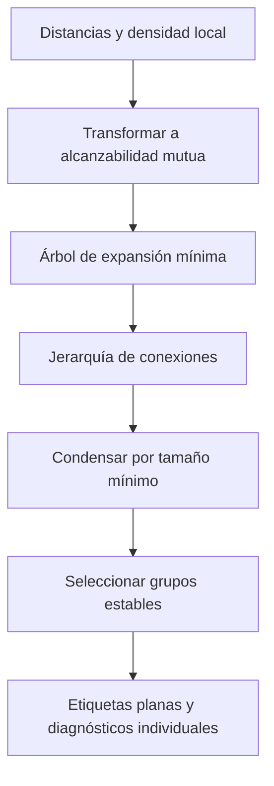
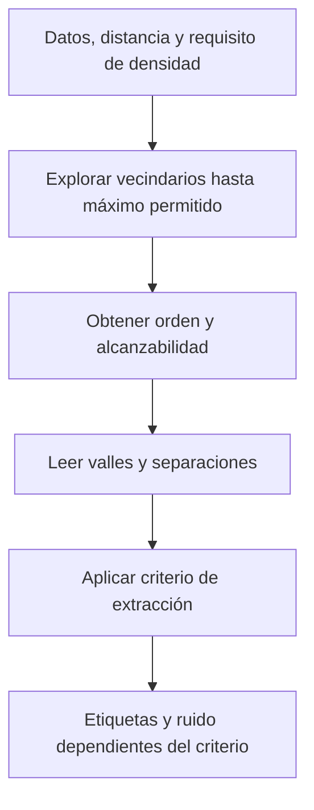

# HDBSCAN y OPTICS

**Idea central:** ambos estudian estructura de densidad a varias escalas, pero HDBSCAN construye y condensa una jerarquía para seleccionar grupos estables, mientras OPTICS produce un orden y distancias de alcanzabilidad antes de extraer grupos. Sus gráficas y parámetros no son intercambiables.

## Problema compartido, soluciones distintas

Una sola vecindad DBSCAN puede ser demasiado estricta para una región dispersa y demasiado permisiva para otra densa. Estudiar estructura multiescala permite reconocer alternativas, pero no elimina supuestos ni garantiza una partición territorial útil. Se distinguen **estructura intermedia**, **criterio de extracción** y **etiquetas finales**.

Fuente docente: V13, José Gómez Romero, 2026-06-23, 00:51:05–01:06:59 y 01:56:15–02:01:02. PPT de referencia, diapositivas 19–20; registro y precisión P2 en [[99 - Recursos/Clase 01 - Fuentes y acuerdos]].

## 1. HDBSCAN: jerarquía y estabilidad

### Analogía y definición

Imagine islas que aparecen y se separan al variar un nivel de agua. Una fotografía corresponde a una escala; seguir cuánto persisten las islas se parece más a estudiar estabilidad. La analogía no convierte altura en probabilidad ni demuestra que los grupos sean objetos físicos verdaderos.

HDBSCAN transforma la distancia usando densidad local, obtiene un árbol de expansión mínima, construye jerarquía, la condensa por tamaño mínimo y extrae grupos planos estables. En la explicación conceptual de E5, la distancia de alcanzabilidad mutua entre a y b toma el máximo de la distancia entre ambos y las distancias núcleo respectivas. Así, un enlace entre puntos en zonas poco densas no se trata igual que uno en zonas densas solo porque su distancia directa sea pequeña.

El árbol conecta el conjunto; la jerarquía registra estructura al variar umbral de conexión. Condensar elimina ramas insuficientes para el tamaño mínimo; seleccionar estabilidad no equivale a cortar toda la jerarquía a una altura fija. Las etiquetas finales resumen una selección y pierden información de otras escalas.

Fuente: [Desarrolladores HDBSCAN, How HDBSCAN Works, documentación rotulada 0.8.1, algorithm steps](https://hdbscan.readthedocs.io/en/latest/how_hdbscan_works.html), consulta 2026-09-15 (E5). La explicación documental no implica que el paquete contrib esté instalado ni que comparta todos los parámetros sklearn/Esri.

![[99 - Recursos/clase-01-grafica-hdbscan-jerarquia.svg]]
**Lectura:** eje vertical conceptual λ=1/distancia, mayor densidad arriba; disposición horizontal de ramas, no coordenada geográfica. Ramas breves y persistentes ilustran condensación/selección. Rectángulos discontinuos señalan una extracción ilustrativa; anchos, alturas y selección no proceden del árbol real de Bomberos. Elaboración propia basada en E5; no interpretar área como estabilidad medida.

**Lectura:** G no reemplaza D. Mostrar colores o una probabilidad individual no es mostrar la jerarquía, precisión P2 de la clase.

### Parámetros y diferencias de implementación

| scikit-learn 1.6 | Papel | Precaución |
| --- | --- | --- |
| `min_cluster_size` | Tamaño mínimo de grupos en condensación/selección | No es una distancia |
| `min_samples` | Control de densidad; por defecto None adopta tamaño mínimo | Incluye el propio punto en sklearn; contrib difiere |
| `cluster_selection_epsilon` | Fusiona grupos bajo una distancia de selección | No es simplemente el ε de DBSCAN repetido |
| `probabilities_` | Fuerza de pertenencia proporcional a persistencia | No valor p ni certeza causal |

[scikit-learn 1.6, HDBSCAN, Parameters/Attributes/Notes](https://scikit-learn.org/1.6/modules/generated/sklearn.cluster.HDBSCAN.html), consulta 2026-09-15 (E4). La P01 usa explícitamente 5/5/0.0; no depende implícitamente de None.

ArcGIS Pro recibe `min_features_cluster` en HDBSCAN; P02 usa 100 y no una distancia fija de 350 m. No equiparar ese único argumento a los dos controles sklearn. Esri documenta `PROB`, `OUTLIER` y `EXEMPLAR`: diagnósticos del grupo asignado, atipicidad y ejemplares. `CLUSTER_ID` es nominal y `COLOR_ID` puede reutilizar colores. No se inventa un campo STABILITY.

[Esri Pro 3.6, Density-based Clustering, Parameters/Outputs](https://pro.arcgis.com/en/pro-app/3.6/tool-reference/spatial-statistics/densitybasedclustering.htm) y [How Density-based Clustering works, Outputs](https://pro.arcgis.com/en/pro-app/3.6/tool-reference/spatial-statistics/how-density-based-clustering-works.htm), consulta 2026-09-15 (E1–E2). La semántica PROB de Esri no se identifica automáticamente con `probabilities_`.

### Ejemplo real ejecutado: Bomberos

Con 90 443 puntos acumulados de 2022–2024, HDBSCAN 100 produjo **3 grupos, 1 187 ruidos y un grupo mayor de 88 919 registros**. Es extracción plana observada, no visualización del árbol ni evidencia de tres zonas operativas naturales. Fuente: notebook P02 e [[99 - Recursos/Clase 01 - Resultados de prácticas|informe vigente]].

![[99 - Recursos/salidas_clase_01/practica_02/ejecucion_20260915T220908_d62e311d/arcgis_mapa_hdbscan.png]]
**Mapa ArcGIS:** colores nominales de grupos; el conjunto dominante ocupa gran parte de la distribución. No inferir menor riesgo para ruido ni superioridad por pocas exclusiones. Jurisdicciones preparadas fuera del notebook, con 17 entidades y cero errores detectados; la comprobación geométrica no certifica límites legales. El encuadre común de incidentes no muestra toda la prolongación sur de los polígonos.

![[99 - Recursos/salidas_clase_01/practica_02/ejecucion_20260915T220908_d62e311d/arcgis_hist_prob.png]]
**Histograma observado:** PROB horizontal y registros por intervalo vertical; solo 89 256 asignados. Mediana 1 no prueba que las pertenencias sean causalmente ciertas ni significativas. Los 1 187 ruidos se excluyeron de este diagnóstico porque sus campos pueden no ser significativos; no se eliminaron de la entrada. P2 evita leer 0.9 como umbral de significancia.

### Evaluación y límites HDBSCAN

Comparar tamaño de grupos, ruido y cambios controlados en parámetros. Un grupo muy persistente puede ser demasiado amplio para una pregunta local; estabilidad algorítmica no es utilidad operativa. La P01 permite observar seis ternas de sensibilidad; P02 demuestra una ejecución geográfica, no un barrido de parámetros ni una optimización.

La llamada P02 vigente tardó 122.76 s en Pro 3.6.2. Esa medición no demuestra una complejidad universal ni predice tiempos en sklearn, otro hardware u otro conjunto. P6 acota la comparación de rendimiento a implementación y ejecución.

## 2. OPTICS: orden, alcanzabilidad y extracción

### Qué produce y cómo entenderlo

OPTICS organiza los puntos de modo que el orden y las distancias de alcanzabilidad expresen estructura de densidad. La alcanzabilidad combina proximidad y requisito de densidad del punto desde el que se alcanza; no es una distancia al centro de un grupo ni tiempo de llegada de un vehículo.

La analogía es recorrer un relieve y registrar los pasos necesarios para entrar a regiones fáciles o difíciles de alcanzar. Los valles señalan regiones accesibles a distancias menores. El límite de la analogía es esencial: el eje de recorrido es **orden algorítmico**, no una ruta espacial física ni una secuencia temporal.

[scikit-learn 1.6, OPTICS, max_eps/Attributes/Notes](https://scikit-learn.org/1.6/modules/generated/sklearn.cluster.OPTICS.html), consulta 2026-09-15 (E9), y E2 para la descripción Esri. La explicación sklearn aporta contraste conceptual; **P02 sí ejecutó OPTICS con ArcGIS Pro**, dentro de la extensión autorizada del Ejercicio 5A, no como ejecución sklearn ni demostración de V13.

![[99 - Recursos/clase-01-grafica-optics-alcanzabilidad.svg]]
**Perfil idealizado propio:** eje horizontal = posición en orden OPTICS; vertical = alcanzabilidad conceptual sin unidades reales. Valles A y C son más profundos que B. La línea discontinua ilustra un criterio de corte, no `max_eps`; otro criterio puede recuperar estructura distinta. No son datos de Bomberos ni un experimento sintético ejecutado. Elaboración basada en E9.

**Lectura:** la estructura se obtiene antes de la partición. Reducir todo el método a una etiqueta final oculta por qué existen alternativas de extracción.

### Definición formal de OPTICS y alcance de la analogía

Sea $N_\varepsilon(o)=\{q:d(o,q)\le\varepsilon\}$, vecindad que incluye al propio punto $o$, y $m=\mathrm{MinPts}$. La **distancia de núcleo** es indefinida si $|N_\varepsilon(o)|<m$; en otro caso es la distancia al m-ésimo punto más cercano, contando $o$. Para un candidato $p$, la **alcanzabilidad desde $o$** es:

$$\operatorname{reach}_{\varepsilon,m}(p\mid o)=\max\{\operatorname{core}_{\varepsilon,m}(o),d(o,p)\},$$

si $o$ es núcleo; en otro caso es indefinida. Es una relación dirigida desde el punto núcleo, no distancia a un centro ni al vecino más próximo. El ordenamiento actualiza candidatos desde puntos procesados; la fórmula de un par no describe por sí sola toda esa actualización. Una alcanzabilidad indefinida no equivale a cero y no debe dibujarse como un valle.

**Fuente primaria:** Ankerst, Breunig, Kriegel y Sander (1999), *[OPTICS: Ordering Points To Identify the Clustering Structure](https://sigmodrecord.org/publications/sigmodRecord/9906/OPTICS_%20ordering%20points%20to%20identify%20the%20clustering%20structure.pdf)*, SIGMOD, §3.2.1, definiciones 5–6, pp. 52–53; consulta **2026-09-16**, pasaje verificado por el equipo y reutilizado. Fundamenta la representación; no establece equivalencia entre `xi` de scikit-learn y sensibilidad de ArcGIS. En Clase 02 se conserva búsqueda 350 m y mínimo 100: cambiar la extracción no elimina esos límites.

### Parámetros, salidas y cautelas

- `max_eps` controla la distancia máxima de búsqueda de vecindario. No es el diámetro de un grupo ni necesariamente una altura de extracción.
- `ordering_` indica el orden; `reachability_` aporta alcanzabilidad. Para interpretar el perfil deben corresponder al orden, no graficarse como si el orden original de filas fuera el resultado.
- La extracción añade un criterio de agrupación. Un valle no autoriza por sí solo a declarar una zona operacional.
- La implementación sklearn documentada tiene O(n²); reducir `max_eps` puede reducir tiempo. No extender esa nota a ArcGIS Pro: la llamada P02 vigente midió 69.16 s, sin que una medición pruebe complejidad universal.

Fuente E9, secciones ya verificadas. No se introducen aquí llamadas ni combinaciones nuevas de parámetros para una práctica adicional.

### Ejemplo real ejecutado: Bomberos con ArcGIS Pro

La P02 vigente ejecutó OPTICS sobre los mismos 90 443 registros, mínimo 100 y búsqueda 350 m, **omitiendo `cluster_sensitivity`** para selección automática. Produjo 29 grupos y 17 561 ruidos (19.42%); grupo 16 dominante con 52 889 filas. El mensaje informó sensibilidad elegida 1, segunda opción 0: no fue un valor prefijado ni se convierte en recomendación universal. Fuente: [[99 - Recursos/salidas_clase_01/practica_02/ejecucion_20260915T220908_d62e311d/evidencia.json|evidencia vigente]] y Markdown final del notebook enlazado en la clase.

![[99 - Recursos/salidas_clase_01/practica_02/ejecucion_20260915T220908_d62e311d/arcgis_alcanzabilidad.png]]
**Perfil ArcGIS real:** eje horizontal = `REACHORDER`; vertical = `REACHDIST` en metros. Los 90 443 valores son representables; hay valles y tramos altos cercanos al límite de búsqueda de 350 m. No es tiempo, recorrido físico ni distancia a centro; un pico no identifica automáticamente un evento anómalo. El perfil no sustituye mapas y barras, que permiten localizar grupos y leer sus poblaciones en la [[01 - Clases/2026-09-14 - Clase 01 - Clustering espacial|práctica completa]].

Respaldo: **Esri, Pro 3.6, Density-based Clustering, Parameters/Outputs** (E1–E2), y **Esri, ayuda Python instalada Pro 3.6.2**, `cluster_sensitivity` y `arcpy.charts.Line` (x/y/aggregation/dataSource), consulta registrada 2026-09-15 en [[99 - Recursos/Clase 01 - Fuentes y acuerdos#Ayuda instalada utilizada en P02 autónoma|ayuda instalada]]. La gráfica usa campos reales y conserva ausencias como huecos, no ceros. El procedimiento corresponde al DOCX Esri Colombia, *DiplomadoGeoIA Ejercicio 5A — Clustering basado en densidad*, edición estudiante, pasos 1–5/revisión, leído el 2026-09-15. El anuncio de V13 se conserva históricamente en el registro; no prueba ejecución de OPTICS en aquel video.

## 3. Comparar sin confundir objetos

| Objeto | HDBSCAN | OPTICS |
| --- | --- | --- |
| Estructura intermedia | Jerarquía de densidad condensada | Orden y alcanzabilidad |
| Paso de lectura | Persistencia y selección de ramas | Valles, separaciones y extracción |
| Resultado plano | Etiquetas seleccionadas y diagnósticos según paquete | Etiquetas obtenidas por criterio de extracción |
| Evidencia Clase 01 | P01 y P02 ejecutadas | P02 ArcGIS ejecutada; mapa, barras y perfil real |

[[02 - Conceptos/DBSCAN]] aporta la vecindad local desde la que se entienden estas diferencias. [[02 - Conceptos/Comparación de métodos de clustering]] separa estabilidad, ruido y utilidad; [[03 - Herramientas/scikit-learn - Clustering por densidad]] y [[03 - Herramientas/ArcGIS Pro - Density-based Clustering]] preservan la frontera entre APIs.

**Pregunta de salida:** ¿por qué un histograma de PROB no muestra la jerarquía y un perfil OPTICS no es un mapa? El primero resume diagnósticos individuales de una extracción; el segundo ordena puntos algorítmicamente. Aplicación en [[01 - Clases/2026-09-14 - Clase 01 - Clustering espacial]]. E1/E2/E4/E5/E9 reutilizadas de [[99 - Recursos/Clase 01 - Fuentes y acuerdos]], consulta original 2026-09-15. Mermaid y SVG pendientes de revisión visual final.
