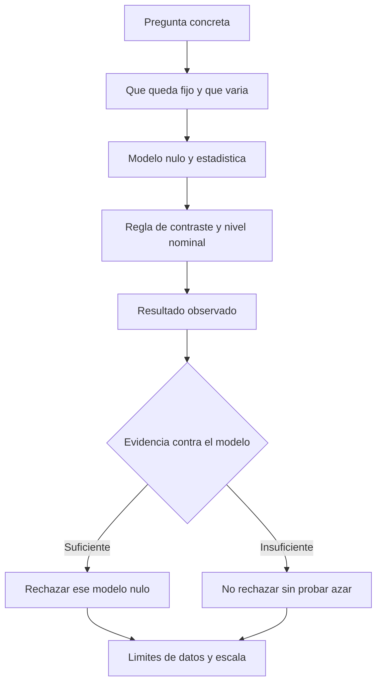

# Hipótesis nula espacial

## Qué es y por qué importa

Una hipótesis nula espacial especifica un **modelo de referencia** para comparar una estadística. No basta escribir «azar»: es necesario decir qué permanece fijo, qué puede variar y con qué mecanismo. De lo contrario, una afirmación de significancia puede responder a una pregunta distinta de la que interpreta el estudiante.

[[02 - Conceptos/Autocorrelación espacial global (Moran's I)|Moran global]] combina un atributo y la localización de las entidades; su no significancia no demuestra aleatoriedad. Esta distinción está en la interpretación de Esri [1]. En [[01 - Clases/2026-09-15 - Clase 02 - OPTICS y autocorrelación espacial incremental|Clase 02]] resulta esencial porque `ICOUNT` se observa en sitios ocupados después de la agregación, no en una partición de todo el territorio.

## Analogía y dos experimentos diferentes

Piense en sillas con tarjetas numeradas. **Permutar etiquetas** es dejar las sillas quietas y repartir las mismas tarjetas de otra manera. **Aleatorizar ubicaciones** es mover las sillas por la habitación conforme a un modelo. Las sillas representan sitios; las tarjetas, atributos; la habitación, la ventana espacial. La analogía no especifica por sí sola la probabilidad de cada ubicación ni las barreras que tendría una ciudad.

![[99 - Recursos/clase-02-nulos-espaciales.svg]]

**Lectura.** Figura propia: en A, los cuatro sitios conservan posición y reciben los mismos valores 1–4 en otro orden; en B, cuatro puntos se colocan de otra manera dentro de una ventana. No hay escala métrica ni coordenadas reales. **Conclusión:** cambiar valores o cambiar ubicaciones define experimentos distintos. **Límite:** son posibilidades dibujadas, no simulaciones ejecutadas ni pruebas de los datos de la práctica. Idea de atributo/localización: Esri [1]; permutación de valores en sitios fijos: Anselin [3]. La figura no ejecuta un proceso puntual.

### Aleatorización del atributo

Para $n$ sitios con geometría y matriz $W$ fijas, el modelo de permutación considera intercambiables las asignaciones de los valores observados entre sitios. Si $\pi$ es una permutación, se evalúa la estadística $T(x_{\pi(1)},\ldots,x_{\pi(n)};W)$ con el mismo $W$.

La intercambiabilidad es un supuesto sustantivo del modelo nulo. Si subregiones tienen mecanismos de registro o exposiciones diferentes, una permutación global puede ser una referencia poco adecuada para la pregunta explicativa. No se soluciona declarando independencia espacial; se explicita qué ausencia de estructura se contrasta.

### Aleatoriedad espacial completa, CSR

Un modelo homogéneo de Poisson en una ventana plantea intensidad constante y conteos independientes en regiones disjuntas. Condicionado a un número fijo de eventos, sus ubicaciones son independientes y uniformes en esa ventana. Cambiar exposición, accesibilidad o ventana cambia el modelo de referencia relevante; la uniformidad espacial no es una propiedad que deba darse por obvia para emergencias.

**Diferencia decisiva:** Moran de `ICOUNT` en sitios ocupados no contrasta automáticamente ese modelo de posiciones. Los sitios se definieron a partir de eventos y no incluyen todos los lugares sin eventos. Tampoco representa una superficie de intensidad corregida por exposición.

La permutación está respaldada por Anselin [3], §13.5: se conservan valores y se reasignan entre localizaciones. La intercambiabilidad global se declara como supuesto del complemento docente, no como propiedad verificada de estos registros. **Límite documental acotado:** la definición de CSR anterior se conserva como contraste conceptual en borrador; las fuentes nuevas verificadas no desarrollan el proceso de Poisson y no se les atribuye ese respaldo.

## Cómo interpretar z y p sin convertirlos en certezas

Para una estadística $T$, el p es una probabilidad de resultados tan extremos o más que el observado **bajo el modelo nulo y la regla de extremidad adoptada**. No es $P(H_0\mid datos)$. Un contraste unilateral y uno bilateral no tienen la misma regla; la elección no debe hacerse después para mejorar el resultado.

Si se justifica la aproximación normal para el z, un contraste bilateral puede expresar $p=2[1-\Phi(|z|)]$. Los cortes aproximados $|z|=1.645,1.960,2.576$ corresponden a niveles nominales 10 %, 5 % y 1 %. No se usan como confianza de pertenencia de un punto a un cluster. Aquí $\Phi$ es la función de distribución normal estándar: la expresión es el cálculo docente de sus dos colas, condicionado a una aproximación válida. Anselin [3], §13.5, presenta el z de Moran como aproximación asintótica, no como normalidad exacta para toda matriz y población; [1] respalda la separación de I, z, p y no rechazo.

| Resultado | Redacción correcta | Redacción que excede la evidencia |
| --- | --- | --- |
| p pequeño para contraste definido | Los datos son poco compatibles con ese modelo nulo | La probabilidad de azar es p |
| p no pequeño | No hay evidencia suficiente para rechazar ese modelo | Se demostró que el patrón es aleatorio |
| z grande e I pequeño | Hay separación estandarizada; evaluar magnitud y contexto | El efecto necesariamente es importante |
| p elegido entre muchas bandas | Resultado nominal de exploración multiescala | Confirmación independiente de la mejor escala |

No rechazar puede coexistir con baja potencia, soporte inadecuado o procesos que se compensan en una medida global. Rechazar no identifica la causa ni autoriza una intervención territorial. [1 para interpretación global.]

**Lectura.** La hipótesis precede a la decisión, y ambas ramas desembocan en límites. No hay una rama que certifique causalidad ni una aprobación de OPTICS.

## Teorema del límite central: precisión necesaria

La formulación clásica supone variables $X_1,\ldots,X_n$ independientes e idénticamente distribuidas, media finita $\mu$ y varianza finita y positiva $\sigma^2$:

$$
\frac{\sqrt{n}(\bar X_n-\mu)}{\sigma}\xrightarrow{d}N(0,1).
$$

Lo que converge es la distribución de una **media estandarizada**, no el histograma de los valores originales. Lanzar un dado muchas veces no transforma sus seis posibles caras en una variable normal. Al promediar bloques independientes de lanzamientos, la distribución de los promedios puede aproximarse a normal conforme crece el tamaño de cada bloque; generar más bloques solo permite observar mejor esa distribución.

La normalidad original no es requisito del TLC clásico; independencia y momentos finitos sí pertenecen a sus condiciones. Hay extensiones para dependencia, con hipótesis específicas. No basta tener muchos puntos geográficos para satisfacerlas. Moran es una estadística de productos ponderados entre valores vecinos, no una media ordinaria a la que pueda aplicarse mecánicamente este teorema. No imponer normalidad del atributo bruto ni independencia ficticia para justificar sus z.

La revisión visible de la fuente (39:53–49:12) permite contrastar datos y medias; no hay garantía universal de normalidad para todo n ≥ 30. Las condiciones formales anteriores son una ampliación docente respaldada por **Kempthorne/MIT [4], Lecture 15, p. 9**, no una validación del test instalado. El símbolo $\xrightarrow{d}$ significa convergencia en distribución; $\mu$ y $\sigma^2$ son media y varianza de cada variable y $\bar X_n$ es la media de n observaciones. El teorema no fija un tamaño universal n=30 ni una velocidad de aproximación para cualquier distribución.

## Ejemplo atribuido y aplicación

La **Clase 14 de José Sebastián Gómez Romero, 2026-06-24**, desarrolla una tercera práctica real de **viviendas turísticas Bogotá de Catastro/IDECA** (106:00–123:09), según revisión directa del orquestador mediante Chrome DevTools MCP el 2026-09-15. No es una fuente comercial de Airbnb: la tarjeta representa **ICOUNT de registros coincidentes**, no precio ni disponibilidad. Se ejecuta en la fuente Collect Events → Moran global con distancia inversa, fila y umbral automático → dos incrementales. La entrada local ya está disponible y el notebook autónomo P03 se ejecutó completo el **2026-09-16**, corrida `ejecucion_5bd614af4469`: 7 529 registros, 2 919 sitios, I=0.025782, z=10.661289 y p exportado como 0, sin interpretarlo como probabilidad exactamente nula. La comprobación de existencia del notebook es preventiva, no un bloqueo vigente. La revisión focal actual confirmó parámetros globales a 110:20–110:27 y el HTML fuente a 115:00–115:07; esos resultados de video se distinguen de las salidas actuales, aunque coincidan. Los intervalos históricos amplios no acreditan revisión continua actual. Un Moran de ese atributo no demuestra aleatoriedad de todas las posiciones posibles ni describe toda la oferta turística.

Para abejas, la etiqueta es `ICOUNT`; no son cantidades ecológicas de abejas ni tasas de exposición. Para colegios, un conteo de establecimientos coincidentes no es matrícula ni cobertura educativa. Esta delimitación permite conservar los casos sin inventar evidencia.

## Relaciones y comprobación

- [[02 - Conceptos/Escala espacial, vecindad y bandas de distancia|Vecindad y escala]] define las relaciones que permanecen fijas durante un contraste de atributo.
- [[02 - Conceptos/Autocorrelación espacial incremental|Moran incremental]] cambia esas relaciones entre distancias; elegir después el mejor resultado exige cautela de postselección.
- [[02 - Conceptos/HDBSCAN y OPTICS|OPTICS]] organiza densidad sin que un rechazo de esta hipótesis nula sea requisito universal.

**Pregunta de salida:** si todos los sitios ocupados tienen valor 1, ¿por qué no puede interpretarse un Moran inválido de ese atributo como prueba de CSR? Respuesta esperada: no hay variación del atributo, y además el modelo de ubicaciones no es el modelo de permutación de etiquetas.

## Fuentes y pendientes

1. **Esri, ArcGIS Pro 3.6 — [How Spatial Autocorrelation (Global Moran's I) works](https://pro.arcgis.com/en/pro-app/3.6/tool-reference/spatial-statistics/h-how-spatial-autocorrelation-moran-s-i-spatial-st.htm)**, introducción e Interpretation. Consulta registrada **2026-09-15**, reutilizada de [[99 - Recursos/Clase 01 - Fuentes y acuerdos#8. Referencias verificadas por el orquestador|E6]].
2. **Gómez Romero, José Sebastián, grabación Clase 14, 2026-06-24**, 39:53–65:13 y 106:00–123:09. Revisión directa comunicada por el orquestador, consulta 2026-09-15; identidad, cobertura parcial y pendientes en [[01 - Clases/2026-09-15 - Clase 02 - OPTICS y autocorrelación espacial incremental#4. Fuentes, procedencia y resultados|procedencia de Clase 02]]. No se afirma visionado continuo.

3. **Luc Anselin, [An Introduction to Spatial Data Science with GeoDa — Moran’s I](https://lanselin.github.io/introbook_vol1/morans-i.html)**, edición web, §13.5, momentos e inferencia por aleatorización; consulta **2026-09-16**, lectura del orquestador reutilizada.
4. **Peter Kempthorne, MIT 18.655, primavera 2016, [Mathematical Statistics — Lecture 15: Limit Theorems](https://live.ocw.mit.edu/courses/18-655-mathematical-statistics-spring-2016/6c41b4096a836ff41f8de46cf54b5b7c_MIT18_655S16_LecNote15.pdf)**, p. 9, TLC iid con varianza finita positiva; consulta **2026-09-16**, pasaje verificado por el equipo y reutilizado.
5. **Wasserstein y Lazar (2016), [The ASA’s Statement on p-Values: Context, Process, and Purpose](https://doi.org/10.1080/00031305.2016.1154108)**, §3, principios 4–5, pp. 131–132; [reproducción pública leída](https://www.uab.edu/ccts/images/kaizen/r2t/2025/Review%2016-20_ASA%20Statement%20on%20Pvalues.pdf), consulta **2026-09-16**.

La ASA [5] exige transparencia sobre análisis y selección, y distingue p de magnitud del efecto. Aplicación docente: conservar todas las bandas y no llamar confirmación independiente al p elegido después de inspeccionarlas. No se ha aplicado ni atribuido a la ASA una corrección espacial concreta.

Pendientes: respaldo específico de la definición formal de CSR, revisión visual T03 y cobertura completa de video T04. No se ejecutaron simulaciones nuevas; las tres prácticas sí están ejecutadas y documentadas en Clase 02. Estos límites no se confunden con falta de datos de P03.
