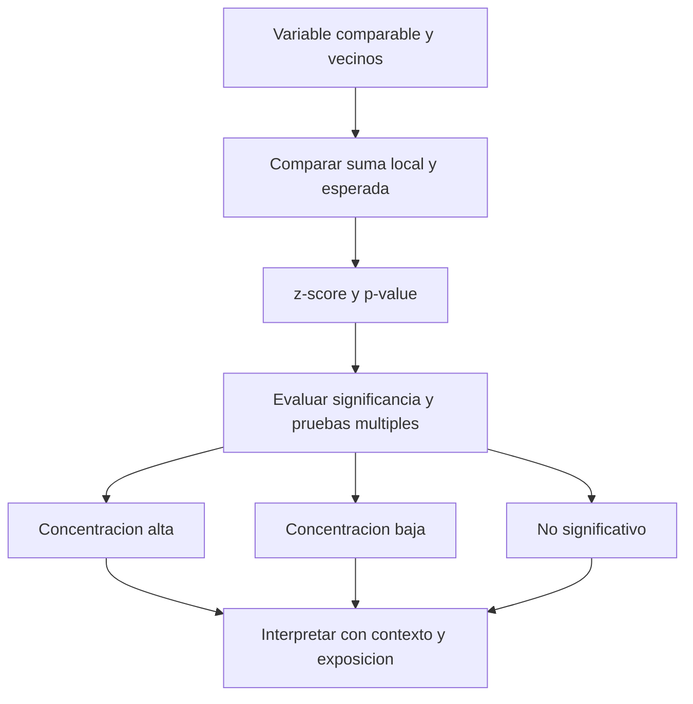

# Hot spots Getis-Ord Gi*

Un punto con muchos eventos llama la atención. ¿Está aislado o pertenece a una concentración de valores altos? **Getis-Ord Gi\*** es un estadístico local que evalúa cada entidad en el contexto de sus vecinos. Compara la suma local con la esperada en relación con el conjunto analizado. Un valor alto aislado no basta para identificar un hot spot significativo [E1, introducción](#referencias).

## Lo alto no siempre es un punto caliente

![[../99 - Recursos/clase-03-getis-ord.svg]]

**Lectura:** en las dos mallas hipotéticas el centro vale 9; a la izquierda está rodeado de unos y a la derecha de ochos. Los números son conteos ilustrativos, no datos de Bogotá. **Conclusión:** el contexto cambia la suma local aunque el centro sea idéntico. **Límite:** ninguna malla lleva una etiqueta de significancia: para calcularla hacen falta el conjunto completo, pesos y contraste. Elaboración docente basada en E1.

En forma estandarizada, la idea se expresa como:

$$
G_i^*=\frac{\sum_jw_{ij}x_j-\bar{x}\sum_jw_{ij}}
{S\sqrt{\frac{n\sum_jw_{ij}^{2}-(\sum_jw_{ij})^{2}}{n-1}}},
\qquad \bar{x}=\frac{\sum_jx_j}{n},\quad
S=\sqrt{\frac{\sum_jx_j^2}{n}-\bar{x}^2}.
$$

Aquí $x_j$ es la variable, $w_{ij}$ representa la relación espacial, $n$ el número de entidades y $i$ la ubicación evaluada. Gi* incluye la propia ubicación en el contexto local. El numerador mide cuánto se aparta la suma local de la esperada; el denominador la estandariza. La elección de vecinos forma parte de la pregunta, no es un detalle decorativo [E1, Calculations e Interpretation](#referencias).

## Qué devuelve ArcGIS Pro

| Resultado | Lectura |
| --- | --- |
| z-score positivo significativo | Agrupamiento de valores altos. |
| z-score negativo significativo | Agrupamiento de valores bajos. |
| Resultado no significativo | Evidencia insuficiente para ese patrón local bajo esa configuración. |
| `Gi_Bin` | Clase de significancia caliente/fría/no significativa. |

El p-value no mide gravedad ni riesgo. Tampoco es la probabilidad de que «todo haya ocurrido por azar». Se interpreta bajo la hipótesis nula y el modelo de relaciones espaciales. Al probar muchas ubicaciones, hay que considerar pruebas múltiples; [[Optimized Hot Spot Analysis]] aplica FDR a `Gi_Bin`, no a los campos z/p [E2, Usage](#referencias).

## Global, local y temporal responden preguntas distintas

[[Autocorrelación espacial global (Moran's I)]] resume el patrón del conjunto. Gi* pregunta por concentración alrededor de cada ubicación. **La no significancia global no invalida por sí sola una prueba local**: son preguntas y estadísticas diferentes. El resultado local debe justificarse con su variable, escala, cobertura y control de pruebas múltiples, no condicionarse a que Moran global «dé permiso». Esta precisión corrige la lectura demasiado restrictiva del cierre histórico de abejas; véanse la definición local de E1 y [[Hipótesis nula espacial]].

Moran local, en cambio, distingue clusters y atípicos respecto de los vecinos (alto-alto, bajo-bajo, alto-bajo y bajo-alto). Gi* se enfoca en concentraciones altas/bajas. [[Emerging Hot Spot Analysis]] incorpora tiempo y clasifica la secuencia de resultados Gi*, no simplemente el crecimiento de los conteos.

## Ejemplos conservados de la fuente

La nota original relacionaba el método con dos antecedentes: el ejercicio docente de muertes alrededor de la bomba de Broadwick Street y las tasas municipales de lesiones personales. Se conservan como **ejemplos narrados en el material fuente**, no como análisis reejecutados aquí ni demostraciones causales nuevas. El primero ilustra concentración frente a eventos aislados; el segundo, la necesidad de una variable comparable.

En [[../01 - Clases/2026-09-16 - Clase 03 - Cubos espacio-temporales y patrones emergentes|Clase 03]], siniestros, colegios y abejas refuerzan la misma pregunta. **Conteo no equivale a riesgo:** muchos incidentes pueden reflejar más tránsito, personas o actividad. Esri distingue explícitamente el análisis de conteos para asignación de recursos y el de tasas/razones para controlar relaciones esperadas. Sin un denominador apropiado no se afirma riesgo individual [E1, Hot spot analysis considerations](#referencias).

## Referencias

- **E1. Esri.** *How Hot Spot Analysis (Getis-Ord Gi*) works*. ArcGIS Pro **3.6**, introducción, Calculations, Interpretation, Hot spot analysis considerations; consulta 2026-09-17. <https://pro.arcgis.com/en/pro-app/3.6/tool-reference/spatial-statistics/h-how-hot-spot-analysis-getis-ord-gi-spatial-stati.htm>.
- **E2. Esri.** *Optimized Hot Spot Analysis*. ArcGIS Pro **3.6**, Usage; consulta 2026-09-17. <https://pro.arcgis.com/en/pro-app/3.6/tool-reference/spatial-statistics/optimized-hot-spot-analysis.htm>.

## Procedencia y estado

BORRADOR migrado de `../diplomado_geoia/02 - Conceptos/Hot spots Getis-Ord Gi Star.md`. Conserva fundamentos y ejemplos narrados de las clases fuente 09, 12 y 15, sin importar su currículo ni modificar clases existentes. La Clase 15 del 2026-06-25 atribuye la docencia a José Sebastián Gómez Romero. Las precisiones inferenciales son complemento docente respaldado por las referencias; no hubo ejecución nueva.
