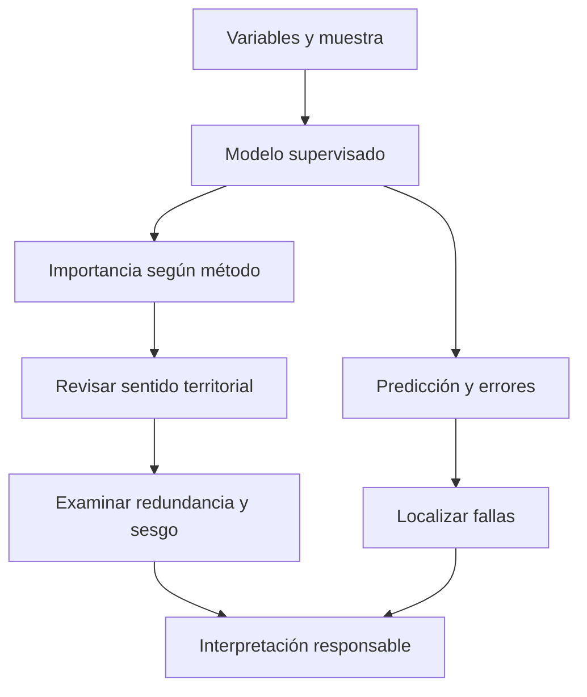

# Importancia de variables

## Utilidad predictiva no es causalidad

La importancia resume cómo utiliza un modelo sus variables explicativas. En [[Random Forest]] puede medirse mediante mejoras de las divisiones de árboles o mediante deterioro del desempeño cuando se altera una variable. Son medidas distintas: no deben intercambiarse ni llamarse genéricamente «porcentaje explicado». [Breiman y Cutler, «Random Forests», importancia; Esri 3.6, «How…», importancia de variables.]

Si variables poblacionales ayudan a predecir lesiones personales, eso no demuestra que las produzcan. Pueden representar población expuesta, urbanización, accesibilidad o sesgo de reporte. La importancia depende de **modelo, muestra, predictores disponibles y método de cálculo**.

| Interpretación responsable | Interpretación incorrecta |
|---|---|
| Ayuda a este modelo a predecir | Causa el fenómeno |
| Debe contrastarse con teoría y territorio | El ranking reemplaza al experto |
| Puede revelar variables proxy o sesgos | Mayor importancia significa mayor valor operativo |
| Cambia con los datos y las variables | Es una propiedad universal del fenómeno |

## Dos métodos, dos preguntas

- **Disminución de impureza:** agrega la mejora producida por divisiones que usan una variable. Gini corresponde a clasificación; en regresión se usan reducciones asociadas al error o variabilidad, no «Gini» indistintamente. Variables con muchas oportunidades de división pueden resultar favorecidas.
- **Permutación:** desordena una variable y mide cuánto empeora una métrica respecto de la evaluación original. Su significado depende de la métrica y del conjunto usado —por ejemplo OOB o validación—. Alterar una variable correlacionada con otras puede producir combinaciones poco realistas o enmascarar información redundante.

Para una pérdida donde menor es mejor, una forma conceptual es $I_j=L_{permutada,j}-L_{original}$. Valores grandes indican mayor deterioro al alterar $j$; no son efectos causales ni tienen que sumar 100 %. Consultar qué medida entrega efectivamente cada salida de ArcGIS antes de compararla.

El ranking orienta preguntas; los errores y el territorio permiten contrastarlas. Una variable de importancia baja no debe descartarse automáticamente.

![[99 - Recursos/clase-06-importancia-bosque.svg]]

**Lectura:** comparar longitudes de barras y sus etiquetas para ordenar la contribución según la medida representada. **Conclusión:** el orden describe al bosque evaluado, no una jerarquía causal del ecosistema. **Límite:** ranking hipotético docente; no reproduce una corrida nueva ni prueba que quitar una variable mejore el modelo. Fuente: elaboración docente; distinción entre importancia y causalidad y métodos del bosque en Breiman y Cutler y Esri 3.6.

## Caso de biomasa y ejemplo calculable

En Coiba, una importancia baja de [[NDVI]] puede motivar revisar redundancia con bandas, saturación en vegetación densa, correlación, fechas de imagen y campo, resolución o variabilidad entre corridas. La respuesta de biomasa también depende de estructura vertical que un índice espectral no describe completamente.

Supongamos este **ranking parcial hipotético**:

| Variable | Importancia relativa |
|---|---:|
| Infrarrojo cercano | 34 % |
| Elevación | 22 % |
| Pendiente | 17 % |
| NDVI | 9 % |
| Aspecto | 6 % |

Las filas suman 88 %: no son la distribución completa. «NDVI no sirve» es una conclusión inválida. La lectura correcta es «en esta corrida, con esta muestra y predictores, NDVI obtuvo menos importancia que otras señales». Antes de retirarlo, comparar configuraciones con la misma estrategia de [[Validación de modelos supervisados]], sin usar reiteradamente la prueba final para decidir.

En el ejemplo docente de lesiones personales, el ranking debe contrastarse con perfiles poblacionales, tamaño municipal y cobertura de captura. La subestimación de algunos municipios recuerda que importancia alta y buen desempeño no son equivalentes.

![[99 - Recursos/grafica-importancia-variables.svg]]

**Lectura:** las barras ordenan predictores poblacionales del ejemplo docente; no tienen eje numérico y no permiten calcular porcentajes. El panel derecho exige contrastar teoría, residuales, proxies y costo del error. **Conclusión:** utilidad predictiva no implica una causa. **Límite:** no representa la importancia medida en Coiba ni autoriza inferencias sobre grupos demográficos. Fuente: gráfico didáctico original GeoIA; interpretación del bosque en Esri 3.6 y Breiman y Cutler, citados al final.

## Usos y cautelas

La importancia permite priorizar revisión, explicar parcialmente el modelo, detectar proxies, comparar señales esperadas y sospechosas, y formular hipótesis diagnósticas. No aporta por sí sola el signo ni la forma de la relación: una variable importante puede tener efectos predictivos no lineales e interacciones.

Cruzar siempre el ranking con mapas, tasas, residuales y conocimiento territorial. [[Rasters explicativos]] ayuda a revisar los insumos; [[Métricas de evaluación de modelos]] permite comprobar desempeño; [[Analítica predictiva]] mantiene la distinción entre predicción e intervención.

## Referencias y contexto

- Esri. *How Forest-based and Boosted Classification and Regression works*, ArcGIS Pro 3.6, importancia de variables. https://pro.arcgis.com/en/pro-app/3.6/tool-reference/spatial-statistics/how-forest-works.htm. Consulta documentada: 2026-09-21.
- Breiman, L. y Cutler, A. *Random Forests*, importancia por permutación y Gini. https://www.stat.berkeley.edu/~breiman/RandomForests/cc_home.htm. Consulta documentada: 2026-09-21.
- Créditos académicos conservados, sin nueva consulta: Breiman (2001), *Random Forests*, https://doi.org/10.1023/A:1010933404324; Strobl et al. (2008), *Conditional variable importance for random forests*, https://doi.org/10.1186/1471-2105-9-307; Molnar, *Interpretable Machine Learning*, https://christophm.github.io/interpretable-ml-book/.
- Ampliaciones conservadas, sin nueva verificación: scikit-learn, *Permutation feature importance*, https://scikit-learn.org/stable/modules/permutation_importance.html; Esri, *Regression analysis basics*, https://pro.arcgis.com/en/pro-app/latest/tool-reference/spatial-statistics/regression-analysis-basics.htm.

Aplicación: [[2026-09-21 - Clase 04 - Aprendizaje supervisado y Random Forest geoespacial|Clase 04]]. Ranking ilustrativo, sin ejecución nueva.
