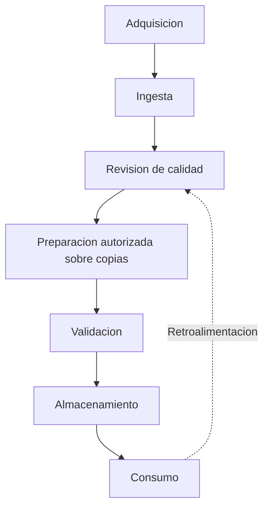
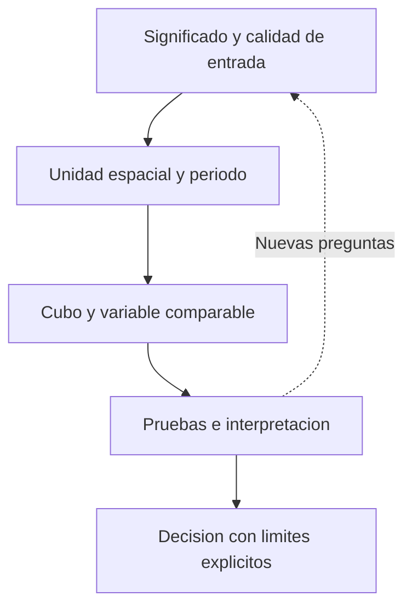

# Ingeniería de datos geoespaciales

La **ingeniería de datos geoespaciales** prepara datos territoriales para análisis, visualización, modelos y decisiones. No busca solamente «un archivo limpio»: busca un proceso que pueda repetirse, explicarse y revisarse. Un modelo sofisticado no compensa fechas mal interpretadas, coordenadas equivocadas o un denominador que no representa la exposición.

La nota fuente la presenta como condición previa de GeoIA. Su estimación de que 70–80 % del esfuerzo puede dedicarse a preparación se conserva aquí como **comentario docente histórico**, no como una proporción universal comprobada ni como resultado medido en este proyecto.

## Qué añade la dimensión geográfica

La ingeniería general revisa tipos, nulos, claves, esquemas, actualización y procedencia. La geoespacial añade CRS y proyecciones, precisión posicional, topología, escala, unidades de análisis, agregación territorial, cobertura temporal, metadatos y restricciones de uso. Una coordenada numérica no es interpretable sin su sistema de referencia; un cero no significa lo mismo que un dato desconocido.

![[../99 - Recursos/clase-03-ingenieria.svg]]

**Lectura:** el original queda a la izquierda, separado de la copia y de las salidas. Las preguntas sobre fechas, CRS y significado acompañan el proceso. **Conclusión:** revisar no equivale a corregir automáticamente. **Límite:** el esquema no demuestra calidad ni autoriza reparación. Elaboración docente basada en el ciclo de la nota fuente y en la [[../99 - Recursos/datos/clase_03/README|procedencia local de las entradas]].

## Un ciclo de trabajo, no una limpieza a ciegas

### 1. Adquisición

Los datos pueden provenir de GPS, Survey123, sensores, digitalización, servicios o registros institucionales. Aquí nacen límites de captura, cobertura y reporte. Antes de hablar de patrón, hay que preguntar qué representa un registro y qué eventos quedan fuera.

### 2. Ingesta

Cargar datos requiere conservar esquema, frecuencia de actualización y procedencia. En Clase 03 se seleccionaron cuatro clases de entidad y un NetCDF; no se copió todo el entorno de trabajo fuente. Las entradas son de solo lectura.

### 3. Revisión y limpieza

Se revisan nulos, claves repetidas, textos inconsistentes, fechas imposibles, geometrías y posiciones sospechosas. Un identificador repetido puede representar varios eventos asociados y no un duplicado accidental. La revisión documenta el problema; no elimina ni imputa registros automáticamente. Tampoco transforma coordenadas solo porque parezcan extrañas.

### 4. Transformación

En otros contextos puede incluir cambio de CRS, tipos y unidades, tasas, densidades, distancias, agregación, logaritmos, Box-Cox o estandarización. Son posibilidades del ciclo, **no operaciones obligatorias ni autorizadas por esta nota**. Cada transformación necesita pregunta, respaldo y comparación antes/después sobre una copia.

### 5. Validación

Se revisan dominios, rangos, fechas, reglas de negocio y geometrías pertinentes. Es iterativa: se puede volver a la revisión si algo no concuerda. Contar entidades iguales antes/después no basta para asegurar igualdad de atributos y geometrías; tampoco cero geometrías nulas significa topología válida.

### 6. Almacenamiento

La geodatabase organiza entidades; [[NetCDF]] organiza variables multidimensionales. Entradas, copias de trabajo y resultados deben quedar separados. Los nombres han de permitir reconocer qué se observó y qué se derivó, sin dispersar rutas personales.

### 7. Consumo

Los datos alimentan mapas, gráficos, notebooks y modelos. El consumo devuelve preguntas a la preparación: un mapa puede revelar coordenadas fuera de cobertura y un histograma temporal, periodos incompletos. Comunicar resultados exige explicar esos límites, no ocultarlos detrás del modelo.

## ArcGIS primero, con una función concreta

La fuente describe **Data Engineering** como vista de ArcGIS Pro para explorar campos, nulos, valores únicos, estadísticas y gráficos, y acceder a herramientas de preparación. No es una clase `arcpy.DataEngineering`. ArcPy, ModelBuilder y notebooks permiten automatizar operaciones concretas; no convierten la vista en una API [referencia documental conservada de la fuente](#referencias).

Para los siniestros, la pregunta inicial es sencilla: ¿qué cuentan los registros y qué tiempo cubren? Revisar `FECHA_OCUR`, `GRAVEDAD`, `CLASE_ACC` y `LOCALIDAD`; distinguir el OID del almacenamiento de `OBJECTID`; observar distribución de fechas y conteos por localidad mediante gráficos ArcGIS, y posición de eventos mediante mapas. Antes de [[Cubo espacio-temporal|agregar en un cubo]], verificar la proyección y las unidades.

Los preparados de colegios y abejas solo tienen OID, geometría e `ICOUNT`. Según la procedencia local, sus sumas son 10.617 y 2.173, distintas de las 9.911 y 1.918 ubicaciones. No contienen fechas individuales y no permiten reconstruir por sí solos cubos temporales. Su preparación histórica incluyó Integrate y Collect Events; esta migración no los repite.

## Relación con el análisis

[[Teselación espacial]] transforma eventos en unidades; [[Hot spots Getis-Ord Gi Star|Gi*]] compara valores dentro de una vecindad. Ambos heredan los límites de los datos. El caso de [[../01 - Clases/2026-09-16 - Clase 03 - Cubos espacio-temporales y patrones emergentes|Clase 03]] muestra por qué preparar es parte de enseñar el método, no un trámite anterior.

## Referencias

- **Esri.** *Prepare data*. ArcGIS Pro, referencia conservada de la nota fuente, sección Data Engineering; versión `latest` en el enlace original, sin nueva verificación de versión ni fecha de consulta atribuida. <https://pro.arcgis.com/en/pro-app/latest/help/analysis/geoprocessing/data-engineering/prepare-your-data.htm>.
- **Procedencia local de Clase 03:** [[../99 - Recursos/datos/clase_03/README]]. Contenido, esquema, CRS y comprobaciones observadas de las entradas; no certifica toda la calidad de los originales.

## Procedencia y estado

BORRADOR migrado de `../diplomado_geoia/02 - Conceptos/Ingeniería de datos geoespaciales.md`, conservando sus siete etapas y ejemplos de preparación. La atribución de la Clase 15 relacionada es José Sebastián Gómez Romero, 2026-06-25. No se importan notas de otras áreas ni se autorizan limpieza, reparación, Integrate, imputación o deduplicación. Sin ejecución de análisis nueva.
