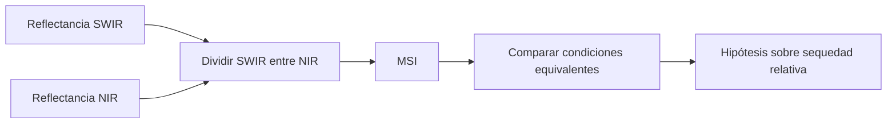

# MSI

![[99 - Recursos/grafica-indice-msi.svg]]

**Lectura:** la tarjeta presenta SWIR/NIR como señal relativa, no porcentaje de humedad. **Precisión técnica:** el rótulo original «B6 o B7» no implica bandas intercambiables: la formulación R1600/R820 corresponde aproximadamente a SWIR1/NIR (B6/B5 en Landsat 8/9); usar B7 cambia el contraste y exige justificación. **Conclusión:** identificar longitudes de onda antes de interpretar. **Límite:** no mide agua absoluta. Fuente: gráfico didáctico original GeoIA; especificación ESA SNAP citada al final, sin nueva consulta.

## Una razón espectral para comparar sequedad relativa

El **Moisture Stress Index** relaciona reflectancia de infrarrojo de onda corta (SWIR) e infrarrojo cercano (NIR) para aportar una señal de estrés hídrico o menor contenido relativo de agua en vegetación:

$$MSI=\frac{SWIR}{NIR}.$$

La especificación técnica conservada de ESA SNAP expresa $R_{1600}/R_{820}$, con longitudes de onda aproximadas en nanómetros. «SWIR/NIR» describe la relación conceptual: se debe identificar qué banda de cada sensor representa esos intervalos; no elegir cualquier SWIR indistintamente. [ESA SNAP 13, *Moisture Stress Index Algorithm Specification*, referencia al final, sin nueva consulta.]

Valores mayores suelen ser compatibles con mayor sequedad relativa; valores menores, con mayor contenido relativo de agua. No equivalen a un porcentaje de humedad ni constituyen un diagnóstico fisiológico sin contexto y calibración.

Las condiciones equivalentes incluyen sensor, fechas, corrección radiométrica, cobertura y escala espacial. Si NIR es cero el cociente no está definido; cerca de cero aumenta su sensibilidad al ruido.

## Dos ejemplos hipotéticos

| Caso | SWIR | NIR | MSI |
|---|---:|---:|---:|
| A | 0.18 | 0.52 | $0.18/0.52=0.346$ |
| B | 0.30 | 0.26 | $0.30/0.26=1.154$ |

B sugiere mayor sequedad relativa, **si las otras condiciones son comparables**. La diferencia también puede reflejar cobertura o fondo distintos; no permite calcular directamente cuánto agua perdió una hoja.

![[99 - Recursos/grafica-indices-teledeteccion-formulas.svg]]

**Lectura:** localizar la razón SWIR/NIR y distinguirla del contraste verde–SWIR de MNDWI. **Conclusión:** la humedad relativa de vegetación y el agua superficial no se representan con la misma combinación. **Límite:** el recurso no calibra MSI en unidades de agua ni proporciona un umbral universal. Fuente: recurso docente de índices; fórmula atribuida a ESA SNAP y antecedentes de Hunt y Rock (1989).

## Aplicación en Coiba y límites

MSI puede diferenciar condiciones de humedad del dosel, estrés o bordes ambientales. Su aporte al modelo de [[Biomasa aérea sobre el suelo (AGBD)]] es indirecto: estructura y estado hídrico influyen en reflectancia, pero no son sinónimos de biomasa.

- No sustituye mediciones foliares ni de campo.
- SWIR y NIR pueden tener resoluciones diferentes; justificar alineación y remuestreo.
- Suelo, sombra y topografía pueden influir en la señal.
- Un cociente adimensional no garantiza comparabilidad entre productos con offsets o correcciones diferentes.

[[MNDWI]] atiende otra pregunta, centrada en agua superficial; el NDWI de Gao citado como antecedente hídrico tampoco es el mismo índice que MNDWI. [[Índices de teledetección]] permite contrastar fórmulas; [[Rasters explicativos]] explica el uso predictivo sin convertir el índice en respuesta de campo.

## Referencias y contexto

- ESA SNAP 13. *Moisture Stress Index Algorithm Specification*. https://step.esa.int/main/wp-content/help/versions/13.0.0/snap-toolboxes/eu.esa.opt.opttbx.radiometric.indices.ui/msi/MsiAlgorithmSpecification.html. Referencia técnica conservada; sin nueva consulta en esta edición.
- Hunt y Rock (1989). *Detection of changes in leaf water content using near- and middle-infrared reflectances*. https://doi.org/10.1016/0034-4257(89)90046-1.
- Gao (1996). *NDWI—A normalized difference water index for remote sensing of vegetation liquid water from space*. https://doi.org/10.1016/S0034-4257(96)00067-3.
- Ceccato et al. (2001). *Detecting vegetation leaf water content using reflectance in the optical domain*. https://doi.org/10.1016/S0034-4257(01)00191-2. Los tres créditos académicos se conservan sin nueva consulta; no se atribuye su fórmula a una opción ArcGIS no verificada.

Aplicación: [[2026-09-21 - Clase 04 - Aprendizaje supervisado y Random Forest geoespacial|Clase 04]]. Ejemplos manuales hipotéticos; sin ejecución nueva sobre imágenes.
