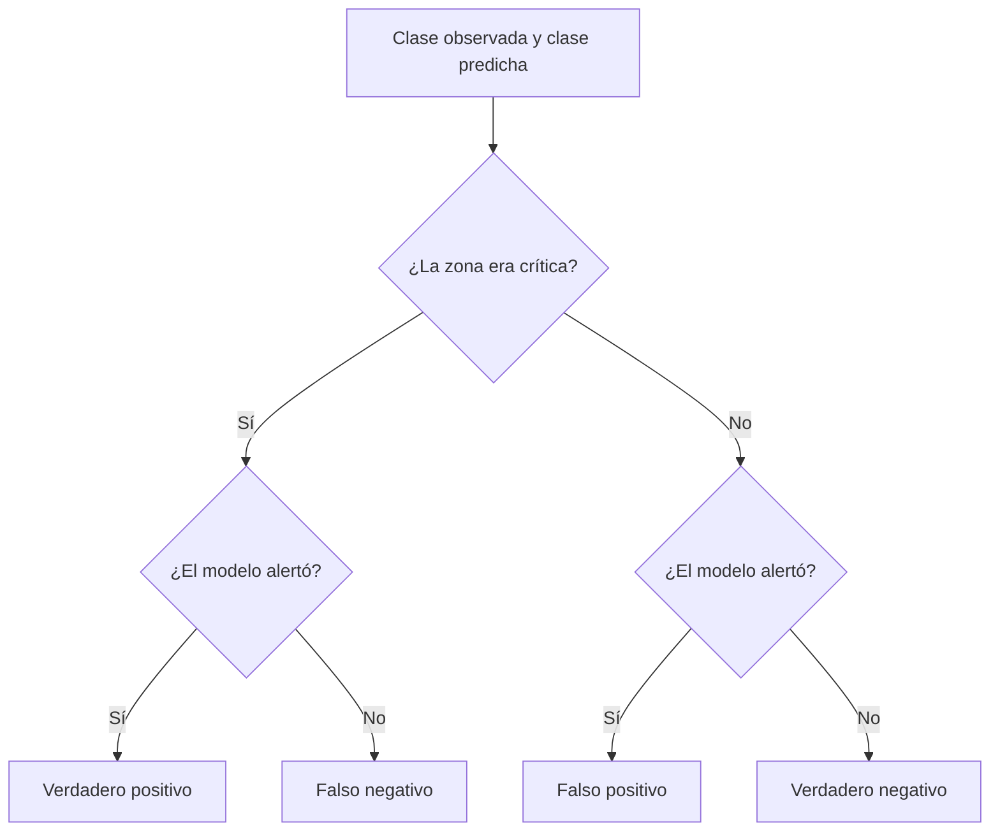

# Matriz de confusión

## ¿Qué errores comete un clasificador?

La matriz de confusión compara clases reales y predichas. No solo cuenta aciertos: distingue omisiones de falsas alarmas. Confundir una zona crítica con no crítica puede costar más que alertar innecesariamente. La evaluación debe responder a ese costo, no únicamente al porcentaje global de aciertos.

## Estructura binaria

Definimos «zona crítica» como clase positiva y colocamos **real en filas, predicho en columnas**. Algunos programas presentan otra orientación: comprobar siempre sus etiquetas.

| | Predicho positivo | Predicho negativo |
|---|---:|---:|
| Real positivo | Verdadero positivo (VP) | Falso negativo (FN) |
| Real negativo | Falso positivo (FP) | Verdadero negativo (VN) |

- **VP:** se detecta una zona realmente crítica.
- **FN:** no se alerta una zona que necesitaba atención.
- **FP:** se prioriza una zona que no era crítica.
- **VN:** se descarta correctamente una zona estable.

![[99 - Recursos/grafica-matriz-confusion.svg]]

**Lectura:** filas = realidad; columnas = predicción. VP y VN son aciertos, FN omite positivos y FP genera falsas alarmas. No hay magnitudes representadas por área o color: son cuatro categorías. **Conclusión:** identifique primero orientación y clase positiva antes de dividir. **Límite:** el esquema no evalúa un modelo ejecutado ni localiza errores. Fuente: gráfico didáctico original GeoIA; marco de clasificación de Esri 3.6, citado al final.

## Del conteo a las métricas

$$Accuracy=\frac{VP+VN}{VP+VN+FP+FN},\qquad Precision=\frac{VP}{VP+FP}.$$

$$Recall=\frac{VP}{VP+FN},\qquad F1=2\frac{Precision\,Recall}{Precision+Recall}=\frac{2VP}{2VP+FP+FN}.$$

Precision evalúa la confiabilidad de las alertas; recall o sensibilidad evalúa la cobertura de los positivos reales. F1 equilibra ambas mediante su media armónica, pero no incorpora verdaderos negativos ni costos específicos. Si un denominador es cero, la métrica correspondiente no está definida matemáticamente: declarar cómo lo trata el software, no interpretar un valor de sustitución como evidencia.

## Ejemplo hipotético con 100 zonas

| | Predicho crítico | Predicho no crítico |
|---|---:|---:|
| Real crítico | 18 | 7 |
| Real no crítico | 10 | 65 |

Aquí VP = 18, FN = 7, FP = 10 y VN = 65.

$$Accuracy=\frac{18+65}{100}=0.83,$$
$$Precision=\frac{18}{28}\approx0.64,\qquad Recall=\frac{18}{25}=0.72,$$
$$F1=\frac{36}{36+10+7}\approx0.679.$$

El modelo acierta el 83 % globalmente, pero solo el 64 % de sus alertas es correcto y detecta el 72 % de las zonas críticas. Si omitirlas tiene un costo alto, el recall puede pesar más que accuracy. No es una autorización para ignorar la capacidad disponible para atender falsas alarmas.

![[99 - Recursos/clase-06-matriz-confusion.svg]]

**Lectura:** las filas representan realidad y las columnas predicción; las celdas verdes son aciertos y las naranjas errores. La figura reproduce VP = 18, FN = 7, FP = 10 y VN = 65 de la tabla anterior. **Conclusión:** el total de aciertos no resume el costo de las omisiones. **Límite:** ejemplo didáctico, no resultado de un clasificador ejecutado para Coiba. Fuente: elaboración docente de matriz binaria; contexto de evaluación en Esri, ArcGIS Pro 3.6, «How…».

## Volver al mapa

La matriz no informa **dónde** se producen los errores. Preguntar si los FN se concentran en zonas rurales, bordes administrativos o áreas poco muestreadas; si los FP aparecen en transiciones de cobertura; si las clases minoritarias quedan ocultas; y si el umbral corresponde al costo real de equivocarse.

En problemas multiclase hay una fila y una columna por categoría: revisar pares de clases confundidas y número de ejemplos de cada una. Una accuracy alta puede coexistir con fracaso completo en la categoría operativamente importante. La biomasa continua requiere métricas de regresión; convertirla en clases exige justificar los umbrales.

Relaciones: [[Aprendizaje supervisado]], [[Random Forest]], [[Validación de modelos supervisados]], [[Métricas de evaluación de modelos]] y [[Analítica predictiva]].

## Referencias y contexto

- Esri. *How Forest-based and Boosted Classification and Regression works*. ArcGIS Pro 3.6, evaluación de clasificación. https://pro.arcgis.com/en/pro-app/3.6/tool-reference/spatial-statistics/how-forest-works.htm. Consulta documentada: 2026-09-21.
- Bibliografía conservada, sin nueva consulta: scikit-learn, *confusion_matrix*, https://scikit-learn.org/stable/modules/generated/sklearn.metrics.confusion_matrix.html, y *Classification metrics*, https://scikit-learn.org/stable/modules/model_evaluation.html#classification-metrics; Fawcett, T. (2006), *An introduction to ROC analysis*, https://doi.org/10.1016/j.patrec.2005.10.010.

Aplicación: [[2026-09-21 - Clase 04 - Aprendizaje supervisado y Random Forest geoespacial|Clase 04]]. Los cálculos son ilustrativos, no métricas observadas de una ejecución nueva.
