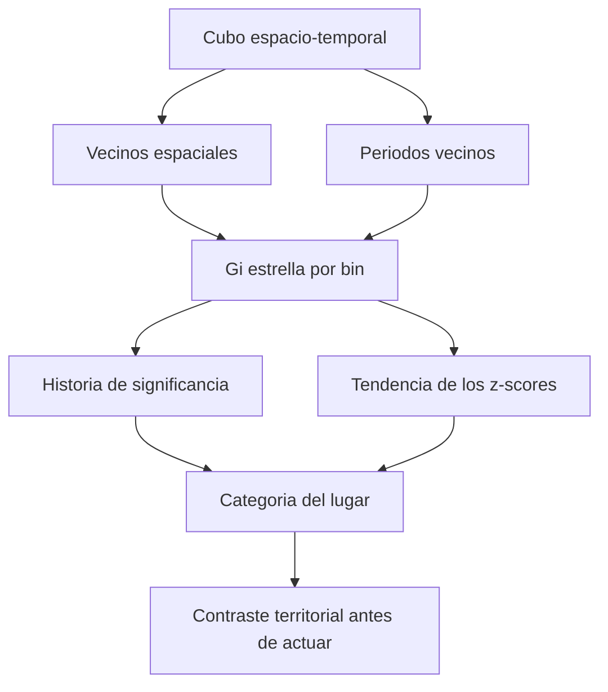

# Minería de patrones espacio-temporales

Un mapa acumulado puede mostrar dónde ocurrieron muchos incidentes y ocultar cuándo ocurrieron. Una zona pudo ser crítica al inicio del periodo y otra apenas al final. La **minería de patrones espacio-temporales** busca estructuras que combinan lugar y tiempo: describe la historia de las ubicaciones, no solo el aspecto de un mapa.

En ArcGIS Pro, el [[Cubo espacio-temporal]] organiza esas observaciones y [[Emerging Hot Spot Analysis]] permite preguntar si una concentración significativa es nueva, persistente, intensificada, decreciente, esporádica u oscilante [E1, introducción y categorías](#referencias).

## La historia necesita dos contextos

![[../99 - Recursos/grafica-mineria-patrones-espacio-temporales.svg]]

**Lectura:** el cubo, la vecindad espacial y la temporal alimentan una prueba y una clasificación. Las cajas no son una escala de intensidad. **Conclusión:** cambiar el contexto espacial o temporal puede cambiar la respuesta. **Límite:** la categoría no explica la causa. Gráfica conceptual migrada de Clase 15, basada en E1.

El componente espacial pregunta qué ocurre alrededor; el temporal, qué ocurrió en periodos comparables. En el análisis emergente los vecinos temporales se buscan hacia atrás. Un valor de dos pasos añade dos periodos anteriores al actual; no utiliza periodos futuros [E1, Neighborhood defaults](#referencias).

## De las categorías a preguntas útiles

| Categoría | Lectura inicial | Pregunta operativa |
| --- | --- | --- |
| Nuevo hot spot | Concentración caliente significativa en el último periodo, no antes. | ¿Cambió el fenómeno o su registro? |
| Persistente | Significativo caliente en al menos 90 % de periodos, sin tendencia discernible del agrupamiento. | ¿Hay condiciones estructurales que convenga investigar? |
| Intensificado | Predomina el patrón caliente y el agrupamiento se fortalece significativamente. | ¿Qué está cambiando en el territorio y su exposición? |
| Esporádico | Apariciones intermitentes de significancia caliente, sin episodios fríos. | ¿Hay eventos puntuales, estacionalidad o cambios de reporte? |
| Oscilante | El último periodo es caliente y hubo significancia fría antes. | ¿Qué explica el cambio de signo? |
| Frío persistente | Concentración baja sostenida respecto del contexto. | ¿Menor ocurrencia, menor exposición o subregistro? |

Esta lectura abre preguntas; no sustituye las reglas completas de [[Emerging Hot Spot Analysis]]. En particular, **intensificación del agrupamiento no es sinónimo de crecimiento del conteo bruto** [E1, categorías](#referencias).

## Hipótesis e interpretación

La [[Hipótesis nula espacial]] recuerda que ver un grupo no equivale a demostrarlo. Aquí hay varios niveles: Gi* evalúa concentración local; Mann-Kendall evalúa tendencia; las reglas combinan historia y significancia. No hay una única prueba genérica de «mapa aleatorio» que explique todo el procedimiento.

Un resultado global no significativo no borra heterogeneidad local. Un resultado local significativo tampoco identifica una causa ni convierte una categoría en pronóstico. La [[Autocorrelación espacial global (Moran's I)]] y [[Hot spots Getis-Ord Gi Star|Gi*]] deben interpretarse según sus distintas preguntas.

## Caso aplicado y decisiones

La fuente de la [[../01 - Clases/2026-09-16 - Clase 03 - Cubos espacio-temporales y patrones emergentes|Clase 03]] estudió siniestros viales de Bogotá en 14 intervalos semestrales. El resultado histórico distinguió ubicaciones persistentes, intensificadas, oscilantes y frías; sus tablas y mapas se conservan en la clase, sin atribuirlos a ejecución actual.

La pregunta final permanece: con recursos limitados, ¿dónde conviene investigar primero? Un patrón persistente puede señalar una necesidad sostenida y uno intensificado un cambio reciente del agrupamiento. Pero un mapa de conteos no contiene por sí mismo la gravedad, los viajes realizados, la población expuesta ni el costo de intervenir. Priorizar requiere ese contexto; evaluar eficacia exige un diseño más fuerte que comparar colores antes y después.

## Riesgos que conviene recordar

- Bins muy grandes pueden ocultar cambios locales; intervalos inadecuados pueden borrar o exagerar señales.
- Una primera o última ventana incompleta puede introducir sesgo temporal.
- El área de análisis debe corresponder a dónde el fenómeno puede ocurrir.
- Los cold spots no demuestran éxito de una política.
- La comparación entre [[Optimized Hot Spot Analysis]] y el análisis emergente requiere reconocer que uno acumula y el otro conserva historia.

## Referencias

- **E1. Esri.** *How Emerging Hot Spot Analysis works*. ArcGIS Pro **3.6**, introducción, categorías y Neighborhood defaults; consulta 2026-09-17. <https://pro.arcgis.com/en/pro-app/3.6/tool-reference/space-time-pattern-mining/learnmoreemerging.htm>.

## Procedencia y estado

BORRADOR migrado de `../diplomado_geoia/02 - Conceptos/Minería de patrones espacio-temporales.md`, Clase 15, 2026-06-25, docente fuente José Sebastián Gómez Romero. Se conserva el paso del mapa a la historia y la discusión de prioridades; se precisan inferencia y categorías con E1. Video con cobertura directa parcial; sin resultados nuevos.
