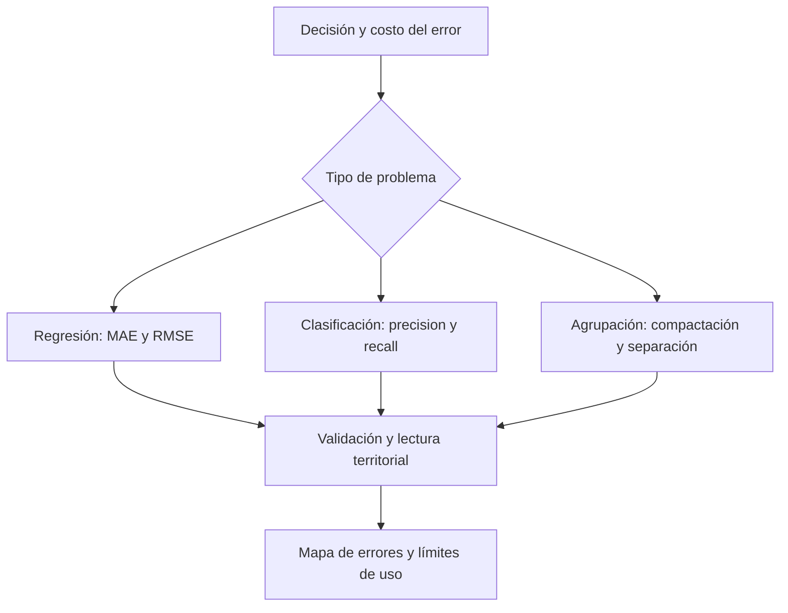

# Métricas de evaluación de modelos

## Una medida responde a una decisión

Las métricas cuantifican error, ajuste, clasificación, estabilidad o separación de grupos. No certifican que un modelo sea «bueno» en abstracto: informan su utilidad para **una pregunta, una respuesta, una escala territorial y una decisión**.

Para decidir si llevar paraguas interesa detectar lluvia; para dimensionar alcantarillado, estimar volumen; para emergencias, no omitir eventos extremos aunque haya falsas alarmas. Elegir métricas es parte del diseño, no un trámite posterior.

## Regresión: magnitud, sesgo y ajuste

Para $n$ observaciones, $e_i=y_i-\hat y_i$ es el residual. Con esta convención, un error positivo indica subestimación.

$$MAE=\frac{1}{n}\sum_i|e_i|,\qquad RMSE=\sqrt{\frac{1}{n}\sum_i e_i^2},\qquad ME=\frac{1}{n}\sum_i e_i.$$

$$R^2=1-\frac{\sum_i(y_i-\hat y_i)^2}{\sum_i(y_i-\bar y)^2}.$$

| Métrica | Lectura | Precaución |
|---|---|---|
| MAE | Error absoluto promedio en unidades del objetivo | No destaca tanto los errores extremos |
| RMSE | Error en esas mismas unidades, con mayor peso de errores grandes | Puede estar dominado por pocos extremos |
| MAPE | Promedio de errores absolutos relativos, multiplicado por 100 | Indefinido con valores reales cero e inestable cerca de cero |
| Error medio (ME) | Dirección del sesgo | Errores de signo opuesto se cancelan |
| R² | Mejora respecto de predecir la media en el conjunto evaluado | Puede ser negativo fuera de muestra; no es causalidad |
| R² ajustado | Ajuste penalizado por cantidad de variables en modelos lineales | No sustituye validación ni diagnóstico residual |
| AIC/AICc | Equilibrio relativo de ajuste y complejidad en modelos con formulación compatible | No es error predictivo; no comparar respuestas o datasets incompatibles |

R² no está definido por esta fórmula cuando la respuesta no varía. Para regresión lineal con $p$ predictores y $n>p+1$, $R^2_{aj}=1-(1-R^2)(n-1)/(n-p-1)$; no trasladar mecánicamente esta penalización a [[Random Forest]].

**Ejemplo hipotético:** MAE = 2 muertes significa dos muertes de error absoluto promedio. RMSE = 7, para el mismo conjunto, sugiere errores grandes: corresponde localizarlos, no solo informar un número.

![[99 - Recursos/clase-06-errores-prediccion.svg]]

**Lectura:** comparar barras verdes (observado) y naranjas (predicho) en el eje horizontal de unidades de respuesta. P2 sobreestima y P1/P3 subestiman; el signo corresponde a observado menos predicho. **Conclusión:** una buena tendencia general puede esconder extremos mal predichos. **Límite:** la gráfica es didáctica e hipotética, no una evaluación ejecutada de Coiba. Fuente: elaboración docente; marco de entrenamiento y evaluación de Esri, ArcGIS Pro 3.6, «How…».

## Clasificación: no todos los errores cuestan igual

| Métrica | Pregunta | Uso y límite |
|---|---|---|
| Accuracy | ¿Qué proporción total se clasificó bien? | Puede ocultar fracaso en clases minoritarias |
| Precision | De las alertas positivas, ¿cuántas eran correctas? | Importa cuando los falsos positivos son costosos |
| Recall/sensibilidad | De los positivos reales, ¿cuántos se detectaron? | Importa cuando omitir casos es grave |
| F1 | ¿Cómo se equilibran precision y recall? | No incluye verdaderos negativos ni todos los costos |
| AUC-ROC | ¿Cómo se ordenan positivos frente a negativos a diferentes umbrales? | Requiere puntuaciones; no demuestra calibración |
| [[Matriz de confusión]] | ¿Qué clases se confunden y cuántas veces? | Leer soporte y orientación de filas/columnas |

En priorización de brotes, recall alto reduce omisiones, aunque pueda aumentar falsas alarmas. Precision alta hace las alertas más confiables, pero no garantiza encontrar todos los casos. Deben revisarse ambas y explicar el umbral de decisión. Véase [[Validación de modelos supervisados]].

## Agrupación sin etiquetas

| Criterio | Qué indica | Cómo interpretarlo |
|---|---|---|
| Inercia | Compactación dentro de grupos | Disminuye al aumentar $k$; no basta por sí sola |
| Codo | Mejora decreciente al aumentar grupos | Orienta, no determina una única solución |
| Silhouette | Separación y cohesión | Su utilidad depende de distancias, forma y densidad |
| Validación externa | Sentido experto, territorial u operativo | Comprueba si los grupos permiten actuar |

Un grupo debe poder describirse —«zonas periurbanas con vulnerabilidad alta y baja accesibilidad»—, no quedar reducido a «cluster 3». Estas medidas no sustituyen métricas de predicción supervisada ni se aplican indistintamente a cualquier algoritmo.

## Diagnóstico espacial

| Diagnóstico | Pregunta |
|---|---|
| Mapa de residuales | ¿Dónde se sobreestima y dónde se subestima? |
| Moran de residuales | ¿Persisten errores espacialmente relacionados bajo la vecindad elegida? |
| Puntos calientes de residuales | ¿Hay concentraciones de errores altos o bajos? |
| AICc en modelos compatibles | ¿Qué especificación equilibra ajuste y complejidad, junto con la teoría? |

Moran significativo puede señalar estructura omitida, pero no identifica por sí solo la variable faltante ni valida el modelo. AICc es comparación relativa, no medida de dependencia espacial; contrastar OLS y modelos espaciales exige coherencia de datos, respuesta y verosimilitud.

En un ejercicio de lesiones personales, examinar observado/predicho se complementa con la posible subestimación de municipios extremos y el mapa residual. Un RMSE global favorable puede esconder fallas en barrios vulnerables, zonas rurales, bordes administrativos o áreas poco muestreadas; ello afecta la equidad y utilidad de la decisión.

![[99 - Recursos/grafica-evaluacion-espacial-modelo.svg]]

**Lectura:** el panel izquierdo ejemplifica métricas globales y el derecho localiza residuales: rojo indica subestimación y azul sobreestimación bajo observado menos predicho. **Conclusión:** un promedio no informa dónde falla el modelo. **Límite:** 18,9, 55,0 y 0,87 son valores del recurso ilustrativo, no métricas nuevas de Coiba; el mapa no tiene escala geográfica ni localizaciones reales. Fuente: gráfico didáctico original GeoIA; contexto de evaluación en Esri 3.6, citado al final.

## Elegir antes de ajustar

1. Precisar si se busca predecir, detectar, segmentar, explicar o intervenir.
2. Definir costos: falsos positivos, falsos negativos, errores grandes y sesgo territorial.
3. Elegir métricas alineadas con esos costos.
4. Interpretarlas con mapas, residuales y conocimiento del fenómeno.
5. Documentar qué se optimizó y qué quedó fuera.

Relaciones: [[Aprendizaje supervisado]] define el tipo de respuesta; [[Analítica predictiva]] conecta evaluación con decisión; [[Random Forest]] aporta un modelo posible, no una métrica universal.

## Referencias y contexto

- Esri. *How Forest-based and Boosted Classification and Regression works*. ArcGIS Pro 3.6, entrenamiento y evaluación. https://pro.arcgis.com/en/pro-app/3.6/tool-reference/spatial-statistics/how-forest-works.htm. Consulta documentada: 2026-09-21.
- Bibliografía de ampliación conservada, sin nueva consulta: Esri, *Regression analysis basics*, https://pro.arcgis.com/en/pro-app/latest/tool-reference/spatial-statistics/regression-analysis-basics.htm; *Ordinary Least Squares*, https://pro.arcgis.com/en/pro-app/latest/tool-reference/spatial-statistics/ordinary-least-squares.htm; scikit-learn, *Model evaluation*, https://scikit-learn.org/stable/modules/model_evaluation.html, y *Clustering performance evaluation*, https://scikit-learn.org/stable/modules/clustering.html#clustering-performance-evaluation.

Aplicación: [[2026-09-21 - Clase 04 - Aprendizaje supervisado y Random Forest geoespacial|Clase 04]]. Definiciones y ejemplos docentes; no se presentan métricas de una ejecución nueva.
