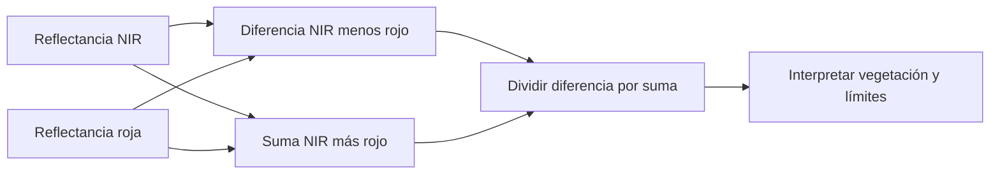

# NDVI

## Contrastar absorción roja y reflexión infrarroja

El **Normalized Difference Vegetation Index** compara el infrarrojo cercano (NIR), que la vegetación suele reflejar con fuerza, con el rojo, absorbido por la clorofila. La normalización hace el contraste relativo a la suma de ambas señales, pero no elimina todas las influencias de suelo o atmósfera.

$$NDVI=\frac{NIR-Red}{NIR+Red}.$$

La fórmula corresponde al método NDVI de Esri, *Band Arithmetic*, ArcGIS Pro 3.6. Para reflectancias no negativas y suma distinta de cero, su rango matemático es −1 a 1. En productos Landsat 8/9 la correspondencia usual es NIR = B5 y rojo = B4, por lo que resulta $(B5-B4)/(B5+B4)$; comprobar siempre el orden del producto o compuesto utilizado. La atribución de esta correspondencia a USGS se conserva en la referencia técnica.

Si la suma es cero, el índice no está definido. NoData no equivale a ausencia de vegetación ni debe sustituirse automáticamente por cero.

## Ejemplo manual

Para NIR = 0.52 y Red = 0.06:

$$NDVI=\frac{0.52-0.06}{0.52+0.06}=\frac{0.46}{0.58}\approx0.793.$$

El contraste es compatible con vegetación verde marcada. No significa «79.3 % de biomasa» ni determina una cantidad de toneladas por hectárea.

![[99 - Recursos/grafica-indices-teledeteccion-formulas.svg]]

**Lectura:** localizar NDVI y comparar su diferencia normalizada con el cociente simple y con los términos correctivos de EVI/SAVI. **Conclusión:** NDVI expresa contraste relativo rojo–NIR, no cantidad absoluta de material vegetal. **Límite:** la gráfica explica fórmulas; no fija umbrales locales ni valida una imagen. Fuente: recurso docente de índices; fórmula verificada en Esri 3.6, «Band Arithmetic», NDVI.

![[99 - Recursos/grafica-indice-ndvi.svg]]

**Lectura:** la tarjeta vincula fórmula, bandas Landsat 8/9 y saturación. No representa un mapa ni una escala de biomasa. **Conclusión:** el contraste normalizado informa sobre verdor. **Límite:** un valor alto no distingue necesariamente incrementos de biomasa en bosque denso. Fuente: gráfico didáctico original GeoIA; fórmula en Esri 3.6, «Band Arithmetic», y atribución Landsat a USGS, citadas al final.

## Interpretación y cautelas

- Valores negativos pueden asociarse con agua u otras superficies, sombras y condiciones atmosféricas; no son un clasificador universal de agua.
- Valores de 0 a 0.2 suelen ser compatibles con suelo desnudo o vegetación escasa, según contexto.
- Valores altos suelen indicar vegetación verde, pero no necesariamente más biomasa leñosa.

Los rangos son orientativos, no umbrales universales. En bosque denso y alto índice de área foliar (LAI), NDVI puede saturarse: un incremento de estructura o biomasa produce poco cambio espectral. También influyen suelo visible, atmósfera, sombras y geometría solar; el índice no describe directamente estructura vertical.

## Uso en Coiba

NDVI aporta un predictor de vigor vegetal, no una medición de [[Biomasa aérea sobre el suelo (AGBD)]]. Una importancia baja en una corrida puede resultar de saturación, redundancia con bandas rojo/NIR u otros índices, correlación o escala de muestreo. [[Importancia de variables]] orienta la investigación, no el descarte automático.

[[EVI]] introduce términos adicionales y [[SAVI]] ajusta el fondo del suelo; la comparación se desarrolla en [[Índices de teledetección]]. Los tres pueden formar parte de [[Rasters explicativos]], sujetos a fechas, alineación y validación.

## Referencias y contexto

- Esri. *Band Arithmetic function*. ArcGIS Pro 3.6, NDVI. https://pro.arcgis.com/en/pro-app/3.6/help/analysis/raster-functions/band-arithmetic-function.htm. Consulta documentada: 2026-09-21.
- Referencias técnicas conservadas, sin nueva consulta: USGS, *Landsat Normalized Difference Vegetation Index*, https://www.usgs.gov/landsat-missions/landsat-normalized-difference-vegetation-index; NASA Earth Observatory, *Measuring Vegetation (NDVI & EVI)*, https://earthobservatory.nasa.gov/Features/MeasuringVegetation/.
- Créditos fundacionales conservados, sin nueva consulta: Rouse et al. (1974), *Monitoring Vegetation Systems in the Great Plains with ERTS*, https://ntrs.nasa.gov/citations/19740022614; Tucker (1979), *Red and photographic infrared linear combinations for monitoring vegetation*, https://doi.org/10.1016/0034-4257(79)90013-0; Zeng et al. (2022), *Optical vegetation indices for monitoring terrestrial ecosystems globally*, https://doi.org/10.1038/s43017-022-00298-5.

Aplicación: [[2026-09-21 - Clase 04 - Aprendizaje supervisado y Random Forest geoespacial|Clase 04]]. Ejemplo hipotético; no cálculo nuevo sobre rasters.
