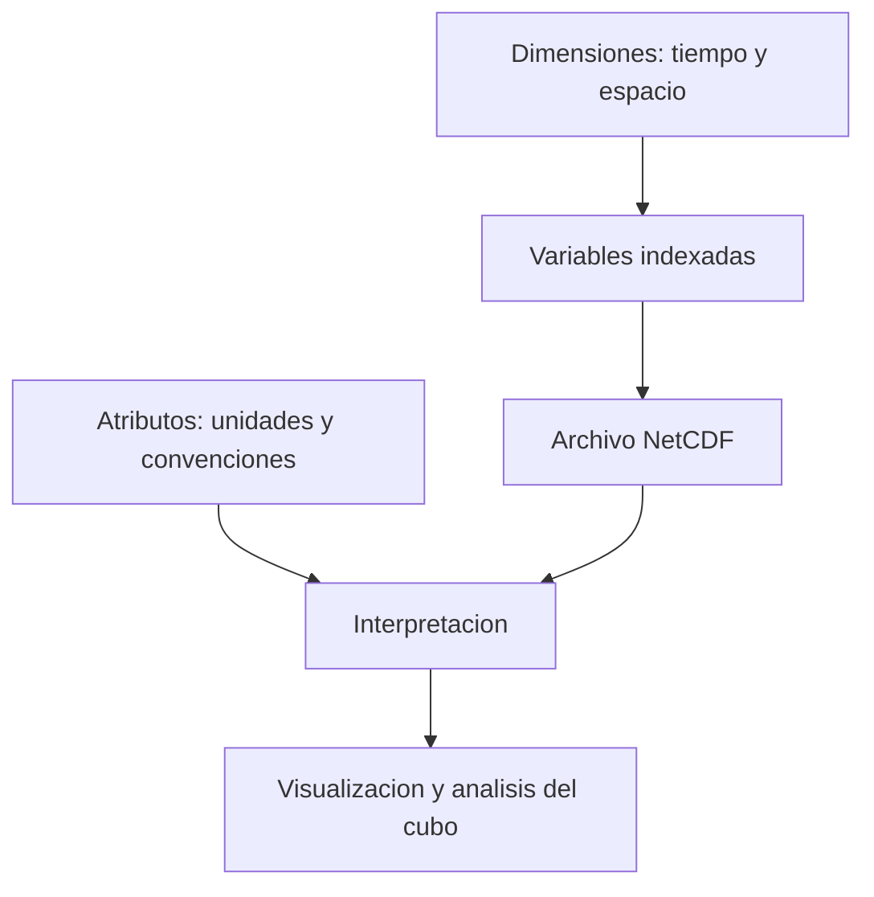

# NetCDF

¿Cómo guardar una observación que pertenece a un lugar y a un periodo sin perder esas dos relaciones? **NetCDF**, *Network Common Data Form*, ofrece formatos y bibliotecas para datos científicos organizados como arreglos. Es autodescriptivo: junto a los valores conserva información para interpretarlos. No es simplemente una hoja de cálculo con otra extensión [U1, presentación y propiedades](#referencias).

## Dimensiones, variables y atributos

Una dimensión define un eje de organización, como tiempo, x o y. Una **variable** contiene valores indexados por dimensiones: por ejemplo, `COUNT[tiempo, y, x]`. Los **atributos** describen significado, unidades o convenciones. Tener varias variables no implica que «variable» sea otra dimensión del archivo: hay que inspeccionar su estructura, no adivinarla por el nombre [U1](#referencias).

![[../99 - Recursos/clase-03-netcdf.svg]]

**Lectura:** la matriz ilustrativa tiene ubicaciones A/B y periodos t1/t2/t3; cada intersección contiene un conteo hipotético. Las etiquetas laterales representan metadatos, no nuevos eventos. **Conclusión:** un mismo archivo puede conservar los valores y las instrucciones para leerlos. **Límite:** la matriz simplifica un cubo real y no reproduce el orden físico de sus dimensiones. Elaboración docente basada en U1 y en la estructura documentada de las entradas locales.

## En los cubos espacio-temporales

ArcGIS Pro guarda el [[Cubo espacio-temporal]] en NetCDF. Conserva la organización espacial y temporal, `COUNT` y otras variables resumidas; herramientas posteriores pueden incorporar resultados. Un archivo `.nc` cualquiera no es necesariamente un cubo compatible con Space Time Pattern Mining: formato y estructura esperada por una herramienta no son sinónimos [E1, Summary y Usage](#referencias).

En la práctica histórica de siniestros se usó `cubo_espacio_temporal_accidentes.nc`. La entrada local está en `99 - Recursos/datos/clase_03/` y sus dimensiones observadas son `time=14`, `x=57`, `y=166`; contiene ya variables `EMERGING_COUNT_*`. La [[../99 - Recursos/datos/clase_03/README|procedencia de las entradas]] explica las coordenadas temporales y una discrepancia conservada entre atributos de proyección. No se corrigió silenciosamente.

## Un archivo de entrada que una herramienta puede modificar

**Emerging Hot Spot Analysis añade variables al cubo recibido y reemplaza resultados anteriores si ya existen.** Por eso el flujo de [[../01 - Clases/2026-09-16 - Clase 03 - Cubos espacio-temporales y patrones emergentes|Clase 03]] exige una copia en salidas antes de ejecutar esa operación. Nunca se le pasa el NetCDF de entradas ni el original [E2, Tool outputs](#referencias).

Esto distingue tres estados: cubo histórico de solo lectura, copia de trabajo y resultado del análisis actual. Copiar un archivo con resultados antiguos no constituye una ejecución nueva; crear un cubo nuevo desde los puntos tampoco garantiza que coincida con el histórico si cambian extensión, alineación o parámetros.

## Precauciones prácticas

- Leer dimensiones, variables y atributos antes de interpretar números.
- Separar fechas de eventos, etiquetas de intervalos y unidades de la coordenada temporal.
- Conservar un reporte de descripción: es más útil que inferir parámetros por una imagen.
- Recordar que bins muy pequeños y periodos muy cortos aumentan el volumen de datos.
- No convertir automáticamente ceros en nulos ni nulos en ceros: representan situaciones diferentes.

[[Ingeniería de datos geoespaciales]] conecta estas comprobaciones con la calidad de entrada; [[Emerging Hot Spot Analysis]] explica qué resultados se incorporan al archivo.

## Referencias

- **U1. NSF Unidata.** *NetCDF*. Presentación y lista de propiedades; página institucional sin versión de documento, consulta 2026-09-17. <https://www.unidata.ucar.edu/software/netcdf>. Las versiones de bibliotecas anunciadas no certifican la versión instalada localmente.
- **E1. Esri.** *Create Space Time Cube By Aggregating Points*. ArcGIS Pro **3.6**, Summary y Usage; consulta 2026-09-17. <https://pro.arcgis.com/en/pro-app/3.6/tool-reference/space-time-pattern-mining/create-space-time-cube.htm>.
- **E2. Esri.** *How Emerging Hot Spot Analysis works*. ArcGIS Pro **3.6**, Tool outputs; consulta 2026-09-17. <https://pro.arcgis.com/en/pro-app/3.6/tool-reference/space-time-pattern-mining/learnmoreemerging.htm>.

## Procedencia y estado

BORRADOR migrado de `../diplomado_geoia/02 - Conceptos/NetCDF.md`, relacionado con la Clase 15 del 2026-06-25, docente fuente José Sebastián Gómez Romero. Se conserva la explicación multidimensional y se precisa la distinción dimensión/variable y la mutación del cubo con las fuentes leídas. No se ejecutó análisis nuevo.
