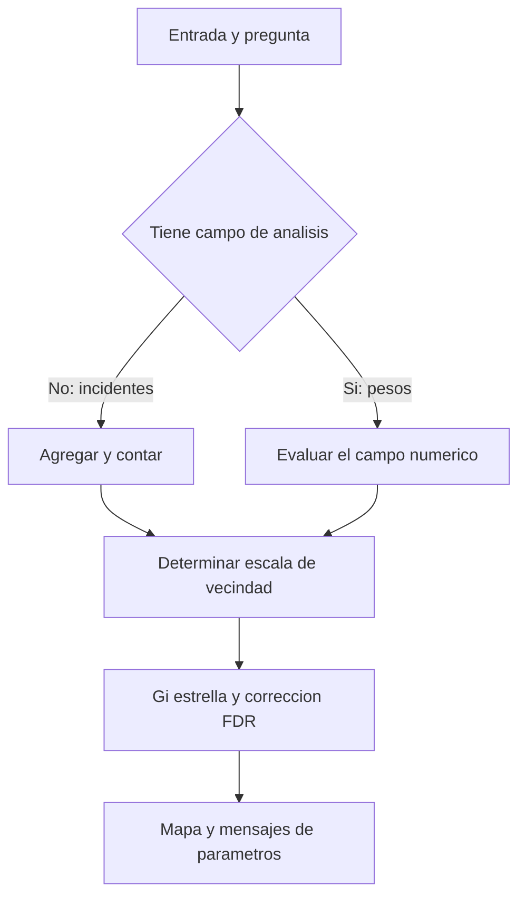

# Optimized Hot Spot Analysis

**Optimized Hot Spot Analysis** crea un mapa de puntos calientes y fríos estadísticamente significativos mediante [[Hot spots Getis-Ord Gi Star|Getis-Ord Gi*]]. Automatiza decisiones como agregación de incidentes, tamaño de celda y escala de análisis. Es útil para una primera lectura espacial, pero «optimizado» no significa que la herramienta conozca la pregunta territorial ni que haya encontrado una escala universal [E1, Summary y Usage](#referencias).

## Eventos o entidades ponderadas

Hay dos entradas distintas. Si cada punto representa un incidente, la herramienta puede agregar puntos y contar cuántos hay por unidad. Si cada punto ya tiene un peso, como `ICOUNT` de Collect Events, ese campo expresa cuántos eventos representa la ubicación. Omitirlo cambiaría la pregunta: se contarían ubicaciones agregadas en vez de analizar sus pesos [E1, Usage: Analysis Field](#referencias).

![[../99 - Recursos/grafica-optimized-hot-spot-analysis.svg]]

**Lectura:** el flujo muestra la ruta de incidentes sin campo de análisis: agregación, escala, Gi* y mapa. Las flechas describen operaciones, no causalidad. **Conclusión:** la unidad sobre la que aparece el resultado puede ser distinta del punto original. **Límite:** para entidades ya ponderadas no se repite obligatoriamente la agregación dibujada. Gráfica migrada de Clase 15, interpretada según E1.

## Parámetros críticos

| Parámetro | Función | Pregunta que debe resolver el analista |
| --- | --- | --- |
| Input Features | Eventos o entidades ponderadas. | ¿Representan el mismo fenómeno y cobertura? |
| Analysis Field | Variable numérica evaluada. | ¿Conteo, tasa, media o índice? ¿Qué significa? |
| Incident Data Aggregation Method | Malla o polígonos para contar incidentes. | ¿Cuál es una unidad territorial defendible? |
| Bounding Polygons | Dónde los incidentes son posibles. | ¿Un cero significa ausencia observada o imposibilidad? |
| Cell Size | Resolución de agregación. | ¿Qué detalle se conserva? |
| Distance Band | Vecindad del cálculo. | ¿A qué escala se comparan valores? |

Sin polígono de posibilidad, las opciones de malla conservan solo celdas con incidentes; con él pueden incluir celdas con cero dentro del área definida. Esta decisión cambia el universo de comparación. No se debe dibujar un límite por comodidad ni interpretar toda zona vacía como cero observado [E1, Usage](#referencias).

## Leer los campos de salida

| Campo | Lectura |
| --- | --- |
| `GiZScore` | Signo y fuerza del agrupamiento local, expresados como z-score. |
| `GiPValue` | p-value del contraste local; no es probabilidad de que la hipótesis sea verdadera. |
| `Gi_Bin` | −3/−2/−1: frío al 99/95/90 %; 0: no significativo; +1/+2/+3: caliente al 90/95/99 %. |
| `NNeighbors` | Número de vecinos usados. |
| Campo de conteo | Peso agregado de incidentes, cuando corresponde; revisar su nombre real. |

**Precisión importante:** en esta herramienta, `Gi_Bin` incorpora corrección FDR por múltiples pruebas y dependencia espacial; `GiZScore` y `GiPValue` no contienen esa corrección. No volver a clasificar únicamente el p-value y presentar esa clasificación como si fuera `Gi_Bin` [E1, Usage](#referencias).

## Tres contrastes históricos, en su orden

La [[../01 - Clases/2026-09-16 - Clase 03 - Cubos espacio-temporales y patrones emergentes|Clase 03]] conserva los contrastes del notebook fuente de Clase 15, no nuevas ejecuciones:

1. **Siniestros desde 2020:** 871 polígonos; 553 significativos, incluidos 237 calientes y 120 fríos al 99 %. La selección temporal produce una lectura acumulada reciente, no categorías emergentes.
2. **Colegios:** 9.911 puntos ponderados; 3.627 significativos. `ICOUNT` representa eventos agregados y no matrículas ni cobertura educativa. La distancia 16.625,3004 m se conserva como resultado reportado en la nota fuente, no como recomendación general.
3. **Abejas:** 1.918 puntos ponderados y cero entidades significativas en aquella configuración. No se deben cambiar parámetros hasta fabricar un mapa rojo.

Las tablas históricas están enlazadas e interpretadas en la nota de clase. Su comparación con [[Emerging Hot Spot Analysis]] es conceptual: OHA pregunta por concentración espacial; Emerging conserva la historia del [[Cubo espacio-temporal]].

## Límites

Los conteos pueden reflejar exposición, densidad de actividad y reporte; no equivalen a riesgo individual. La corrección FDR controla una fuente de falsos descubrimientos, pero no elimina sesgo de entrada ni demuestra causalidad. Revisar [[Teselación espacial]] y [[Escala espacial, vecindad y bandas de distancia]] antes de comparar mapas producidos con unidades diferentes.

## Referencias

- **E1. Esri.** *Optimized Hot Spot Analysis*. ArcGIS Pro **3.6**, Summary, Usage, Parameters y Licensing information; consulta 2026-09-17. <https://pro.arcgis.com/en/pro-app/3.6/tool-reference/spatial-statistics/optimized-hot-spot-analysis.htm>.

## Procedencia y estado

BORRADOR migrado de `../diplomado_geoia/02 - Conceptos/Optimized Hot Spot Analysis.md` y de la Clase 15 del 2026-06-25, docente fuente José Sebastián Gómez Romero. Se conservan fundamentos y resultados históricos; la distinción entre FDR y campos z/p se verifica con E1. Sin ejecución nueva ni ampliación de la cobertura parcial del video.
