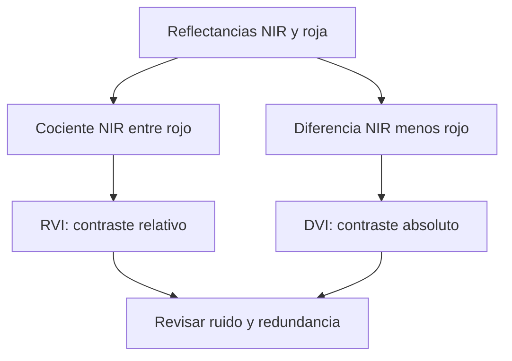

# RVI y DVI

![[99 - Recursos/grafica-indice-rvi-dvi.svg]]

**Lectura:** compare cociente y diferencia; el punto separa las dos fórmulas, no indica multiplicarlas. No comparten escala: RVI es una razón y DVI conserva la escala radiométrica. **Conclusión:** ambas contrastan rojo y NIR de maneras distintas. **Límite:** rojo próximo a cero desestabiliza RVI; DVI depende de la escala. Fuente: gráfico didáctico original GeoIA; Esri 3.6, SR, y crédito a Tucker, citados al final.

## Cociente y diferencia responden preguntas distintas

**RVI (Ratio Vegetation Index)** expresa cuántas veces la reflectancia NIR supera la roja; **DVI (Difference Vegetation Index)** expresa cuánto la supera en la escala radiométrica utilizada.

$$RVI=\frac{NIR}{Red},\qquad DVI=NIR-Red.$$

Aquí RVI corresponde al **Simple Ratio (SR)** de Esri, *Band Arithmetic*, ArcGIS Pro 3.6. La atribución de combinaciones rojo–NIR se conserva en Tucker (1979). La sigla RVI puede tener otros significados en otras familias de sensores: mantener explícita la fórmula.

En la correspondencia habitual Landsat 8/9 son B5/B4 y B5−B4; confirmar el orden real del producto. No son intercambiables con [[NDVI]], que normaliza la diferencia mediante la suma.

## Ejemplo manual hipotético

Con NIR = 0.52 y Red = 0.06:

$$RVI=0.52/0.06\approx8.667,\qquad DVI=0.52-0.06=0.460.$$

RVI dice que NIR es aproximadamente 8.67 veces el rojo; DVI dice que la diferencia es 0.46 en esta escala de reflectancia. Ninguno equivale a una fracción de biomasa.

Si ambas reflectancias se multiplicaran por el mismo factor, RVI no cambiaría, mientras DVI se multiplicaría por ese factor. Esto no autoriza ignorar offsets aditivos ni correcciones del producto. Con rojo cercano a cero, un pequeño error puede alterar mucho RVI; con rojo igual a cero, no está definido.

![[99 - Recursos/grafica-indices-teledeteccion-formulas.svg]]

**Lectura:** comparar cociente simple, diferencia y diferencia normalizada. **Conclusión:** normalizar y restar no conservan la misma sensibilidad a escala o denominadores pequeños. **Límite:** una tabla gráfica de fórmulas no demuestra utilidad predictiva ni comparabilidad entre sensores. Fuente: recurso docente de índices; SR en Esri 3.6 y crédito rojo–NIR de Tucker (1979).

## Interpretación en Coiba

Un RVI alto suele ser compatible con fuerte contraste vegetal; un DVI alto indica gran diferencia NIR−rojo. RVI no está acotado entre −1 y 1 como NDVI bajo reflectancias no negativas. DVI depende de iluminación, calibración y escala. Para comparar fechas o sensores se necesita reflectancia consistente.

Ambos proporcionan señales simples a [[Random Forest]], pero pueden ser redundantes con bandas originales y [[Índices de teledetección]] derivados. Bajo los mismos valores y denominadores válidos, $NDVI=(RVI-1)/(RVI+1)$: no son fuentes independientes de información. Eso no implica que todos los modelos aprovechen idénticamente sus transformaciones.

[[SAVI]] añade un ajuste de suelo que estos índices no incluyen. [[Importancia de variables]] y [[Validación de modelos supervisados]] permiten contrastar su aporte, sin descartarlos ni conservarlos automáticamente por un solo ranking.

## Referencias y contexto

- Esri. *Band Arithmetic function*. ArcGIS Pro 3.6, SR. https://pro.arcgis.com/en/pro-app/3.6/help/analysis/raster-functions/band-arithmetic-function.htm. Consulta documentada: 2026-09-21.
- Créditos conservados, sin nueva consulta: Tucker (1979), *Red and photographic infrared linear combinations for monitoring vegetation*, https://doi.org/10.1016/0034-4257(79)90013-0; Richardson y Wiegand (1977), *Distinguishing vegetation from soil background information*; Bannari et al. (1995), *A review of vegetation indices*, https://doi.org/10.1080/02757259509532298.
- Referencia técnica conservada para bandas, sin nueva consulta: USGS, *Landsat Normalized Difference Vegetation Index*, https://www.usgs.gov/landsat-missions/landsat-normalized-difference-vegetation-index.

Aplicación: [[2026-09-21 - Clase 04 - Aprendizaje supervisado y Random Forest geoespacial|Clase 04]]. Ejemplo hipotético, sin cálculo nuevo sobre imágenes.
