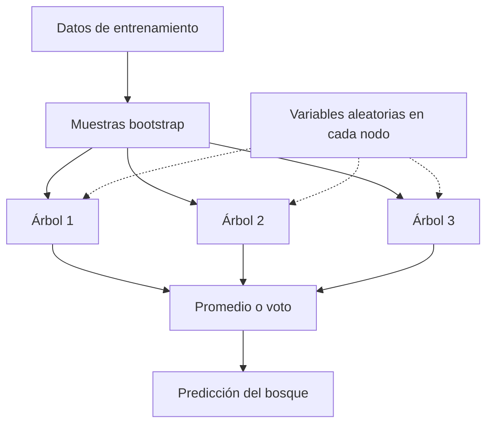

# Random Forest

## Muchos árboles, una predicción

Random Forest es un método de [[Aprendizaje supervisado]] que combina árboles de decisión. En su formulación clásica, cada árbol aprende de una muestra **bootstrap** —muestreo con reemplazo— y considera un subconjunto aleatorio de variables **en cada nodo**, no un único subconjunto fijo para todo el árbol. Los árboles se construyen independientemente, a diferencia del ajuste secuencial de boosting. [Breiman y Cutler, «Random Forests», características y funcionamiento; Esri 3.6, «How…».]

Un árbol pregunta, por ejemplo, «¿qué distancia hay a la bomba?», «¿en qué semana ocurrió?» o «¿qué tipo de vivienda era?». Puede aprender accidentes de la muestra. El bosque se parece a consultar varios analistas con versiones parciales de los datos: combinar respuestas diversas suele reducir la variabilidad. El límite de la analogía es que los árboles no deliberan ni aportan conocimiento causal; todos dependen de la calidad y cobertura de la misma información.

## Cómo se combinan las respuestas

En regresión:

$$\hat y(x)=\frac{1}{T}\sum_{t=1}^{T}\hat y_t(x).$$

En clasificación, una regla habitual es el voto mayoritario:

$$\hat c(x)=\operatorname{mode}\{c_1(x),\ldots,c_T(x)\}.$$

$T$ es el número de árboles. En un ejemplo hipotético, tres árboles predicen 5, 7 y 6 muertes para una ubicación: el promedio es 6. Si se observaron 8, el residual $e=y-\hat y=2$ indica subestimación de dos muertes. Conviene comprobar si ese error se repite en ciertas zonas o perfiles poblacionales, no descartar ni aceptar el modelo por un solo caso.

La diversidad reduce correlación entre errores de árboles. Más árboles no corrigen etiquetas erróneas ni una muestra territorial sesgada.

![[99 - Recursos/grafica-random-forest.svg]]

**Lectura:** siga los tres árboles: 5, 7 y 6 producen promedio 6; frente a 8 observado, el residual es 2. Son cifras ilustrativas, no una corrida de Coiba. Las barras laterales ilustran un ranking parcial: sus longitudes no son una escala calibrada de porcentajes. **Conclusión:** combinar árboles no evita revisar errores. **Límite:** ni el ranking ni más árboles demuestran causalidad. Fuente: gráfico didáctico original GeoIA; fundamentos de Breiman y Cutler citados al final.

## Qué controla el ajuste

| Hiperparámetro | Efecto |
|---|---|
| Número de árboles | Estabilidad del ensamble y costo computacional |
| Profundidad máxima | Complejidad de los árboles; valores altos pueden aprender detalles poco transferibles |
| Tamaño mínimo de hoja | Cantidad mínima de observaciones en nodos terminales |
| Variables muestreadas | Número de candidatas consideradas en cada división |
| Datos por árbol | Fracción o muestra de entrenamiento disponible para cada árbol |

El bosque admite clasificación y regresión, relaciones no lineales e interacciones, y variables numéricas o categóricas según la implementación. Puede ser menos sensible a ciertos atípicos que una regresión lineal simple, pero no es inmune a valores anómalos ni **incapaz de sobreajustarse**. Un modelo lineal sigue siendo útil cuando su estructura e interpretación son pertinentes.

## Del muestreo de Coiba a una superficie

En la [[2026-09-21 - Clase 04 - Aprendizaje supervisado y Random Forest geoespacial|Clase 04]], puntos con biomasa conocida se relacionan con bandas Landsat e índices espectrales. La secuencia conceptual es:

1. Revisar puntos y significado de la biomasa observada.
2. Extraer valores de [[Rasters explicativos]] en las ubicaciones.
3. Entrenar el bosque.
4. Evaluar con muestras reservadas y distinguirlas del error fuera de bolsa.
5. Aplicar las relaciones celda por celda a un raster de biomasa estimada.
6. Revisar [[Importancia de variables]] y distribución espacial del error.

![[99 - Recursos/grafica-biomasa-coiba-indices-modelo.svg]]

**Lectura:** el esquema gráfico conecta información espectral, índices, muestras y modelo con una superficie estimada. Las flechas describen dependencias de información, no causalidad. **Conclusión:** un píxel predicho no es una medición de campo. **Límite:** el esquema no demuestra exactitud ni ejecución actual; depende de representatividad, alineación raster y validación. Fuente: recurso docente del caso Coiba; fundamento del modelamiento raster en Esri, ArcGIS Pro 3.6, «How…».

Los bosques no extrapolan bien fuera de los valores de respuesta observados; también es arriesgado aplicarlos a combinaciones de predictores ausentes de la muestra. Un mapa continuo y visualmente convincente no demuestra transferencia. Random Forest **no modela por sí mismo la dependencia espacial**. Es necesario diseñar [[Validación de modelos supervisados]] acorde con el territorio de aplicación.

![[99 - Recursos/grafica-random-forest-biomasa-raster.svg]]

**Lectura:** las muestras aportan la respuesta, los rasters sus predictores y el bosque combina árboles para estimar biomasa. Los verdes de la salida son conceptuales, sin unidades ni escala cartográfica. **Conclusión:** extender a celdas requiere validar el dominio representado. **Límite:** el esquema muestra una posibilidad, no un raster producido por esta ejecución; pertenecer al dominio es necesario, no suficiente para asegurar fiabilidad. Fuente: gráfico didáctico original GeoIA; Esri 3.6, predicción raster.

## Otros ejemplos geoespaciales

En el ejemplo histórico de John Snow, la respuesta es muertes por ubicación y los predictores posibles incluyen distancia a la bomba de agua, semana epidemiológica, días desde el inicio del brote, rango etario, ocupación, vivienda y variables normalizadas por población expuesta. Una importancia alta de la distancia refuerza una hipótesis predictiva, pero debe contrastarse con evidencia epidemiológica e histórica: no prueba causalidad.

Otro ejercicio docente relaciona lesiones personales con variables censales. La lectura útil no se limita a la importancia: hay que revisar residuales y posibles subestimaciones en municipios extremos. Estos ejemplos ilustran el método y no constituyen resultados nuevos de esta nota.

## Evaluación y riesgos

| Problema | Métricas |
|---|---|
| Regresión | R², RMSE, MAE y error medio |
| Clasificación | Accuracy, precision, recall, F1, AUC y [[Matriz de confusión]] |

MAE y RMSE conservan las unidades de la respuesta: un MAE de 2 muertes representa dos muertes de error absoluto promedio. RMSE mucho mayor que MAE sugiere errores grandes. Si solo el 5 % de zonas es crítico, predecir siempre «no crítica» logra 95 % de accuracy sin detectar ninguna: precision pregunta cuánto se acierta al alertar; recall, cuántos casos positivos se detectan.

El error **fuera de bolsa (OOB)** usa para cada observación árboles que no la incluyeron en su muestra bootstrap. No equivale a una prueba de transferencia espacial: puede compartir vecindad con los datos de entrenamiento. Tampoco la importancia por permutación ni la disminución de impureza equivalen a causalidad. Véanse [[Métricas de evaluación de modelos]] y [[Analítica predictiva]].

Evitar usar el bosque como caja negra, ajustar parámetros sobre la evaluación final, ignorar sesgos o presentar extrapolaciones como mediciones. La herramienta aplicada se desarrolla en [[ArcGIS Pro - Forest-based and Boosted Classification and Regression]].

## Referencias y contexto

- Esri. *How Forest-based and Boosted Classification and Regression works*, ArcGIS Pro 3.6, fundamentos, entrenamiento, importancia y predicción raster. https://pro.arcgis.com/en/pro-app/3.6/tool-reference/spatial-statistics/how-forest-works.htm. Consulta documentada: 2026-09-21.
- Esri. *Forest-based and Boosted Classification and Regression*, ArcGIS Pro 3.6, parámetros. https://pro.arcgis.com/en/pro-app/3.6/tool-reference/spatial-statistics/forestbasedclassificationregression.htm. Consulta documentada: 2026-09-21.
- Breiman, L. y Cutler, A. *Random Forests*, características, bootstrap, selección de variables, OOB e importancia. https://www.stat.berkeley.edu/~breiman/RandomForests/cc_home.htm. Consulta documentada: 2026-09-21.
- Breiman, L. (2001). *Random Forests*. Machine Learning, 45, 5–32. https://doi.org/10.1023/A:1010933404324. Crédito bibliográfico conservado, sin nueva consulta del artículo.
- Ampliaciones conservadas, sin nueva verificación: James, Witten, Hastie y Tibshirani, *An Introduction to Statistical Learning*, https://www.statlearning.com/; Esri, *Evaluate Predictions with Cross-validation*, https://pro.arcgis.com/en/pro-app/latest/tool-reference/spatial-statistics/evaluate-predictions-with-cross-validation.htm.

Los ejemplos son docentes; no se ejecutó un bosque nuevo para esta nota.
