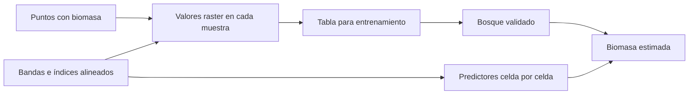

# Rasters explicativos

## ¿Qué información rodea a cada muestra?

Un raster explicativo es una capa cuyas celdas aportan una variable predictora: reflectancia, elevación, pendiente, temperatura, humedad o cobertura. Puede ser continuo o categórico. En [[Aprendizaje supervisado]], la respuesta conocida —por ejemplo biomasa— está en puntos o parcelas; los rasters proporcionan contexto continuo que se extrae en las ubicaciones de entrenamiento. Después, el modelo puede aplicarse a otras celdas con los mismos predictores. [Esri 3.6, «How…», variables explicativas y predicción raster.]

| Raster | Representación | Uso posible |
|---|---|---|
| Bandas Landsat/Sentinel | Respuesta espectral por longitud de onda | Vegetación, suelo, humedad y cobertura |
| [[NDVI]] | Contraste NIR-rojo | Cobertura fotosintética y vigor vegetal |
| Modelo de elevación | Altitud | Gradientes ecológicos, drenaje, temperatura |
| Pendiente | Inclinación | Erosión y condiciones de vegetación |
| Aspecto | Orientación de ladera | Exposición solar y humedad |
| Distancia rasterizada | Proximidad a vías, ríos o infraestructura | Accesibilidad y presión antrópica |

No basta con que una capa exista: debe ser pertinente y estar disponible también en el territorio de predicción. El aspecto es circular —0° y 360° son vecinos— y las clases de cobertura no son magnitudes continuas; su tratamiento requiere atención.

El esquema distingue respuesta de campo y predictores. El modelo recibe combinaciones de valores, no interpreta visualmente el paisaje como una persona.

## Ejemplo hipotético de extracción

| Punto | Biomasa observada | NDVI | Elevación (m) | Pendiente |
|---|---:|---:|---:|---:|
| A | 85 | 0.78 | 120 | 8° |
| B | 42 | 0.41 | 45 | 2° |
| C | 110 | 0.83 | 260 | 15° |

Cada fila combina respuesta y predictores. Las unidades de biomasa deben identificarse en los metadatos reales antes de interpretar cifras; esta tabla solo ilustra la estructura. El soporte de una parcela puede ser mayor que una celda: extraer en su centro no es siempre equivalente a promediar su superficie.

![[99 - Recursos/grafica-biomasa-coiba-indices-modelo.svg]]

**Lectura:** seguir el tránsito desde bandas e índices y observaciones hasta el modelo y la superficie estimada. **Conclusión:** la predicción necesita correspondencia entre valores usados al entrenar y valores usados al mapear. **Límite:** el gráfico no verifica alineación, licencia, calidad de muestras ni exactitud de una salida. Fuente: recurso docente del caso Coiba; fundamento de predicción con rasters en Esri, ArcGIS Pro 3.6.

## NDVI: señal útil, no medición directa de biomasa

$$NDVI=\frac{NIR-Rojo}{NIR+Rojo}.$$

La vegetación suele reflejar más NIR y absorber rojo. Esa señal ayuda a describir cobertura vegetal, pero puede saturarse en vegetación densa. Una importancia baja puede deberse a información redundante con otras bandas, correlación, falta de representatividad o desacuerdo de escala entre raster y campo. Véanse [[Índices de teledetección]] e [[Importancia de variables]]. [Esri 3.6, «Band Arithmetic», NDVI, para la fórmula.]

![[99 - Recursos/grafica-random-forest-biomasa-raster.svg]]

**Lectura:** cada muestra reúne respuesta de campo y valores de bandas, índices y topografía antes de entrenar el bosque. La salida coloreada es esquemática, sin escala ni unidades. **Conclusión:** el territorio de predicción necesita los mismos predictores. **Límite:** el gráfico no demuestra que se haya generado una superficie ni que todo lugar del dominio sea fiable. Fuente: gráfico didáctico original GeoIA; Esri 3.6, predicción raster, citado al final.

## Preparación y límites

- Revisar proyección, tamaño de celda, extensión, máscara y alineación de cuadrícula; igual tamaño no garantiza igual origen.
- Revisar NoData, nubes, sombras y artefactos; no convertirlos automáticamente en cero.
- Documentar fechas y separación temporal entre imagen y campo.
- Justificar mezclas de resolución y remuestreo; las categorías no se interpolan como reflectancias.
- Examinar redundancia entre índices y bandas.
- Evaluar rangos y combinaciones de predictores presentes en entrenamiento.
- Aplicar [[Validación de modelos supervisados]] con lectura espacial, no solo un promedio global.

La predicción raster con la herramienta forest-based requiere la extensión Spatial Analyst según la documentación de Esri; capacidad documentada no equivale a licencia comprobada en un equipo. Un raster explicativo aporta señal, no causalidad. Ni [[Random Forest]] ni el aspecto continuo del mapa garantizan fiabilidad en condiciones nuevas.

## Referencias y contexto

- Esri. *How Forest-based and Boosted Classification and Regression works*. ArcGIS Pro 3.6, predictores y predicción raster. https://pro.arcgis.com/en/pro-app/3.6/tool-reference/spatial-statistics/how-forest-works.htm. Consulta documentada: 2026-09-21.
- Esri. *Band Arithmetic function*. ArcGIS Pro 3.6, NDVI. https://pro.arcgis.com/en/pro-app/3.6/help/analysis/raster-functions/band-arithmetic-function.htm. Consulta documentada: 2026-09-21.
- Créditos bibliográficos conservados, sin nueva consulta: Rouse et al. (1974), *Monitoring vegetation systems in the Great Plains with ERTS*, https://ntrs.nasa.gov/citations/19740022614; Powell et al. (2010), *Quantification of live aboveground forest biomass dynamics with Landsat time-series and field inventory data*, https://doi.org/10.1016/j.rse.2010.01.018; Lu et al. (2016), referencia sobre estimación de biomasa con Landsat/LiDAR y análisis de incertidumbre, https://www.mdpi.com/2071-1050/8/2/159.

Aplicación: [[2026-09-21 - Clase 04 - Aprendizaje supervisado y Random Forest geoespacial|Clase 04]]. La tabla es hipotética; no acredita extracción ni ejecución nuevas.
