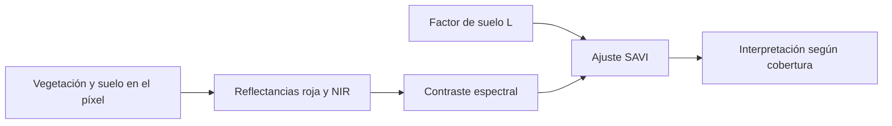

# SAVI

![[99 - Recursos/grafica-indice-savi.svg]]

**Lectura:** el 0,5 del denominador y el factor 1,5 corresponden a L = 0,5; la tarjeta no representa una calibración local. **Conclusión:** el ajuste busca reducir influencia del suelo visible. **Límite:** L no es universal y exige escala de reflectancia coherente. Fuente: gráfico didáctico original GeoIA; Esri 3.6, «Band Arithmetic», SAVI, citado al final.

## Reducir la influencia del suelo visible

El **Soil Adjusted Vegetation Index** modifica el contraste de [[NDVI]] para reducir parte de la influencia del brillo del suelo cuando la cobertura vegetal es incompleta. La pregunta es si el cambio observado corresponde a vegetación o al fondo que aparece entre plantas. [Esri, *Band Arithmetic*, ArcGIS Pro 3.6, SAVI; crédito fundacional: Huete, 1988.]

$$SAVI=(1+L)\frac{NIR-Red}{NIR+Red+L}.$$

$L$ controla el ajuste de fondo. Un valor común es $L=0.5$, pero no es universal; con $L=0$, SAVI se reduce algebraicamente a NDVI. Las constantes requieren una escala radiométrica coherente. En la correspondencia usual Landsat 8/9, NIR = B5 y rojo = B4:

$$SAVI=1.5\frac{B5-B4}{B5+B4+0.5}.$$

La correspondencia se conserva de USGS; comprobar el orden real de bandas del producto.

El ajuste reduce una influencia específica, no separa físicamente plantas y suelo ni corrige todos los efectos de adquisición.

## Ejemplo manual hipotético

Con NIR = 0.52, Red = 0.06 y $L=0.5$:

$$SAVI=1.5\frac{0.52-0.06}{0.52+0.06+0.5}=1.5\frac{0.46}{1.08}\approx0.639.$$

Para esas mismas reflectancias NDVI es aproximadamente 0.793. La diferencia no demuestra que haya menos vegetación: son transformaciones distintas y no se comparan como porcentajes de cobertura.

![[99 - Recursos/grafica-indices-teledeteccion-formulas.svg]]

**Lectura:** identificar el término de suelo en SAVI y contrastarlo con el denominador de NDVI. **Conclusión:** añadir $L$ cambia la respuesta al fondo y a la escala de las reflectancias. **Límite:** el esquema no selecciona automáticamente el mejor $L$ para Coiba ni demuestra una mejora predictiva. Fuente: recurso docente de fórmulas; Esri 3.6, «Band Arithmetic», SAVI; atribución a Huete (1988).

## Aplicación en Coiba

SAVI puede ser útil donde el píxel mezcla vegetación y suelo. En doseles cerrados su ventaja frente a NDVI puede disminuir y resultar redundante con otras bandas o índices. Puede evaluarse como candidato en [[Random Forest]], pero el algoritmo no sustituye la justificación física ni la [[Validación de modelos supervisados]].

No corrige todos los efectos atmosféricos o topográficos. La elección de $L$ se documenta y no se modifica repetidamente mirando la evaluación final. El índice modificado MSAVI, asociado con Qi et al. (1994), es otra formulación, no un nombre intercambiable para SAVI.

[[Índices de teledetección]] permite comparar señales; [[Rasters explicativos]] desarrolla su incorporación espacial al modelo.

## Referencias y contexto

- Esri. *Band Arithmetic function*. ArcGIS Pro 3.6, SAVI. https://pro.arcgis.com/en/pro-app/3.6/help/analysis/raster-functions/band-arithmetic-function.htm. Consulta documentada: 2026-09-21.
- Referencia técnica conservada, sin nueva consulta: USGS, *Landsat Soil Adjusted Vegetation Index*, https://www.usgs.gov/landsat-missions/landsat-soil-adjusted-vegetation-index.
- Créditos académicos conservados, sin nueva consulta: Huete (1988), *A soil-adjusted vegetation index (SAVI)*, https://doi.org/10.1016/0034-4257(88)90106-X; Qi et al. (1994), *A modified soil adjusted vegetation index*, https://doi.org/10.1016/0034-4257(94)90134-1.

Aplicación: [[2026-09-21 - Clase 04 - Aprendizaje supervisado y Random Forest geoespacial|Clase 04]]. Cálculo hipotético, sin ejecución nueva sobre rasters.
