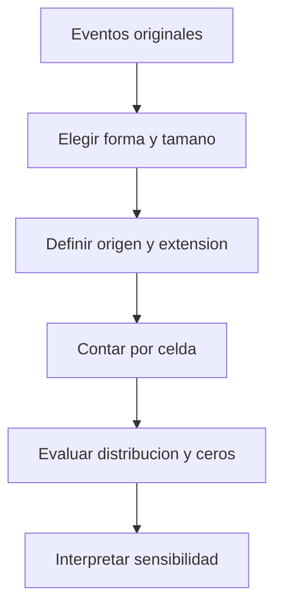

# Teselación espacial

¿Cómo comparar miles de puntos sin que el mapa sea una nube ilegible? Una **teselación** divide el espacio en celdas que cubren el área sin huecos ni superposiciones. En esta clase interesan mallas regulares de cuadrados o hexágonos: convierten eventos puntuales en unidades donde se puede contar, sumar o promediar.

No es solo una forma de dibujar. La unidad elegida determina qué eventos se consideran juntos. Por eso conecta con [[Escala espacial, vecindad y bandas de distancia]], [[Hot spots Getis-Ord Gi Star|Gi*]] y [[Cubo espacio-temporal]].

## La unidad cambia la lectura

![[../99 - Recursos/clase-03-teselacion.svg]]

**Lectura:** ambas mallas hipotéticas contienen los mismos ocho puntos. La izquierda los reparte entre cuatro celdas y la derecha los reúne en una. **Conclusión:** los conteos por unidad cambian sin mover los eventos. **Límite:** no es una comparación estadística ni recomienda la celda grande. Elaboración docente basada en el problema de agregación explicado por la nota fuente y E1.

## Para qué sirve y qué no resuelve

La malla permite unidades geométricas comparables, reduce superposición visual y prepara variables para inferencia. Pero igual superficie no implica igual población, tránsito ni exposición. Un conteo alto no es automáticamente una tasa alta.

El tamaño, la forma y la alineación pueden cambiar estadísticas y clusters. La fuente relaciona esta sensibilidad con el **MAUP**, problema de la unidad espacial modificable. Conviene distinguir dos decisiones: cambiar la escala de agregación y cambiar cómo se trazan las fronteras a escala semejante. No se espera que todos los mapas sean idénticos; se busca entender qué conclusiones dependen de la unidad elegida.

| Decisión | Pregunta guía |
| --- | --- |
| Tamaño | ¿Representa la escala del fenómeno o solo una conveniencia visual? |
| Forma | ¿Malla regular o unidades administrativas responden mejor a la pregunta? |
| CRS y unidades | ¿La proyección permite medir las distancias y áreas pertinentes? |
| Alineación y extensión | ¿Cambiar el origen separa grupos cercanos? ¿Dónde pueden ocurrir eventos? |
| Sensibilidad | ¿Qué conclusión se mantiene al variar una decisión por vez? |

## No confundir metros con metros cuadrados

En **Create Space Time Cube By Aggregating Points**, `Distance Interval` es una longitud. Para hexágonos define su altura; el ancho es $2h/\sqrt{3}$. Los 500 m del caso de siniestros no son 500 m² ni el radio de búsqueda Gi* [E1, Usage y Parameters: Distance Interval](#referencias).

El antecedente narrado en la nota fuente de Clase 09 usaba hexágonos de **1.000 m²** y Summarize Within para sumar `Deaths` en el caso de cólera. Se conserva como ejemplo histórico de sensibilidad, no como parámetros de Clase 03 ni resultado reejecutado. Los participantes obtuvieron valores distintos de Moran al variar la teselación, según esa nota fuente.

La fuente también presenta la regla orientativa $s=\sqrt{2A/n}$ para una celda cuadrada, con área $A$ y número de puntos $n$. Se conserva como **heurística histórica del material**, no como fórmula oficial de tamaño óptimo de ArcGIS Pro ni como regla para hexágonos. No se utiliza para fijar los parámetros de esta práctica; su validez general no se verificó de nuevo.

## Del espacio al tiempo

Una vez fijada la malla, el cubo repite las mismas ubicaciones en periodos comparables. Cambiar la malla entre periodos impediría atribuir diferencias únicamente al tiempo. La [[Ingeniería de datos geoespaciales]] ayuda a conservar CRS, significado de campos y cobertura; [[Optimized Hot Spot Analysis]] muestra cómo la agregación puede ser automática, pero sigue necesitando interpretación.

## Referencias

- **E1. Esri.** *Create Space Time Cube By Aggregating Points*. ArcGIS Pro **3.6**, Usage y Parameters: Aggregation Shape Type / Distance Interval; consulta 2026-09-17. <https://pro.arcgis.com/en/pro-app/3.6/tool-reference/space-time-pattern-mining/create-space-time-cube.htm>.
- **Antecedente bibliográfico de la nota fuente:** Openshaw, S. (1984), *The Modifiable Areal Unit Problem*. Referencia conservada; no se afirma una nueva lectura de la monografía.

## Procedencia y estado

BORRADOR migrado de `../diplomado_geoia/02 - Conceptos/Teselación espacial.md`. Se mantienen el ejemplo histórico, la heurística explícitamente limitada y los criterios prácticos, adaptados al [[Cubo espacio-temporal]] de Clase 03. No se importan otras clases ni se ejecutan cambios en los puntos o teselas originales.
