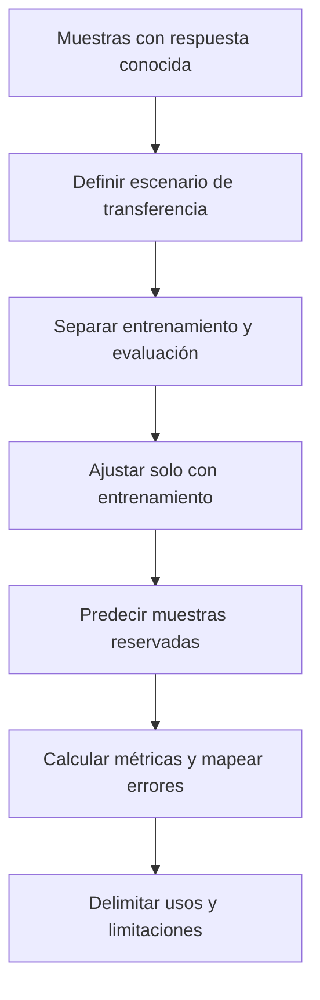

# Validación de modelos supervisados

## ¿Aprendió una relación transferible o memorizó la muestra?

Validar significa evaluar un modelo con observaciones que no utilizó para aprender. Un ajuste excelente en entrenamiento no garantiza desempeño en otra zona, fecha o población. La separación de datos y las pruebas repetidas ayudan a evaluar **generalización**, no a certificar validez universal. [Esri 3.6, «How…», entrenamiento y validación.]

| Conjunto | Uso | Pregunta |
|---|---|---|
| Entrenamiento | Ajustar relaciones y parámetros del modelo | ¿Qué aprende? |
| Validación | Comparar configuraciones durante el desarrollo | ¿Cuál generaliza mejor? |
| Prueba | Evaluación final independiente de esas decisiones | ¿Cómo se comporta el modelo elegido? |

En ejercicios introductorios se habla de entrenamiento y validación. En un proyecto formal conviene distinguir la prueba final: si se eligen repetidamente parámetros mirando sus resultados, dejó de ser independiente.

La partición debe representar la pregunta de aplicación: predecir entre puntos próximos no es la misma tarea que predecir en una región nueva.

## Ejemplo hipotético: partición 90/10

Con 1 000 puntos de biomasa, se reservan 100 (10 %) y se entrena con 900 (90 %). El modelo predice los 100 reservados y contrasta valores observados y estimados. Error bajo y sin concentración territorial aporta confianza **dentro del escenario evaluado**; errores concentrados en un sector pueden indicar falta de cobertura o variables omitidas. El porcentaje por sí solo no resuelve representatividad ni dependencia espacial.

![[99 - Recursos/grafica-validacion-modelos-supervisados.svg]]

**Lectura:** el bloque turquesa representa entrenamiento y el gris datos no vistos; use la etiqueta 90/10, no la anchura de las cajas, que es esquemática. El panel derecho reúne métricas, OOB y mapa residual como lecturas complementarias. **Conclusión:** separar datos evita evaluar solo memorización. **Límite:** OOB y validación retenida no son intercambiables ni prueban transferencia espacial. Fuente: gráfico didáctico original GeoIA; Esri 3.6 y Breiman y Cutler, citados al final.

## Fuera de bolsa no significa fuera del territorio

En [[Random Forest]] clásico cada árbol recibe una muestra bootstrap. Algunas observaciones quedan fuera de ese árbol: son **out-of-bag (OOB)**. Para cada observación, se combinan las predicciones de los árboles que no la usaron y se compara esa predicción OOB con la respuesta real. [Breiman y Cutler, «Random Forests», error OOB.]

1. Construir cada árbol con su muestra.
2. Identificar registros no incluidos en ella.
3. Predecirlos con ese árbol.
4. Agregar las predicciones OOB por registro y calcular el error del bosque.

No se necesita reservar un conjunto nuevo para cada árbol. Pero sus vecinos sí pueden estar en entrenamiento: OOB no sustituye una evaluación territorial independiente.

## Validación espacial

La partición aleatoria puede repartir puntos cercanos entre entrenamiento y evaluación. Si comparten condiciones ambientales, el resultado puede ser demasiado optimista para áreas no muestreadas. Los bloques, zonas o folds espaciales permiten preguntar si el modelo funciona en sectores excluidos del ajuste. El tamaño y disposición de bloques deben responder a la escala de dependencia y al uso esperado; no existe una distancia universal. La discusión de estructura espacial conserva como referencia académica Roberts et al. (2017), citada al final, sin nueva comprobación del artículo.

![[99 - Recursos/clase-06-validacion-espacial.svg]]

**Lectura:** verde indica entrenamiento y naranja validación. Cada panel reserva 4 de 20 sitios (20 %), no el 10 % del ejemplo anterior; comparar la partición intercalada y el sector contiguo. No hay escala geográfica ni distancias reales. La cercanía entre muestras de grupos diferentes puede facilitar la predicción sin probar transferencia a otra zona. **Conclusión:** el diseño de validación cambia la pregunta que responde el error. **Límite:** es un esquema docente, no una partición ejecutada ni una recomendación de distancia específica para Coiba. Fuente: elaboración docente; idea de validación estructurada de la bibliografía de Roberts et al. (2017).

ArcGIS Pro dispone de herramientas de evaluación por validación cruzada, pero no debe suponerse que cualquier partición es espacial ni atribuir a la herramienta del bosque un diseño por bloques no configurado. Las funciones disponibles y su aplicación efectiva son asuntos distintos.

## Qué revisar además del promedio

| Revisión | Utilidad |
|---|---|
| Error medio | Dirección del sesgo |
| MAE y RMSE | Magnitud de error de regresión |
| [[Matriz de confusión]] | Tipos de error por categoría |
| Mapa residual | Ubicaciones donde falla |
| Autocorrelación residual | Estructura espacial restante según la vecindad analizada |
| Rangos de predictores | Condiciones nuevas respecto del entrenamiento |

Un modelo de biomasa puede tener RMSE global favorable y fallar en costas o sombras topográficas. Los errores agrupados pueden responder a condiciones de imagen, sesgo de muestreo, variables faltantes o relaciones no captadas. Mejorar un número sin revisar ese patrón no resuelve el problema territorial.

Relaciones: [[Aprendizaje supervisado]] define objetivo y muestra; [[Métricas de evaluación de modelos]] explica las medidas; [[Rasters explicativos]] permite revisar qué condiciones se transfieren al mapa.

## Referencias y contexto

- Esri. *How Forest-based and Boosted Classification and Regression works*, ArcGIS Pro 3.6, entrenamiento y validación. https://pro.arcgis.com/en/pro-app/3.6/tool-reference/spatial-statistics/how-forest-works.htm. Consulta documentada: 2026-09-21.
- Breiman, L. y Cutler, A. *Random Forests*, error OOB. https://www.stat.berkeley.edu/~breiman/RandomForests/cc_home.htm. Consulta documentada: 2026-09-21.
- Roberts et al. (2017). *Cross-validation strategies for data with temporal, spatial, hierarchical, or phylogenetic structure*. https://doi.org/10.1111/ecog.02881. Crédito académico conservado, sin nueva consulta.
- Ampliaciones conservadas, sin nueva verificación: Esri, *Evaluate Predictions with Cross-validation*, https://pro.arcgis.com/en/pro-app/latest/tool-reference/spatial-statistics/evaluate-predictions-with-cross-validation.htm; scikit-learn, *train_test_split*, https://scikit-learn.org/stable/modules/generated/sklearn.model_selection.train_test_split.html, y *KFold*, https://scikit-learn.org/stable/modules/generated/sklearn.model_selection.KFold.html.

Aplicación: [[2026-09-21 - Clase 04 - Aprendizaje supervisado y Random Forest geoespacial|Clase 04]]. El ejemplo 90/10 ilustra el procedimiento; no acredita una ejecución nueva.
