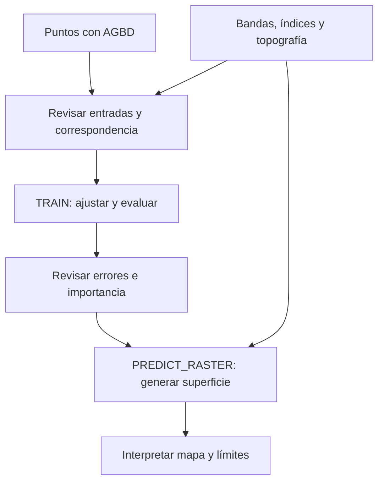

# ArcGIS Pro - Forest-based and Boosted Classification and Regression

## Propósito: aprender de muestras y predecir entidades o celdas

La herramienta de Spatial Statistics relaciona una respuesta conocida con variables explicativas para clasificar categorías o estimar valores continuos. En Coiba el objetivo es [[Biomasa aérea sobre el suelo (AGBD)|AGBD]], una respuesta continua: se plantea **regresión con bosque**, no clasificación de vegetación ni boosting por defecto. [Esri, ArcGIS Pro 3.6, *Forest-based and Boosted Classification and Regression*, resumen y parámetros.]

Clasificación/regresión describen el tipo de respuesta. `TRAIN`/`PREDICT_RASTER` describen operaciones. No confundir «tipo de predicción» con «variable categórica».

## Método y elección del modelo

En [[Random Forest]], los árboles se construyen independientemente a partir de aleatoriedad en muestras y variables candidatas a dividir nodos. En regresión se combinan sus estimaciones; en clasificación, sus decisiones. Boosting usa otra estrategia, con árboles construidos secuencialmente. Que ambos aparezcan en el nombre de la herramienta no los vuelve intercambiables. [Esri 3.6, «How…», fundamentos; Breiman y Cutler, «Random Forests».]

El bosque aprende relaciones no lineales, pero no garantiza ausencia de sobreajuste ni modela automáticamente dependencia espacial. Tampoco extrapola bien fuera de lo observado. Antes de aplicar una relación a toda una isla, hay que comprobar qué condiciones representa la muestra.

El flujo es docente: no implica que cambiar de operación cargue automáticamente un modelo persistido ni acredita que las operaciones hayan sido ejecutadas. La llamada de predicción requiere sus entradas de entrenamiento y parámetros conforme a la interfaz documentada.

## Entradas y preparación

| Entrada | Papel | Comprobación |
|---|---|---|
| Puntos con `AGBD` | Ejemplos con respuesta conocida | Campo numérico, unidades, nulos, soporte y fechas |
| Bandas Landsat | Señales ópticas | Producto, bandas, escala, nubes y sombras |
| [[Índices de teledetección]] | Contrastes derivados | Fórmulas, denominadores y redundancia |
| DEM, pendiente y aspecto | Contexto topográfico | CRS, unidades y tratamiento de orientación |
| [[Rasters explicativos]] para el área de predicción | Valores disponibles celda por celda | Correspondencia de variables, cuadrícula, extensión y NoData |

Los originales son de solo lectura. Si el ejercicio selecciona registros completos, conservar todos los registros originales y explicar cuántos y cuáles quedan fuera del entrenamiento; no confundir esta selección explícita con imputación, deduplicación o eliminación automática. Inspeccionar antes de modelar y separar entradas, copias y salidas.

La predicción raster requiere **Spatial Analyst** según Esri 3.6. La documentación de una capacidad no comprueba licencia ni disponibilidad en el equipo. Verificar también la versión y sus parámetros antes de ejecutar; esta nota no certifica el entorno.

## Configuración docente del bosque

| Parámetro | Valor del ejercicio | Qué controla y cómo leerlo |
|---|---:|---|
| Número de árboles | 30 | Tamaño del ensamble; no son 30 variables ni 30 corridas |
| Tamaño mínimo de hoja | 5 | Mínimo de observaciones en una hoja; limita divisiones muy específicas |
| Profundidad máxima | 20 | Límite de complejidad de cada árbol; no obliga a todos a alcanzar esa profundidad |
| Datos excluidos para validación | 10 % | Reserva para evaluar; no prueba independencia espacial |
| Número de ejecuciones de validación | 2 | Repeticiones de evaluación; no son dos árboles ni garantizan estabilidad |
| Variable objetivo categórica | No, para AGBD continua | Configura regresión; confirmar tipo y significado real del campo |

Son valores del recorrido docente, **no óptimos universales ni una configuración con generalización espacial validada**. Registrar parámetros restantes, semilla si se configura, número efectivo de muestras y mensajes al ejecutar. Dos repeticiones permiten observar alguna variabilidad, pero no bastan para demostrar robustez territorial. [Esri 3.6, referencia de herramienta, parámetros de árboles y validación.]

## `TRAIN` frente a `PREDICT_RASTER`

| Operación | Finalidad | Qué no demuestra |
|---|---|---|
| `TRAIN` — Train only | Ajustar el modelo y examinar diagnósticos con las muestras | No crea por sí sola el raster final de biomasa |
| `PREDICT_RASTER` — Predict to raster | Ajustar/aplicar el procedimiento para obtener una superficie con predictores raster | Un mapa generado no equivale a exactitud o transferencia validadas |

La herramienta también contempla predicción a entidades; no es la salida territorial elegida en este ejercicio. En el notebook de Clase 04, `TRAIN` recibe los 17 campos extraídos. La rama `PREDICT_RASTER` **reentrena** con `complete_case_training`, respuesta `AGBD` numérica y exclusivamente los **17 rasters continuos** de `RASTER_SPECS` en `explanatory_rasters` (pares `[ruta, 'false']`: Categorical desmarcado en la columna GPBoolean de la ValueTable, distinta de `treat_variable_as_categorical='NUMERIC'` para el objetivo; [Esri Pro 3.6, Forest, Code sample](https://pro.arcgis.com/en/pro-app/3.6/tool-reference/spatial-statistics/forestbasedclassificationregression.htm), ejemplo verificado). La ejecución integrada completó 17/17 celdas, incluida esta rama: no carga el SSM anterior ni utiliza `explanatory_variables`. Cada rama guarda su propia capa entrenada, importancia, SSM y reporte; las métricas de TRAIN no acreditan el bosque raster.

Se conservan 30 árboles, hoja 5, profundidad 20, muestra 100, cinco variables candidatas, 10% retenido y dos corridas, sin semilla nueva. El **10% es exploratorio**: Esri recomienda reajustar con **0% retenido para la predicción final**, una vez elegido y evaluado el modelo. Esa recomendación no cambia los parámetros de esta práctica ni convierte el raster exploratorio en producto final. Fuente: Esri Pro 3.6, *How Forest-based… works*, «Predict using a model / Predicting to rasters», y *Forest-based…*, «Parameters», pasajes verificados el 21/09/2026, enlaces completos al final.

La cuadrícula de análisis usa NDVI real como `snapRaster`, `cellSize` y CRS, con extensión `MINOF`; la salida observada tiene 30 × 30 m, no una resolución asumida. Compare propiedades resultantes, rangos, NoData y ceros válidos. La superficie y el histograma de píxeles no constituyen validación retenida. El [notebook, sección «Guía paso a paso en ArcGIS Pro»](../99%20-%20Recursos/notebooks/Clase%2004%20-%20Practica%2001%20-%20Random%20Forest%20geoespacial.ipynb#Guía-paso-a-paso-en-ArcGIS-Pro) incluye correspondencias raster/campo, parámetros y salidas separadas: guía de interfaz, no evidencia de clics realizados ni sustituto del código autónomo.

## Qué mirar en las salidas

En regresión, revisar observado/predicho, residuales y las [[Métricas de evaluación de modelos]] efectivamente reportadas. Distinguir métricas de entrenamiento, validación reservada y OOB cuando corresponda: ninguna es automáticamente validación espacial por bloques.

![[99 - Recursos/clase-06-errores-prediccion.svg]]

**Lectura:** comparar las barras verdes (observado) y naranjas (predicho) en unidades de respuesta; su diferencia muestra magnitud y dirección del error. **Conclusión:** la evaluación debe preceder a la confianza en la superficie. **Límite:** gráfico hipotético, no salida ejecutada de la herramienta. Fuente: elaboración docente; evaluación forest-based de Esri 3.6.

![[99 - Recursos/clase-06-importancia-bosque.svg]]

**Lectura:** comparar barras según la medida de importancia identificada. **Conclusión:** ayuda a investigar en qué señales se apoya el modelo. **Límite:** ranking hipotético, sin inferencia causal ni prueba de desempeño; importancia por impureza y por permutación no son equivalentes. Fuente: elaboración docente; Esri 3.6 y Breiman/Cutler.

En Coiba, AGBD, RESIDUAL, MAE y RMSE se rotulan en **Mg/ha por confirmación del usuario**, sin conversión ni atribución de esa unidad a metadatos o a GEDI. Las capturas históricas conservan rótulos genéricos. El mapa residual corregido usa dos capas de la misma copia: consulta `RESIDUAL < 0` y símbolo azul para sobrepredicción (2.859), `RESIDUAL > 0` y rojo para subpredicción (1.981), ambos SimpleRenderer de 4 pt. Se verificó observado−predicho en los 4.840 registros: rango −340,868 a 560,933 Mg/ha; cero: 0, sin capa vacía. El marco contiene todos los XY; el color representa signo, no intensidad del error. La guía GUI separada del notebook reproduce estas consultas sin reentrenar.

Mapear errores para identificar subestimación o sobreestimación territorial; revisar zonas sin representación en entrenamiento y celdas sin datos. Interpretar el raster como **biomasa estimada**, con unidades confirmadas y alcance limitado por muestras y predictores. [[Importancia de variables]] explica el ranking y [[Validación de modelos supervisados]] desarrolla la transferencia territorial.

## Referencias y estado de uso

- Esri. *Forest-based and Boosted Classification and Regression*. ArcGIS Pro 3.6, uso, tipos de predicción y parámetros. https://pro.arcgis.com/en/pro-app/3.6/tool-reference/spatial-statistics/forestbasedclassificationregression.htm. Consulta documentada: 2026-09-21.
- Esri. *How Forest-based and Boosted Classification and Regression works*. ArcGIS Pro 3.6, modelos, evaluación, predicción raster y límites. https://pro.arcgis.com/en/pro-app/3.6/tool-reference/spatial-statistics/how-forest-works.htm. Consulta documentada: 2026-09-21.
- Breiman, L. y Cutler, A. *Random Forests*, funcionamiento e importancia. https://www.stat.berkeley.edu/~breiman/RandomForests/cc_home.htm. Consulta documentada: 2026-09-21.

Aplicación: [[2026-09-21 - Clase 04 - Aprendizaje supervisado y Random Forest geoespacial|Clase 04]]. P01 completó **17/17 celdas** en kernel nuevo, ArcGIS Pro **3.6.2 / ArcInfo**, ~320 s: [resultado](../99%20-%20Recursos/salidas_clase_04/publicados/README.md) y [ejecutado](../99%20-%20Recursos/notebooks/Clase%2004%20-%20Practica%2001%20-%20Random%20Forest%20geoespacial.ipynb). Esta nota integra evidencia, no ejecuta herramientas de nuevo. TRAIN: R² entrenamiento/retenido 0,890/0,196; rama raster: 0,891/0,219, con advertencias de extrapolación en los 17 predictores. Raster F64 de 1.099 × 1.222, 542.006 finitos y 800.972 NoData; mapa gris e histograma ArcGIS de 50.000 píxeles sistemáticos inspeccionados. Los antecedentes y dos intentos fallidos se conservan. Comprobación independiente previa: 137 enlaces locales sin destinos faltantes. Los cinco Mermaid del notebook pasaron parser, renderizado e inspección visual mediante Chrome DevTools MCP y Mermaid 11.12.0; no se acredita el renderizado de otros diagramas ni la disposición nativa de Jupyter/ArcGIS Notebook/Obsidian. El [render focal posterior](../99%20-%20Recursos/salidas_clase_04/publicados/residuales_resultado.json) comprobó copia, signos, conteos y extensión; el PNG muestra puntos y leyenda legibles. No es otra ejecución de 17/17 ni modifica entrenamiento, métricas o evidencia anterior. Video parcial, sin revisión nueva: no constituye aprobación de un producto operativo ni clase completa.
