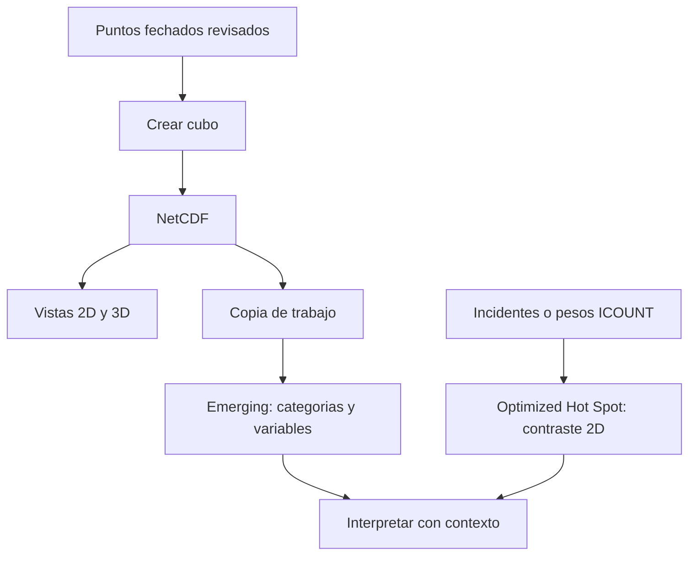

# ArcGIS Pro - Space Time Pattern Mining

## Qué problema resuelve

Un conjunto de puntos fechados no muestra por sí solo cómo cambia cada lugar. Space Time Pattern Mining organiza observaciones en un [[../02 - Conceptos/Cubo espacio-temporal]], permite explorar sus variables y clasificar historias de concentración. En la [[../01 - Clases/2026-09-16 - Clase 03 - Cubos espacio-temporales y patrones emergentes|Clase 03]], la pregunta se aplica a siniestros viales; los contrastes finales de colegios y abejas usan Spatial Statistics, no cubos temporales.

Esta nota especializa las capacidades de ArcGIS Pro descritas en la herramienta general del vault fuente, sin importar sus temas ajenos a la clase ni modificar herramientas de Clase 01/02.

## Elegir la operación por su salida

| Operación ArcPy de la fuente | Entrada y parámetros importantes | Salida y lectura |
| --- | --- | --- |
| `arcpy.stpm.CreateSpaceTimeCube` | Puntos, `FECHA_OCUR`, seis meses, `END_TIME`, hexágonos de 500 m. | NetCDF; agrega eventos por lugar y periodo. |
| `arcpy.stpm.VisualizeSpaceTimeCube2D` | Cubo, `COUNT`, `LOCATIONS_WITH_DATA` o `TRENDS`. | Entidades de ubicaciones o tendencias de conteos; no categorías emergentes. |
| `arcpy.stpm.VisualizeSpaceTimeCube3D` | Cubo, `COUNT`, `VALUE`. | Bins 3D; altura temporal, no relieve. |
| `arcpy.stpm.EmergingHotSpotAnalysis` | Copia del cubo, COUNT, distancia automática, dos pasos anteriores, máscara UPZ. | Entidades por categoría y variables añadidas al cubo. |
| `arcpy.stats.OptimizedHotSpotAnalysis` | Incidentes de 2020+; después colegios y abejas ponderados por ICOUNT. | Concentración espacial 2D, sin historia temporal. |

Los nombres y llamadas se conservan del notebook fuente; los fragmentos de la nota no se ejecutaron por separado. La ejecución real del notebook migrado y su fallo de cierre se distinguen en la procedencia final. La resolución de 500 m crea bins; no fija la distancia automática de vecinos. Dos pasos temporales incluyen hasta dos intervalos anteriores además del actual [E1–E2].

![[../99 - Recursos/grafica-flujo-cubo-hotspot-emergente.svg]]

**Lectura:** las cajas separan preparación, estructura, visualización, inferencia y decisión; no tienen escala numérica. **Conclusión:** una escena llamativa no sustituye el análisis. **Límite:** gráfica conceptual migrada de Clase 15; no demuestra calidad de datos ni causalidad.

## Preparar una sesión sin alterar las entradas

Usar Python de ArcGIS Pro con ArcPy. La comprobación previa de entradas registró Pro 3.6.2, Python 3.13.7 y licencia ArcInfo; ese estado histórico del entorno **no demuestra que los geoprocesos de esta nota se ejecutaron**, ni determina por sí solo la licencia mínima de cada herramienta. Antes de ejecutar, comprobar disponibilidad y licencia efectiva; no instalar dependencias para sortear un bloqueo.

1. Leer la [procedencia local](../99%20-%20Recursos/datos/clase_03/README.md) y revisar campos, fechas, CRS y unidades. En Data Engineering, explorar nulos, valores únicos y distribuciones; es una vista, no una clase ArcPy.
2. Separar entradas, geodatabase de trabajo y resultados. El NetCDF histórico tiene resultados anteriores y una discrepancia documentada de atributos de proyección; no corregirlo silenciosamente.
3. Copiar el NetCDF a una carpeta de salida nueva **antes** de Emerging. La herramienta añade variables y puede reemplazar análisis previos [E2, Tool outputs].
4. Leer mensajes y parámetros efectivos; abrir las entidades de salida en mapa o escena local. Si terreno o basemap ocultan bins, ajustar su visibilidad; los filtros temporales ayudan a recorrer la historia.
5. Acompañar mapas con gráficos ArcGIS. La fuente exportó barras e histograma mediante ArcPy Charts y mapas con leyenda mediante `arcpy.mp`. Conservar interpretación junto a las salidas, no solo tablas o métricas.

No ejecutar RepairGeometry, Integrate, deduplicación ni imputación. Los preparados históricos de colegios y abejas ya están disponibles; no se repite su preparación ni se utilizan salidas mutables de otras clases.

## Leer sin mezclar preguntas

- **COUNT:** eventos contabilizados por bin, no riesgo individual.
- **TRENDS:** evolución del conteo, distinta de la tendencia de z-scores Gi*.
- **Emerging:** combina historia de significancia y tendencia del agrupamiento. Las categorías completas están en [[../02 - Conceptos/Emerging Hot Spot Analysis]].
- **OHA:** `Gi_Bin` incorpora FDR; `GiZScore` y `GiPValue` no. Véase [[../02 - Conceptos/Optimized Hot Spot Analysis]].
- **ICOUNT:** peso de ubicaciones agregadas, no número de estudiantes ni fechas individuales.

La secuencia práctica se conserva: cubo disponible → vistas 2D/3D → Emerging → OHA siniestros → colegios → abejas. La creación desde puntos está documentada como alternativa no ejecutada por defecto en la fuente. Los bloques comentados de configuración y llamadas están en la nota de clase; el [[../99 - Recursos/notebooks/Clase 03 - Practica 01 - Cubos espacio-temporales y patrones emergentes.ipynb|notebook autónomo migrado]] conserva la secuencia y sus salidas guardadas.

## Referencias y procedencia

- **E1. Esri.** *Create Space Time Cube By Aggregating Points*, ArcGIS Pro 3.6, Usage y Parameters; consulta 2026-09-17 registrada en [[../02 - Conceptos/Cubo espacio-temporal]]. <https://pro.arcgis.com/en/pro-app/3.6/tool-reference/space-time-pattern-mining/create-space-time-cube.htm>.
- **E2. Esri.** *How Emerging Hot Spot Analysis works*, ArcGIS Pro 3.6, Tool outputs y Neighborhood defaults; consulta 2026-09-17 registrada en [[../02 - Conceptos/Emerging Hot Spot Analysis]]. <https://pro.arcgis.com/en/pro-app/3.6/tool-reference/space-time-pattern-mining/learnmoreemerging.htm>.
- **E3. Esri.** *Optimized Hot Spot Analysis*, ArcGIS Pro 3.6, Usage y Parameters; lectura registrada en su concepto: 2026-09-17. <https://pro.arcgis.com/en/pro-app/3.6/tool-reference/spatial-statistics/optimized-hot-spot-analysis.htm>.
- **Esri.** *Visualizing cube data* y *What is the Charts module?*, referencias `latest` conservadas de la clase/herramienta fuente, sin nueva verificación atribuida: <https://doc.esri.com/en/arcgis-pro/latest/tool-reference/space-time-pattern-mining/visualizing-cube-data.htm> y <https://pro.arcgis.com/en/pro-app/latest/arcpy/charts/what-is-the-charts-module.htm>.

Adaptación de `../diplomado_geoia/03 - Herramientas/ArcGIS Pro.md` y del notebook de Clase 15, 2026-06-25, docente fuente José Sebastián Gómez Romero. Los fragmentos de la nota no se ejecutaron por separado. El notebook migrado completó 21 celdas sin errores de celda y guardó [16 PNG ArcGIS en la corrida actual](../99%20-%20Recursos/salidas_clase_03/practica_01/run_b01a1f3965b84ae2a861e185ead354dc/); el kernel falló al cerrar, por lo que no se afirma ejecución integral limpia. La evidencia histórica se conserva separada de esos resultados actuales. La cobertura directa del video sigue parcial y sus pendientes se registran en la nota de Clase 03. Esta herramienta no declara la clase completa.
